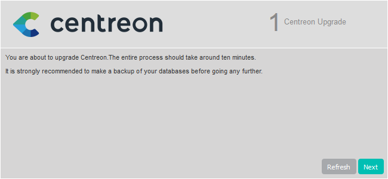
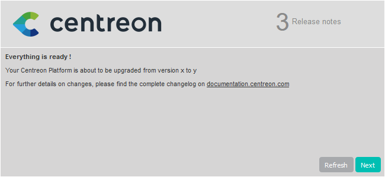
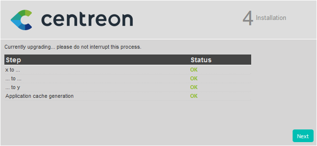

import Tabs from '@theme/Tabs';
import TabItem from '@theme/TabItem';

Ce chapitre décrit la procédure de montée de version de votre plateforme
Centreon depuis la version 21.10 vers la version 25.10.

> La version 21.10 n'est plus supportée. La montée de version à partir de cette version n'a pas été testée par l'équipe d'assurance qualité de Centreon.

> Lorsque vous effectuez la montée de version de votre serveur central, assurez-vous d'également mettre à jour tous vos serveurs distants et vos collecteurs. Dans votre architecture, tous les serveurs doivent avoir la même version de Centreon. De plus, tous les serveurs doivent utiliser la même [version du protocole BBDO](../developer/developer-broker-bbdo-switch-versions.md).

> Si vous souhaitez migrer votre serveur Centreon vers Oracle Linux
> / RHEL 8, vous devez suivre la [procédure de migration](../migrate/migrate-from-el-to-el.md). Si vous utilisez la HA sur votre plateforme, contactez votre représentant commercial Centreon pour discuter des scénarios de migration possibles.

> Utilisateurs de la Business edition : MAP Legacy n'est plus disponible dans Centreon 25.10. Si vous utilisiez toujours MAP Legacy, vous devez migrer vers MAP. Consultez la page [Fin de vie de MAP Legacy](https://docs.centreon.com/docs/graph-views/map-legacy-eol/).

> Attention, si vous utilisiez les connecteurs suivants, à partir de la version 24.10 il est obligatoire de déclarer la configuration de tous ceux-ci [**à la page Configuration > Additional connector configurations**](/pp/integrations/plugin-packs/getting-started/how-to-guides/additional-connector-configuration) avant de déployer la configuration du collecteur correspondant :
> * [VMware ESX](https://docs.centreon.com/pp/integrations/plugin-packs/procedures/virtualization-vmware2-esx/)
> * [VMware vCenter](https://docs.centreon.com/pp/integrations/plugin-packs/procedures/virtualization-vmware2-vcenter-generic/)
> * [VMware VM](https://docs.centreon.com/pp/integrations/plugin-packs/procedures/virtualization-vmware2-vm/)
> * [VMware vCenter v4](https://docs.centreon.com/fr/pp/integrations/plugin-packs/procedures/virtualization-vmware2-vcenter-4/)
> * [VMware vCenter v5](https://docs.centreon.com/fr/pp/integrations/plugin-packs/procedures/virtualization-vmware2-vcenter-5/)
> * [VMware vCenter v6](https://docs.centreon.com/pp/integrations/plugin-packs/procedures/virtualization-vmware2-vcenter-6/)

## Prérequis

### Sauvegarde

Avant toute chose, il est préférable de s’assurer de l’état et de la consistance
des sauvegardes de l’ensemble des serveurs centraux de votre plate-forme :

- Serveur Centreon Central,
- Serveur de gestion de base de données.

Si vous utilisez un fournisseur Open Ticket avec des configurations personnalisées, [sauvegardez-les avant de mettre à jour Centreon](../alerts-notifications/ticketing-install.md#sauvegarder-votre-configuration-personnalisée-de-fournisseur-openticket).

### Vérifier les dépôts

Avant de réaliser la montée de version de votre plateforme Centreon, assurez-vous que les dépôts de paquets suivants sont activés :

<Tabs groupId="os" queryString>
<TabItem value="EL" label="EL">

* EPEL
* BaseOS
* AppStream
* centreon
* centreon-modules, if you are using Centreon Business Edition.

</TabItem>
<TabItem value="Debian 11" label="Debian 11">

* bullseye, bullseye-updates, bullseye-backports and bullseye security
* BaseOS
* AppStream
* centreon
* centreon-modules, if you are using Centreon Business Edition.

</TabItem>
<TabItem value="Debian 12" label="Debian 12">

* bookworm, bookworm-updates, bookworm-backports and bookworm security
* BaseOS
* AppStream
* centreon
* centreon-modules, if you are using Centreon Business Edition.

</TabItem>
</Tabs>

## Montée de version du serveur Centreon Central

> Lorsque vous lancez une commande, vérifiez les messages obtenus. En cas de message d'erreur, arrêtez la procédure et dépannez les problèmes.

### Installer les nouveaux dépôts

1. Sur votre plateforme 21.10, remplacez `https://packages.centreon.com/rpm-standard` ou `https://yum.centreon.com/standard/` par `https://archives.centreon.com/standard/` dans votre configuration YUM (par défaut, `/etc/yum.repos.d/centreon.repo`).

2. Mettez à jour votre Centreon 21.10 jusqu'à la dernière version mineure.

3. Supprimez le fichier **centreon.repo** :

   ```shell
   cd /etc/yum.repos.d/
   rm -rf centreon*
   ```

4. Installez le nouveau dépôt :

   ```shell
   dnf install -y dnf-plugins-core
   dnf config-manager --add-repo https://packages.centreon.com/rpm-standard/25.10/el8/centreon-25.10.repo
   systemctl stop cbd
   dnf clean all --enablerepo=*
   ```

> Si vous avez une [licence offline](../administration/licenses.md#types-de-licences), supprimez également l'ancien dépôt des connecteurs de supervision, puis installez le nouveau dépôt.
>
> Vous pouvez trouver l'adresse des dépôts sur le [portail support Centreon](https://support.centreon.com/hc/fr/categories/10341239833105-D%C3%A9p%C3%B4ts).

### Montée de version de la solution Centreon

1. Assurez-vous que tous les utilisateurs sont déconnectés avant de commencer la procédure de mise à jour.

2. Si vous avez des extensions Business installées, supprimez la configuration du dépôt 21.10 :

<Tabs groupId="os" queryString>
<TabItem value="Alma / RHEL / Oracle Linux 8" label="Alma / RHEL / Oracle Linux 8">

```shell
rm /etc/yum.repos.d/centreon-business-21.10.repo
```

</TabItem>

<TabItem value="Alma / RHEL / Oracle Linux 9" label="Alma / RHEL / Oracle Linux 9">

```shell
rm /etc/yum.repos.d/centreon-business-21.10.repo
```

</TabItem>
</Tabs>

3. Installez le dépôt business en 25.10. Rendez-vous sur le [portail du support](https://support.centreon.com/hc/fr/categories/10341239833105-D%C3%A9p%C3%B4ts) pour en récupérer l'adresse.

4. Arrêtez le processus Centreon Broker :

```shell
systemctl stop cbd
```

5. Supprimez les fichiers de rétention présents :

```shell
rm /var/lib/centreon-broker/* -f
```

### Montée de version de PHP

Centreon 25.10 utilise PHP en version 8.2.

<Tabs groupId="os" queryString>
<TabItem value="RHEL 8" label="RHEL 8">

Vous devez changer le flux PHP de la version 8.0 à 8.2 en exécutant les commandes suivantes et en répondant **y**
pour confirmer :

```shell
dnf config-manager --disable remi-modular remi-safe
dnf module disable composer:2
dnf module disable php:remi-8.1
rm -rf /etc/yum.repos.d/remi*
dnf module reset php
```

```shell
dnf module install php:8.2
dnf distro-sync php\* --allowerasing
```

Assurez vous que le paramètre `memory_limit` contenu dans `/etc/php.d/50-centreon.ini` est fixé à au moins 256mb. Ajoutez cette limite manuellement si nécessaire.

```shell
su - apache -s /bin/bash -c "/usr/share/centreon/bin/console cache:clear"
systemctl restart php-fpm
```

</TabItem>
<TabItem value="Alma / Oracle Linux 8" label="Alma / Oracle Linux 8">

Vous devez changer le flux PHP de la version 8.0 à 8.2 en exécutant les commandes suivantes et en répondant **y**
pour confirmer :

```shell
dnf config-manager --disable remi-modular remi-safe
dnf module disable composer:2
dnf module disable php:remi-8.1
rm -rf /etc/yum.repos.d/remi*
dnf module reset php
```

```shell
dnf module install php:8.2
dnf distro-sync php\* --allowerasing
```

Assurez vous que le paramètre `memory_limit` contenu dans `/etc/php.d/50-centreon.ini` est fixé à au moins 256mb. Ajoutez cette limite manuellement si nécessaire.

```shell
su - apache -s /bin/bash -c "/usr/share/centreon/bin/console cache:clear"
systemctl restart php-fpm
```

</TabItem>
</Tabs>

### Montée de version de la solution Centreon

1. Assurez-vous que tous les utilisateurs sont déconnectés avant de commencer la procédure de mise à jour.

2. Si vous avez des extensions Business installées, supprimez la configuration du dépôt 21.10 :

<Tabs groupId="os" queryString>
<TabItem value="Alma / RHEL / Oracle Linux 8" label="Alma / RHEL / Oracle Linux 8">

```shell
rm /etc/yum.repos.d/centreon-business-21.10.repo
```

</TabItem>

<TabItem value="Alma / RHEL / Oracle Linux 9" label="Alma / RHEL / Oracle Linux 9">

```shell
rm /etc/yum.repos.d/centreon-business-21.10.repo
```

</TabItem>
</Tabs>

3. Installez le dépôt business en 25.10. Rendez-vous sur le [portail du support](https://support.centreon.com/hc/fr/categories/10341239833105-D%C3%A9p%C3%B4ts) pour en récupérer l'adresse.

5. Arrêtez le processus Centreon Broker :

```shell
systemctl stop cbd
```

6. Supprimez les fichiers de rétention présents :

```shell
rm /var/lib/centreon-broker/* -f
```

1. Videz le cache :

<Tabs groupId="os" queryString>
<TabItem value="Alma / RHEL / Oracle Linux 8" label="Alma / RHEL / Oracle Linux 8">

```shell
dnf clean all --enablerepo=*
```

</TabItem>
<TabItem value="Alma / RHEL / Oracle Linux 9" label="Alma / RHEL / Oracle Linux 9">

```shell
dnf clean all --enablerepo=*
```

</TabItem>
</Tabs>

2. Mettez à jour l'ensemble des composants :

<Tabs groupId="os" queryString>
<TabItem value="Alma / RHEL / Oracle Linux 8" label="Alma / RHEL / Oracle Linux 8">

```shell
dnf update centreon\* php-pecl-gnupg
```

</TabItem>
</Tabs>

> Acceptez les nouvelles clés GPG des dépôts si nécessaire.

### Mettre à jour une configuration Apache personnalisée

Cette section s'applique uniquement si vous avez personnalisé votre configuration Apache. 

<Tabs groupId="os" queryString>
<TabItem value="Alma / RHEL / Oracle Linux 8" label="Alma / RHEL / Oracle Linux 8">

Lors de la montée de version, le fichier de configuration Apache n'est pas mis à jour automatiquement : le nouveau fichier de configuration amené par le rpm ne remplace pas l'ancien. Vous devez reporter les changements manuellement dans votre fichier de configuration personnalisée.

Faites un diff entre l'ancien et le nouveau fichier de configuration Apache :

```
diff -u /etc/httpd/conf.d/10-centreon.conf /etc/httpd/conf.d/10-centreon.conf.rpmnew
```

* **10-centreon.conf** (post montée de version) : ce fichier contient la configuration personnalisée. Il ne contient pas les nouveautés apportées par la montée de version.
* **10-centreon.conf.rpmnew** (post montée de version) : ce fichier est fourni par le rpm; il ne contient pas la configuration personnalisée.

Pour chaque différence entre les fichiers, évaluez si celle-ci doit être reportée du fichier **10-centreon.conf.rpmnew** au fichier **10-centreon.conf**.

Vérifiez qu'Apache est bien configuré, en exécutant la commande suivante :

```shell
apachectl configtest
```

Le résultat attendu est le suivant :

```shell
Syntax OK
```

Redémarrez Apache pour appliquer les modifications :

```shell
systemctl restart php-fpm httpd
```

Puis vérifiez le statut :

```shell
systemctl status httpd
```

Si tout est correct, vous devriez avoir quelque chose comme :

```shell
● httpd.service - The Apache HTTP Server
   Loaded: loaded (/usr/lib/systemd/system/httpd.service; enabled; vendor preset: disabled)
  Drop-In: /usr/lib/systemd/system/httpd.service.d
           └─php-fpm.conf
   Active: active (running) since Tue 2020-10-27 12:49:42 GMT; 2h 35min ago
     Docs: man:httpd.service(8)
 Main PID: 1483 (httpd)
   Status: "Total requests: 446; Idle/Busy workers 100/0;Requests/sec: 0.0479; Bytes served/sec: 443 B/sec"
    Tasks: 278 (limit: 5032)
   Memory: 39.6M
   CGroup: /system.slice/httpd.service
           ├─1483 /usr/sbin/httpd -DFOREGROUND
           ├─1484 /usr/sbin/httpd -DFOREGROUND
           ├─1485 /usr/sbin/httpd -DFOREGROUND
           ├─1486 /usr/sbin/httpd -DFOREGROUND
           ├─1487 /usr/sbin/httpd -DFOREGROUND
           └─1887 /usr/sbin/httpd -DFOREGROUND

```

</TabItem>
</Tabs>

#### Configuration Apache personnalisée : activer la compression du texte

Pour améliorer le temps de chargement des pages, vous pouvez activer la compression du texte sur le serveur Apache. Le paquet **brotli** est nécessaire. Cette configuration est optionnelle mais vous fournira une meilleure expérience utilisateur.

Ajoutez le code suivant à votre fichier de configuration Apache, dans les éléments `<VirtualHost *:80>` et `<VirtualHost *:443>` :

```shell
<IfModule mod_brotli.c>
    AddOutputFilterByType BROTLI_COMPRESS text/html text/plain text/xml text/css text/javascript application/javascript application/json
</IfModule>
AddOutputFilterByType DEFLATE text/html text/plain text/xml text/css text/javascript application/javascript application/json
```

### Finalisation de la mise à jour

<Tabs groupId="os" queryString>
<TabItem value="Alma / RHEL / Oracle Linux 8" label="Alma / RHEL / Oracle Linux 8">

Avant de démarrer la montée de version via l'interface web, mettez à jour [Centreon BAM avec cette procédure](../service-mapping/upgrade.md) puis rechargez le serveur Apache avec la commande suivante :
```shell
systemctl reload httpd
```

</TabItem>
</Tabs>

Connectez-vous ensuite à l'interface web Centreon pour démarrer le processus de
mise à jour :

Cliquez sur **Next** :



Cliquez sur **Next** :


La note de version présente les principaux changements, cliquez sur **Next** :



Le processus réalise les différentes mises à jour, cliquez sur **Next** :



Votre serveur Centreon est maintenant à jour, cliquez sur **Finish** pour
accéder à la page de connexion :


> La présentation de l'interface ayant été modifiée dans la version 22.10, vous devez vider le cache de votre navigateur pour afficher le nouveau thème.

Référez-vous à la documentation de mise à jour pour [Centreon MBI](../reporting/update.md) et [Centreon MAP](../graph-views/map-web-upgrade.md) pour mettre à jour ces modules.

### Actions post montée de version

1. Montée de version des extensions :

   Depuis le menu **Administration > Extensions > Gestionnaire**, mettez à jour
   toutes les extensions, en commençant par les suivantes :

   - License Manager,
   - Gestionnaire de connecteurs de supervision,
   - Auto Discovery.

   Vous pouvez alors mettre à jour toutes les autres extensions commerciales.

2. Si vous utilisiez des commandes personnalisées pour un collecteur (sur la page **Configuration > Collecteurs > Collecteurs**, dans la section **Monitoring Engine Information**), sachez qu'une nouvelle expression régulière de validation est désormais appliquée (`[a-zA-Z0-9\-\_]+`) : vos commandes personnalisées devront peut-être être adaptées. Sur le serveur central :
   * Pour identifier les commandes qui doivent être adaptées, exécutez :
     ```shell
     sudo -u apache php /usr/share/centreon/bin/console w:m:c --dry-run
     ```
   * Pour adapter automatiquement les commandes, exécutez :
     ```shell
     sudo -u apache php /usr/share/centreon/bin/console w:m:c
     ```
     (Vous pouvez également les adapter manuellement.)

3. [Déployez la configuration](../monitoring/monitoring-servers/deploying-a-configuration.md).

4. Redémarrez les processus Centreon :

    ```shell
    systemctl restart cbd centengine centreontrapd gorgoned
    ```

## Mettre à jour MariaDB

Suivez [cette procédure](upgrade-mariadb.md) pour monter de version MariaDB en 10.11.

## Montée de version des serveurs distants

Cette procédure est identique à celle utilisée pour effectuer la montée de version d'un serveur Centreon Central, avec en plus la nécessité de récupérer la clé de déchiffrement à la fin.

### Récupération de la clé de déchiffrement

Exécutez le script suivant avec l'adresse IP du serveur central afin de permettre au serveur distant de recevoir et traiter des données chiffrées : 

```shell
/usr/share/centreon/bin/writeEngineSecrets.sh <BASE_URL> <API_ACCOUNT> <PASSWORD>
```

Exemple:

``` shell
/usr/share/centreon/bin/writeEngineSecrets.sh https://10.10.10.10/centreon admin password
```

> Vous devez utiliser **admin** comme valeur pour **\<API_ACCOUNT\>**.

Redémarrez **centengine**:

```shell
systemctl restart centengine
```

> En fin de mise à jour, la configuration doit être déployée depuis le serveur Central.

## Montée de version des collecteurs

### Mise à jour des dépôts

Exécutez la commande suivante :

<Tabs groupId="os" queryString>
<TabItem value="Alma / RHEL / Oracle Linux 8" label="Alma / RHEL / Oracle Linux 8">

```shell
dnf install -y dnf-plugins-core && \
rm -f /etc/yum.repos.d/centreon* && \
dnf config-manager --add-repo https://packages.centreon.com/rpm-standard/25.10/el8/centreon-25.10.repo
```

</TabItem>
</Tabs>

### Montée de version de la solution Centreon

Videz le cache :

```shell
dnf clean all --enablerepo=*
```

Mettez à jour l'ensemble des composants :

```shell
dnf update centreon\*
```

> Acceptez les nouvelles clés GPG des dépôts si nécessaire.

Démarrez et activez **gorgoned**:

```shell
systemctl start gorgoned
systemctl enable gorgoned
```

### Récupération de la clé de déchiffrement

Exécutez le script suivant avec l'adresse IP correspondante afin de permettre au collecteur de recevoir et traiter des données chiffrées.

L'adresse IP à utiliser varie selon les conditions suivantes :
- Lorsque vous mettez à jour un collecteur lié directement au server central, utilisez l'adresse IP du serveur central.
- Lorsque vous mettez à jour un collecteur lié à un serveur distant, utilisez l'adresse IP du serveur distant. Cependant, dans ce cas, confirmez d'abord que le server distant a la bonne clé. Vérifiez que la valeur de `app_secret` dans le fichier `/etc/centreon-engine/engine-context.json` du serveur distant est la même que pour le serveur central. Si ce n'est pas le cas, relancez le script avec l'adresse IP pour corriger le fichier .json.

```shell
/usr/share/centreon/bin/writeEngineSecrets.sh <BASE_URL> <API_ACCOUNT> <PASSWORD>
```

Exemple:

``` shell
/usr/share/centreon/bin/writeEngineSecrets.sh https://10.10.10.10/centreon admin password
```

> Vous devez utiliser **admin** comme valeur pour **\<API_ACCOUNT\>**.

Redémarrez **centengine**:

```shell
systemctl restart centengine
```
