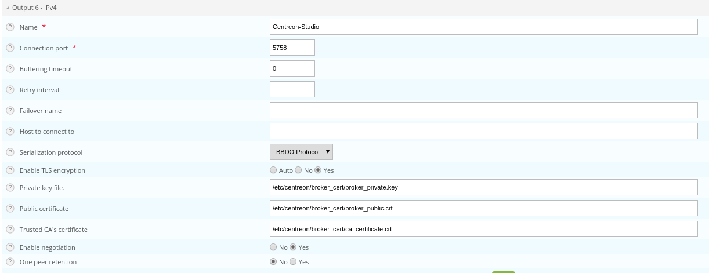

import Tabs from '@theme/Tabs';
import TabItem from '@theme/TabItem';

Ce chapitre décrit les procédures avancées permettant de sécuriser votre plateforme Centreon MAP.

> Si vous souhaitez utiliser MAP en HTTPS, vous devez sécuriser à la fois votre plateforme Centreon et MAP. Suivez cette [procédure](../administration/secure-platform.md#sécuriser-le-serveur-web-en-https) si vous devez sécuriser votre plateforme Centreon.

> Des erreurs de modification de fichiers de configuration peuvent entraîner des dysfonctionnements du logiciel. Nous vous recommandons de faire une sauvegarde du fichier avant de le modifier et de ne changer que les paramètres conseillés par Centreon.

Tous les paramètres TLS décrits dans ce chapitre sont configurés via des propriétés dans **/etc/centreon-map/map-config.properties**. Deux formats de certificats sont pris en charge :

- **PEM** (recommandé) : utilisez directement vos fichiers de certificat `.crt` et de clé privée `.key`. Il s'agit du format par défaut, qui ne nécessite aucune conversion.
- **JKS** : utilisez un keystore Java, si vous en possédez déjà un.

> Si vous effectuez une mise à niveau depuis une version qui utilisait les profils Spring `tls` / `tls_broker` dans **/etc/centreon-map/centreon-map.conf**, vous n'avez rien à modifier manuellement : le script post-installation migre automatiquement votre configuration existante vers le format basé sur les propriétés décrit ci-dessous.

## Configurer HTTPS/TLS sur le serveur MAP

Cette section décrit comment sécuriser le serveur web MAP lui-même (l'interface accessible depuis votre navigateur et depuis Centreon Central).

### Configurer HTTPS/TLS avec une clé reconnue

> Cette section décrit comment utiliser une **clé reconnue** avec le serveur Centreon MAP.
>
> Si vous souhaitez plutôt utiliser un certificat auto-signé, veuillez vous référer à la [section suivante](#configuration-httpstls-avec-une-clé-auto-signée).

Vous aurez besoin de :

- Un fichier de clé privée, appelé *map-server.key*.
- Un fichier de certificat, appelé *map-server.crt*.

<Tabs groupId="tls-format" queryString>
<TabItem value="pem" label="PEM (recommandé)">

1. Copiez les fichiers de clé et de certificat sur le serveur MAP, par exemple dans **/etc/centreon-map/**.

2. Définissez les paramètres suivants dans **/etc/centreon-map/map-config.properties** :

    ```properties
    centreon-map.tls.enabled=true
    centreon-map.tls.pem.keystore.certificate=/etc/centreon-map/map-server.crt
    centreon-map.tls.pem.keystore.private-key=/etc/centreon-map/map-server.key
    centreon-map.tls.pem.keystore.private-key-pass=xxx
    ```

    > Ne définissez `private-key-pass` que si votre clé privée est chiffrée. Adaptez les chemins si vous avez stocké les fichiers ailleurs.

</TabItem>
<TabItem value="jks" label="JKS">

1. Accédez au serveur Centreon MAP par SSH et créez un fichier PKCS12 avec la ligne de commande suivante :

    ```shell
    openssl pkcs12 -inkey map-server.key -in map-server.crt -export -out keys.pkcs12
    ```

2. Importez ce fichier dans un nouveau keystore (un dépôt Java de certificats de sécurité) :

    ```shell
    keytool -importkeystore -srckeystore keys.pkcs12 -srcstoretype pkcs12 -destkeystore /etc/centreon-map/map.jks
    ```

3. Définissez les paramètres suivants dans **/etc/centreon-map/map-config.properties** :

    ```properties
    centreon-map.tls.enabled=true
    centreon-map.tls.type=map-jks-tls
    centreon-map.tls.jks.keystore=/etc/centreon-map/map.jks
    centreon-map.tls.jks.keystore-pass=xxx
    ```

    > Remplacez la valeur "xxx" de keystore-pass par le mot de passe que vous avez utilisé pour le keystore, et adaptez le chemin s'il a été modifié.

</TabItem>
</Tabs>

### Configuration HTTPS/TLS avec une clé auto-signée

> L'activation du mode TLS avec une clé auto-signée obligera chaque utilisateur à ajouter une exception pour le certificat avant d'utiliser l'interface web.
>
> Ne l'activez que si votre Centreon utilise également ce protocole.
>
> Les utilisateurs devront ouvrir l'URL :
>
> ```shell
> https://<MAP_IP>:9443/centreon-map/api/beta/actuator/health
> ```
>
> **La solution que nous recommandons est d'utiliser une clé reconnue, comme expliqué ci-dessus.**

<Tabs groupId="tls-format" queryString>
<TabItem value="pem" label="PEM (recommandé)">

1. Générez un certificat auto-signé et une clé privée :

    ```shell
    openssl req -x509 -newkey rsa:2048 -nodes -keyout /etc/centreon-map/map-server.key -out /etc/centreon-map/map-server.crt -days 365
    ```

2. Définissez les paramètres suivants dans **/etc/centreon-map/map-config.properties** :

    ```properties
    centreon-map.tls.enabled=true
    centreon-map.tls.pem.keystore.certificate=/etc/centreon-map/map-server.crt
    centreon-map.tls.pem.keystore.private-key=/etc/centreon-map/map-server.key
    ```

</TabItem>
<TabItem value="jks" label="JKS">

1. Allez dans le dossier où Java est installé :

    ```shell
    cd $JAVA_HOME/bin
    ```

2. Générez un fichier keystore avec la commande suivante :

    ```shell
    keytool -genkey -alias map -keyalg RSA -keystore /etc/centreon-map/map.jks
    ```

    La valeur de l'alias "map" et le chemin du fichier keystore
    **/etc/centreon-map/map.jks** peuvent être modifiés, mais à moins d'une
    raison spécifique, nous conseillons de conserver les valeurs par défaut.

    Fournissez les informations nécessaires lors de la création du keystore.

    À la fin du formulaire, lorsque le "mot de passe de la clé" est demandé,
    utilisez le même mot de passe que celui utilisé pour le keystore
    lui-même en appuyant sur la touche ENTRÉE.

3. Définissez les paramètres suivants dans **/etc/centreon-map/map-config.properties** :

    ```properties
    centreon-map.tls.enabled=true
    centreon-map.tls.type=map-jks-tls
    centreon-map.tls.jks.keystore=/etc/centreon-map/map.jks
    centreon-map.tls.jks.keystore-pass=xxx
    ```

    > Remplacez la valeur keystore-pass "xxx" par le mot de passe que vous
    > avez utilisé pour le keystore.

</TabItem>
</Tabs>

### Appliquer la configuration

Redémarrez le service Centreon MAP pour appliquer la modification :

```shell
systemctl restart centreon-map-engine
```

Le serveur MAP est maintenant configuré pour répondre aux demandes provenant de HTTPS. Le port d'écoute par défaut passe automatiquement à **9443** (ou un port précédemment configuré) au lieu de 8081.

Pour utiliser un autre port, définissez le paramètre suivant dans
**/etc/centreon-map/map-config.properties** :

```properties
centreon-map.port=9443
```

Pour modifier le port par défaut, reportez-vous à la [procédure dédiée](./map-web-change-port.md).

> N'oubliez pas de modifier l'URL côté Centreon dans le champ **Adresse du serveur Centreon MAP** du menu **Administration > Extensions > Map > Options**.

## Configurer TLS sur la connexion Broker

Une sortie Broker supplémentaire pour Centreon Central (centreon-broker-master) a été créée pendant l'installation.

Vous pouvez la vérifier dans votre interface web Centreon, à la page **Configuration > Collecteurs > Configuration de Centreon Broker**, en éditant la configuration **centreon-broker-master**.

La configuration éditée doit ressembler à ceci :


### Configuration de Broker

Vous pouvez activer la sortie TLS et configurer la clé privée et le certificat public de Broker comme décrit ci-dessous :



1. Créez un certificat auto-signé avec les commandes suivantes :

    ```text
    openssl req -new -newkey rsa:2048 -nodes -keyout broker_private.key -out broker.csr
    openssl x509 -req -in broker.csr -CA ca.crt -CAkey ca.key -CAcreateserial -out broker_public.crt -days 365 -sha256
    ```

2. Copiez la clé privée et le certificat dans le répertoire **/etc/centreon/broker_cert/** :

    ```text
    mv broker_private.key /etc/centreon/broker_cert/
    mv broker_public.crt /etc/centreon/broker_cert/
    ```

> Le champ "Trusted CA's certificate" est facultatif. Si vous activez l'authentification client de Broker en définissant ce "ca\_certificate.crt", vous devez également configurer le [TLS propre au serveur MAP](#configurer-httpstls-sur-le-serveur-map).
>
> Vous devez pousser la nouvelle configuration du broker et redémarrer le broker après la configuration.

### Configuration du moteur MAP

Définissez les paramètres suivants dans **/etc/centreon-map/map-config.properties** pour activer la connexion par socket TLS avec Broker :

<Tabs groupId="tls-format" queryString>
<TabItem value="pem" label="PEM (recommandé)">

```properties
broker.tls.enabled=true
broker.tls.pem.keystore.certificate=/etc/centreon-map/map-broker.crt
```

Pointez directement vers le certificat public de Broker (ou son certificat CA) au format PEM — aucune création de truststore n'est nécessaire.

</TabItem>
<TabItem value="jks" label="JKS">

Si le certificat public de Broker est auto-signé, vous devez créer un truststore contenant le certificat (ou son certificat CA) avec la ligne de commande suivante :

```shell
keytool -import -alias centreon-broker -file broker_public.crt -keystore /etc/centreon-map/map-broker.jks
```

- "broker\_public.crt" est le certificat public de Broker ou son certificat CA au format PEM,
- "map-broker.jks" est le truststore généré au format JKS,
- un mot de passe de store est requis lors de la génération.

Ajoutez les paramètres du truststore dans **/etc/centreon-map/map-config.properties** :

```properties
broker.tls.enabled=true
broker.tls.type=broker-jks-tls
broker.tls.jks.truststore=/etc/centreon-map/map-broker.jks
broker.tls.jks.truststore-pass=xxxx
```

> `broker.tls.jks.truststore-pass` est facultatif — définissez-le uniquement si le truststore a été créé avec un mot de passe.

Si le certificat de Broker est signé par une autorité de certification reconnue, le truststore par défaut de la JVM (**cacerts**, **/etc/pki/java/cacerts**) est utilisé automatiquement — il n'y a rien à configurer.

</TabItem>
</Tabs>

Redémarrez le service Centreon MAP pour appliquer la modification :

```shell
systemctl restart centreon-map-engine
```

Une fois que vous avez configuré un certificat de confiance, Centreon MAP l'utilisera pour valider le certificat de Broker. Cela signifie que si vous utilisez un certificat auto-signé pour Broker, vous devez l'ajouter comme indiqué ci-dessus. Si vous ne le faites pas, la page **Supervision > Map** sera vide, et les journaux (**/var/log/centreon-map/centreon-map.log**) afficheront l'erreur suivante :
`unable to find valid certification path to requested target`.

## Configurer TLS pour la connexion à Centreon Central

> Vous devez [sécuriser votre plateforme Centreon avec HTTPS](../administration/secure-platform.md#sécuriser-le-serveur-web-en-https).

Définissez le paramètre **centreon.url** dans **/etc/centreon-map/map-config.properties**
pour utiliser HTTPS au lieu de HTTP :

```properties
centreon.url=https://<server-address>
```

Si Centreon Central utilise un certificat auto-signé ou un certificat signé par
une CA personnalisée/interne, vous devez donner à Centreon MAP un moyen de lui faire confiance :

<Tabs groupId="tls-format" queryString>
<TabItem value="pem" label="PEM (recommandé)">

```properties
centreon.tls.pem.keystore.certificate=/etc/centreon-map/central-ca.crt
```

Pointez directement vers le certificat public de Central ou son certificat CA, au format PEM.

</TabItem>
<TabItem value="jks" label="JKS">

1. Copiez le certificat **.crt** du serveur central sur le serveur MAP.

2. Créez un truststore contenant le certificat (ou son certificat CA) :

    ```shell
    keytool -import -alias centreon-central -file central_public.crt -keystore /etc/centreon-map/central-truststore.jks
    ```

3. Définissez les paramètres suivants :

    ```properties
    centreon.tls.jks.truststore=/etc/centreon-map/central-truststore.jks
    centreon.tls.jks.truststore-pass=xxxx
    ```

    > `centreon.tls.jks.truststore-pass` est facultatif — définissez-le uniquement si le truststore a été créé avec un mot de passe.

</TabItem>
</Tabs>

> Centreon MAP utilise par défaut le format PEM pour ce paramètre ; si le
> fichier de certificat PEM n'existe pas, il utilise alors le format JKS.
> Il n'y a pas de propriété `centreon.tls.type` à définir pour cette connexion.

Si le certificat est signé par une autorité de certification reconnue, rien n'a
besoin d'être configuré : le truststore par défaut de la JVM (**cacerts**,
**/etc/pki/java/cacerts**) est utilisé automatiquement.
