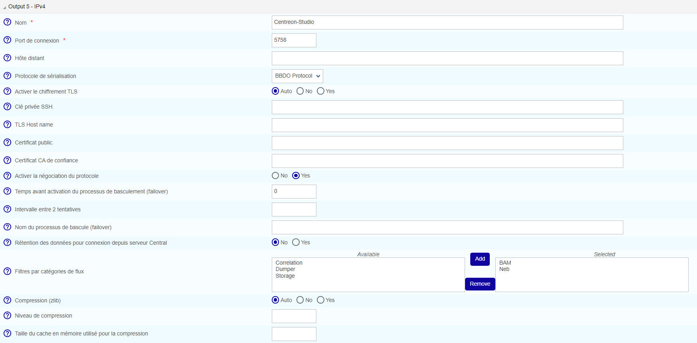

import Tabs from '@theme/Tabs';
import TabItem from '@theme/TabItem';

Ce chapitre décrit les procédures avancées permettant de sécuriser votre plateforme Centreon MAP.

> Si vous souhaitez utiliser MAP en HTTPS, vous devez sécuriser à la fois votre plateforme Centreon et MAP. Suivez cette [procédure](../administration/secure-platform.md#sécuriser-le-serveur-web-en-https) si vous devez sécuriser votre plateforme Centreon.

> Des erreurs de modification de fichiers de configuration peuvent entraîner des dysfonctionnements du logiciel. Nous vous recommandons de faire une sauvegarde du fichier avant de le modifier et de ne changer que les paramètres conseillés par Centreon.

Tous les paramètres TLS décrits dans ce chapitre sont configurés via des propriétés dans **/etc/centreon-map/map-config.properties**. Deux formats de certificats sont pris en charge :

- **PEM** (recommandé) : utilisez directement vos fichiers de certificat `.crt` et de clé privée `.key`. Il s'agit du format par défaut, qui ne nécessite aucune conversion.
- **JKS** : utilisez un keystore Java, si vous en possédez déjà un.

> Si vous effectuez une mise à niveau depuis une version qui utilisait les profils Spring `tls` / `tls_broker` dans **/etc/centreon-map/centreon-map.conf**, vous n'avez rien à modifier manuellement : le script post-installation migre automatiquement votre configuration existante vers le format basé sur les propriétés décrit ci-dessous.

## Configurer HTTPS/TLS sur le serveur MAP

Cette section décrit comment sécuriser le serveur web MAP lui-même (l'interface accessible depuis votre navigateur et depuis Centreon Central).

### Configurer HTTPS/TLS avec une clé reconnue

> Cette section décrit comment utiliser une **clé reconnue** avec le serveur Centreon MAP.
>
> Si vous souhaitez plutôt utiliser un certificat auto-signé, veuillez vous référer à la [section suivante](#configuration-httpstls-avec-une-clé-auto-signée).

Vous aurez besoin de :

- Un fichier de clé privée, appelé *map-server.key*.
- Un fichier de certificat, appelé *map-server.crt*.

<Tabs groupId="tls-format" queryString>
<TabItem value="pem" label="PEM (recommandé)">

1. Copiez les fichiers de clé et de certificat sur le serveur MAP, par exemple dans **/etc/centreon-map/**.

2. Définissez les paramètres suivants dans **/etc/centreon-map/map-config.properties** :

    ```properties
    centreon-map.tls.enabled=true
    centreon-map.tls.pem.keystore.certificate=/etc/centreon-map/map-server.crt
    centreon-map.tls.pem.keystore.private-key=/etc/centreon-map/map-server.key
    centreon-map.tls.pem.keystore.private-key-pass=xxx
    ```

    > Ne définissez `private-key-pass` que si votre clé privée est chiffrée. Adaptez les chemins si vous avez stocké les fichiers ailleurs.

</TabItem>
<TabItem value="jks" label="JKS">

1. Accédez au serveur Centreon MAP par SSH et créez un fichier PKCS12 avec la ligne de commande suivante :

    ```shell
    openssl pkcs12 -inkey map-server.key -in map-server.crt -export -out keys.pkcs12
    ```

2. Importez ce fichier dans un nouveau keystore (un dépôt Java de certificats de sécurité) :

    ```shell
    keytool -importkeystore -srckeystore keys.pkcs12 -srcstoretype pkcs12 -destkeystore /etc/centreon-map/map.jks
    ```

3. Définissez les paramètres suivants dans **/etc/centreon-map/map-config.properties** :

    ```properties
    centreon-map.tls.enabled=true
    centreon-map.tls.type=map-jks-tls
    centreon-map.tls.jks.keystore=/etc/centreon-map/map.jks
    centreon-map.tls.jks.keystore-pass=xxx
    ```

    > Remplacez la valeur "xxx" de keystore-pass par le mot de passe que vous avez utilisé pour le keystore, et adaptez le chemin s'il a été modifié.

</TabItem>
</Tabs>

### Configuration HTTPS/TLS avec une clé auto-signée

> L'activation du mode TLS avec une clé auto-signée obligera chaque utilisateur à ajouter une exception pour le certificat avant d'utiliser l'interface web.
>
> Ne l'activez que si votre Centreon utilise également ce protocole.
>
> Les utilisateurs devront ouvrir l'URL :
>
> ```shell
> https://<MAP_IP>:9443/centreon-map/api/beta/actuator/health
> ```
>
> **La solution que nous recommandons est d'utiliser une clé reconnue, comme expliqué ci-dessus.**

<Tabs groupId="tls-format" queryString>
<TabItem value="pem" label="PEM (recommandé)">

1. Générez un certificat auto-signé et une clé privée :

    ```shell
    openssl req -x509 -newkey rsa:2048 -nodes -keyout /etc/centreon-map/map-server.key -out /etc/centreon-map/map-server.crt -days 365
    ```

2. Définissez les paramètres suivants dans **/etc/centreon-map/map-config.properties** :

    ```properties
    centreon-map.tls.enabled=true
    centreon-map.tls.pem.keystore.certificate=/etc/centreon-map/map-server.crt
    centreon-map.tls.pem.keystore.private-key=/etc/centreon-map/map-server.key
    ```

</TabItem>
<TabItem value="jks" label="JKS">

1. Allez dans le dossier où Java est installé :

    ```shell
    cd $JAVA_HOME/bin
    ```

2. Générez un fichier keystore avec la commande suivante :

    ```shell
    keytool -genkey -alias map -keyalg RSA -keystore /etc/centreon-map/map.jks
    ```

    La valeur de l'alias "map" et le chemin du fichier keystore
    **/etc/centreon-map/map.jks** peuvent être modifiés, mais à moins d'une
    raison spécifique, nous conseillons de conserver les valeurs par défaut.

    Fournissez les informations nécessaires lors de la création du keystore.

    À la fin du formulaire, lorsque le "mot de passe de la clé" est demandé,
    utilisez le même mot de passe que celui utilisé pour le keystore
    lui-même en appuyant sur la touche ENTRÉE.

3. Définissez les paramètres suivants dans **/etc/centreon-map/map-config.properties** :

    ```properties
    centreon-map.tls.enabled=true
    centreon-map.tls.type=map-jks-tls
    centreon-map.tls.jks.keystore=/etc/centreon-map/map.jks
    centreon-map.tls.jks.keystore-pass=xxx
    ```

    > Remplacez la valeur keystore-pass "xxx" par le mot de passe que vous
    > avez utilisé pour le keystore.

</TabItem>
</Tabs>

### Appliquer la configuration

Redémarrez le service Centreon MAP pour appliquer la modification :

```shell
systemctl restart centreon-map-engine
```

Le serveur MAP est maintenant configuré pour répondre aux demandes provenant de HTTPS. Le port d'écoute par défaut passe automatiquement à **9443** (ou un port précédemment configuré) au lieu de 8081.

Pour utiliser un autre port, définissez le paramètre suivant dans
**/etc/centreon-map/map-config.properties** :

```properties
centreon-map.port=9443
```

Pour modifier le port par défaut, reportez-vous à la [procédure dédiée](./map-web-change-port.md).

> N'oubliez pas de modifier l'URL côté Centreon dans le champ **Adresse du serveur Centreon MAP** du menu **Administration > Extensions > Map > Options**.

## Configurer TLS sur la connexion Broker

Une sortie Broker supplémentaire pour Centreon Central (centreon-broker-master) a été créée pendant l'installation.

Vous pouvez la vérifier dans votre interface web Centreon, à la page **Configuration > Collecteurs > Configuration de Centreon Broker**, en éditant la configuration **centreon-broker-master**.

La configuration éditée doit ressembler à ceci :



### Configuration de Broker

Vous pouvez activer la sortie TLS et configurer la clé privée et le certificat public de Broker comme décrit ci-dessous :


1. Créez un certificat auto-signé avec les commandes suivantes :

    ```text
    openssl req -new -newkey rsa:2048 -nodes -keyout broker_private.key -out broker.csr
    openssl x509 -req -in broker.csr -CA ca.crt -CAkey ca.key -CAcreateserial -out broker_public.crt -days 365 -sha256
    ```

2. Copiez la clé privée et le certificat dans le répertoire **/etc/centreon/broker_cert/** :

    ```text
    mv broker_private.key /etc/centreon/broker_cert/
    mv broker_public.crt /etc/centreon/broker_cert/
    ```

> Le champ "Trusted CA's certificate" est facultatif. Si vous activez l'authentification client de Broker en définissant ce "ca\_certificate.crt", vous devez également configurer le [TLS propre au serveur MAP](#configurer-httpstls-sur-le-serveur-map).
>
> Vous devez pousser la nouvelle configuration du broker et redémarrer le broker après la configuration.

### Configuration du moteur MAP

Définissez les paramètres suivants dans **/etc/centreon-map/map-config.properties** pour activer la connexion par socket TLS avec Broker :

<Tabs groupId="tls-format" queryString>
<TabItem value="pem" label="PEM (recommandé)">

```properties
broker.tls.enabled=true
broker.tls.pem.keystore.certificate=/etc/centreon-map/map-broker.crt
```

Pointez directement vers le certificat public de Broker (ou son certificat CA) au format PEM — aucune création de truststore n'est nécessaire.

</TabItem>
<TabItem value="jks" label="JKS">

Si le certificat public de Broker est auto-signé, vous devez créer un truststore contenant le certificat (ou son certificat CA) avec la ligne de commande suivante :

```shell
keytool -import -alias centreon-broker -file broker_public.crt -keystore /etc/centreon-map/map-broker.jks
```

- "broker\_public.crt" est le certificat public de Broker ou son certificat CA au format PEM,
- "map-broker.jks" est le truststore généré au format JKS,
- un mot de passe de store est requis lors de la génération.

Ajoutez les paramètres du truststore dans **/etc/centreon-map/map-config.properties** :

```properties
broker.tls.enabled=true
broker.tls.type=broker-jks-tls
broker.tls.jks.truststore=/etc/centreon-map/map-broker.jks
broker.tls.jks.truststore-pass=xxxx
```

> `broker.tls.jks.truststore-pass` est facultatif — définissez-le uniquement si le truststore a été créé avec un mot de passe.

Si le certificat de Broker est signé par une autorité de certification reconnue, le truststore par défaut de la JVM (**cacerts**, **/etc/pki/java/cacerts**) est utilisé automatiquement — il n'y a rien à configurer.

</TabItem>
</Tabs>

Redémarrez le service Centreon MAP pour appliquer la modification :

```shell
systemctl restart centreon-map-engine
```

Une fois que vous avez configuré un certificat de confiance, Centreon MAP l'utilisera pour valider le certificat de Broker. Cela signifie que si vous utilisez un certificat auto-signé pour Broker, vous devez l'ajouter comme indiqué ci-dessus. Si vous ne le faites pas, la page **Supervision > Map** sera vide, et les journaux (**/var/log/centreon-map/centreon-map.log**) afficheront l'erreur suivante :
`unable to find valid certification path to requested target`.

## Configurer TLS pour la connexion à Centreon Central

> Vous devez [sécuriser votre plateforme Centreon avec HTTPS](../administration/secure-platform.md#sécuriser-le-serveur-web-en-https).

Définissez le paramètre **centreon.url** dans **/etc/centreon-map/map-config.properties**
pour utiliser HTTPS au lieu de HTTP :

```properties
centreon.url=https://<server-address>
```

Si Centreon Central utilise un certificat auto-signé ou un certificat signé par
une CA personnalisée/interne, vous devez donner à Centreon MAP un moyen de lui faire confiance :

<Tabs groupId="tls-format" queryString>
<TabItem value="pem" label="PEM (recommandé)">

```properties
centreon.tls.pem.keystore.certificate=/etc/centreon-map/central-ca.crt
```

Pointez directement vers le certificat public de Central ou son certificat CA, au format PEM.

</TabItem>
<TabItem value="jks" label="JKS">

1. Copiez le certificat **.crt** du serveur central sur le serveur MAP.

2. Créez un truststore contenant le certificat (ou son certificat CA) :

    ```shell
    keytool -import -alias centreon-central -file central_public.crt -keystore /etc/centreon-map/central-truststore.jks
    ```

3. Définissez les paramètres suivants :

    ```properties
    centreon.tls.jks.truststore=/etc/centreon-map/central-truststore.jks
    centreon.tls.jks.truststore-pass=xxxx
    ```

    > `centreon.tls.jks.truststore-pass` est facultatif — définissez-le uniquement si le truststore a été créé avec un mot de passe.

</TabItem>
</Tabs>

> Centreon MAP utilise par défaut le format PEM pour ce paramètre ; si le
> fichier de certificat PEM n'existe pas, il utilise alors le format JKS.
> Il n'y a pas de propriété `centreon.tls.type` à définir pour cette connexion.

Si le certificat est signé par une autorité de certification reconnue, rien n'a
besoin d'être configuré : le truststore par défaut de la JVM (**cacerts**,
**/etc/pki/java/cacerts**) est utilisé automatiquement.

## Configurer TLS sur une base de données MySQL ou MariaDB

Cette section décrit comment activer SSL sur un serveur MySQL/MariaDB et configurer Centreon MAP pour s'y connecter de manière sécurisée en utilisant la vérification de l'autorité de certification (mode `verify-ca`).

> **Remarque :** Cette procédure couvre uniquement le mode `verify-ca`. Dans ce mode, le certificat du serveur est validé par une autorité de certification de confiance, mais le nom d'hôte/l'adresse IP n'est pas vérifié. Pour les autres modes de vérification SSL, consultez la section [Référence des modes SSL](#référence-des-modes-ssl).

- Sélectionnez l'onglet correspondant à la base de données que vous souhaitez utiliser.

### Étape 1 - Générer les clés et certificats

<Tabs groupId="db" queryString>
<TabItem value="MySQL" label="MySQL">

**1. Créez un répertoire** (`/etc/mysql/newcerts` dans cet exemple) pour stocker vos fichiers de certificats :

```shell
mkdir -p /etc/mysql/newcerts
cd /etc/mysql/newcerts
```

**2. Générez l'autorité de certification (CA).** La CA est utilisée pour signer les certificats serveur et client, établissant ainsi une chaîne de confiance.

```shell
# Generate the CA private key
openssl genrsa 2048 > ca-key.pem
# Generate the CA self-signed certificate
openssl req -new -x509 -nodes -days 365000 -key ca-key.pem -out ca-cert.pem
```

**3. Générez le certificat serveur.** Le certificat serveur est présenté par MySQL aux clients lors de la négociation SSL.

```shell
# Generate the server private key and CSR (Certificate Signing Request)
openssl req -newkey rsa:2048 -days 365000 -nodes -keyout server-key.pem -out server-req.pem

# Convert the server key to RSA format (required by MySQL)
openssl rsa -in server-key.pem -out server-key.pem

# Sign the server certificate with the CA
openssl x509 -req -in server-req.pem -days 365000 -CA ca-cert.pem -CAkey ca-key.pem -set_serial 01 -out server-cert.pem
```

**4. Générez le certificat client.** Le certificat client est utilisé par l'application pour s'authentifier auprès de MySQL (TLS mutuel).

```shell
# Generate the client private key and CSR
openssl req -newkey rsa:2048 -days 365000 -nodes -keyout client-key.pem -out client-req.pem
# Convert the client key to RSA format
openssl rsa -in client-key.pem -out client-key.pem
# Sign the client certificate with the CA
openssl x509 -req -in client-req.pem -days 365000 -CA ca-cert.pem -CAkey ca-key.pem -set_serial 01 -out client-cert.pem
```

**5. Vérifiez les certificats.** Assurez-vous que les deux certificats sont correctement signés par la CA avant de continuer.

```shell
openssl verify -CAfile ca-cert.pem server-cert.pem client-cert.pem
# Expected output:
# server-cert.pem: OK
# client-cert.pem: OK
```

</TabItem>
<TabItem value="MariaDB" label="MariaDB">

**1. Créez un répertoire** (`/etc/mariadb/newcerts` dans cet exemple) pour stocker vos fichiers de certificats :

```shell
mkdir -p /etc/mariadb/newcerts
cd /etc/mariadb/newcerts
```

**2. Générez l'autorité de certification (CA).** La CA est utilisée pour signer les certificats serveur et client, établissant ainsi une chaîne de confiance.

```shell
# Generate the CA private key
openssl genrsa 2048 > ca-key.pem

# Generate the CA self-signed certificate
openssl req -new -x509 -nodes -days 365000 -key ca-key.pem -out ca-cert.pem
```

**3. Générez le certificat serveur.** Le certificat serveur est présenté par MariaDB aux clients lors de la négociation SSL.

```shell
# Generate the server private key and CSR (Certificate Signing Request)
openssl req -newkey rsa:2048 -days 365000 -nodes -keyout server-key.pem -out server-req.pem

# Convert the server key to RSA format (required by MariaDB)
openssl rsa -in server-key.pem -out server-key.pem

# Sign the server certificate with the CA
openssl x509 -req -in server-req.pem -days 365000 \
-CA ca-cert.pem -CAkey ca-key.pem -set_serial 01 \
-out server-cert.pem
```

**4. Générez le certificat client.** Le certificat client est utilisé par l'application pour s'authentifier auprès de MariaDB (TLS mutuel). Ignorez cette étape si vous n'avez besoin que de `REQUIRE SSL`.

```shell
# Generate the client private key and CSR
openssl req -newkey rsa:2048 -days 365000 -nodes -keyout client-key.pem -out client-req.pem

# Convert the client key to RSA format
openssl rsa -in client-key.pem -out client-key.pem

# Sign the client certificate with the CA
openssl x509 -req -in client-req.pem -days 365000 \
-CA ca-cert.pem -CAkey ca-key.pem -set_serial 01 \
-out client-cert.pem
```

**5. Vérifiez les certificats.** Assurez-vous que les deux certificats sont correctement signés par la CA avant de continuer.

```shell
openssl verify -CAfile ca-cert.pem server-cert.pem client-cert.pem
# Expected output:
# server-cert.pem: OK
# client-cert.pem: OK
```

</TabItem>
</Tabs>

### Étape 2 - Configurer le serveur MySQL/MariaDB

<Tabs groupId="db" queryString>
<TabItem value="MySQL" label="MySQL">

**1. Définissez la propriété des fichiers.** MySQL doit être propriétaire de tous les fichiers de certificats.

> Assurez-vous d'utiliser le répertoire créé précédemment (`/etc/mysql/newcerts` dans cet exemple).

```shell
chown -Rv mysql:root /etc/mysql/newcerts/*
```

**2. Modifiez la configuration du serveur MySQL.** Ajoutez le bloc suivant à votre fichier de configuration du serveur MySQL (généralement `/etc/mysql/mysql.conf.d/mysqld.cnf`) :

```shell
[mysqld]
ssl-ca   = /etc/mysql/newcerts/ca-cert.pem
ssl-cert = /etc/mysql/newcerts/server-cert.pem
ssl-key  = /etc/mysql/newcerts/server-key.pem
# Restrict to secure TLS versions only
tls_version = TLSv1.2,TLSv1.3
```

**3. Optionnel - Modifiez la configuration du client MySQL.** Cela permet à l'outil CLI mysql de se connecter également en SSL.

```shell
[mysql]
ssl-ca   = /etc/mysql/newcerts/ca-cert.pem
ssl-cert = /etc/mysql/newcerts/client-cert.pem
ssl-key  = /etc/mysql/newcerts/client-key.pem
```

**4. Redémarrez MySQL.**

```shell
systemctl restart mysqld
```

**5. Vérifiez que SSL est actif.**

```shell
SHOW VARIABLES LIKE '%ssl%';
-- have_ssl should be YES
-- ssl_ca, ssl_cert, ssl_key should point to your certificate files
```

</TabItem>
<TabItem value="MariaDB" label="MariaDB">

**1. Définissez la propriété des fichiers.** MariaDB doit être propriétaire de tous les fichiers de certificats.

> Assurez-vous d'utiliser le répertoire créé précédemment (`/etc/mariadb/newcerts` dans cet exemple).

```shell
chown -Rv mysql:root /etc/mariadb/newcerts/*
```

**2. Modifiez la configuration du serveur MariaDB.** Ajoutez le bloc suivant à votre fichier de configuration du serveur MariaDB (généralement `/etc/mariadb/mariadb.conf.d/50-server.cnf`) :

```shell
[mariadb]
ssl-ca   = /etc/mariadb/newcerts/ca-cert.pem
ssl-cert = /etc/mariadb/newcerts/server-cert.pem
ssl-key  = /etc/mariadb/newcerts/server-key.pem

# Restrict to secure TLS versions only
tls_version = TLSv1.2,TLSv1.3
```

**3. Optionnel - Modifiez la configuration du client MariaDB.** Cela permet à l'outil CLI mariadb de se connecter également en SSL (/etc/mariadb/mariadb.conf.d/client.cnf) :

```shell
[client-mariadb]
ssl-ca   = /etc/mariadb/newcerts/ca-cert.pem
ssl-cert = /etc/mariadb/newcerts/client-cert.pem
ssl-key  = /etc/mariadb/newcerts/client-key.pem
```

**4. Redémarrez MariaDB.**

```shell
systemctl restart mariadb
```

**5. Vérifiez que SSL est actif.**

```shell
SHOW VARIABLES LIKE '%ssl%';
-- have_ssl should be YES
-- ssl_ca, ssl_cert, ssl_key should point to your certificate files
```

</TabItem>
</Tabs>

### Étape 3 - Configurer l'utilisateur MySQL/MariaDB

<Tabs groupId="db" queryString>
<TabItem value="MySQL" label="MySQL">

**1. Exigez SSL pour l'utilisateur.**

```shell
ALTER USER 'centreon_map'@'<ip_or_hostname>' REQUIRE SSL;
-- Verify: ssl_type should now show ANY
SELECT user, host, ssl_type FROM mysql.user WHERE user='centreon_map';
```

**2. Accordez les privilèges.**

```shell
GRANT SELECT, INSERT, UPDATE, DELETE, CREATE, DROP, INDEX, ALTER,
      CREATE TEMPORARY TABLES, LOCK TABLES
  ON `centreon_map`.*
  TO `centreon_map`@`<ip_or_hostname>`;
-- Verify grants
SHOW GRANTS FOR 'centreon_map'@'<ip_or_hostname>';
```

</TabItem>
<TabItem value="MariaDB" label="MariaDB">

**1. Exigez SSL pour l'utilisateur.**

```shell
-- SSL only (no client certificate required)
ALTER USER 'centreon_map'@'<ip_or_hostname>' REQUIRE SSL;

-- Or mutual TLS (client certificate required)
-- ALTER USER 'centreon_map'@'<ip_or_hostname>' REQUIRE X509;

-- Verify: ssl_type should now show ANY (for SSL) or X509 (for mTLS)
SELECT user, host, ssl_type FROM mysql.user WHERE user='centreon_map';
```

**2. Accordez les privilèges.**

```shell
GRANT SELECT, INSERT, UPDATE, DELETE, CREATE, DROP, INDEX, ALTER,
    CREATE TEMPORARY TABLES, LOCK TABLES
ON `centreon_map`.*
TO `centreon_map`@`<ip_or_hostname>`;
-- Verify grants
SHOW GRANTS FOR 'centreon_map'@'<ip_or_hostname>';
```

</TabItem>
</Tabs>

### Étape 4 - Configurer JDBC (Spring Boot)

<Tabs groupId="db" queryString>
<TabItem value="MySQL" label="MySQL">

Depuis la migration vers MariaDB Connector/J, le connecteur MySQL n'est plus fourni. Même si votre serveur de base de données est **MySQL**, l'URL JDBC utilise le schéma `jdbc:mariadb://` et le pilote `org.mariadb.jdbc.Driver`. **MariaDB Connector/J 3.x prend en charge nativement les fichiers PEM** via le paramètre `serverSslCert`, directement dans l'URL JDBC. Aucune conversion en keystore Java n'est nécessaire pour le mode SSL simple.

Un fichier keystore n'est nécessaire que pour mTLS (authentification par certificat client) :

| Fichier      | Contenu                        | Utilité                                                  | Requis                     |
|--------------|--------------------------------|----------------------------------------------------------|----------------------------|
| ca-cert.pem  | Certificat CA                  | Permet au pilote de vérifier l'identité du serveur MySQL | Oui - Toujours             |
| keystore.p12 | Certificat client + clé privée | Permet à MySQL de vérifier l'identité de l'application   | Uniquement si REQUIRE X509 |

> **Remarque : mTLS est optionnel.** Il n'est nécessaire que si l'utilisateur MySQL a été créé avec REQUIRE X509. Si l'utilisateur a été créé avec REQUIRE SSL, seul `serverSslCert` pointant vers la CA est nécessaire, et les étapes relatives au keystore ci-dessous peuvent être ignorées.

**1. Optionnel - Créez le KeyStore pour mTLS.**

Ignorez cette étape si l'utilisateur MySQL a été créé avec REQUIRE SSL. Elle n'est requise que pour REQUIRE X509 (TLS mutuel).

`keytool` ne peut pas importer directement une clé privée PEM : il faut donc d'abord passer par un fichier PKCS12.

1.1. Regroupez le certificat client et la clé dans un fichier PKCS12 :

```shell
openssl pkcs12 -export \
-in /etc/mysql/newcerts/client-cert.pem \
-inkey /etc/mysql/newcerts/client-key.pem \
-out /etc/mysql/newcerts/keystore.p12 \
-name mysqlClient \
-passout pass:changeit
```

**2. Définissez les permissions des fichiers.** Assurez-vous que seul l'utilisateur qui exécute l'application Java peut lire les fichiers keystore.

```shell
chown your_java_user: /etc/mysql/newcerts/keystore.p12
chmod 640 /etc/mysql/newcerts/keystore.p12
```

**3. Définissez l'URL JDBC.** Ajoutez la ligne suivante à votre fichier de configuration (/etc/centreon-map/*-database.properties) :

```shell
*.connection.url=jdbc:mariadb://<ip_or_hostname>:3306/centreon_map?sslMode=verify-ca&serverSslCert=/etc/mysql/newcerts/ca-cert.pem&rewriteBatchedStatements=true
```

> **Remarque : sslMode=trust pour MySQL 8.** Sur un serveur MySQL 8, le paramètre `sslMode=trust` est ajouté par défaut. Pour une configuration d'authentification `caching_sha2_password` renforcée, remplacez `trust` par `verify-ca` (comme ci-dessus) ou `verify-full`. N'utilisez jamais `sslMode=disable` sur MySQL 8 : cela empêcherait l'authentification.

**4. Optionnel — uniquement si mTLS est activé (REQUIRE X509).** Ajoutez les options `keyStore`, `keyStorePassword` et `keyStoreType` :

```shell
*.connection.url=jdbc:mariadb://<ip_or_hostname>:3306/centreon_map?sslMode=verify-ca&serverSslCert=/etc/mysql/newcerts/ca-cert.pem&keyStore=/etc/mysql/newcerts/keystore.p12&keyStorePassword=changeit&keyStoreType=PKCS12&rewriteBatchedStatements=true
```

</TabItem>
<TabItem value="MariaDB" label="MariaDB">

Contrairement à MySQL Connector/J, **MariaDB Connector/J 3.x prend en charge nativement les fichiers PEM** via le paramètre `serverSslCert`, directement dans l'URL JDBC. Aucune conversion en keystore Java n'est nécessaire pour le mode SSL simple.

Un fichier keystore n'est nécessaire que pour mTLS (authentification par certificat client) :

| Fichier      | Contenu                        | Utilité                                                    | Requis                     |
|--------------|--------------------------------|------------------------------------------------------------|----------------------------|
| ca-cert.pem  | Certificat CA                  | Permet au pilote de vérifier l'identité du serveur MariaDB | Oui - Toujours             |
| keystore.p12 | Certificat client + clé privée | Permet à MariaDB de vérifier l'identité de l'application   | Uniquement si REQUIRE X509 |

> **Remarque : mTLS est optionnel.** Il n'est nécessaire que si l'utilisateur MariaDB a été créé avec REQUIRE X509. Si l'utilisateur a été créé avec REQUIRE SSL, seul `serverSslCert` pointant vers la CA est nécessaire, et les étapes relatives au keystore ci-dessous peuvent être ignorées.

**1. Optionnel - Créez le KeyStore pour mTLS.**

Ignorez cette étape si l'utilisateur MariaDB a été créé avec REQUIRE SSL. Elle n'est requise que pour REQUIRE X509 (TLS mutuel).

`keytool` ne peut pas importer directement une clé privée PEM : il faut donc d'abord passer par un fichier PKCS12.

1.1. Regroupez le certificat client et la clé dans un fichier PKCS12 :

```shell
openssl pkcs12 -export \
-in /etc/mariadb/newcerts/client-cert.pem \
-inkey /etc/mariadb/newcerts/client-key.pem \
-out /etc/mariadb/newcerts/keystore.p12 \
-name mariadbClient \
-passout pass:changeit
```

**2. Définissez les permissions des fichiers.** Assurez-vous que seul l'utilisateur qui exécute l'application Java peut lire les fichiers keystore.

```shell
chown your_java_user: /etc/mariadb/newcerts/keystore.p12
chmod 640 /etc/mariadb/newcerts/keystore.p12
```

**3. Définissez l'URL JDBC.** Ajoutez la ligne suivante à votre fichier de configuration (/etc/centreon-map/*-database.properties) :

```shell
*.connection.url=jdbc:mariadb://<ip_or_hostname>:3306/centreon_map?sslMode=verify-ca&serverSslCert=/etc/mariadb/newcerts/ca-cert.pem&rewriteBatchedStatements=true
```

**4. Optionnel — uniquement si mTLS est activé (REQUIRE X509).** Ajoutez les options `keyStore`, `keyStorePassword` et `keyStoreType` :

```shell
*.connection.url=jdbc:mariadb://<ip_or_hostname>:3306/centreon_map?sslMode=verify-ca&serverSslCert=/etc/mariadb/newcerts/ca-cert.pem&keyStore=/etc/mariadb/newcerts/keystore.p12&keyStorePassword=changeit&keyStoreType=PKCS12&rewriteBatchedStatements=true
```

</TabItem>
</Tabs>

### Étape 5 - Vérifier l'expiration des certificats

<Tabs groupId="db" queryString>
<TabItem value="MySQL" label="MySQL">

**1. Vérifiez le certificat CA.**

```shell
openssl x509 -in /etc/mysql/newcerts/ca-cert.pem -noout -dates
# notBefore=...
# notAfter=...
```

**2. Vérifiez le certificat serveur.**

```shell
openssl x509 -in /etc/mysql/newcerts/server-cert.pem -noout -dates
```

**3. Vérifiez le KeyStore (mTLS uniquement).**

```shell
keytool -list -v -keystore /etc/mysql/newcerts/keystore.p12 -storepass changeit
# Look for: Valid from ... until ...
```

</TabItem>
<TabItem value="MariaDB" label="MariaDB">

**1. Vérifiez le certificat CA.**

```shell
openssl x509 -in /etc/mariadb/newcerts/ca-cert.pem -noout -dates
# notBefore=...
# notAfter=...
```

**2. Vérifiez le certificat serveur.**

```shell
openssl x509 -in /etc/mariadb/newcerts/server-cert.pem -noout -dates
```

**3. Vérifiez le KeyStore (mTLS uniquement).**

```shell
keytool -list -v -keystore /etc/mariadb/newcerts/keystore.p12 -storepass changeit
# Look for: Valid from ... until ...
```

</TabItem>
</Tabs>

### Référence des modes SSL

Le mode `verify-ca` est le minimum recommandé en production. Ce tableau liste les autres modes disponibles selon vos exigences de sécurité :

| Mode          | Certificat serveur vérifié | Nom d'hôte/IP vérifié | Cas d'utilisation                                                         |
|---------------|----------------------------|-----------------------|---------------------------------------------------------------------------|
| `disable`     | Non                        | Non                   | Développement uniquement — pas de chiffrement                             |
| `trust`       | Non                        | Non                   | Chiffre le trafic mais ne valide pas le certificat serveur                |
| `verify-ca`   | Oui                        | Non                   | Utilisé dans cette procédure — valide la chaîne de la CA                  |
| `verify-full` | Oui                        | Oui                   | Le plus strict — vérifie aussi le nom d'hôte/l'IP dans le SAN du certificat |

> **Remarque :** Si vous souhaitez utiliser le mode `verify-full`, le certificat serveur doit inclure un champ Subject Alternative Name (SAN) correspondant exactement à l'IP ou au nom d'hôte utilisé dans l'URL JDBC. Le champ CN seul ne suffit pas pour les connexions basées sur une adresse IP.
