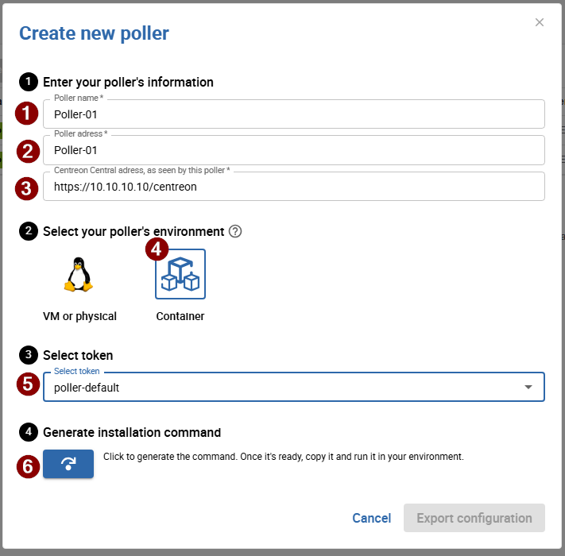

Centreon propose également un déploiement de collecteur basé sur Docker. Au lieu
d'un unique container monolithique, chaque composant du collecteur s'exécute
dans son propre container dédié (Centreon Engine, Gorgone, et en option la
gestion des traps SNMP et la supervision VMware), orchestrés par un unique
fichier `docker-compose.yaml`.

Cette méthode de déploiement s'appuie sur une commande d'installation générée
qui télécharge et exécute un script d'installation sur l'hôte Docker cible. Le
script génère pour vous les fichiers `.env` et `docker-compose.yaml`, puis
démarre la stack.

> Consultez [Utilisateurs et groupes](../../installation/technical.md) pour la
> liste des utilisateurs système (`centreon-engine`, `centreon-gorgone`, etc.)
> utilisés à l'intérieur de ces containers.

## Prérequis

* Un hôte Linux disposant de **Docker Engine** et du plugin **Docker Compose
  v2** (la commande `docker compose version` doit s'exécuter sans erreur).
* Un accès réseau sortant depuis cet hôte vers votre serveur central Centreon.
* Si ce collecteur doit recevoir des traps SNMP, le port UDP 162 doit être
  accessible sur cet hôte.
* Si ce collecteur doit superviser une infrastructure VMware, l'image Docker
  `centreon-vmware` doit être construite au préalable (voir
  [Optionnel : container centreon-vmware](#optionnel--container-centreon-vmware)).

## Étape 1 : Générer la commande d'installation

1. Dans l'interface Centreon, ouvrez le menu **Pollers** en haut de l'écran et
   cliquez sur **Create new poller** (actuellement en BETA).

   

2. Renseignez les informations du collecteur, sélectionnez son environnement
   et son token, puis générez la commande d'installation :

   

   1. **Poller name** : un nom unique pour ce collecteur.
   2. **Poller address** : l'adresse propre du collecteur (voir la remarque
      ci-dessous).
   3. **Centreon Central adress, as seen by this poller** : l'URL utilisée
      par ce collecteur pour joindre le serveur central.
   4. **Container** : l'environnement pour lequel générer la commande (par
      opposition à **VM or physical**).
   5. **Select token** : un token de collecteur Gorgone existant.
   6. Le bouton qui génère la commande d'installation.

   > Le champ **Poller address** n'a pas d'impact sur la connectivité :
   > Gorgone utilise PullWSS, le collecteur initie donc toujours la
   > connexion vers le serveur central, jamais l'inverse.

3. Copiez la commande d'installation générée, et laissez cette fenêtre
   ouverte. Elle ressemble à ceci :

   

   ```shell
   curl -fsSL <CENTRAL_URL>/poller/install.sh | bash -s -- \
     --type docker \
     --poller_token <TOKEN_NAME>:<TOKEN_SECRET> \
     --uid <POLLER_UID> \
     --name '<POLLER_NAME>' \
     --central_url <CENTRAL_URL> \
     --appsecret <APP_SECRET> \
     --salt <SALT>
   ```

   > Remplacez **\<CENTRAL_URL\>** par l'URL complète de votre serveur central
   > Centreon, incluant le chemin de base de l'application web (par exemple,
   > `https://centreon.example.com/centreon`).

## Étape 2 : Exécuter la commande d'installation sur l'hôte Docker

Exécutez la commande copiée en tant qu'utilisateur autorisé à utiliser Docker
sur l'hôte cible. Le script :

1. Vérifie que Docker et le plugin Docker Compose v2 sont disponibles.
2. Génère un fichier `.env` et un fichier `docker-compose.yaml` dans le
   répertoire courant.
3. Démarre la stack avec `docker compose up -d`, sauf si `--no-start` a été
   ajouté à la commande (dans ce cas, démarrez-la vous-même plus tard avec
   `docker compose up -d`).

Par défaut, la stack générée comprend toujours deux services :

* **centengine** : Centreon Engine, le moteur de supervision.
* **gorgone** : Gorgone, chargé de récupérer la configuration du collecteur et
  de communiquer avec le serveur central.

## Étape 3 : Ajouter des services optionnels

Ajoutez ces options à la commande d'installation **avant de l'exécuter** pour
inclure des services supplémentaires dans la stack générée :

| Option | Effet |
|------|--------|
| `--with-snmptrap` | Ajoute les services `snmptrapd` et `centreontrapd`, pour la supervision passive par traps SNMP. |
| `--with-vmware` | Ajoute le service `centreon-vmware` (voir le prérequis ci-dessous). |
| `--with-cma` | Monte les certificats TLS et expose le port 4317, pour les collecteurs qui acceptent des connexions du Centreon Monitoring Agent (CMA) via OpenTelemetry gRPC. |
| `--tz <timezone>` | Définit le fuseau horaire des containers (par défaut : `UTC`). |
| `--debug true` | Active les logs de debug sur les services. |
| `--gorgone-ssl <true\|false>` | Surcharge le paramètre SSL utilisé pour la connexion Gorgone vers le serveur central. |
| `--no-start` | Génère uniquement `.env` et `docker-compose.yaml` ; ne démarre pas la stack. |

Si vous avez déjà exécuté la commande d'installation sans ces options, vous
pouvez aussi ajouter le(s) service(s) correspondant(s) manuellement dans les
fichiers `docker-compose.yaml` et `.env` générés, puis relancer
`docker compose up -d`.

### Optionnel : container centreon-vmware

La supervision d'une infrastructure VMware nécessite le SDK Perl VMware
propriétaire, qui ne peut pas être redistribué pour des raisons de licence.
C'est pourquoi l'image du container `centreon-vmware` **n'est pas publiée sur
un registre**. Le `docker-compose.yaml` généré la référence sous la forme
`connector-vmware:${VMWARE_TAG:-local}` avec `pull_policy: never` : vous devez
donc la construire localement, sur l'hôte Docker, avant d'utiliser
`--with-vmware`.

Clonez le dépôt `centreon-plugins` et construisez l'image à partir de celui-ci :

```shell
git clone https://github.com/centreon/centreon-plugins.git
cd centreon-plugins
docker build \
  --build-arg PACKAGE_SOURCE=repo \
  --build-arg WITH_SDK=true \
  --file .github/docker/connector/Dockerfile.connector-vmware \
  --tag connector-vmware:local \
  .
```

> `WITH_SDK=true` nécessite les archives du SDK Perl VMware vSphere et du SDK
> vSAN, que vous devez télécharger vous-même depuis le portail développeur de
> Broadcom. Consultez les
> [prérequis du plugin pack VMware ESX](/pp/integrations/plugin-packs/procedures/virtualization-vmware2-esx/#prérequis)
> pour savoir comment obtenir ces fichiers. Déposez les archives téléchargées
> dans le répertoire `./centreon-plugins/sdks-vmware` avant d'exécuter la
> commande `docker build` ci-dessus. Construire l'image avec `WITH_SDK=false`
> produit une image fonctionnelle, mais celle-ci ne peut pas déchiffrer les
> identifiants vCenter chiffrés.

### Checks personnalisés et dépendances des plugins

Le container `centengine` peut installer des scripts de check personnalisés
et des dépendances supplémentaires sans reconstruire l'image. Ajoutez les
volumes correspondants au service `centengine` dans le `docker-compose.yaml`
généré :

```yaml
    volumes:
      # Scripts de plugins personnalisés (doivent être exécutables)
      - ./custom-plugins:/usr/lib/nagios/plugins/custom:ro
      # Paquets APT supplémentaires, installés au démarrage
      - ./custom-deps.json:/etc/centreon-engine/custom-deps.json:ro
```

* Les **scripts de plugins personnalisés** placés dans `./custom-plugins`
  deviennent disponibles sous `/usr/lib/nagios/plugins/custom` à l'intérieur
  du container.
* **`custom-deps.json`** liste des paquets APT arbitraires à installer, par
  exemple :

  ```json
  {
    "apt": ["snmp", "jq"]
  }
  ```

  Ce fichier est lu au démarrage du container, puis surveillé en continu :
  le modifier sur l'hôte déclenche automatiquement l'installation des
  paquets listés, sans avoir besoin de redémarrer le container.
  L'installation des paquets s'exécute en arrière-plan, ce qui n'interrompt
  pas `centengine` pendant ce temps.

> Les plugins de supervision Centreon (issus des Connecteurs de supervision)
> n'ont pas besoin d'être configurés ici : Gorgone les installe
> automatiquement, dans le même volume de configuration partagé, dès lors que
> **Installation automatique des plugins** est activée à la page
> **Configuration > Connecteurs > Connecteurs de supervision** et que la
> configuration du collecteur est déployée depuis le serveur central.
> Consultez [Connecteurs de supervision](../../monitoring/pluginpacks.md)
> pour plus de détails.

#### Intégrer les dépendances dans une image personnalisée

Plutôt que d'installer les dépendances au démarrage du container, vous pouvez
construire votre propre image à partir de l'image officielle et tout
installer au moment du build :

```dockerfile
FROM docker.centreon.com/centreon/centreon-engine-trixie:26.10

RUN apt-get update && apt-get install -y --no-install-recommends \
      snmp \
      jq \
    && rm -rf /var/lib/apt/lists/*
```

Construisez-la, puis référencez-la via `ENGINE_TAG` (ou en surchargeant
directement la valeur `image:`) dans votre `docker-compose.yaml`. L'intérêt
principal de cette approche est le temps de démarrage : lorsqu'un collecteur
nécessite de nombreuses dépendances, les installer une seule fois au moment
du build est plus rapide que de les réinstaller à chaque démarrage du
container via `custom-deps.json`.

### Optionnel : prise en charge du Centreon Monitoring Agent (CMA)

Ajoutez `--with-cma` à la commande d'installation pour que `centengine`
puisse accepter les connexions du Centreon Monitoring Agent via OpenTelemetry
gRPC. Cela ajoute les éléments suivants au service `centengine` :

```yaml
    volumes:
      - ./certs/poller.crt:/etc/pki/poller.crt:ro
      - ./certs/poller.key:/etc/pki/poller.key:ro
    ports:
      - "4317:4317"
```

Générez les certificats TLS et configurez l'agent en suivant
[Configurer les certificats](../../cma/cma-certificates.md) et
[Configurer l’environnement de l’agent](../../cma/cma-setup.md).

## Référence des fichiers générés

Le `docker-compose.yaml` généré par le script d'installation relie les
services entre eux à l'aide de volumes Docker nommés, vous n'avez donc pas
besoin de configurer cela vous-même :

| Volume | Partagé entre | Rôle |
|--------|-----------------|---------|
| `poller-engine` | centengine, gorgone | Configuration de Centreon Engine (`/etc/centreon-engine`) |
| `poller-broker` | centengine, gorgone | Configuration de Centreon Broker (`/etc/centreon-broker`) |
| `poller-centcmd` | centengine, gorgone, centreontrapd | Pipe de commandes externes de Centreon Engine (`/var/lib/centreon-engine/rw`) |
| `poller-snmp-spool` | snmptrapd, centreontrapd | Répertoire spool où les traps reçus sont écrits puis traités |
| `poller-snmp-traps` | gorgone, centreontrapd | Définitions des traps SNMP poussées par le serveur central |

Chaque service dispose également d'un healthcheck Docker : `docker compose ps`
indique donc `healthy` une fois qu'un service est pleinement opérationnel.

## Étape 4 : Confirmer la connexion et exporter la configuration

La fenêtre de création du collecteur n'affiche pas de statut "connecté" par
elle-même. Vérifiez plutôt l'état de santé du container `gorgone` sur l'hôte
Docker :

```shell
docker compose ps
```

Une fois que `gorgone` indique `healthy`, la connexion avec le serveur
central est établie. Retournez sur la fenêtre de création du collecteur et
cliquez sur **Export configuration** pour envoyer la configuration de
supervision au collecteur.

Le collecteur apparaît alors comme actif sur la page
**Configuration > Pollers** :


Si `gorgone` ne passe pas à l'état `healthy` après quelques minutes,
vérifiez d'abord ses logs (`docker compose logs gorgone`), puis consultez
[Rattacher un collecteur à un serveur central ou distant](../../monitoring/monitoring-servers/add-a-poller-to-configuration.md)
et
[Communications entre les serveurs](../../monitoring/monitoring-servers/communications.md)
pour plus de détails sur la manière dont les collecteurs s'enregistrent et
communiquent avec le serveur central.

## Étape 5 : Sécuriser votre plateforme

N'oubliez pas de sécuriser votre plateforme Centreon en suivant nos
[recommandations](../../administration/secure-platform.md).
