## Introduction

Cette documentation vous est présentée par notre partenaire YPSI :


## Comment ça marche

Le connecteur de notification Telegram utilise le plugin Centreon perl pour envoyer des notifications via Telegram grâce à leur API REST.

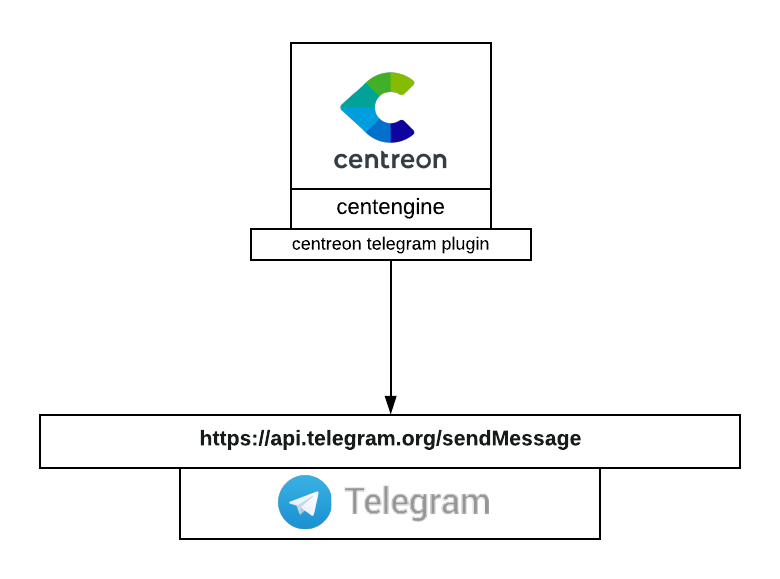

## Installation

### Plugin Centreon avec Telegram

Avant toute chose, vous devez avoir installé le plugin Centreon Telegram sur votre serveur Centreon.
Installez Git, puis exécutez les commandes suivantes :

```bash
mkdir /usr/lib/centreon/git-plugins
cd /usr/lib/centreon/git-plugins
git clone https://github.com/centreon/centreon-plugins.git
```

### Configurer Telegram

Connectez-vous à votre compte sur https://web.telegram.org

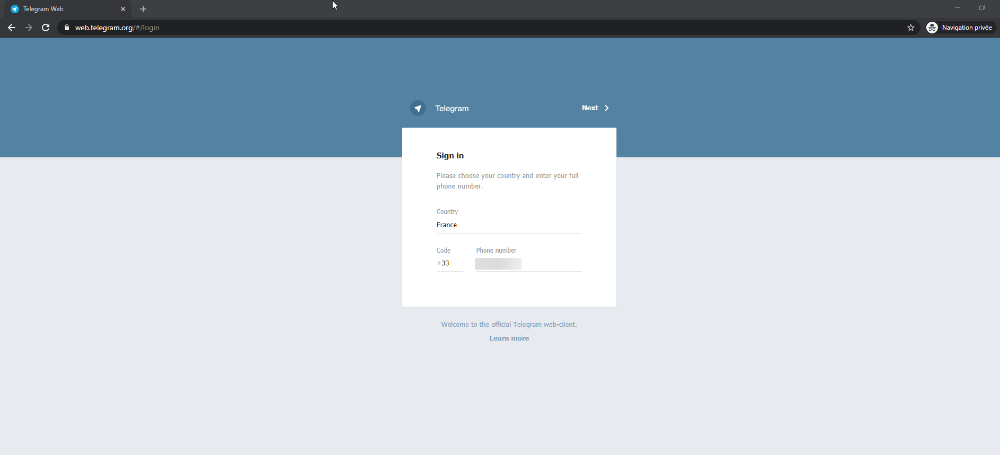

Puis parlez au BotFather et donnez-lui la commande suivante :

```/newbot```

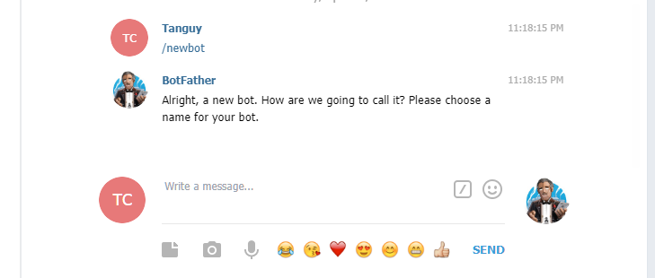

Le BotFather vous demandera un prénom et un nom d'utilisateur pour votre bot. Le nom d'utilisateur doit se terminer par "**_bot**".
Il est possible d'utiliser le même nom pour les deux identifiants comme montré ci-dessous.

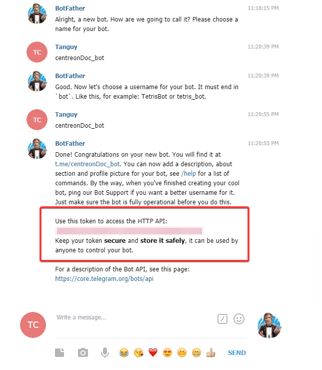

Comme vient de vous le dire le BotFather, il est très important que vous **reteniez votre token**, on en aura besoin pour envoyer les notifications plus tard.

Il nous faut maintenant créer un nouveau groupe.

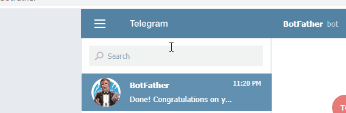

Ajoutez votre bot au groupe que vous venez de créer.

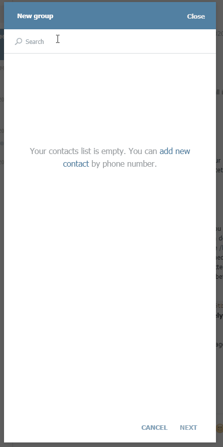

## Configuration

### Obtenir votre chat-id de Telegram

Allez sur l'application web de Telegram et cliquez sur le groupe que vous venez de créer pour obtenir le chat-id à partir de l'URL de la page.

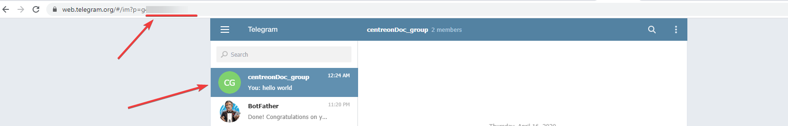

Par exemple, si votre URL est la suivante : **https://web.telegram.org/#/im?p=g123456** votre chat-id est **123456**.

> Bien que 123456 soit le chat-id, vous devrez écrire **-123456** dans la configuration pour que celle-ci marche.

### Création des commandes sur Centreon

#### Commande pour notification sur service

Allez sur **Configuration > Commandes > Notifications** et cliquez sur **Ajouter**.

Selectionnez **Notification** pour le type de commande et copiez la commande suivante dans l'espace **Ligne de commande** en remplaçant les macros avec vos informations :

```bash
/usr/lib/centreon/git-plugins/centreon-plugins/src/centreon_plugins.pl
--plugin=notification::telegram::plugin
--mode=alert
--http-peer-addr='api.telegram.org'
--bot-token='xxxxxxxxxxxxxxxxxxxxxxxxxxxxxxxxxxx'
--chat-id='-xxxxxxxxxx'
--host-name='$HOSTNAME$'
--service-description='$SERVICEDESC$'
--service-state=$SERVICESTATE$
--service-output='$SERVICEOUTPUT$'
``` 

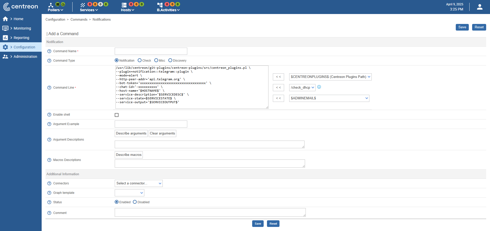

#### Commande pour notification sur hôte

Allez sur **Configuration > Commandes > Notifications** et cliquez sur **Ajouter**.

Selectionnez **Notification** pour le type de commande et copiez la commande suivante dans l'espace **Ligne de commande** en remplaçant les macros avec vos informations :

```bash
/usr/lib/centreon/git-plugins/centreon-plugins/src/centreon_plugins.pl
--plugin=notification::telegram::plugin
--mode=alert
--http-peer-addr='api.telegram.org'
--bot-token='xxxxxxxxxxxxxxxxxxxxxxxxxxxxxxxxxxxxxxx'
--chat-id='-xxxxxxx'
--host-name='$HOSTNAME$'
--host-state=$HOSTSTATE$
--host-output='$HOSTOUTPUT$'
```

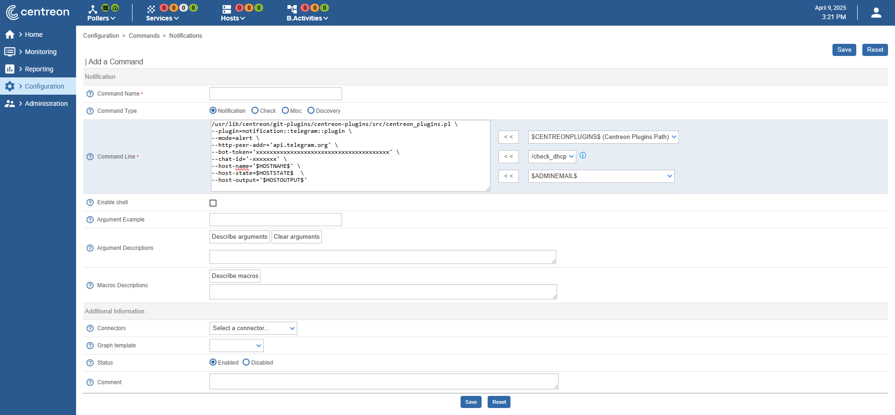

## Exemple

```bash
/usr/lib/centreon/git-plugins/centreon-plugins/src/centreon_plugins.pl \ 
--plugin=notification::telegram::plugin \
--mode=alert \
--http-peer-addr='api.telegram.org' \
--bot-token='xxxxxxxxxxxxxxxxxxxxxxxxxxxxxxxxxxx' \
--chat-id='-xxxxxxxx' \
--host-name='nirvana' \
--service-description='yellow-submarine' \
--service-state=CRITICAL 
--service-output='highway to hell'
```

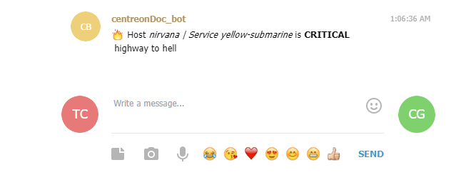

```bash
/usr/lib/centreon/git-plugins/centreon-plugins/src/centreon_plugins.pl \
--plugin=notification::telegram::plugin \
--mode=alert \
--http-peer-addr='api.telegram.org' \
--bot-token='xxxxxxxxxxxxxxxxxxxxxxxxxxxxxxxxxxx' \
--chat-id='-xxxxxxx' \
--host-name='REM' \
--host-state=DOWN \
--host-output='let the sky fall'
```

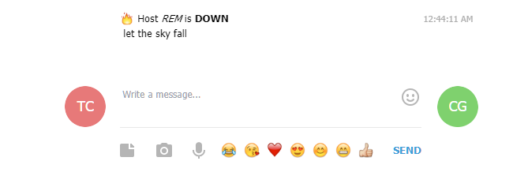

## Options de message

Lors de l'envoi de notifications, vous pouvez ajouter diverses options. Vous pouvez consulter ces options en utilisant l'option `--help` du plugin Centreon.

Voici quelques unes des options disponibles :

| Options           | Explication                                            | Exemple                                                                                                                                                                                   |
| ----------------- | ------------------------------------------------------ | ----------------------------------------------------------------------------------------------------------------------------------------------------------------------------------------- |
| \--centreon-token | un token d'autologin Centreon                       |                                                                                                                                                                                           |
| \--centreon-url   | l'URL de Centreon                                   |                                                                                                                                                                                           |
| \--graph-url      | URL d'un graphique. Les options ci-dessus peuvent être utilisées comme macros ici | **%\{centreon_url\}**/include/views/graphs/generateGraphs/generateImage.php?username=myuser&token=**%\{centreon_token\}**&hostname=**%\{host_name\}**&service=**%\{service_description\}** |
| \--link-url       | une URL                                            | **%\{centreon_url\}**/main.php?p=20201&o=svc&host\_search=**%\{host_name\}**&svc\_search=**%\{service_description\}**                                                                     |
| \--proxyurl       | l'URL vers votre proxy (si nécessaire)                 |                                                                                                                                                                                           |

Pour afficher toutes les options, utilisez la commande suivante :

```bash
/usr/lib/centreon/git-plugins/centreon-plugins/src/centreon_plugins.pl \
--plugin=notification::telegram::plugin \
--mode=alert \
--help
```
