### BV-BA-Availabilities-1

#### Description

Ce rapport affiche les statistiques de disponibilité et d'incidents des
applications d'une vue métier. La plage horaire utilisée pour chaque
activité métier est la plage horaire par défaut configurée dans le
module Centreon BAM.

#### Comment interpréter ce rapport

La première page affiche un focus sur les notions suivantes:

- Disponibilité

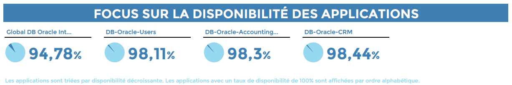

- De temps d'indisponibilité

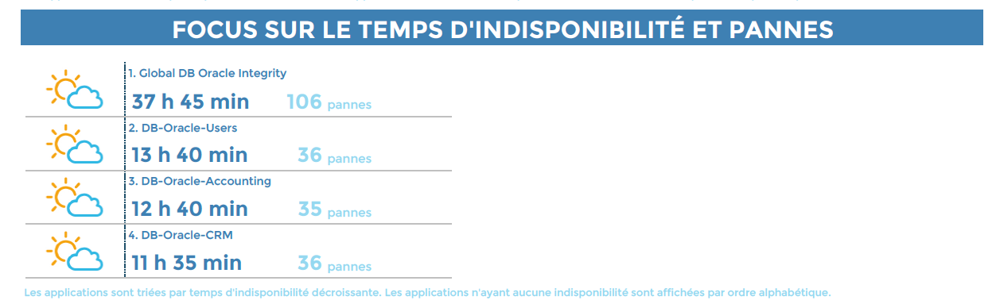

Les icônes météo changent en fonction des SLA définis au niveau de
chaque activité métier en minute.

- De fiabilité et maintenabilité

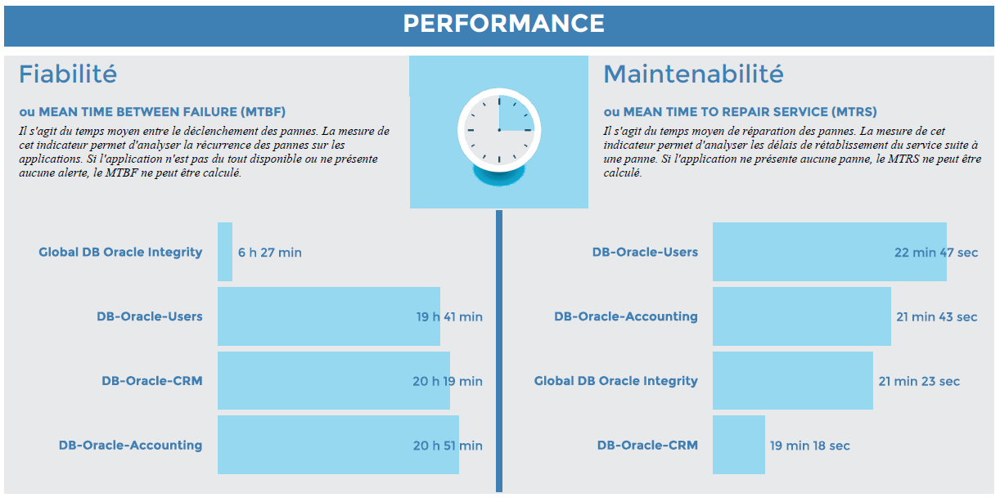

Les pages suivantes affichent pour chaque activité métier présente dans
la vue métier les statistiques sur:

- La disponibilité, le temps d'indisponibilité, le temps passé en downtime,
  l'indice de performance du service ainsi que le nombre d'evenement déclenchés.

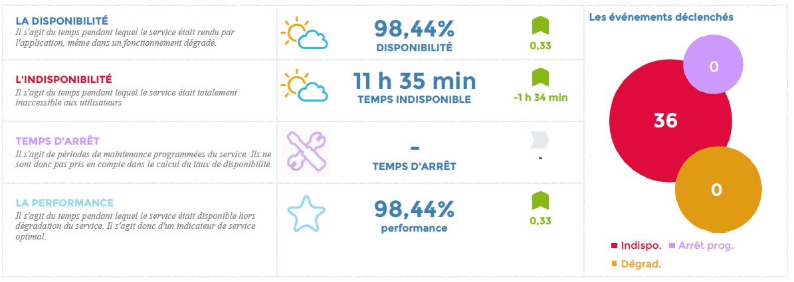

Les icônes météo changent en fonction des SLA en pourcentage et en
minutes définis dans la configuration pour l'activité métier.

- L'évolution de la disponibilité, de la performance et du nombre
  d'évenements déclenchés

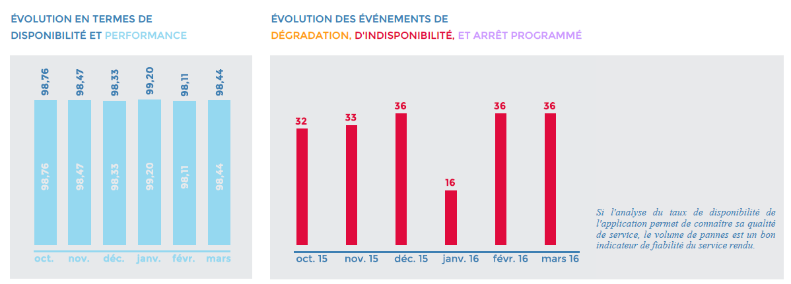

- Un calendrier de disponibilité par jour où seuls les jours où la
  disponibilité est inférieure à 100% sont affichés.
- Une journée avec 100% de disponibilité est représentée par une case
  gris clair sans aucune valeur.
- En cas de non présence de données sur une journée, la case sera blanche et
  sans valeur.

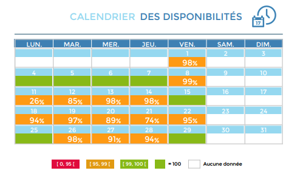

- En option, la liste d'évenements déclenchés, avec pour chaque évenement les
  KPIs mises en cause.

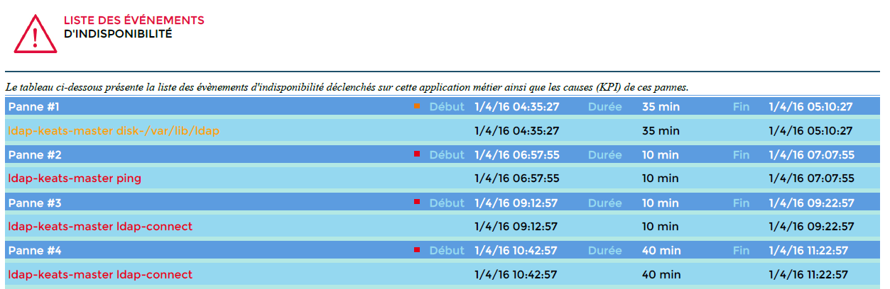

#### Paramètres

Les paramètres attendus dans ce rapport :

- Une date correspondant au mois sur lequel générer le rapport (date
  de début sur l'interface de Centreon MBI)
- Les objets Centreon suivant :

| Paramètres     | Type             | Description                                                                            |
|----------------|------------------|----------------------------------------------------------------------------------------|
| logo           | Liste déroulante | Logo à afficher dans l’en tête du rapport                                              |
| business View  | Liste déroulante | Sélection de la business view sur laquelle générer le rapport                          |
| hide event     | Radio bouton     | Permet de cacher le tableau affichant la liste des évènements déclenchés               |
| calendar color | Radio bouton     | Permet de colorer les cases du calendrier en utilisant les couleurs verte/orange/rouge |
| title          | Champ texte      | Permet de préciser un titre particulier pour le rapport                                |
| time period    | Liste déroulante | Sélectionner la période de reporting à appliquer\*                                     |

\* *Si différent de "Default", assurez vous que la plage sélectionnée
soit bien définie dans la configuration des activités métier en tant que
plage horaire par défaut ou supplémentaire. Dans le cas contraire, les
activités métier n'apparaîtront pas dans le rapport*

> Dans le champ **périodes temporelles**, n'utilisez pas de périodes temporelles comprenant des [exceptions](../../monitoring/basic-objects/timeperiods.md#onglet-période-dexception) : les exceptions ne seront pas prises en compte.

#### Pré-requis

- Superviser au moins une activité métier et la lier à une vue business.
- Avoir au moins un mois de données provenant du module BAM

### BA-Availability-1

#### Description

Ce rapport affiche les statistiques de disponibilité et d'incidents
d'une application métier.

#### Comment interpréter ce rapport

Pour une activité métier, le rapport affiche les statistiques sur:

- La disponibilité, le temps d'indisponibilité, le temps passé en downtime,
  l'indice de performance du service ainsi que le nombre d'evenement déclenchés.

Les icônes météo changent en fonction des SLA en pourcentage et en
minutes définis dans la configuration pour l'activité métier.

- L'évolution de la disponibilité et du nombre d'évenements déclenchés

- Un calendrier de disponibilité par jour où seuls les jours où la disponibilité
  est inférieure aux SLA en pourcentage définis dans la configuration de la BA
  sont affichés.

- En option, la liste d'évenements déclenchés, avec pour chaque évenement les
  KPIs mises en cause.

#### Paramètres

Les paramètres attendus dans ce rapport :

- Une date correspondant au mois sur lequel générer le rapport (date de début
  sur l'interface de Centreon MBI)
- Les objets Centreon suivant :

| Paramètres        | Type             | Description                                                                            |
| ----------------- | ---------------- | -------------------------------------------------------------------------------------- |
| logo              | Liste déroulante | Logo à afficher dans l'en tête du rapport                                              |
| business Activity | Liste déroulante | Sélection de la business activity sur laquelle générer le rapport                      |
| hide\_event       | Radio bouton     | Permet de cacher le tableau affichant la liste des évènements déclenchés               |
| calendar color    | Radio bouton     | Permet de colorer les cases du calendrier en utilisant les couleurs verte/orange/rouge |
| title             | Champ texte      | Permet de préciser un titre particulier pour le rapport                                |
| time period       | Liste déroulante | Sélectionner la période de reporting à appliquer \*                                    |

\* *Si différent de "Default", assurez vous que la plage sélectionnée
soit bien définie dans les paramètres de l'application métier dans
Configuration > Business Activiy > XXXXX | onglet "Information
étendues" en plage horaire par défaut ou supplémentaire*

> Dans le champ **périodes temporelles**, n'utilisez pas de périodes temporelles comprenant des [exceptions](../../monitoring/basic-objects/timeperiods.md#onglet-période-dexception) : les exceptions ne seront pas prises en compte.

#### Pré-requis

- Superviser au moins une activité métier et la lier à une vue business.
- Avoir au moins un mois de données provenant du module BAM

### BV-BA-Availabilities-List

####  Description

Pour une vue métier, ce rapport affiche les statistiques de
disponibilité, temps d'indisponibilité, temps dégrédé et pannes des
applications métier sous forme de listing.

#### Comment intérpréter le rapport:

Les icônes météo changent en fonction des SLA définis au niveau de
chaque activité métier en pourcentage. Si aucune SLA n'est paramétrée,
une disponibiilité de 100% sera représentée par un soleil, et une
disponibilité inférieure à 100% sera représentée par un nuage.

L'évolution est calculée par rapport à la période précedente:

> - Si la période de reporting est un mois plein, la période
>   précedente sera le mois plein précedent.
> - Si la répiode de reporting est autre qu'un mois plein,
>   l'évolution sera calculée sur le nombre de jour qui précede le
>   nombre de jour de la période de reporing.

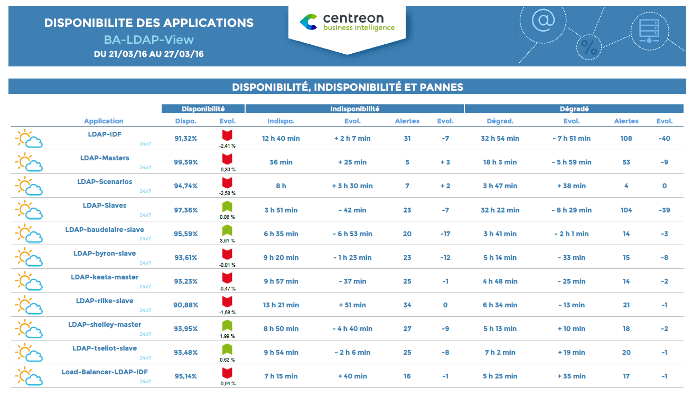

#### Paramètres

Les paramètres attendus dans ce rapport :

- Une date correspondant au mois sur lequel générer le rapport (date
  de début sur l'interface de Centreon MBI)
- Les paramètres suivants :

| Paramètres                      | Type             | Description                                                                     |
| ------------------------------- | ---------------- | ------------------------------------------------------------------------------- |
| business View                   | Liste déroulante | Sélection de la business view sur laquelle générer le rapport                   |
| logo                            | Liste déroulante | Logo à afficher dans l'en tête du rapport                                       |
| sort by                         | Radio bouton     | Permet d'afficher les BA par ordre alphabétique ou par BA les moins disponibles |
| show the reporting timeperiod.. | Radio bouton     | Permet l'affichage ou non de la période associée à l'activité métier            |
| title                           | Champ texte      | Permet de préciser un titre particulier pour le rapport                         |
| time period                     | Liste déroulante | Sélectionner la période de reporting à appliquer\*                              |

\* *Si différent de "Default", assurez vous que la plage sélectionnée
soit bien définie dans la configuration des activités métier en tant que
plage horaire par défaut ou supplémentaire. Dans le cas contraire, elle
n'apparaîtront pas dans le rapport*

> Dans le champ **périodes temporelles**, n'utilisez pas de périodes temporelles comprenant des [exceptions](../../monitoring/basic-objects/timeperiods.md#onglet-période-dexception) : les exceptions ne seront pas prises en compte.

#### Pré-requis

- Superviser au moins une activité métier et la lier à une vue business.

### BA-Event-List

#### Description

Pour une application métier, ce rapport affiche la liste des évenements
déclenchés.

#### Comment interpréter ce rapport

- La liste d'évenements déclenchés, avec pour chaque évenement les KPIs mises en
  cause. La période temporelle prise en compte est celle définie par défaut dans
  la configuration de la BA.

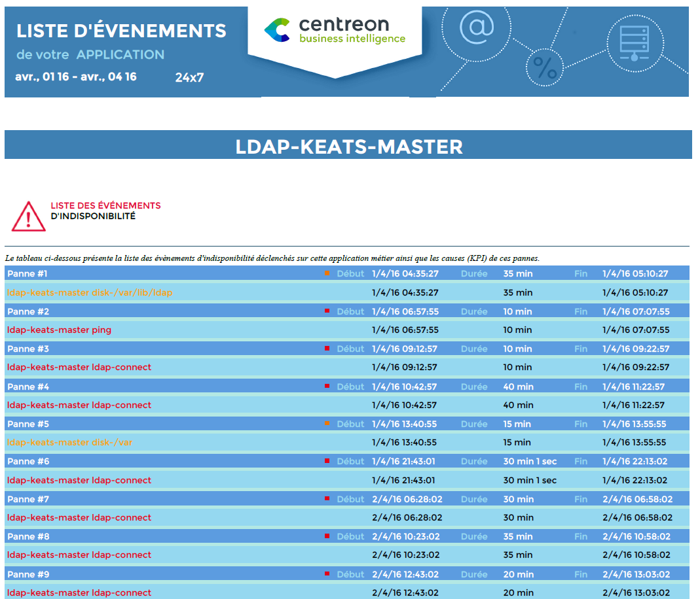

#### Paramètres

Les paramètres attendus dans ce rapport :

- Une date de début et de fin laquelle générer le rapport
- Les objets Centreon suivant :

| Paramètres        | Type             | Description                                                       |
| ----------------- | ---------------- | ----------------------------------------------------------------- |
| logo              | Liste déroulante | Logo à afficher dans l'en tête du rapport                         |
| business Activity | Liste déroulante | Sélection de la business activity sur laquelle générer le rapport |
| title             | Champ texte      | Permet de préciser un titre particulier pour le rapport           |
| time period       | Liste déroulante | Sélectionner la période de reporting à appliquer\*                |

\* *Si différent de "Default", assurez vous que la plage sélectionnée
soit bien définie dans les paramètres de l'application métier dans
Configuration > Business Activiy > XXXXX | onglet "Information
étendues" en plage horaire par défaut ou supplémentaire*

> Dans le champ **périodes temporelles**, n'utilisez pas de périodes temporelles comprenant des [exceptions](../../monitoring/basic-objects/timeperiods.md#onglet-période-dexception) : les exceptions ne seront pas prises en compte.

#### Pré-requis

- Disposer de Centreon BAM >= 3.0
- Disposer de Centreon Broker >= 2.8.0
- Superviser au moins une activité métier et la lier à une vue
  business.
- Avoir au moins un mois de données provenant du module BAM

### BV-BA-Current-Health-VS-Past

#### Description

Ce rapport affiche la santé des activités métier au moment de sa génération et
leur disponibilité sur une période paramétrée.

#### Comment interpréter ce rapport

Pour une vue métier donnée en entrée, Le rapport affiche l'état et la
santé de chacune des applications de la vue métier, l'heure du dernier
changement d'état, la durée de l'état actuel, indique si
l'application métier a été acquittée et / ou en downtime. Selon le
paramètre choisi au moment de la génération, le rapport affiche la
disponibilité et le nombre de pannes des applications métier sur une
période dans le passé.

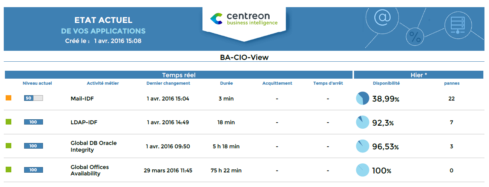

#### Paramètres

Les paramètres attendus dans ce rapport :

| Paramètres                      | Type             | Description                                                                                     |
|---------------------------------|------------------|-------------------------------------------------------------------------------------------------|
| logo                            | Liste déroulante | Logo à afficher dans l’en tête du rapport                                                       |
| title                           | Champ texte      | Permet de préciser un titre particulier pour le rapport                                         |
| business View                   | Liste déroulante | Sélection de la business view sur laquelle générer le rapport                                   |
| compare with                    | Radio bouton     | Permet de d’afficher les données du passés selon la période choisie                             |
| show the reporting timeperiod.. | Radio bouton     | Permet l’affichage ou non de la période associée à l’activité métier                            |
| display thresholds              | Radio bouton     | Afficher les seuils d’avertissement (warning) et critique (critical) de chaque activité métier? |
| time period                     | Liste déroulante | Sélectionner la période de reporting à appliquer\*                                              |

\* *Si différent de "Default", assurez vous que la plage sélectionnée
soit bien définie dans les paramètres de l'application métier dans
Configuration > Business Activiy > XXXXX | onglet "Information
étendues" en plage horaire par défaut ou supplémentaire. Dans le cas
contraire seule les données temps réelles seront affichées.*

> Dans le champ **périodes temporelles**, n'utilisez pas de périodes temporelles comprenant des [exceptions](../../monitoring/basic-objects/timeperiods.md#onglet-période-dexception) : les exceptions ne seront pas prises en compte.

#### Pré-requis

- Superviser au moins une activité métier et la lier à une vue business.

### BV-BA-Availabilities-Calendars

#### Description

Ce rapport vous donnes des statistiques sur la disponibilité et les
incidents de vos activités métier. Les données sont affichées dans des
calendriers au mois et à la journée. La plage horaire utilisée pour
chaque activité métier est la plage horaire par défaut configurée dans
le module Centreon BAM.

#### Comment interpréter ce rapport

Le premier calendrier la disponibilité des activités métier par mois.
Les cases sont colorées en fonction des SLA définis en pourcentage au
niveau de chaque activité métier (dans "Extended Information"). Si
aucun SLA n'est défini au niveau de la BA, la valeur est affichée dans
la cellule si la disponibilité est inférieure à 100% ou
l'indisponibilité supérieure à 0 secondes. La plage horaire considérée
est la plage horaire de reporting par défaut définie au niveau de chaque
activité métier (Dans l'onglet "Configuration").

Le second calendrier affiche l'indisponibilité et le nombre
d'incidents apparus sur les activités métier, par mois. Les cases sont
colorées en fonction des SLA définis au niveau de chaque activité métier
en minutes. Si aucun SLA n'est défini au niveau de la BA, la valeur est
affichée dans la cellule si la disponibilité est inférieure à 100% ou
l'indisponibilité supérieure à 0 secondes. La plage horaire considérée
est la plage horaire de reporting par défaut définie au niveau de chaque
activité métier.

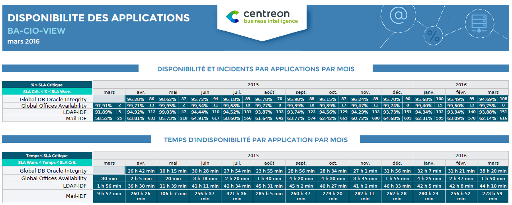

Le troisième calendrier affiche la disponibilité par jour de chaque
activité métier. La couleur est affichée en fonction des tranches de
temps indisponibles définies en paramètres du rapport, en minute. Si la
disponibilité est inférieur à 100%, la disponibilité de la journée est
affichées.

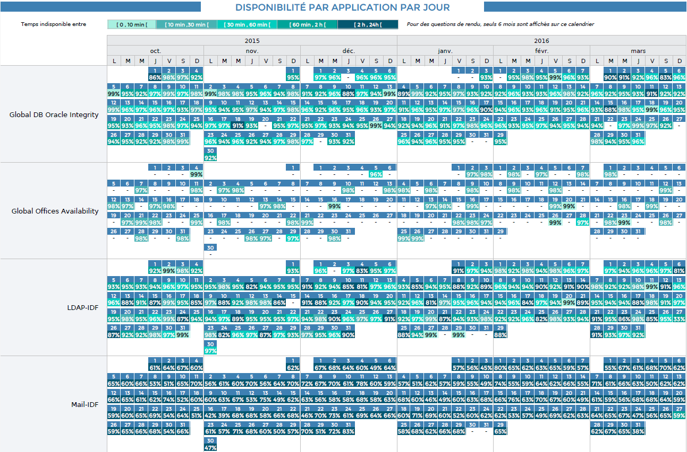

#### Paramètres

Les paramètres attendus dans ce rapport :

- Une date correspondant au mois sur lequel générer le rapport (date
  de début sur l'interface de Centreon MBI)
- Les objets Centreon suivant :

| Paramètres    | Type             | Description                                                             |
|---------------|------------------|-------------------------------------------------------------------------|
| logo          | Liste déroulante | Logo à afficher dans l’en tête du rapport                               |
| business View | Liste déroulante | Sélection de la business view sur laquelle générer le rapport           |
| sla 1         | Champ texte      | Temps maximum en minutes du premier intervalle [0 min, **sla1**]        |
| sla 2         | Champ texte      | Temps maximum en minutes du second intervalle [sla1 min, **sla2**]      |
| sla 3         | Champ texte      | Temps maximum en minutes du troisième intervalle [sl2 min, **sla3**]    |
| sla 4         | Champ texte      | Temps maximum en minutes du quatrième intervalle [sl3 min, **sla4**]    |
| title         | Champ texte      | Permet de préciser un titre particulier pour le rapport                 |
| time period   | Liste déroulante | Sélectionner la période de reporting à appliquer\*                      |

\* *Si différent de "Default", assurez vous que la plage sélectionnée
soit bien définie dans la configuration des activités métier en tant que
plage horaire par défaut ou supplémentaire. Dans le cas contraire, elle
n'apparaîtront pas dans le rapport*

> Dans le champ **périodes temporelles**, n'utilisez pas de périodes temporelles comprenant des [exceptions](../../monitoring/basic-objects/timeperiods.md#onglet-période-dexception) : les exceptions ne seront pas prises en compte.

#### Pré-requis

- Superviser au moins une activité métier et la lier à une vue business.
- Avoir au moins un mois de données provenant du module BAM

