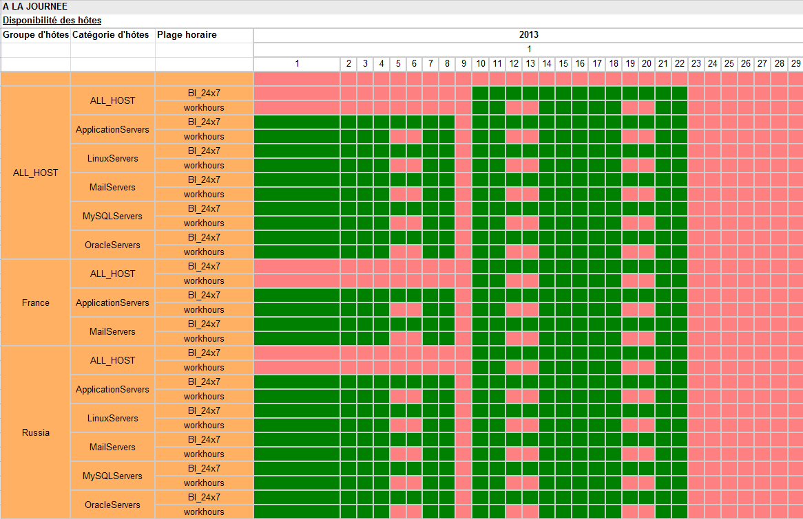
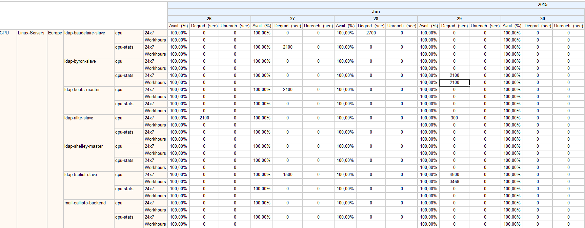
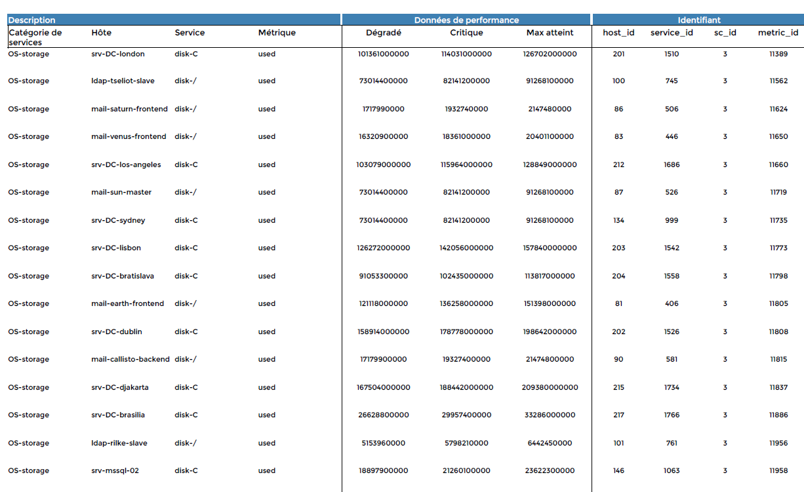

## Diagnostic de base de données Centreon/Reporting

### Content-diagnostic

Ce rapport vous permets de connaître le contenu de votre base de données
au niveau des statistiques de disponibilité et de performance par jour
et par mois. Les informations affichées permettent de déterminer si les
données sont présentes pour les groupes d'hôtes, catégories d'hôtes,
catégories de services et plages horaire en fonction des couleurs.

- Vert = au moins une valeurs est présente
- Rouge = aucune valeur présente

> **Important**
>
> Ce rapport ne garanti pas la qualité et la cohérence des données mais
> uniquement la présence de ces dernières.

#### Paramètres

Les paramètes attendus par le rapport sont:

- La période de reporting
- Les objets Centreon suivant :

| Paramètres         | Type            | Description                                   |
|--------------------|-----------------|-----------------------------------------------|
| Host group         | Multi sélection | Sélectionner les groupes d’hôtes              |
| Service Categories | Multi sélection | Sélectionner les catégories de services       |
| Host Categories    | Multi sélection | Sélectionner les catégories d’hôtes           |
| Metrics            | Multi sélection | Métriques sur lesquelles filtrer les services |

### Content-diagnostic-availability

Ce rapport vous permet d'avoir une vue sous forme de calendrier de la
disponibilité des hôtes. Sont affichées sur le rapport : la
disponibilité de chaque hôtes, le temps d'indisponibilité en seconde
ainsi que le temps injoignable, le tout pour chaque plage horaire et
combinaison groupe `<>` catégories d'hôtes.

#### Paramètres

Les paramètes attendus par le rapport sont:

- La période de reporting
- Les objets Centreon suivant :

| Paramètres      | Type            | Description                         |
|-----------------|-----------------|-------------------------------------|
| Host group      | Multi sélection | Sélectionner les groupes d’hôtes    |
| Host Categories | Multi sélection | Sélectionner les catégories d’hôtes |

### Content-diagnostic-service-availability

Ce rapport vous permet d'avoir une vue sous forme de calendrier de la
disponibilité des services. Sont affichées sur le rapport : la
disponibilité de chaque service, le temps passé dans l'état critique et
le temps passé dans l'état warning, le tout pour chaque plage horaire
et combinaison groupe `<>` catégories d'hôtes `<>` catégories de
services.

### Paramètres

Les paramètes attendus par le rapport sont:

- La période de reporting
- Les objets Centreon suivant :

| Paramètres         | Type            | Description                             |
|--------------------|-----------------|-----------------------------------------|
| Host group         | Multi sélection | Sélectionner les groupes d’hôtes        |
| Host Categories    | Multi sélection | Sélectionner les catégories d’hôtes     |
| Service Categories | Multi sélection | Sélectionner les catégories de services |

### Content-diagnostic-performance

Ce rapport vous permet d'avoir une vue sous forme de calendrier de la
moyenne des métriques et la valeur maximum atteignable ( bande passante
maximum, stockage maximum etc..), pour chaque plage horaire, pour chaque
combinaison groupes d'hôtes `<>` catégories d'hôtes`<>` catégories de services.

#### Paramètres

Les paramètes attendus par le rapport sont:

- La période de reporting
- Les objets Centreon suivant :

| Paramètres         | Type            | Description                             |
|--------------------|-----------------|-----------------------------------------|
| Host group         | Multi sélection | Sélectionner les groupes d’hôtes        |
| Host Categories    | Multi sélection | Sélectionner les catégories d’hôtes     |
| Service Categories | Multi sélection | Sélectionner les catégories de services |
| Metrics            | Multi sélection | Sélectionner les métriques à inclure    |

### Metric-integrity-check

Ce report permet de vérifier la compatibilité des plugins et des métriques avec
les rapports de performance de Centreon MBI. Il permet d'identifier rapidement
les services incompatibles et de mettre à jour les plugins utilisés.

#### Comment interpréter ce rapport

Si un warning est affiché en face d'une ligne, cela signifie que :

- La valeur maximum n'est pas renseigné
- Les seuils Warning et Critique ne sont pas définis

#### Paramètres

Les paramètres attendus par le rapport sont:

- Une période de reporting
- Les objets Centreon suivants :

| Paramètres         | Type            | Description                          |
|--------------------|-----------------|--------------------------------------|
| Service Categories | Multi sélection | Sélection des catégories de services |
| Metrics            | Multi sélection | Sélection des métriques à inclure    |
