## Inventaire et configuration

### Hostgroups-Host-Templates

Ce rapport permet d'afficher les informations sur les hôtes présents
dans la base de données de reporting, leur template parent, leur
appartenance aux groupes et aux catégories, ainsi que leur date de
création en filtrant sur les groupes et les catégories d'hôtes souhaités.

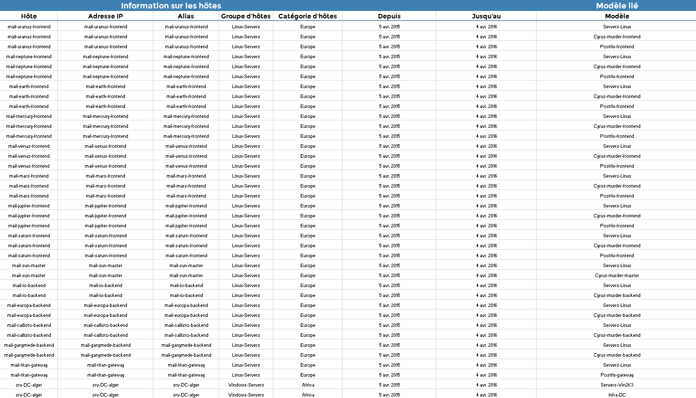

Afficher depuis la configuration Centreon les lien entre modèles d'hôtes :

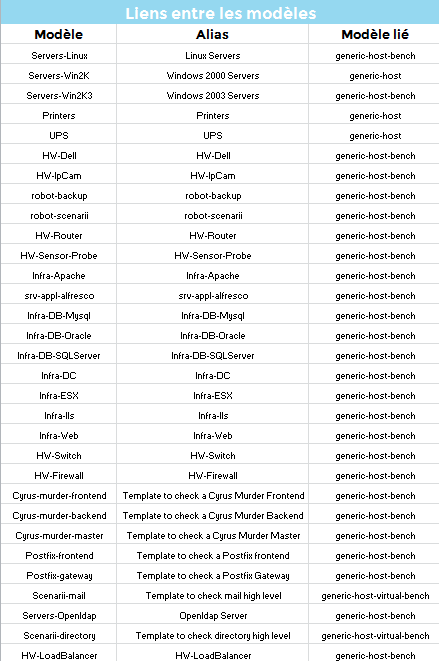

Les modèles de services rattachés aux modèles d'hôtes :

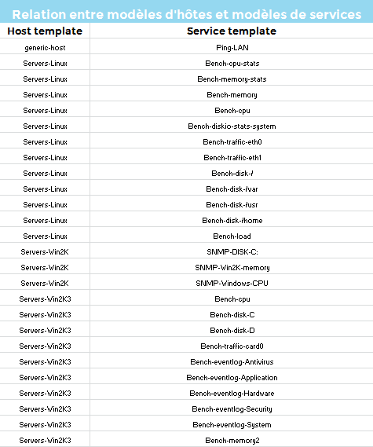

Ainsi que des informations globales sur les modèles d'hôtes, leurs
propriétés de vérifications et de notifications.

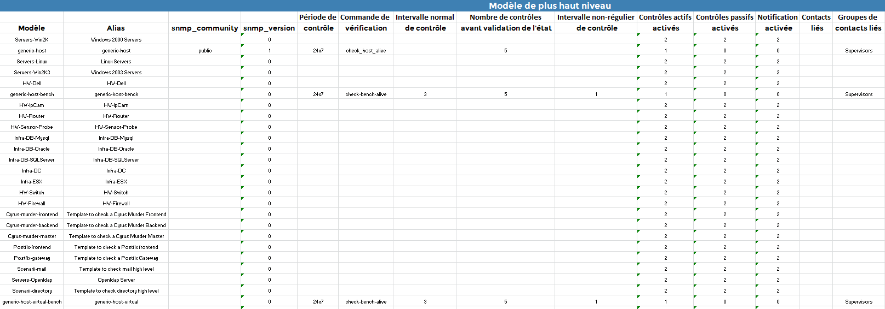

#### Paramètres

Les paramètes attendus par le rapport sont:

- La période de reporting
- Les objets Centreon suivant

| Paramètres      | Type            | Description                         |
|-----------------|-----------------|-------------------------------------|
| Hostgroups      | Multi sélection | Sélectionner les groupes d’hôtes    |
| Host Categories | Multi sélection | Sélectionner les catégories d’hôtes |

### Hostgroups-Service-Templates

Ce rapport permet d'afficher les informations sur les services présents
dans la base de données de reporting, leur modèle parent, leur liaison
avec les hôtes, appartenance aux groupes et aux catégories, ainsi que
leur date de création en filtrant sur les groupes d'hôtes, catégories
d'hôtes et categories de services souhaitées.

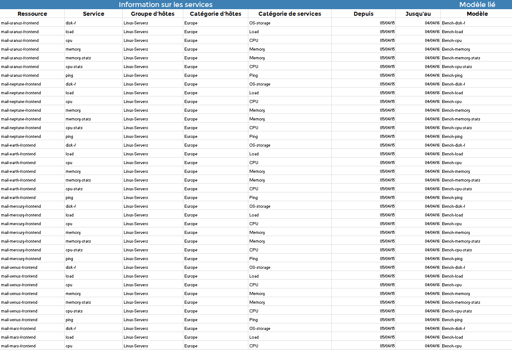

Afficher depuis la configuration Centreon les liens entre modèles de services:

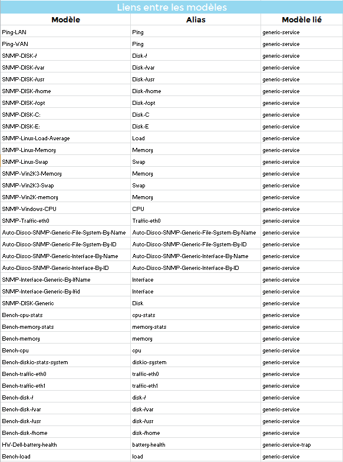

Les modèles d'hôtes rattachés aux modèles de services :

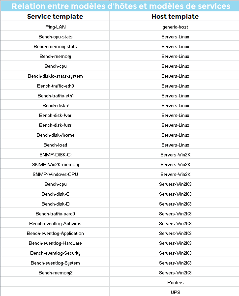

Ainsi que des informations globales sur les modèles de services, leurs
propriétés de vérifications et de notifications :

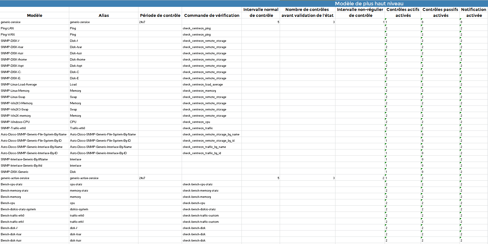

#### Paramètres

Les paramètes attendus par le rapport sont :

- La période de reporting
- Les objets Centreon suivant

| Paramètres         | Type            | Description                             |
|--------------------|-----------------|-----------------------------------------|
| Hostgroups         | Multi sélection | Sélectionner les groupes d’hôtes        |
| Host Categories    | Multi sélection | Sélectionner les catégories d’hôtes     |
| Service Categories | Multi sélection | Sélectionner les catégories de services |

### Poller-Performances

Ce rapport fourni des informations sur les performances et la
configuration de l'ordonnanceur Centreon Engine sur un Poller.

#### Comment interpréter ce rapport

La prémière partie indique le nom du poller et son adresse IP, la
version et l'état de l'ordonnanceur installé dessus ainsi que la date
du dernier redémarrage.

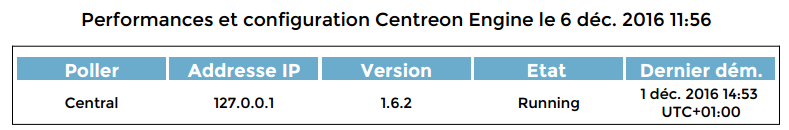

Ensuite, les hôtes et les services supervisés par le poller en question,
ainsi que leurs états sont affichés.

Les latences et temps d'executions moyens et maximums sont représentés,
ainsi que les hôtes et services dépassant les seuils tolérés.

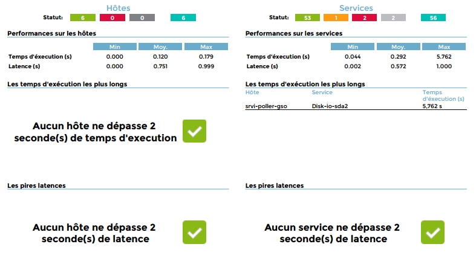

Enfin, un résumé sur la configuration actuelle de l'ordonnanceur et des
astuces d'optimisation en cas de problème de performances

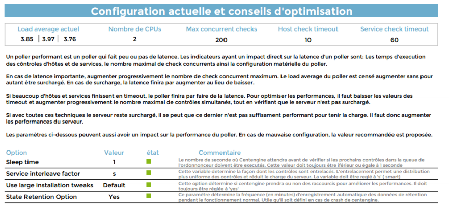

#### Paramètres

Le données représentées dans le rapport sont celles de l'instant de
génération.

Les paramètres attendus dans ce rapport :

- Les objets Centreon suivants :

| Paramètres                                       | Type         | Description                                                                                          |
|--------------------------------------------------|--------------|------------------------------------------------------------------------------------------------------|
| Select poller(s) on which you want to the report | Radio bouton | Générer le rapport sur le Central seulement, les poller seulement ou sur l’ensemble de la plateforme |
| Limit latency (sec)                              | Champs texte | Seuil de latency. Les équipements / services dépassant ce seuil seront listés                        |
| Limit exceution time (sec)                       | Champs texte | Seuil pour le temps d’execution. Les equipements /services dépassant ce seuil seront listés          |

#### Pre-requis

Les prérequis pour le bon fonctionnement de ce rapport sont:

- Supervision du load average des pollers (les métriques doivent
  être: load1, load5 et load15)
- Supervision de la CPU des pollers (les métriques doivent contenir
  la chaine *cpu* ainsi que le numéro du coeur. Ex: CPU à 4 coeurs ,
  les métriques doivent ressembler à cpu0,cpu1... ou cpu_0,cpu_1... )

### Hosts-not-classified

Ce rapport affiche la liste des hôtes non classifiés. Les informations
sont representées sous forme de 2 tableaux:

- Le premier affiche les hôtes non liés à des groupes d'hôtes
- Le second tableau affichent les hôtes non liés à des catégories d'hôtes.

Si un hôte n'a ni groupe d'hôte ni catégorie d'hôte, il apparaitra
dans les 2 tableau.

Les modifications faites sur la classification des hôtes seront prises
en compte le lendemain du changement.

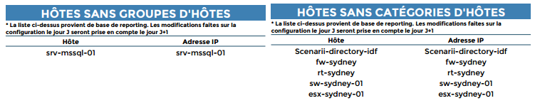

#### Paramètres

Ce rapport n'a besoin d'aucun paramètre.

#### Pré-requis

Aucun prérequis n'est necessaire.

### Services-not-classified

Ce rapport affiche la liste des services non catégorisés. Les
informations sont représentées sous forme de tableau.

Les modifications faites sur la catégorisation des services seront
prises en compte le lendemain du changement.

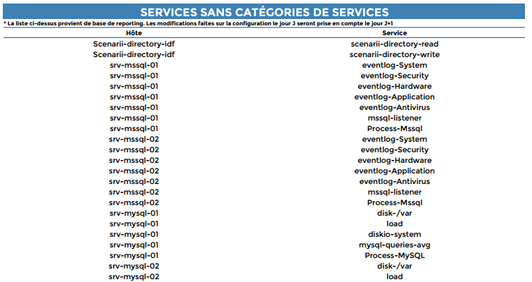

#### Paramètres

Ce rapport n'a besoin d'aucun paramètre.

#### Pré-requis

Aucun prérequis n'est necessaire.
