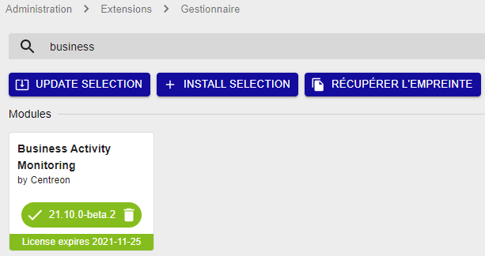

import Tabs from '@theme/Tabs';
import TabItem from '@theme/TabItem';

> Centreon BAM est une **extension** Centreon qui requiert une clé de licence
> valide. Pour plus d'information, contactez
> [Centreon](mailto:sales@centreon.com).

## Prérequis

Voir les [prérequis logiciels](../installation/prerequisites.md#caractéristiques-des-serveurs).

Installez BAM sur le serveur central.
Le serveur central et Centreon BAM doivent être dans la même version majeure (par exemple tous les deux en 26.10.x).
Si vous voulez pouvoir voir les Activités métier supervisées par un serveur distant, installez BAM également sur le serveur distant. Lorsque BAM est installé sur un serveur distant, les Activités métier n'incluent que les ressources supervisées par le serveur distant.

## Installation

### Installer le paquet

Ajoutez le dépôt Centreon Business. Vous pouvez le trouver sur le
[portail support](https://support.centreon.com/hc/fr/categories/10341239833105-D%C3%A9p%C3%B4ts).

Ensuite, installez le paquet en exécutant la commande suivante :

<Tabs groupId="sync">
<TabItem value="Alma / RHEL / Oracle Linux 9" label="Alma / RHEL / Oracle Linux 9">

``` shell
dnf install centreon-bam-server
```

</TabItem>
<TabItem value="Alma / RHEL / Oracle Linux 10" label="Alma / RHEL / Oracle Linux 10">

``` shell
dnf install centreon-bam-server
```

</TabItem>
<TabItem value="Debian 13" label="Debian 13">

```shell
apt update && apt install centreon-bam-server
```

</TabItem>

</Tabs>

### Charger la licence

Un fichier de licence *bam.license* est fourni par Centreon. Allez dans le menu
**Administration > Extensions > Gestionnaire** et chargez la licence
via l'interface.

### Installer l'interface

Allez dans le menu **Administration > Extensions > Gestionnaire** et cliquez
sur le bouton d'installation des modules suivants :

- License Manager (s'il n'est pas déjà installé)
- Business Activity Monitoring

Une fois le module installé et la licence ajoutée, la carte du module affiche
la date d'expiration de la licence :



> Si vous utilisez une réplication MariaDB pour vos bases de données de
> **monitoring**, lors de l'installation de Centreon BAM, une vue est
> créée. Il faut l'exclure de la réplication en rajoutant la ligne
> suivante dans le fichier my.cnf du slave
>
> ``` text
> replicate-ignore-table=centreon.mod_bam_view_kpi
> ```
>
> puis créer les vues sur le slave [avec le fichier suivant](view_creation.sql), en lançant la commande:
>
> ``` shell
> myqsl centreon < view_creation.sql
> ```
