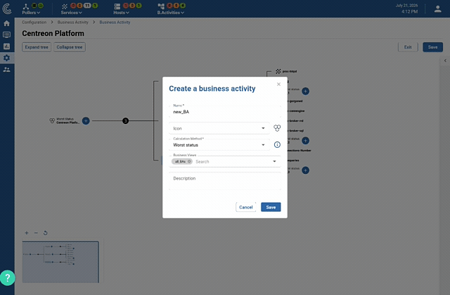

La fonctionnalité de **Service Mapping** de Centreon se base sur
l'extension appelée **Centreon Business Activity Monitoring (Centreon
BAM)**.

> Centreon BAM est une **extension** Centreon qui requiert une [licence](../administration/licenses.md)
> valide. Pour plus d'informations, contactez
> [Centreon](mailto:sales@centreon.com).

## Qu'est-ce que Centreon BAM ?

Le module **Centreon Business Activity Monitoring** offre la possibilité
de mesurer en temps réel l'activité de la production informatique en
agrégeant les états des différents points de contrôle supervisés avec
**Centreon**. L'utilisateur est alors mieux informé de l'état de santé
global de son SI et à même de prendre les meilleures décisions.

**Centreon BAM** utilise un moteur avancé de calcul des "**Business
Activities**" (BA), à partir d'indicateurs de performance clés (**KPI**)
supervisés par **Centreon**.

Définitions :

  - **BA** - Activité métier
  - **BV** - Vue métier : regroupement de plusieurs activités métier.
  - **KPI** - Indicateur de performance clé : l'indicateur pondéré pris
    en compte dans le calcul de la BA.

## Configuration d'une activité métier

> Vous pouvez [simuler](/cloud/service-mapping/ba-simulation) le comportement d'un arbre de dépendances d'activités métier avant d'enregistrer vos modifications et de déployer la configuration en production. Cela vous permet de décider par la suite si vous souhaitez conserver ou rejeter les modifications que vous avez apportées.

L'interface de configuration de Centreon BAM vous permet de gérer une
activité métier entière depuis un seul écran :

- **Visualisez toute la structure en un coup d'œil** : l'activité métier
  et tous ses indicateurs sont affichés sous la forme d'une arborescence
  unique, ce qui vous donne une vue d'ensemble de ce qui est supervisé
  sans devoir naviguer d'un écran à l'autre.

  

- **Modifiez chaque nœud dans son contexte** : sélectionnez n'importe
  quel nœud de l'arborescence pour modifier directement sa méthode de
  calcul, ses seuils ou l'héritage des plages de maintenance, sans
  changer de menu.

  

- **Enregistrez toutes vos modifications en une seule fois** : effectuez
  plusieurs modifications dans l'arborescence, puis enregistrez-les
  toutes ensemble plutôt que nœud par nœud.

  
