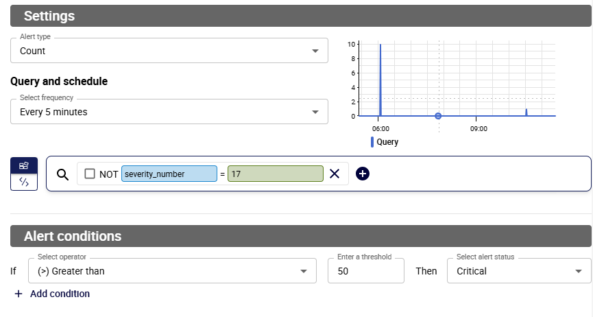
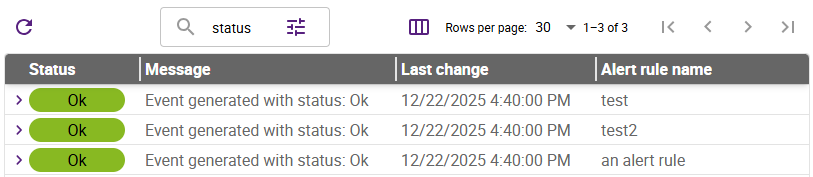

import Tabs from '@theme/Tabs';
import TabItem from '@theme/TabItem';

## From logs to alert events

Logs have a [severity](./resources/glossary.md#severity) (i.e., a log level) that indicates how serious an event is. However, severity only tells you about the nature of a single log. On its own, this is not enough. Logs often need to be analyzed together.

For example, an INFO log entry might simply record that a user tried to log in. But if you see 300 login attempts (and therefore 300 INFO entries) within 10 seconds, that suggests a problem.

To detect issues like this, you need to create alert rules.

An alert rule evaluates specific criteria over a defined time period and with a specific frequency. Each time these criteria are evaluated, an [alert event](./resources/glossary.md#alert-event) is generated, each with an [alert status](#alert-event-statuses). For example, an alert rule might be described like this in words:
"If this query returns more than 50 results in the last 5 minutes, an alert event with the CRITICAL status should be recorded."

* alert type: count
* frequency: 5 minutes
* alert conditions: if > 50, then alert status = CRITICAL

### Alert event statuses

Possible alert event statuses are:

* **CRITICAL**
* **ERROR**
* **WARNING**
* **OK**
* **UNKNOWN**

## Defining an alert rule

<!--For the beta program, you can create up to 10 alert rules.-->

1. Go to **Alerts & notifications > Alert rules**.
2. Click **Add**.
3. In the window that appears, enter a name and a description for your alert rule, then define the criteria you want.
   * **Alert type**: 
      * **Count** means that the query will return the number of log entries that match the query.
      * **Ratio** means that you divide the results of a query by the results of another query.
   * **Frequency**: this field defines both the frequency of the check and the time period covered by it. For instance, if you select **Every 5 minutes**, a check will be performed every 5 minutes on the data of the last 5 minutes.
   * **Query**: use the correct [query syntax](query-syntax.md).
   * **Conditions**: define which [alert status the alert event should have](#alert-event-statuses).
4. Save your alert rule. The window is closed and your alert rule appears in the list of alert rules. The rule starts being evaluated and producing alert events.

## Viewing the last alert event for an alert rule

Go to **Alerts & notifications > Alert events**. Use the search bar and its filter button to find alert events.

You can expand each alert event to view more information about it, including the alert rule evaluation history. Hover over the graph to display the start and end dates for each period spent in a status.

