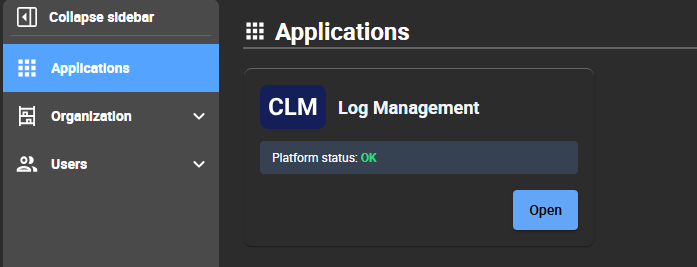

Centreon Hub is a module that:

- allows you to access all your Centreon applications.
- allows your administrator to manage your organizations, manage all Centreon user accounts and user groups for an organization, and manage the way users will log in to Centreon Log Management.

An organization covers a scope of resources you want to receive logs from. For instance, you may want to have an organization called Europe and an organization called Asia. Organizations are independent from each other. According to your needs, you may have one or several organizations. Each organization has its own applications, including its own Centreon Log Management platform.

## I am an administrator

### Creating your account

1. Go to the URL provided by the Centreon support team, and then click **Sign up**.
2. Enter your email address and password, and then click **Continue**. The screen prompts you to check your emails.
3. In the email you have received, click **Confirm my account**.
4. Click **Back to Centreon Hub**. You can start inviting other users to your organization.

### Inviting users into the organization

1. Go to **Users**, and then click **Invite user**.
2. Fill in the email(s).
3. Click **Invite**. They will receive an email with the following subject line: **You've been invited to join `<organization>`'s Centreon account**. Your email address will be visible in the invitation email.

## I am a Centreon user

Your administrator has invited you to Centreon Hub; you have received an email inviting you to the platform.

1. In the email, click **Accept invitation**.
2. Enter your password, and then click **Continue**. The Centreon Hub site opens.
3. In the top right corner of the screen, click the profile icon, and then click **Edit profile**. You can then fill in your details.

## Accessing Centreon Log Management

To open Centreon Log Management, log in to Centreon Hub. In the **Applications** page, click the tile you want:

