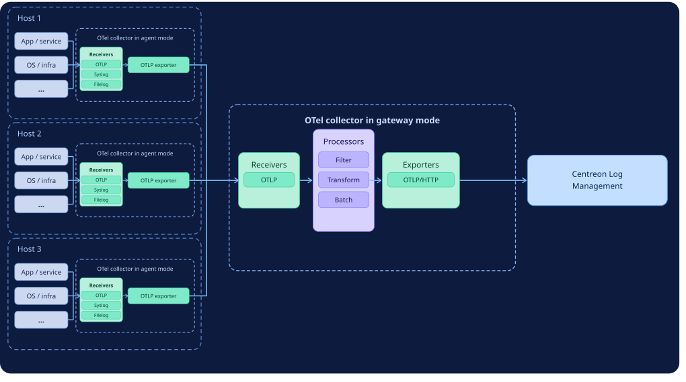

import Tabs from '@theme/Tabs';
import TabItem from '@theme/TabItem';

As explained in [What is OpenTelemetry and how is it used by Centreon Log Management?](../getting-started/concepts.md#what-is-opentelemetry-and-how-is-it-used-by-centreon-log-management), you need to [install an OpenTelemetry collector](./collector.md) on each host you want to be able to send logs to Centreon Log Management.

* Only one collector is needed per host.
* You can send different types of logs using the same collector.
* A collector that collects logs directly from a host is a collector in agent mode. Sometimes you may want to chain collectors, with agent-mode collectors feeding into a [gateway-mode collector](#opentelemetry-collectors-in-gateway-mode).

## Components of an OpenTelemetry Collector

An OpenTelemetry Collector has three main components that are executed one after the other (see [diagram](#diagrams) below):

* **Receivers** read data from files or receive data from a stream. They accept logs in various formats and from various sources (e.g., OTLP, syslog, etc). Some types of receivers include "operators", which are similar to processors but apply only to the logs from that specific receiver.
* **Processors** let you perform actions on all logs in a given pipeline. They can filter, transform, or enrich data before it leaves the collector.
* **Exporters** send the logs in OpenTelemetry format to Centreon Log Management.

## Configuring the data processing pipeline

Receivers, processors and exporters are organized into a pipeline that defines the order in which they run.
Each component is defined using YAML files.

* If you only need to receive logs from a small number of sources, you can keep all the configuration in a single file (**config.yaml**). [See two examples here](collector-simple.md).
* Otherwise, best practice is to use one file for the collector’s general configuration and one file per data source (this is the method described in [our main procedure](./collector.md)).

In all cases, receivers, processors and exporters must be defined.

## OpenTelemetry collectors in gateway mode

In some situations, you may want to add an extra collector that sits in between your host collectors and Centreon Log Management, i.e. a collector in [gateway mode](#diagrams). It receives all the data from your other collectors and forwards it to Centreon Log Management on their behalf. Its configuration is the same as that of an OpenTelemetry collector in agent mode: all you have to do is to make the exporters of the host collectors point to an OTLP receiver on the gateway.

Use an OpenTelemetry Collector in gateway mode:

* When you cannot install a collector in agent mode on a network device (e.g. a firewall).
* When you want to control and limit outbound network traffic by only opening the necessary ports.
* When you have a lot of services. If you have 50 services and you want to change where logs are sent, having a gateway means you only have one configuration to update.
* When you want to clean up the data before it goes anywhere. Maybe some logs contain confidential data, or they contain too much information. The gateway can strip that out before the data ever reaches a third-party tool. One filter, applied everywhere, automatically.

## Diagrams

<Tabs groupId="agentgatewaymode" queryString>
<TabItem value="Agent mode" label="Agent mode">

</TabItem>
<TabItem value="Gateway mode" label="Gateway mode">

</TabItem>
</Tabs>
