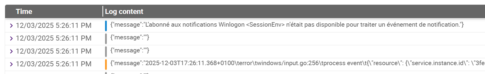

---
id: concepts
title: Centreon Log Management basics
description: Key concepts and terminology behind Centreon Log Management
---

## What are logs?

Centreon Log Management handles logs. Logs contain detailed information about events, errors, and the performance of your IT system.

## What does a log entry look like in Log Management?

All logs received by Log Management are listed on the **Log explorer** page, where you can filter them. In Log Management, each log entry has a [severity (i.e., a log level)](../resources/glossary.md#severity), indicated by a colored line.



## What can Centreon Log Management do with logs?

Here are the main features of Centreon Log Management:

1. Log Management [collects](../collector/collector.md) and centralizes logs from various sources (servers, applications, databases, network devices, etc.).

3. Log Management allows you to [analyze these logs in real time](../explore-analyze.md), using filters, [queries](../query-syntax.md), or [dashboards](../dashboards.md). This helps you detect detect anomalies, errors, security incidents, or unexpected behavior: see [**Use cases**](use-cases.md) for detailed examples.

4. Log Management creates [alert events](../resources/glossary.md#alert-event) in case problems occur or critical thresholds are exceeded, according to [alert rules](../alerts.md) you have defined.

5. Log Management allows you to store logs securely over long periods of time (for compliance, security, or historical analysis).

## What is OpenTelemetry and how is it used by Centreon Log Management?

Logs are a type of [telemetry](../resources/glossary.md#telemetry) data. Centreon Log Management can read logs in the OpenTelemetry format. OpenTelemetry is a protocol for sending this kind of data.

OpenTelemetry data is structured (often in JSON or in Protobuf), standardized based on [semantic conventions](https://opentelemetry.io/docs/concepts/semantic-conventions/) (with the same fields and format everywhere), and provides rich context about events, such as the service, environment, version, and custom attributes.

OpenTelemetry logs aren't just text: they're data you can analyze. And Log Management lets you [define dynamic alerts on them](../alerts.md).

* You can send logs in OpenTelemetry format directly to Centreon Log Management.
* If a device produces logs in a format other than OpenTelemetry, [use an OpenTelemetry Collector to convert the data](../collector/collector.md). The collector can run as an agent on the device or in gateway mode to receive, enrich, translate and forward logs to Centreon Log Management.

## What does a log entry in OpenTelemetry format look like?

A log entry in OpenTelemetry format always has a timestamp and a [service](../resources/glossary.md#service) name (for the service that produced the log). Usually, it also shows the log's [severity](../resources/glossary.md#severity): typically, <span style={{color:'#1ebeb3'}}>**DEBUG**</span>, <span style={{color:'#1588d1'}}>**INFO**</span>, <span style={{color:'#ffca34'}}>**WARNING**</span>, <span style={{color:'#fd9b27'}}>**ERROR**</span>, or <span style={{color:'#ff4a4a'}}>**FATAL**</span>. All the other information in the log depends on [how you have configured your OpenTelemetry Collector](../collector/collector.md).

Here is an example of a raw log entry sent by the Windows Event Viewer, collected by an OpenTelemetry collector, then converted to Log Management's internal syntax:

```json
{
  "attributes": {
    "event.id": 16394,
    "event.record.id": 226535,
    "event.task": "0",
    "process.pid": 0
  },
  "body": {
    "message": "La migration de bas niveau hors connexion a réussi."
  },
  "observed_timestamp_nanos": 1763648218788360200,
  "resource_attributes": {
    "event.provider.guid": "{XXXXXXXX-XXXX-XXXX-XXXX-XXXXXXXXXXXX}",
    "event.provider.name": "Microsoft-Windows-Security-SPP",
    "host.name": "MyLaptop",
    "os.name": "Microsoft Windows 10 Pro",
    "os.type": "windows",
    "os.version": "22H2",
    "service.namespace": "application",
    "service.version": "1.0.0"
  },
  "service_name": "windows-event-log",
  "severity_number": 9,
  "severity_text": "INFO",
  "timestamp_nanos": 1763648218609230600,
  "trace_flags": 0
}
```

* Log **attributes** describe what the log is about (message details, error code, etc.)

* **Resource attributes** show the context of the log, i.e. what produced this log. Here are some examples of common resource attributes for logs:

  * **service_name** – the name of the service emitting the log
  * **service.version** – version of the service
  * **host.name** – hostname or machine name
  * **cloud.region** – cloud region (e.g., us-east-1)
  * **k8s.container.name** – Kubernetes container name
  * **deployment.environment** – environment like prod or staging.

In Log Management, you can filter your data by using these attributes in [queries](../query-syntax.md), in [**Log explorer**](../log-explorer.md) or [dashboards](../dashboards.md).

## Which OpenTelemetry attribute determines the date and time of logs?

The date and time of logs are based on the OpenTelemetry attribute **observed_timestamp_nanos**.
