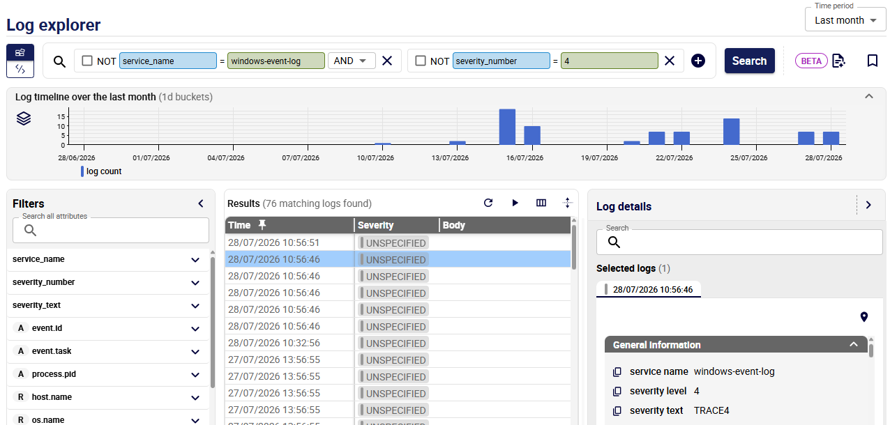
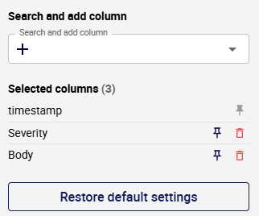

import Tabs from '@theme/Tabs';
import TabItem from '@theme/TabItem';

The **Log explorer** page allows you to search and filter logs so you can investigate issues and perform root-cause analysis.

## Time period

* Use the **Time period** list at the top right of the page to select the range of logs to display.
* Navigate your data using the timeline: click and drag your mouse over the graph to select a new time range. Use the **Stacking** icon to the left of the chart to choose how log volume is displayed: as a total, or stacked by severity or service name.

## Searching for logs

### Filters panel

The **Filters** panel lists all OpenTelemetry attributes present in your logs for the selected time period. It works in conjunction with [the search bar](#search-bar).

* Expand an attribute to view all its values and their number of occurrences. This gives you a quick overview of your data distribution without writing a single query.
* The **Search all attributes** field filters all attributes in real time. Once an attribute is expanded, **Search values** lets you search for a specific value among all available ones.
* Click the **+** at the left of a value to add it directly as a clause in the active Query Builder or Query Editor.

### Search bar

Use the search bar to filter your logs. The search bar has two modes; use the switch on the right to pick one.

* In **Query builder** mode, blocks let you build your search step by step: add a block, select attribute names and values, then add syntax elements such as AND, OR, and NOT. Click the plus sign in the search bar to add a blank block.

   

* In **Query editor** mode:

   * Type your search directly using the [query syntax](query-syntax.md). Autocomplete and error detection help you write queries faster and avoid mistakes. Hover over a flagged mistake to see explanations and suggestions. Errors (in red) mean that the query will not work. Warnings (in orange) mean that the query may work but the results might not be what you expected. For example, typing **and** instead of **AND** causes the query to search for the string "and" in the message body rather than using it as a boolean operator.
   * Click the **Ask AI** button to the right of the search bar. In the field that appears, write a query in your own words, in any language, then click **Apply and search**. This will generate a query with the correct syntax in the query editor: you can edit it to enrich the query if you like. This is a good way to learn the [query syntax](query-syntax.md).

      > AI responses may be inaccurate or incomplete. Always check the results.

      

### Running the search

In both modes, you need to click the **Search** button to run the search.

## Detailed log information

Click a log to see all related information in the **Log details** panel, including the raw OpenTelemetry log entry.

* You can open several logs in the panel.
* Copy or download the whole log in JSON format from the **Raw OTel log** section.
* The search bar inspects attribute names and values.

## Summarizing logs

You can automatically generate a summary of all logs matching a query. The summary identifies recurring issues, groups them by type, lists their likely root causes, and suggests next steps to resolve them.

Click the **Log summary** button next to the time range selector to open the summary in a new tab.

* Summaries are only available for queries returning 2,000 lines or fewer.
* You may need to authorize new tabs for the same domain in your browser.

## Rearranging columns

* The default columns are **Time**, **Severity** and **Body**.
* Use the **Search and add column** button at the top right of the results to choose which columns/attributes you want to display.
* In this window, you can reset the display to the three default columns.
* The **Time** column is always displayed first and cannot be unpinned. You can pin one other column in second position.
* You can drag columns to a different position in the table.

   

<!-- ## Generating a summary of your logs

Once the **Log explorer** page only shows the logs you want, generate a summary of the displayed logs to see what they can tell you: click the **Summarize logs** button to the right of the search bar.
Log summaries are a list of the main events detected for a period:

- Critical errors and failures
- Security-related events
- Unusual system behavior
- Important updates or configuration changes -->
