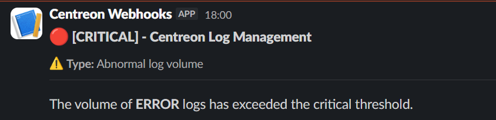

import Tabs from '@theme/Tabs';
import TabItem from '@theme/TabItem';

Notifications can be sent when an [alert rule](alerts.md) triggers an [alert event](./resources/glossary.md#alert-event) and certain conditions are met. You can configure a webhook to post a message to a third-party application.

## Step 1: Create a notification channel

1. Go to **Alerts and notifications > Notification channels**.

2. Click **Add** or **Create a notification channel** and enter a name and description.

3. In the **Settings** section:
   * Enter the webhook URL you retrieved from your third-party application. You must include **https://**.
   * Select the HTTP method you want the webhook to use.
   * Write the message body to be sent.
   * Define any headers you want to pass to your third-party application, e.g. to indicate the format of the message body.

   **Example**: I want to post a message to a Slack channel.
      * The webhook URL is retrieved from Slack.
      * For Slack, the message body must be json (see the [example below](#example)).
      * Header: key: **content-type**: value : **application/json**.

4. Click **Create**. The notification channel appears in the list.

## Step 2: Link an alert rule to a notification channel

1. Go to **Alerts and notifications > Alert rules**.

2. Create a new alert rule or edit an existing one: in the **Notification channels** section, click **Add channel**.

3. In the section that appears:

   * define which alert event statuses should trigger a notification.
   * define when notifications should be sent: **On every status change/on every alert event**.
   * select the notification channel you created at step 1.

4. Click **Save**. The notifications will start being sent when the alert events meet the conditions you defined. Use the **Last trigger event** and **Last sent** columns to track your notifications.

## Example

### json

```json
{
  "blocks": [
    {
      "type": "header",
      "text": {
        "type": "plain_text",
        "text": "🔴 [CRITICAL] - Centreon Log Management",
        "emoji": true
      }
    },
    {
      "type": "context",
      "elements": [
        {
          "type": "mrkdwn",
          "text": "⚠️ *Type:* Abnormal log volume"
        }
      ]
    },
    {
      "type": "divider"
    },
    {
      "type": "section",
      "text": {
        "type": "mrkdwn",
        "text": "The volume of *ERROR* logs has exceeded the critical threshold."
      }
    }
  ]
}
```

### Slack output


