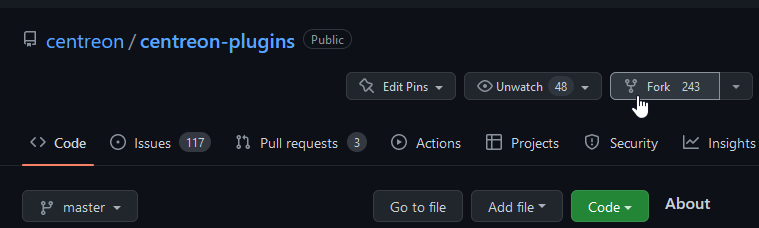

import Tabs from '@theme/Tabs';
import TabItem from '@theme/TabItem';

## Setup your environment

To use the centreon-plugins framework, you'll need the following: 

- A Linux operating system, ideally Debian 11 or RHEL/RHEL-like >= 8
- [git](https://git-scm.com/book/en/v2/Getting-Started-Installing-Git) command line utility
- A [GitHub](https://github.com/) account

### Enable our standard repositories

<Tabs groupId="sync">
<TabItem value="Debian 11" label="Debian 11">

```shell
echo "deb https://apt.centreon.com/repository/22.04/ $(lsb_release -sc) main" | tee /etc/apt/sources.list.d/centreon.list
wget -O- https://apt-key.centreon.com | gpg --dearmor | tee /etc/apt/trusted.gpg.d/centreon.gpg > /dev/null 2>&1
```

</TabItem>
<TabItem value="RHEL 8 and alike" label="RHEL 8 and alike">

```shell
dnf install -y https://yum.centreon.com/standard/22.04/el8/stable/noarch/RPMS/centreon-release-22.04-3.el8.noarch.rpm
```

</TabItem>
</Tabs>

Install the following dependencies: 

<Tabs groupId="sync">
<TabItem value="Debian 11" label="Debian 11">

```shell
apt-get install 'libpod-parser-perl' 'libnet-curl-perl' 'liburi-encode-perl' 'libwww-perl' \
    'liblwp-protocol-https-perl' 'libhttp-cookies-perl' 'libio-socket-ssl-perl' 'liburi-perl' \
    'libhttp-proxypac-perl' 'libcryptx-perl' 'libjson-xs-perl' 'libjson-path-perl' \
    'libcrypt-argon2-perl' 'libkeepass-reader-perl' 
```

</TabItem>
<TabItem value="RHEL 8 and alike" label="RHEL 8 and alike">

```shell
dnf install 'perl(Digest::MD5)' 'perl(Pod::Find)' 'perl-Net-Curl' 'perl(URI::Encode)' \
    'perl(LWP::UserAgent)' 'perl(LWP::Protocol::https)' 'perl(IO::Socket::SSL)' 'perl(URI)' \
    'perl(HTTP::ProxyPAC)' 'perl-CryptX' 'perl(MIME::Base64)' 'perl(JSON::XS)' 'perl-JSON-Path' \
    'perl-KeePass-Reader' 'perl(Storable)' 'perl(POSIX)' 'perl(Encode)'
```

</TabItem>
</Tabs>

### Fork and clone centreon-plugins repository 

Within GitHub UI, on the top left, click on the fork button:



Use git utility to fetch your repository fork: 

```shell
git clone https://<githubusername>@github.com/<githubusername>/centreon-plugins
``` 

Create a branch: 
```shell
cd centreon-plugins
git checkout -b 'my-first-plugin'
```

You can also choose 

## Understand project organization

### Layout and concepts

The project content is made of a main binary (`centreon_plugins.pl`), and a logical 
directory structure allowing to separate plugins and modes files across the domain they 
are refering to. 

You can display it using the command `tree -L 1`. 

```shell
.
├── apps
├── blockchain
├── centreon
├── centreon_plugins.pl
├── changelog
├── cloud
├── contrib
├── database
├── doc
├── example
├── hardware
├── Jenkinsfile
├── LICENSE.txt
├── network
├── notification
├── os
├── README.md
├── snmp_standard
├── sonar-project.properties
└── storage
```

Let's take a deeper look to the layout of the directory containing modes to monitor Linux
system through the command-line (`tree os/linux/local/ -L 1`). 

```shell
os/linux/local/
├── custom      # Type: Directory. Contains code that can be used by several modes (e.g authentication, token management, ...).
│   └── cli.pm  # Type: File. *Custom mode* defining common methods 
├── mode        # Type: Directory. Contains all **modes**. 
[...]
│   └── cpu.pm  # Type: File. **Mode** containing the code to monitor the CPU
[...]
└── plugin.pm   # Type: File. **Plugin** definition.
```

Note the os/linux/**local**. The project offer other way to monitor Linux, SNMP for example. To avoid 
mixing modes using different protocols in the same directory and face some naming collision, we split 
them across several directories making it clear what protocol they rely on.

Now, let's see how these concepets combine to buil a command line:

```shell 
# <perl interpreter> <main_binary> --plugin=<perl_normalized_path_to_plugin_file> --mode=<mode_name> 
perl centreon_plugins.pl --plugin=os::linux::local::plugin --mode=cpu
```

### Shared directories

Some specific directories are not related to a domain (os, cloud, ...) and are used
across all plugins. 

#### The **centreon** directory

The **centreon** directory is specific, it contains:
- Project libraries/packages. This is all the code that will help you to develop faster
by avoiding the coding of protocol related things (SNMP,HTTPx,SSH,...) or common things like 
options or cache management from scratch. You can read the perl modules if you're an experienced developer
but there is a very few chance that you would have to modify anything in it.
- Common files shared by multiple plugins. This is to avoid duplicating code across the 
directory tree and ease the maintenance of the project.

#### The **snmp_standard/mode** directory

The **snmp_standard/mode** exists since the beginning when SNMP monitoring was much more used
than it is today. All the modes it contains use standard OIDs, which means that many plugins are 
relying on these as soon as the the manufacturer supports standard MIBS on their devices.

## Tutorial - How to create a plugin for *my-awesome-app*

### Context: simple JSON health API

In this tutorial, we will create a very simple probe checking an application health 
displayed in JSON through a simple API.

You can mockup an API with the wonderful and free [mocky](https://designer.mocky.io/) tool.
We created one for this tutorial, test it with `curl https://run.mocky.io/v3/6e45073b-068a-40d3-a2c3-31b1ebd54dc9`

It returns the following output: 

```json title="my-awesome-app health JSON" 
{
    "health": "yellow",
    "db_queries": {
        "select": 1230,
        "update": 640,
        "delete": 44
    },
    "connections": [
        {
            "app": "my-awesome-frontend",
            "users": 122
        },
        {
            "app": "my-awesome-db",
            "users": 92
        }
    ],
    "errors": [
        {
            "app": "my-awesome-frontend",
            "users": 32
        },
        {
            "app": "my-awesome-db",
            "users": 27
        }
    ]
}
```

All files showed in this tutorial can be found on the centreon-plugins GitHub in the 
[tutorial](https://github.com/centreon/centreon-plugins/tree/master/contrib/tutorial/)
contrib section. 

> You have to move contrib/tutorial/apps/* content to apps/* if you want to run it for testing purpose.
> `cp -R contrib/tutorial/apps/* apps/`

### Understand the data

Understanding the data is very important as it will drive the way you will design 
the **mode** internals. This is the **first things to do**, no matter what protocol you
are using. 

There is several important properties for a data: 
- Type of the data to process: string, int... There is no limitation in the kind of data you can process
- Dimensions of the data, is it **global** or associated to an **instance**?
- Data layout, in other word anticipate the kind of **data structure** to manipulate

In our example, the most common things are present. we can summarize it like that:
- `health` node is a **global** data and is a string. Structure is a simple *key/value* pair
- `db_queries` node is a collection of **global** integer values about the database. Structure is an hash containing multiple *key/value* pairs
- `connections` node contains integer values (`122`, `92`) refering to specific **instances**(`my-awesome-frontend`, `my-awesome-db`). Structure is an array of hashes
- `errors` is the same as `connections` except the data itself tracks errors instead of connections

Understanding this will be important to code it correctly.

### Create directories for a new plugin

Create directories and files required for your **plugin** and **modes**. 

Go to your centreon-plugins local git and create the appropriate directories and files:

```shell
# path to the main directory and the subdirectory containing modes
mkdir -p apps/myawesomeapp/api/mode/
# path to the main plugin file
touch apps/myawesomeapp/api/plugin.pm
# path to the specific mode(s) file(s)
touch apps/myawesomeapp/api/mode/appsmetrics.pm
```

### Create the plugin.pm file

The `plugin.pm` is the first thing to create, it contains:
- Loading of necessary libraries and compilation options
- A list of all **mode(s)** and path(s) to their associated files/perl packages
- A description that will display when you list all plugins or display this plugin's help

Here is the commented version of the plugin.pm file:

```perl title=my-awesome-app plugin.pm file
[.. license and copyright things ..]

# Name of your perl package
package apps::myawesomeapp::api::plugin;

# Always use strict and warnings, will guarantee that your code is clean and help debugging it
use strict;
use warnings;
# Load the base for your plugin, here we don't do SNMP, SQL or have a custom directory, so we use the _simple base
use base qw(centreon::plugins::script_simple);

# Global sub to create and return the perl object. Don't bother understand what each instruction is doing. 
sub new {
    my ($class, %options) = @_;
    my $self = $class->SUPER::new(package => __PACKAGE__, %options);
    bless $self, $class;

    # A version, we don't really use it but could help if your want to version your code
    $self->{version} = '0.1';
    # Important part! 
    #    On the left, the name of the mode as users will use it in their command line
    #    On the right, the path to the file (note that .pm is not present at the end)
    $self->{modes} = {
        'app-metrics' => 'apps::myawesomeapp::api::mode::appmetrics'
    };

    return $self;
}

# Declare this file as a perl module/package
1;

# Beginning of the documenation/help. __END__ Specify to the interpreter that instructions below don't need to be compiled
# =head1 [..] Specify the section level and the label when using the plugin with --help
# Check my-awesome [..] Quick overview of wath the plugin is doing
# =cut Close the head1 section

__END__

=head1 PLUGIN DESCRIPTION

Check my-awesome-app health and metrics through its custom API

=cut
```

Your first dumb plugin is working, congrats!

Run this command: 

`perl centreon_plugins.pl --plugin=apps::myawesomeapp::api::plugin --list-mode`

It already outputs a lot of things. Elipsed lines are basically all standard capabilities
inherited from the script_custom base. 

You probably already recognized things you've previsously defined in your plugin.pm module. 

```perl

Plugin Description:
    Check my-awesome-app health and metrics through its custom API

Global Options:
    --mode  Choose a mode.
[..]
    --version
            Display plugin version.
[..]

Modes Available:
   app-metrics
```

### Create the appmetrics.pm file

The `appmetrics.pm` will contain your code, in other words, all the instructions to: 
- Connect to run.mocky.io over HTTPS 
- Get the JSON from the '/v3/6e45073b-068a-40d3-a2c3-31b1ebd54dc9' endpoint
- Extract information and format it to be compliant with Centreon

Let's build it iteratively, starting with common declarations.

```perl
# Path to your package. '::' instead of '/', and no .pm at the end.
package apps::myawesomeapp::api::mode::appmetrics

# Use the counter module. It will save you a lot of work and will manage a lot of things for you. 
use base qw(centreon::plugins::templates::counter);

# Don't forget these ;)
use strict;
use warnings;
# We want to connect to an HTTP server, let's use the common library for that
use centreon::plugins::http;
# We will have to process some JSON, no need to reinvent the wheel, load the lib you installed in a previous section
use JSON::XS;
```

