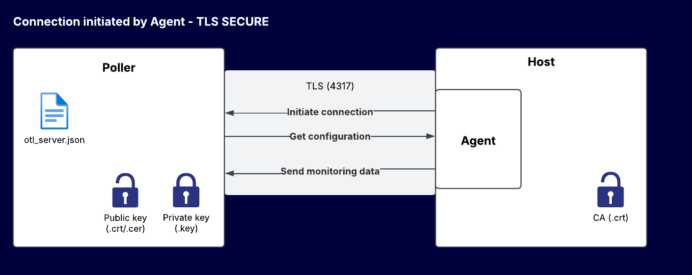
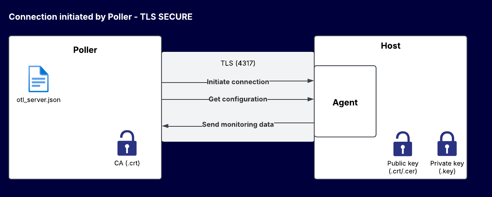

import Tabs from '@theme/Tabs';
import TabItem from '@theme/TabItem';
import PollerAgentConfiguration from './_poller-agent-configuration.mdx';

> The Centreon Monitoring Agent is still in its beta phase. To get support, visit [our dedicated group on The Watch](https://thewatch.centreon.com/groups/opentelemetry-agent-beta-program-61).

## Introduction

The Centreon Monitoring Agent (CMA) is a piece of software installed on the host it monitors: it collects metrics and computes statuses, and sends them to Centreon.

The agent can execute native checks, or use Centreon plugins to execute non-native checks. Native checks are run directly by the agent (as opposed to non-native checks, which require local plugins to be installed on the host). Native checks have better performance and a better footprint (reduced CPU and memory usage).

Both native and non-native checks are defined in either the **Linux Centreon Monitoring Agent** connector or the **Windows Centreon Monitoring Agent** connector. The connectors provide the templates and the agent retrieves the configuration of these checks at regular intervals after the connection has been established.

The agent performs the checks (for non-native checks, using the local plugins) and sends the data to the poller. The part of the poller's Engine that receives data from the agent is called the OTLP receiver (OTLP means OpenTelemetry protocol).

Custom Nagios-compatible plugins can also be used with this agent.

### When do I need to use an agent?

Use the CMA agent:

* when security policies only allow outgoing flows (no checks can be performed by pollers, SNMP is not authorized).
* on sites that have no local poller.
* when you need to run a script locally on the monitored machine for security (rights and/or protocols) or performance reasons.

### How do the host and the poller interact?

Depending on the case, either the agent or the poller initiates the connection.

* In the case of an agent-initiated connection, you simply configure the poller to listen on a specific port. A poller can receive data from n agents/hosts.
* If the agent is not allowed to connect to the poller for security reasons (e.g. when the poller is in a DMZ), you can use a poller-initiated connection. You need to declare in Centreon each host that will be monitored by this agent in the **Poller/agent configuration** menu. The poller will receive data from n hosts via the agent.

<!--You can use both types of communication at the same time (for different hosts).-->

Depending on the direction in which the connection is established, the poller or host can be either client or server. The connection between the poller and the agent must be secure in production.<!-- 2 options are possible:-->

<!--* TLS: the certificate is signed by a certification authority and the Common Name (CN) is verified.
* TLS insecure: the certification authority and Common Name are not verified (self-signed certificates can be used).-->

Store the certificates in the **/etc/pki** directory of the poller. Store them where you like on the host. The diagrams below describe the certificate files to be used in each case.

<Tabs groupId="sync">
<TabItem value="Agent connects to poller, TLS secure" label="Agent connects to poller, TLS secure">



The poller will be configured the following way, using the **Poller/agent configuration** page, in the **OTLP receiver** section:

* Public certificate (mandatory). If you have stored the poller's certificate in the Certificate Store, you don't need to enter a file for the public key. Otherwise, you need to provide the path to the file containing the public key of the poller's opentelemetry server.
        The DNS name that the agent will use to connect to the poller must be identical to the CN of the certificate.
        If this is not possible, you can add an IP **collector_host_name** mapping in the **C:\Windows\System32\drivers\etc\hosts** file (Windows) or **/etc/hosts** (Linux).
* Private key (mandatory)
* CA: rarely necessary in this case, except to manage a double handshake. The TLS protocol with certificates validates the identity of the server for the client, but the "double handshake" goes further: it adds the validation of the client's identity by the server. This is useful for enhanced security but rarely necessary on the internet.

The agent will be configured the following way on the host [(for Windows using the installer or the CLI, and for Linux using the **centagent.json** file)](#step-2-prepare-the-host).

* Encryption = yes
* Trusted CA’s certificate file (can be loaded into the certificate store and not referenced in the agent's configuration)
* Certificate Common Name (rarely necessary)

</TabItem>
<TabItem value="Poller connects to agent, TLS secure" label="Poller connects to agent, TLS secure">



The poller will be configured the following way, using the **Poller/agent configuration** page.

* In the **OTLP Receiver** section, the certificate is not technically necessary but is still mandatory in the interface.

* In the **Host configuration** section:

   CA and CA Common Name (CN) are optional.

   * CA : In the case of a public certificate, the standard OS certification chain is sufficient, this parameter is not required.
   In the case of a self-signed certificate, the CA can be added to the OS in its certification chains, making this parameter unnecessary. If you do not add the CA to the OS, fill in the CA field.

   * CN : The poller uses a domain name or IP to connect to the agent. If the certificate used on the agent matches this domain/IP, then leave the field blank. If it doesn't match, fill in the field.

   Please note that the CN field in the certificate must match the name that will be used by the poller to connect to the host. For example, if you have entered **myhostname** in the CN, the poller must be able to connect to the host **myhostname** without using the IP address (a solution if **myhostname** is not in the DNS: add the IP myhostname mapping in the **/etc/hosts** file).

The agent will be configured the following way on the host [(for Windows using the installer or the CLI, and for Linux using the **centagent.json** file)](#step-2-prepare-the-host).

* Encryption = yes
* Public certificate file
* Private key file

</TabItem>
</Tabs>

<!--#### Unencrypted communication

You can leave the connection unencrypted for test purposes (note that this connection will only last for one hour). Do not use this setting in production.

The agent will be configured the following way on the host [(for Windows using the installer or the CLI, and for Linux using the **centagent.json** file)](#step-2-prepare-the-host).

* Encryption = no-->

### Supported OSs

The CMA can be installed on and monitor the following OSs:

<Tabs groupId="sync">
<TabItem value="Linux" label="Linux">

* RHEL/Oracle Linux/Alma Linux 8
* RHEL/Oracle Linux/Alma Linux 9
* Debian 11
* Debian 12
* Ubuntu 22.04/24.04 LTS

</TabItem>
<TabItem value="Windows" label="Windows">

* Windows 10
* Windows 11
* Windows Server 2016
* Windows Server 2019
* Windows Server 2022

</TabItem>
</Tabs>

### Limitations

The Centreon Monitoring Agent is in Beta Phase. The following limitations need to be considered :

* The scope of supported monitoring is limited, new (native) controls will be introduced in the final version.

## Step 1: Configure Centreon

### Install the Monitoring Connector you need

On your central server, you need to install the monitoring connector that will provide the templates and commands that will allow you to configure the monitored hosts and services in Centreon.

<Tabs groupId="sync">
<TabItem value="Linux" label="Linux">

1. On your central server, go to **Configuration > Connectors > Monitoring Connectors**.
2. [Install](/docs/monitoring/pluginpacks/#installing-a-monitoring-connector) the [**Linux Centreon Monitoring Agent**](../../procedures/operatingsystems-linux-centreon-monitoring-agent.md) monitoring connector.

</TabItem>
<TabItem value="Windows" label="Windows">

1. On your central server, go to **Configuration > Connectors > Monitoring Connectors**.
2. [Install](/docs/monitoring/pluginpacks/#installing-a-monitoring-connector) the [**Windows Centreon Monitoring Agent**](../../procedures/operatingsystems-windows-centreon-monitoring-agent.md) monitoring connector.

</TabItem>
</Tabs>

### Create the CMA connector

<Tabs groupId="sync">
<TabItem value="OnPrem version 24.10.6 or newer" label="OnPrem version 24.10.6 or newer">

1. Go to **Configuration > Commands > Connectors**.

2. Update the Centreon Monitoring Agent connector in the following way: in the **Used by command** field, type **Centreon-Monitoring-Agent** and then click **Select all**.

</TabItem>
<TabItem value="OnPrem version older than 24.10.6" label="OnPrem version older than 24.10.6">

If your Centreon is in a version older than 24.10.6, you need to create the CMA connector on your central server:

1. Go to **Configuration > Commands > Connectors**.
2. Create a new connector with the following values:

| Parameter             | Value                                                                                                                                                                                         |
| --------------------- | --------------------------------------------------------------------------------------------------------------------------------------------------------------------------------------------- |
| Connector Name        | Centreon Monitoring Agent                                                                                                                                           |
| Connector Description | Centreon Monitoring Agent                                                                                                                                                     |
| Command Line          | `opentelemetry --processor=centreon_agent --extractor=attributes --host_path=resource_metrics.resource.attributes.host.name --service_path=resource_metrics.resource.attributes.service.name` |
| Used by command       | Type `Centreon-Monitoring-Agent` and click **Select all**                                                                                                                                     |
| Connector Status      | Enabled                                                                                                                                                                                       |

</TabItem>
</Tabs>

### Configure poller/agent communication

<Tabs groupId="sync">
<TabItem value="Centreon Cloud or OnPrem 24.10.03 and newer" label="Centreon Cloud or OnPrem 24.10.03 and newer">

Configure how the poller and the agent will communicate:

<PollerAgentConfiguration type="CMA" />

5. If the agent is not allowed to connect to the poller for security reasons (e.g. when the poller is in a DMZ), enable **Connection initiated by poller**. Then, in **Host configurations**, define all the hosts on which the agent will be installed.
> If you configure several pollers at once, make sure all certificate files have the same name.

6. [Deploy the configuration](/docs/monitoring/monitoring-servers/deploying-a-configuration).
7. Restart the monitoring engine:

   ```bash
   systemctl restart centengine
   ```

The CMA can now communicate with Centreon. You can set up the monitoring of your hosts.

</TabItem>
<TabItem value="Versions older than 24.10.03" label="Versions older than 24.10.03">

1. On the poller that will receive the data from the agent, install the **centreon-engine-opentelemetry** package.
   
2. On the poller that will receive the data from the agent, create the following file:

   ```shell
   touch /etc/centreon-engine/otl_server.json
   ```

3. Replace the contents of the file with the contents below. This will allow the poller to receive the data that the agent will send.
  
  > The poller can work in both modes simultaneously (some agents connect to the poller, while the poller connects to some other agents).

<Tabs groupId="sync">
<TabItem value="No encryption, agent connects to poller" label="No encryption, agent connects to poller">

```json
{
   "otel_server":{
      "host":"0.0.0.0",
      "port":4317
   },
   "max_length_grpc_log":0,
   "centreon_agent":{
      "check_interval":60,
      "export_period":10
   }
}
```

```bash
chown centreon-engine: /etc/centreon-engine/otl_server.json
```

</TabItem>
<TabItem value="Encryption, agent connects to poller" label="Encryption, agent connects to poller">

```json
{
   "otel_server":{
      "host":"0.0.0.0",
      "port":4317,
      "encryption":true,
      "public_cert":"<CERTIFICATE PATH>",
      "private_key":"<KEY PATH>",
      "ca_certificate":"<CA PATH>"
   },
   "max_length_grpc_log":0,
   "centreon_agent":{
      "check_interval":60,
      "export_period":10
   }
}
```

</TabItem>
<TabItem value="No encryption, poller connects to agent" label="No encryption, poller connects to agent">

Use this configuration when the agent is not allowed to connect to the poller for security reasons (e.g. when the poller is in a DMZ).
In this mode, the poller connects to the CMA.

```json
{
   "max_length_grpc_log":0,
   "centreon_agent":{
      "check_interval":60,
      "export_period":15,
      "reverse_connections":[
         {
            "host":"<HOST ADDRESS>",
            "port":<PORT>
         }
      ]
   }
}
```

```bash
chown centreon-engine: /etc/centreon-engine/otl_server.json
```

* Enter the IP address of the CMA host in the **host** and **port** fields. This IP address must be reachable by the poller.
* The **check_interval** field is the period between two checks for the same service.

</TabItem>
<TabItem value="Encryption, poller connects to agent" label="Encryption, poller connects to agent">

Use this configuration when the agent is not allowed to connect to the poller for security reasons (e.g. when the poller is in a DMZ).
In this mode, the poller connects to the CMA.

```json
{
   "max_length_grpc_log":0,
   "centreon_agent":{
      "check_interval":60,
      "export_period":15,
      "reverse_connections":[
         {
            "host":"localhost",
            "port":4317,
            "encryption":true,
            "ca_certificate":"/tmp/ca_1234.crt",
            "ca_name":"<CA NAME>"
         }
      ]
   }
}
```

* Enter the IP address of the CMA host in the **host** and **port** fields. This IP address must be reachable by the poller.
* The **check_interval** field is the period between two checks for the same service.

</TabItem>
</Tabs>

#### Add a new Broker module

1. Go to **Configuration > Pollers > Engine configuration**, then click on the poller you want to monitor your resources.
2. On the **Data** tab, in the **Broker module** section, in the **Multiple Broker Module** parameter, click on **Add a new entry**.
3. Add the following entry :

   ```bash
   /usr/lib64/centreon-engine/libopentelemetry.so /etc/centreon-engine/otl_server.json
   ```

4. Deploy the configuration.
5. Restart the monitoring engine:

   ```bash
   systemctl restart centengine
   ```

The CMA can now communicate with Centreon. You can set up the monitoring of your hosts.

</TabItem>
</Tabs>

## Step 2: Prepare the host

### Download and install the agent

<Tabs groupId="sync">
<TabItem value="Linux" label="Linux">

#### Install the Centreon repository and the agent

Install the Centreon repository and agent using the following commands:

<Tabs groupId="sync">
<TabItem value="Alma / RHEL / Oracle Linux 8" label="Alma / RHEL / Oracle Linux 8">

```shell
dnf install -y dnf-plugins-core
dnf config-manager --add-repo https://packages.centreon.com/rpm-standard/24.10/el8/centreon-24.10.repo
dnf install  centreon-monitoring-agent
```

</TabItem>
<TabItem value="Alma / RHEL / Oracle Linux 9" label="Alma / RHEL / Oracle Linux 9">

```shell
dnf install -y dnf-plugins-core
dnf config-manager --add-repo https://packages.centreon.com/rpm-standard/24.10/el9/centreon-24.10.repo
dnf install  compat-openssl11 centreon-monitoring-agent
```

</TabItem>
<TabItem value="Debian 11 & 12" label="Debian 11 & 12">

```shell
apt-get update
apt-get -y install lsb-release gpg wget
echo "deb https://packages.centreon.com/apt-standard-24.10-stable $(lsb_release -sc) main" | tee /etc/apt/sources.list.d/centreon.list
echo "deb https://packages.centreon.com/apt-plugins-stable/ $(lsb_release -sc) main" | tee /etc/apt/sources.list.d/centreon-plugins.list
```

Then, import the repository key :

```shell
wget -O- https://apt-key.centreon.com | gpg --dearmor | tee /etc/apt/trusted.gpg.d/centreon.gpg > /dev/null 2>&1
```

Then, install agent :

```shell
apt-get update
apt install centreon-monitoring-agent
```

</TabItem>
<TabItem value="Ubuntu 22.04 & 24.04" label="Ubuntu 22.04 & 24.04">

1. Execute the following commands:

```shell
apt-get update
apt-get -y install lsb-release gpg wget
echo "deb https://packages.centreon.com/ubuntu-standard-24.10-stable $(lsb_release -sc) main" | tee /etc/apt/sources.list.d/centreon.list
echo "deb https://packages.centreon.com/ubuntu-plugins-stable/ $(lsb_release -sc) main" | tee /etc/apt/sources.list.d/centreon-plugins.list
```

2. Import the repository key:

```shell
wget -O- https://apt-key.centreon.com | gpg --dearmor | tee /etc/apt/trusted.gpg.d/centreon.gpg > /dev/null 2>&1
```

3. Install the agent :

```shell
apt-get update
apt install centreon-monitoring-agent
```

</TabItem>
</Tabs>

#### Configure **centreon-monitoring-agent**

Replace the contents of the **/etc/centreon-monitoring-agent/centagent.json** file with the following parameters (4 cases):

<Tabs groupId="sync">
<TabItem value="No encryption, agent connects to poller" label="No encryption, agent connects to poller">


```json
{
  "log_level":"info",
  "endpoint":"<IP POLLER>:4317",
  "host":"host_1",
  "log_type":"file",
  "log_file":"/var/log/centreon-monitoring-agent/centagent.log" 
}
```

</TabItem>
<TabItem value="Encryption, agent connects to poller" label="Encryption, agent connects to poller">

```json
{
  "log_level":"info",
  "endpoint":"<IP POLLER>:4317",
  "host":"host_1",
  "log_type":"file",
  "log_file":"/var/log/centreon-monitoring-agent/centagent.log" ,
  "encryption":true,
  "ca_certificate":"/tmp/ca_1234.crt"
}
```

</TabItem>
<TabItem value="No encryption, poller connects to agent" label="No encryption, poller connects to agent">

```json
{
  "log_level":"info",
  "endpoint":"0.0.0.0:4317",
  "host":"host_1",
  "log_type":"file",
  "log_file":"/var/log/centreon-monitoring-agent/centagent.log" ,
  "reversed_grpc_streaming":true
}
```

</TabItem>
<TabItem value="Encryption, poller connects to agent" label="Encryption, poller connects to agent">

```json
{
  "log_level":"info",
  "endpoint":"0.0.0.0:4317",
  "host":"host_1",
  "log_type":"file",
  "log_file":"/var/log/centreon-monitoring-agent/centagent.log" ,
  "reversed_grpc_streaming":true,
  "encryption":true,
  "private_key":"/tmp/server_1234.key",
  "public_cert":"/tmp/server_1234.crt",
  "ca_certificate":"/tmp/ca_1234.crt"
}

```

</TabItem>
</Tabs>

In the **host** field, enter the name of the host to be monitored as you have entered it in the Centreon interface. If absent, the agent will use the machine's hostname.

#### Configure the logs

You can configure two kinds of log output:

* file: the CMA logs into a file, the path is configured in the **log_file** option.
* stdout: standard output is used.

If you choose to log into a file, log rotation can be customized using the **log_max_file_size** and **log_max_files** options.

Allowed log levels are:

* off: no logs
* critical: critical errors
* error: all errors
* info: additional information
* debug: more information about connections
* trace: the most verbose trace level showing messages sent and received to the poller

#### Restart the agent

Restart the CMA:

```shell
systemctl restart centagent
```

You can check that the agent is running using the following command:

```shell
systemctl status centagent
```

</TabItem>
<TabItem value="Windows" label="Windows">

[Download the CMA installer](https://download.centreon.com) (**Custom Platform** tab then **Monitoring Agent** tab), on every server you want to monitor.

<Tabs groupId="sync">
<TabItem value="Interactive mode" label="Interactive mode">

1. Start the installer (during the configuration, you can click on the (i) icons for help).
   If you choose to install **centreon-plugins**, the installer will try to download and install the latest version of the Centreon plugins. If it can't (no web connection, network issue...), a popup is displayed to ask confirmation before using embedded plugins.
  
   Results are displayed in the installer's window.

2. Configure the endpoint and the connection:
   * **Host name in Centreon**. This must be the name of the host as you have defined it in the Centreon interface.
   * In most cases (the agent connects to the poller), you have to enter the poller's endpoint. The correct format is  \<poller IP or DNS name\>:port (OpenTelemetry listening port on the poller, usually 4317), for example 192.168.45.32:4317.
   * In case of a poller-initiated connection (the poller connects to the agent), you have to choose a host interface (0.0.0.0 for all interfaces) and the listening port on which poller will connect, usually 4317.

3. [Configure logging options](#log-levels). You can configure two kinds of log output:
   * file: the CMA logs into a file
   * eventlog: the CMA logs in the [event logs page](/docs/alerts-notifications/event-log).

   If you choose to log into a file, log rotation can be customized using the **Max File Size** and **Max number of files** options.   Allowed log levels are:

     * off: no logs
     * critical: critical errors
     * error: all errors
     * info: additional information
     * debug: more information about connections
     * trace: the most verbose trace level showing messages sent and received to the poller.

4. Configure encryption. Encryption is activated by default. In case of a **Poller-initiated connection**, the private key file and certificate file are mandatory.

</TabItem>

<TabItem value="Silent mode" label="Silent mode (console)">

In this mode, there is no interface. As this installer is not a console program, it returns immediately despite not having finished. You have to wait for a message telling you that all is finished.
If you want to have an exit status, you can launch the installer in a powershell session and wait for the exit code. The exit code will be 0 if all is right.

To run it in silent mode, you need to set /S as the first argument. You can display a list of arguments with the following command:

```shell
centreon-monitoring-agent.exe /S --help
```

| flag                       | description                                                                                                                                                                                                                                                               |
| -------------------------- | ------------------------------------------------------------------------------------------------------------------------------------------------------------------------------------------------------------------------------------------------------------------------- |
| --install_cma              | Set this flag if you want to install the Centreon Monitoring Agent                                                                                                                                                                                                        |
| --install_plugins          | Set this flag if you want to download and install the latest version of Centreon plugins                                                                                                                                                                                  |
| --install_embedded_plugins | Set this flag if you want to install Centreon plugins embedded in the installer (case of a host that cannot access the internet)                                                                                                                                          |
| --hostname                 | The name of the host as defined in the Centreon interface.                                                                                                                                                                                                                |
| --endpoint                 | IP address of DNS name of the poller the agent will connect to. In case of Poller-initiated connection mode, it is the interface and port on which the agent will accept connections from the poller. 0.0.0.0 means all interfaces. The format is (IP or DNS name):(port) |
| --reverse                  | Add this flag for Poller-initiated connection mode.                                                                                                                                                                                                                       |
| --log_type                 | event_log or file. In case of logging in a file, log_file param is mandatory                                                                                                                                                                                              |
| --log_level                | can be off, critical, error, warning, debug or trace                                                                                                                                                                                                                      |
| --log_file                 | log files path.                                                                                                                                                                                                                                                           |
| --log_max_file_size        | max file in Mo before rotate.                                                                                                                                                                                                                                             |
| --log_max_files            | max number of log files before delete. For the rotation of logs to be active, it is necessary that both parameters 'Max File Size' and 'Max number of files' are set.                                                                                                     |
| --encryption               | Add this flag for encrypt connection with poller.                                                                                                                                                                                                                         |
| --private_key              | Private key file path. Mandatory if encryption and poller-initiated connection are active.                                                                                                                                                                                |
| --public_cert              | Public certificate file path. Mandatory if encryption and poller-initiated connection are active.                                                                                                                                                                         |
| --ca                       | Trusted CA's certificate file path.                                                                                                                                                                                                                                       |
| --ca_name                  | Expected TLS certificate common name (CN).                                                                                                                                                                                                                                |
| --reverse                  | Add this flag to make the agent accept connections from poller (agent in DMZ for example).                                                                                                                                                                                |

If you use the **--install_plugins** option but the download of the plugins fails, the installer will install the plugins embedded in the installer.

#### Log levels

Allowed log levels are:

* off: no logs
* critical: critical errors
* error: all errors
* info: additional information
* debug: more information about connections
* trace: the most verbose trace level showing messages sent and received to the poller.

</TabItem>
</Tabs>

</TabItem>
</Tabs>

### Deploy the Centreon agent plugins

If you want to run non-native checks, you need to install the Centreon plugins, that will execute the checks on the host.

<Tabs groupId="sync">
<TabItem value="Linux" label="Linux">

##### Enable our plugins repository and install the plugins

This repository will provide you our packaged plugins as well as **the dependencies that are not available in the
standard distribution repositories**.

<Tabs groupId="sync">
<TabItem value="Alma / RHEL / Oracle Linux 8" label="Alma / RHEL / Oracle Linux 8">

```bash
dnf -y install dnf-plugins-core oracle-epel-release-el8
dnf config-manager --set-enabled ol8_codeready_builder

cat >/etc/yum.repos.d/centreon-plugins.repo <<'EOF'
[centreon-plugins-stable]
name=Centreon plugins repository.
baseurl=https://packages.centreon.com/rpm-plugins/el8/stable/$basearch/
enabled=1
gpgcheck=1
gpgkey=https://yum-gpg.centreon.com/RPM-GPG-KEY-CES
module_hotfixes=1

[centreon-plugins-stable-noarch]
name=Centreon plugins repository.
baseurl=https://packages.centreon.com/rpm-plugins/el8/stable/noarch/
enabled=1
gpgcheck=1
gpgkey=https://yum-gpg.centreon.com/RPM-GPG-KEY-CES
module_hotfixes=1

[centreon-plugins-testing]
name=Centreon plugins repository. (UNSUPPORTED)
baseurl=https://packages.centreon.com/rpm-plugins/el8/testing/$basearch/
enabled=0
gpgcheck=1
gpgkey=https://yum-gpg.centreon.com/RPM-GPG-KEY-CES
module_hotfixes=1

[centreon-plugins-testing-noarch]
name=Centreon plugins repository. (UNSUPPORTED)
baseurl=https://packages.centreon.com/rpm-plugins/el8/testing/noarch/
enabled=0
gpgcheck=1
gpgkey=https://yum-gpg.centreon.com/RPM-GPG-KEY-CES
module_hotfixes=1

[centreon-plugins-unstable]
name=Centreon plugins repository. (UNSUPPORTED)
baseurl=https://packages.centreon.com/rpm-plugins/el8/unstable/$basearch/
enabled=0
gpgcheck=1
gpgkey=https://yum-gpg.centreon.com/RPM-GPG-KEY-CES
module_hotfixes=1

[centreon-plugins-unstable-noarch]
name=Centreon plugins repository. (UNSUPPORTED)
baseurl=https://packages.centreon.com/rpm-plugins/el8/unstable/noarch/
enabled=0
gpgcheck=1
gpgkey=https://yum-gpg.centreon.com/RPM-GPG-KEY-CES
module_hotfixes=1
EOF
```

Install the plugin:

```bash
dnf install -y centreon-plugin-Operatingsystems-Linux-Local.noarch
```

</TabItem>
<TabItem value="Alma / RHEL / Oracle Linux 9" label="Alma / RHEL / Oracle Linux 9">

```bash
dnf install dnf-plugins-core
dnf install epel-release
dnf config-manager --set-enabled crb

cat >/etc/yum.repos.d/centreon-plugins.repo <<'EOF'
[centreon-plugins-stable]
name=Centreon plugins repository.
baseurl=https://packages.centreon.com/rpm-plugins/el9/stable/$basearch/
enabled=1
gpgcheck=1
gpgkey=https://yum-gpg.centreon.com/RPM-GPG-KEY-CES
module_hotfixes=1

[centreon-plugins-stable-noarch]
name=Centreon plugins repository.
baseurl=https://packages.centreon.com/rpm-plugins/el9/stable/noarch/
enabled=1
gpgcheck=1
gpgkey=https://yum-gpg.centreon.com/RPM-GPG-KEY-CES
module_hotfixes=1

[centreon-plugins-testing]
name=Centreon plugins repository. (UNSUPPORTED)
baseurl=https://packages.centreon.com/rpm-plugins/el9/testing/$basearch/
enabled=0
gpgcheck=1
gpgkey=https://yum-gpg.centreon.com/RPM-GPG-KEY-CES
module_hotfixes=1

[centreon-plugins-testing-noarch]
name=Centreon plugins repository. (UNSUPPORTED)
baseurl=https://packages.centreon.com/rpm-plugins/el9/testing/noarch/
enabled=0
gpgcheck=1
gpgkey=https://yum-gpg.centreon.com/RPM-GPG-KEY-CES
module_hotfixes=1

[centreon-plugins-unstable]
name=Centreon plugins repository. (UNSUPPORTED)
baseurl=https://packages.centreon.com/rpm-plugins/el9/unstable/$basearch/
enabled=0
gpgcheck=1
gpgkey=https://yum-gpg.centreon.com/RPM-GPG-KEY-CES
module_hotfixes=1

[centreon-plugins-unstable-noarch]
name=Centreon plugins repository. (UNSUPPORTED)
baseurl=https://packages.centreon.com/rpm-plugins/el9/unstable/noarch/
enabled=0
gpgcheck=1
gpgkey=https://yum-gpg.centreon.com/RPM-GPG-KEY-CES
module_hotfixes=1
EOF
```

Install the plugin:

```bash
dnf install -y centreon-plugin-Operatingsystems-Linux-Local.noarch
```

</TabItem>
<TabItem value="Debian 11 & 12" label="Debian 11 & 12">

```bash
apt update && apt install lsb-release ca-certificates apt-transport-https software-properties-common wget gnupg2 curl

wget -O- https://apt-key.centreon.com | gpg --dearmor | tee /etc/apt/trusted.gpg.d/centreon.gpg > /dev/null 2>&1
echo "deb https://packages.centreon.com/apt-plugins-stable/ $(lsb_release -sc) main" | tee /etc/apt/sources.list.d/centreon-plugins.list
apt-get update
```

Install the plugin:

```bash
apt -y install centreon-plugin-operatingsystems-linux-local
```

</TabItem>
</Tabs>
</TabItem>
<TabItem value="Windows" label="Windows">

On the hosts you want to monitor, the plugins are already installed by the Centreon Monitoring Agent installer.

</TabItem>
</Tabs>

## Step 3: Monitoring a host with the CMA

### Create hosts using templates

<Tabs groupId="sync">
<TabItem value="Linux" label="Linux">

On the central server, [create hosts](/docs/monitoring/basic-objects/hosts) and apply to them the **OS-Linux-Centreon-Monitoring-Agent-custom** template. The template includes the **Enable passive checks** option set to **on**.

</TabItem>
<TabItem value="Windows" label="Windows">

On the central server, [create hosts](/docs/monitoring/basic-objects/hosts) and apply to them the **OS-Windows-Centreon-Monitoring-Agent-custom** template. The template includes the **Enable passive checks** option set to **on**.

</TabItem>
</Tabs>
