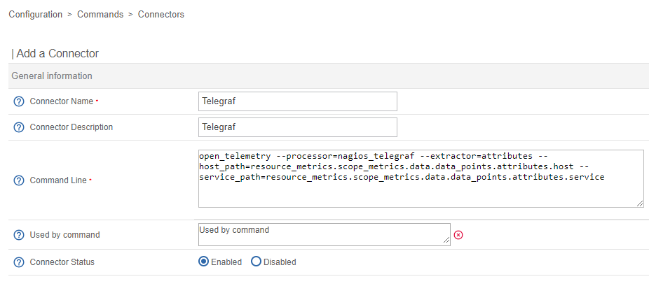

import Tabs from '@theme/Tabs';
import TabItem from '@theme/TabItem';

## Introduction

### General

Centreon is able to gather monitoring data (metrics and statuses) from Telegraf agent.
This can be an added value if you need an OpenTelemetry Agent, able to execute nagios plugins.

### Nagios input data format

Centreon's Telegraf integration is based on native [Nagios input data format](https://docs.influxdata.com/telegraf/v1/data_formats/input/nagios/), which allow Telegraf to execute Nagios plugins.
Centreon and custom plugins are handled by Telegraf, which can return metrics and statuses.

### Telegraf configuration server

Centreon Engine now onboard natively a Telegraf agent Configuration manager.
This component, developed by Centreon is dedicated to provide up-to-date configuration to the Telegraf.
> Configuration is updated on the Agent only during starting or reload.

### Limitations

Due to Telegraf or Centreon constraints, the following limitations need to be considered.
* Telegraf manual reload on host is needed whenever the configuration is updated in Centreon
* Unknown metrics (ie : from OTLP receivers) are not supported
* Only metrics and statuses are returned (no outputs)
* Network connections are one way only : agents to poller (ie : Host in DMZ will need a poller in DMZ)
* As for any Agent, Agent update is necessary to update plugins (no autoupdate)

## Download & Installation

Download and install instructions are documented [here](https://docs.influxdata.com/telegraf/v1/install/).

## Configuration in Centreon

### Install monitoring packs

For Windows host : Windows Telegraf AGENT
For Linux host : Linux Telegraf AGENT

### Create connector

Go in Configuration  Commands  Connectors



Create a new connector with the following values : 

* Connector Name : Telegraf
* Connector Description : Telegraf 
* Commande Line : 
~~~
open_telemetry --processor=nagios_telegraf --extractor=attributes --host_path=resource_metrics.scope_metrics.data.data_points.attributes.host --service_path=resource_metrics.scope_metrics.data.data_points.attributes.service
~~~
**open_telemetry** tell to Engine that it’s not a real connector

**--processor=nagios_telegraf**    
All datas received are stored in fifos.  
This processor will pop these datas in order to build check results  

**--extractor=attributes --host_path=resource_metric…..attributes.host --service_path=resource……...service**  
This extractor will search host name and service description in these open telemetry attributes

* Used by command : 
OS-Windows-Telegraf-Agent-Certificates
OS-Windows-Telegraf-Agent-Ntp
OS-Windows-Telegraf-Agent-Pending-Reboot
OS-Windows-Telegraf-Agent-Sessions
OS-Windows-Telegraf-Agent-Updates

* Connector Status : Enabled

### Configure Engine

Create otl_server.json with the following content.

```
broker_module=/usr/lib64/centreon-engine/libopentelemetry.so /etc/centreon-engine/otl_server.json

{
 "otel_server": {
   "host": "0.0.0.0",
   "port": 4317
 },
 "max_length_grpc_log": 0,
 "telegraf_conf_server": {
   "http_server": {
     "port": 1443,
     "encryption": true,
     "certificate_path": "/tmp/otel/server.crt",
     "key_path": "/tmp/otel/server.key"
   },
   "telegraf_conf": {
     "interval": "10s",
     "service_address": "127.0.0.1:4317"
   }
 }
}
```

**otel_server** gRPC server where collector will connect to and push datas  
**telegraf_conf_server** Telegraf agent will connect to engine to get their configuration  
- **http_server** http(s) server used by telegraf collectors to get their configuration.  
- **telegraf_conf** some Telegraf configuration such as check period and where to push datas (otel_server config seen from Telegraf agent side)

### Add new Broker module
Go to Configuration    Pollers    Engine configuration  Data

On "Multiple Broker Module", click on "Add a new entry".

Add the following entry : 
```
/usr/lib64/centreon-engine/libopentelemetry.so /etc/centreon-engine/otl_server.json
```


## Monitoring

### Deploy Centreon plugins on hosts

#### Linux

##### Enable our plugins repository and install plugin

This repository will provide you our packaged plugins as well as **the dependencies that are not available in the
standard distribution repositories**.

<Tabs groupId="sync">
<TabItem value="Alma / RHEL / Oracle Linux 8" label="Alma / RHEL / Oracle Linux 8">

```bash
cat >/etc/yum.repos.d/centreon-plugins.repo <<'EOF'
[centreon-plugins-stable]
name=Centreon plugins repository.
baseurl=https://packages.centreon.com/rpm-plugins/el8/stable/$basearch/
enabled=1
gpgcheck=1
gpgkey=https://yum-gpg.centreon.com/RPM-GPG-KEY-CES
module_hotfixes=1

[centreon-plugins-stable-noarch]
name=Centreon plugins repository.
baseurl=https://packages.centreon.com/rpm-plugins/el8/stable/noarch/
enabled=1
gpgcheck=1
gpgkey=https://yum-gpg.centreon.com/RPM-GPG-KEY-CES
module_hotfixes=1

[centreon-plugins-testing]
name=Centreon plugins repository. (UNSUPPORTED)
baseurl=https://packages.centreon.com/rpm-plugins/el8/testing/$basearch/
enabled=0
gpgcheck=1
gpgkey=https://yum-gpg.centreon.com/RPM-GPG-KEY-CES
module_hotfixes=1

[centreon-plugins-testing-noarch]
name=Centreon plugins repository. (UNSUPPORTED)
baseurl=https://packages.centreon.com/rpm-plugins/el8/testing/noarch/
enabled=0
gpgcheck=1
gpgkey=https://yum-gpg.centreon.com/RPM-GPG-KEY-CES
module_hotfixes=1

[centreon-plugins-unstable]
name=Centreon plugins repository. (UNSUPPORTED)
baseurl=https://packages.centreon.com/rpm-plugins/el8/unstable/$basearch/
enabled=0
gpgcheck=1
gpgkey=https://yum-gpg.centreon.com/RPM-GPG-KEY-CES
module_hotfixes=1

[centreon-plugins-unstable-noarch]
name=Centreon plugins repository. (UNSUPPORTED)
baseurl=https://packages.centreon.com/rpm-plugins/el8/unstable/noarch/
enabled=0
gpgcheck=1
gpgkey=https://yum-gpg.centreon.com/RPM-GPG-KEY-CES
module_hotfixes=1
EOF

```

Install the plugin :

```bash
dnf install -y centreon-plugin-Operatingsystems-Linux-Local.noarch
```

</TabItem>
<TabItem value="Alma / RHEL / Oracle Linux 9" label="Alma / RHEL / Oracle Linux 9">

```bash
cat >/etc/yum.repos.d/centreon-plugins.repo <<'EOF'
[centreon-plugins-stable]
name=Centreon plugins repository.
baseurl=https://packages.centreon.com/rpm-plugins/el9/stable/$basearch/
enabled=1
gpgcheck=1
gpgkey=https://yum-gpg.centreon.com/RPM-GPG-KEY-CES
module_hotfixes=1

[centreon-plugins-stable-noarch]
name=Centreon plugins repository.
baseurl=https://packages.centreon.com/rpm-plugins/el9/stable/noarch/
enabled=1
gpgcheck=1
gpgkey=https://yum-gpg.centreon.com/RPM-GPG-KEY-CES
module_hotfixes=1

[centreon-plugins-testing]
name=Centreon plugins repository. (UNSUPPORTED)
baseurl=https://packages.centreon.com/rpm-plugins/el9/testing/$basearch/
enabled=0
gpgcheck=1
gpgkey=https://yum-gpg.centreon.com/RPM-GPG-KEY-CES
module_hotfixes=1

[centreon-plugins-testing-noarch]
name=Centreon plugins repository. (UNSUPPORTED)
baseurl=https://packages.centreon.com/rpm-plugins/el9/testing/noarch/
enabled=0
gpgcheck=1
gpgkey=https://yum-gpg.centreon.com/RPM-GPG-KEY-CES
module_hotfixes=1

[centreon-plugins-unstable]
name=Centreon plugins repository. (UNSUPPORTED)
baseurl=https://packages.centreon.com/rpm-plugins/el9/unstable/$basearch/
enabled=0
gpgcheck=1
gpgkey=https://yum-gpg.centreon.com/RPM-GPG-KEY-CES
module_hotfixes=1

[centreon-plugins-unstable-noarch]
name=Centreon plugins repository. (UNSUPPORTED)
baseurl=https://packages.centreon.com/rpm-plugins/el9/unstable/noarch/
enabled=0
gpgcheck=1
gpgkey=https://yum-gpg.centreon.com/RPM-GPG-KEY-CES
module_hotfixes=1
EOF
```

Install the plugin :

```bash
dnf install -y centreon-plugin-Operatingsystems-Linux-Local.noarch
```

</TabItem>
<TabItem value="Debian 11 & 12" label="Debian 11 & 12">

```bash
wget -O- https://apt-key.centreon.com | gpg --dearmor | tee /etc/apt/trusted.gpg.d/centreon.gpg > /dev/null 2>&1
echo "deb https://packages.centreon.com/apt-plugins-stable/ $(lsb_release -sc) main" | tee /etc/apt/sources.list.d/centreon-plugins.list
apt-get update
```

Install the plugin :

```bash
apt -y install centreon-plugin-operatingsystems-linux-local
```

</TabItem>
</Tabs>


#### Windows

Download and execute package for [Windows](https://github.com/centreon/centreon-nsclient-build/releases/download/20240325/centreon_plugins.exe)


### Create hosts using templates