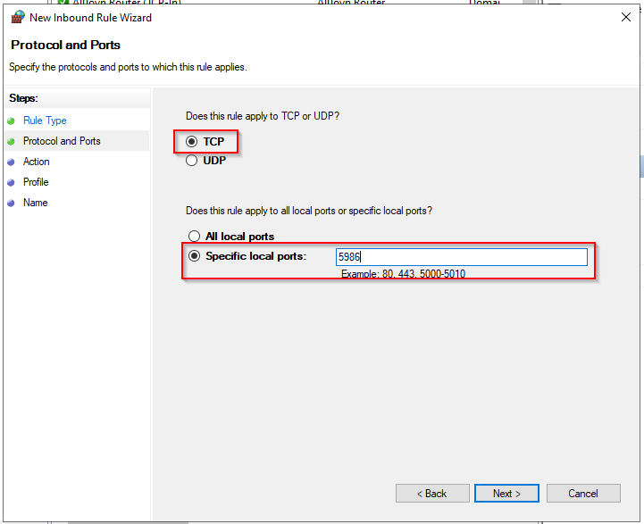
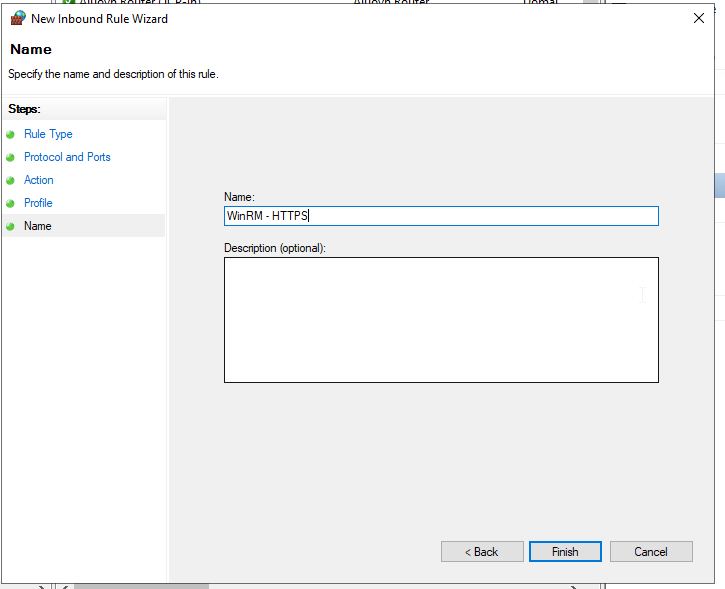
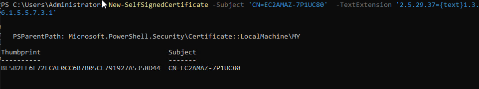
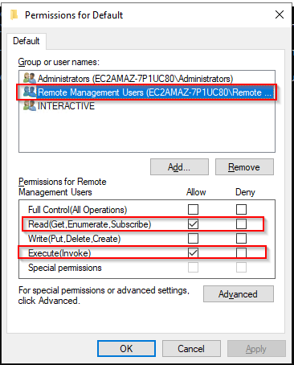

import Tabs from '@theme/Tabs';
import TabItem from '@theme/TabItem';

## Introduction

WS-Management (Web Services-Management) is a DMTF open standard defining a SOAP-based protocol for the management of servers, devices, applications and various Web services. WS-Management provides a common way for systems to access and exchange management information across the IT infrastructure.

## WinRM configuration

<Tabs groupId="sync">
<TabItem value="Local Configuration" label="Local Configuration">

### WSMAN configuration

On your Windows server open PowerShell with Administrator privileges run the following command lines.

Enable WinRM and allow remote access:

``` bash
winrm quickconfig
```

Enable basic authentication:

``` bash
winrm s winrm/config/service/auth '@{Basic="true"}'
```

### Firewall configuration

* Open *Server Manager*
* From the *Tools* menu select *Windows Defender Firewall with Advance Security*
* Click on *Inbound Rules*
* Click on *New Rule...*
* Click on Port, then *Next*


* Enter the value *5986* in the field for Specific local ports and click on *Next*.



* Verify that the radio button next to Allow the connection is selected, and click Next.


* On the next page, select the firewall profiles for which the rule should apply, and click Next.


* On the next page, give the rule a name, and click Finish.



### Create Self-Signed certuficate.

Open PowerShell with Administrator privileges and run the followin command line by replacing
@HOSTNAME@ with the right value.

``` bash
New-SelfSignedCertificate -Subject 'CN=@HOSTNAME@' -TextExtension '2.5.29.37={text}1.3.6.1.5.5.7.3.1'
```

Copy the Thumbprint for the next step



Create the WinRM HTTPS listener by replacing the value @HOSTNAME@ and @THUMBPRINT@ with the right values.

``` bash
winrm create winrm/config/Listener?Address=*+Transport=HTTPS  '@{Hostname="@HOSTNAME@";CertificateThumbprint="@THUMBPRINT@"}'
```

From here, you can monitor your Windows server by using the local Adminsitrator account.
Is not recommanded to use the Administrator account within Centreon.

## Dedicate User configuration

This section will describe you how to configure a local user and minimum privileges to monitor your server.
All configuration can be done through GPO for global deployement.

### Create User

Open a PowerShell with Administrator privileges.

Create your user:

``` bash
net user @USERNAME@ @PASSWORD@ /add
```

### Group configuration

Open the *Computer Management* and add your user into the following groups:
* Distributed COM Users
* Event Log Readers
* Performance Log Users
* Performance Monitor Users
* Remote Management Users


### WMI access configuration

In PowerShell run the command:

``` bash
WMImgmt.msc
```

Right click on *WMI Control*, then *Properties*


Click on *Security*


Select *Root* and click on *Security*


Click on *Add...*, select the *Remote Management Users* group
And allow the following permissions:
* Execute Methods
* Enable Account
* Remote Enable
* Read Security


Click on *Apply* and *OK*

The permissions are not apply recursively, so you will have to repeat the previous process on the following directories:

* Root
* Root/CIMV2
* Root/DEFAULT
* Root/RSOP
* Root/RSOP/Computer
* Root/WMI
* Root/CIMv2/Security/MicrosoftTpm

*Apply* and *OK*
Close WMImgmt windows

### Allow script execution

In PowerShell run the following command line:

``` bash
winrm configSDDL default
```

Add the *Remote Management Users* group.
Allow the right:
* Read(Get,Enumerate,Subscribe)
* Execute(Invoke)



*Apply* and *OK*

### Grant permission about services

#### Retrieve the user SID

To do so, run the following command line in PowerShell by replacing the value *@USERNAME@* with the correct value.

```bash
wmic useraccount where name="@USERNAME@" get name,sid
```

Output:
><p>Name&ensp;&ensp;&ensp;&ensp;&ensp;&ensp;&ensp;&ensp;&ensp;&ensp;SID</p>
>@USRNAME@&ensp;&ensp;S-1-5-21-3051596711-3341658857-577043467-1000

#### Retrieve current SDDL for Service Control Manager

From a Windows Command Prompt (cmd) run the follwing command line:

``` bash
sc sdshow scmanager
```

Your SDDL looks something like this:

>D:(A;;CC;;;AU)(A;;CCLCRPRC;;;IU)(A;;CCLCRPRC;;;SU)(A;;CCLCRPWPRC;;;SY)(A;;KA;;;BA)(A;;CC;;;AC)(A;;CC;;;S-1-15-3-1024-528118966-3876874398-709513571-1907873084-3598227634-3698730060-278077788-3990600205)S:(AU;FA;KA;;;WD)(AU;OIIOFA;GA;;;WD)

#### Modify SDDL

Copy this output and add the following section *(A;;CCLCRPRC;;;@USERSID@)* in the *D:* section just before the *S:* one.

In this exemple the SDDL is now looking like this:

>D:(A;;CC;;;AU)(A;;CCLCRPRC;;;IU)(A;;CCLCRPRC;;;SU)(A;;CCLCRPWPRC;;;SY)(A;;KA;;;BA)(A;;CC;;;AC)(A;;CC;;;S-1-15-3-1024-528118966-3876874398-709513571-1907873084-3598227634-3698730060-278077788-3990600205)*__(A;;CCLCRPRC;;;S-1-5-21-3051596711-3341658857-577043467-1000)__*S:(AU;FA;KA;;;WD)(AU;OIIOFA;GA;;;WD)

#### Set security credentials for accessing the Service Control Manage

In your Windows Command Prompt (cmd) run the following command by replacing *@NEWSDDL@* with the correct value:

``` bash
sc sdset scmanager "@NEWSDDL@"
```

In this example:

>sc sdset scmanager "D:(A;;CC;;;AU)(A;;CCLCRPRC;;;IU)(A;;CCLCRPRC;;;SU)(A;;CCLCRPWPRC;;;SY)(A;;KA;;;BA)(A;;CC;;;AC)(A;;CC;;;S-1-15-3-1024-528118966-3876874398-709513571-1907873084-3598227634-3698730060-278077788-3990600205)(A;;CCLCRPRC;;;S-1-5-21-3051596711-3341658857-577043467-1000)S:(AU;FA;KA;;;WD)(AU;OIIOFA;GA;;;WD)"

From here, your dedicate user is fully setup to monitor your Windows server without using a local Administrator account.

</TabItem>
</Tabs>
