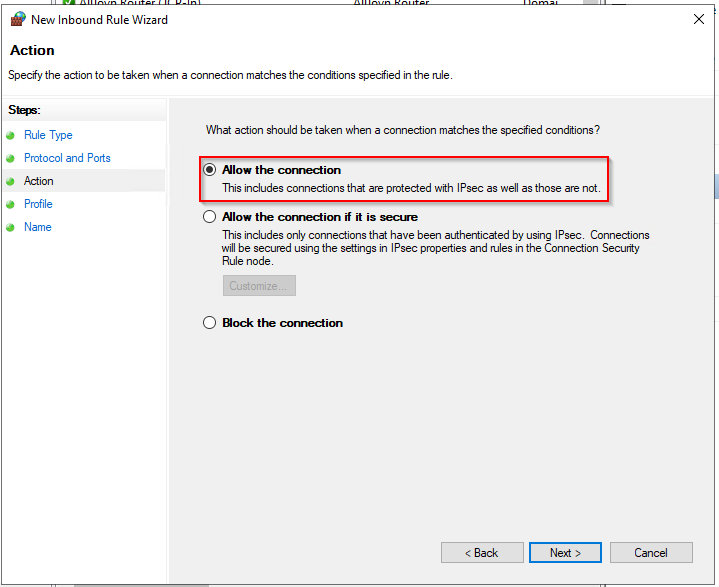
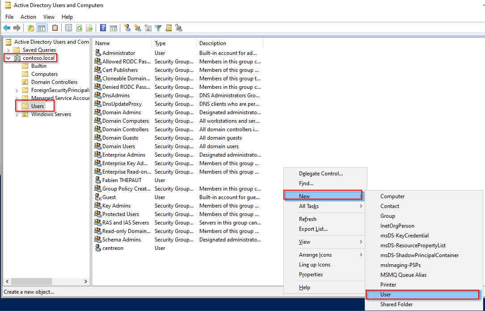
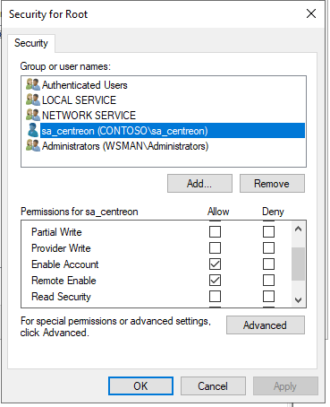
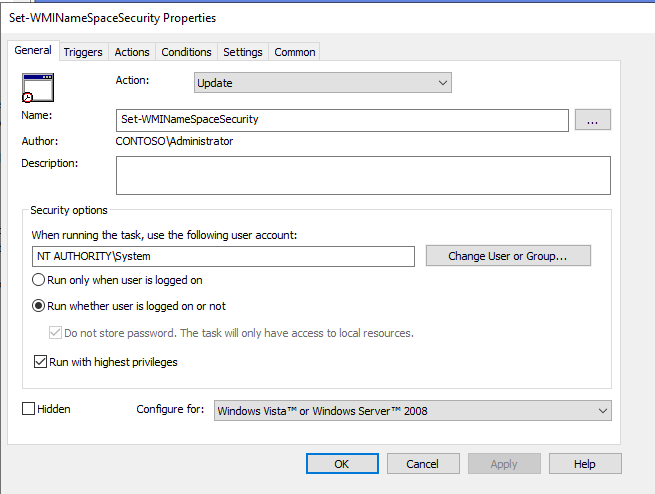

import Tabs from '@theme/Tabs';
import TabItem from '@theme/TabItem';

## Introduction

WS-Management (Web Services-Management) is a DMTF open standard defining a SOAP-based protocol for the management of servers, devices, applications and various web services. WS-Management provides a common way for systems to access and exchange management information across the IT infrastructure.

## WinRM configuration

<Tabs groupId="sync">
<TabItem value="Local Configuration" label="Local Configuration">

### WSMAN configuration

On your Windows server open PowerShell with Administrator privileges and run the following commands.

Enable WinRM and allow remote access:

``` bash
winrm quickconfig
```

Enable basic authentication:

``` bash
winrm s winrm/config/service/auth '@{Basic="true"}'
```

### Firewall configuration

* Open **Server Manager**
* From the **Tools** menu select **Windows Defender Firewall with Advance Security**
* Click on **Inbound Rules**
* Click on **New Rule...**
* Click on **Port**, then **Next**

  

* Enter the value **5986** in the field for **Specific local ports** and click on **Next**.

  

* Check that **Allow the connection** is selected, then click **Next**.

  

* On the next page, select the firewall profiles for which the rule should apply, and click **Next**.

  

* On the next page, give the rule a name, and click **Finish**.

  

### Create a self-signed certificate

Open PowerShell with Administrator privileges and run the following command, replacing
@HOSTNAME@ with the correct value.

``` bash
New-SelfSignedCertificate -Subject 'CN=@HOSTNAME@' -TextExtension '2.5.29.37={text}1.3.6.1.5.5.7.3.1'
```

Copy the **Thumbprint** for the next step:


Create the WinRM HTTPS listener by replacing the value @HOSTNAME@ and @THUMBPRINT@ with the correct values.

``` bash
winrm create winrm/config/Listener?Address=*+Transport=HTTPS  '@{Hostname="@HOSTNAME@";CertificateThumbprint="@THUMBPRINT@"}'
```

From here, you can monitor your Windows server by using the local Administrator account.
Is not recommended to use the Administrator account within Centreon.

## Dedicated User configuration

This section describes how to configure a local user and minimum privileges to monitor your server.
All configurations can be done through a GPO for global deployement.

### Create user

Open a PowerShell with Administrator privileges.

Create your user:

``` bash
net user @USERNAME@ @PASSWORD@ /add
```

### Group configuration

Open **Computer Management** and add your user into the following groups:

* Distributed COM Users
* Event Log Readers
* Performance Log Users
* Performance Monitor Users
* Remote Management Users.

  

### WMI access configuration

In PowerShell run the following command:

``` bash
WMImgmt.msc
```

Right-click on **WMI Control**, then **Properties**:


Click on **Security**:


Select **Root** and click on **Security**:


Click on **Add...**, select the **Remote Management Users** group and set the following permissions:

* Execute Methods
* Enable Account
* Remote Enable
* Read Security.


Click on **Apply** and **OK**

The permissions are not applied recursively, so you will have to repeat the previous process on the following directories:

* Root
* Root/CIMV2
* Root/DEFAULT
* Root/RSOP
* Root/RSOP/Computer
* Root/WMI
* Root/CIMv2/Security/MicrosoftTpm

Click **Apply** and **OK**. Close the WMImgmt window.

### Allow script execution

In PowerShell run the following command:

``` bash
winrm configSDDL default
```

Add the **Remote Management Users** group.
Set the following rights:

* Read(Get,Enumerate,Subscribe)
* Execute(Invoke)


Click **Apply** and **OK**.

### Grant permissions about services

#### Retrieve the user SID

To do so, run the following command in PowerShell, replacing the value *@USERNAME@* with the correct value.

```bash
wmic useraccount where name="@USERNAME@" get name,sid
```

Output:
><p>Name&ensp;&ensp;&ensp;&ensp;&ensp;&ensp;&ensp;&ensp;&ensp;&ensp;SID</p>
>@USRNAME@&ensp;&ensp;S-1-5-21-3051596711-3341658857-577043467-1000

#### Retrieve current SDDL for Service Control Manager

From a Windows Command Prompt (cmd) run the following command:

``` bash
sc sdshow scmanager
```

Your SDDL looks something like this:

>D:(A;;CC;;;AU)(A;;CCLCRPRC;;;IU)(A;;CCLCRPRC;;;SU)(A;;CCLCRPWPRC;;;SY)(A;;KA;;;BA)(A;;CC;;;AC)(A;;CC;;;S-1-15-3-1024-528118966-3876874398-709513571-1907873084-3598227634-3698730060-278077788-3990600205)S:(AU;FA;KA;;;WD)(AU;OIIOFA;GA;;;WD)

#### Modify SDDL

Copy this output and add the following section **(A;;CCLCRPRC;;;@USERSID@)** in the **D:** section just before the **S:** one.

In this exemple the SDDL is now looking like this:

>D:(A;;CC;;;AU)(A;;CCLCRPRC;;;IU)(A;;CCLCRPRC;;;SU)(A;;CCLCRPWPRC;;;SY)(A;;KA;;;BA)(A;;CC;;;AC)(A;;CC;;;S-1-15-3-1024-528118966-3876874398-709513571-1907873084-3598227634-3698730060-278077788-3990600205)*__(A;;CCLCRPRC;;;S-1-5-21-3051596711-3341658857-577043467-1000)__*S:(AU;FA;KA;;;WD)(AU;OIIOFA;GA;;;WD)

#### Set security credentials for accessing the Service Control Manager

In your Windows Command Prompt (cmd) run the following command, replacing *@NEWSDDL@* with the correct value:

``` bash
sc sdset scmanager "@NEWSDDL@"
```

In this example:

>sc sdset scmanager "D:(A;;CC;;;AU)(A;;CCLCRPRC;;;IU)(A;;CCLCRPRC;;;SU)(A;;CCLCRPWPRC;;;SY)(A;;KA;;;BA)(A;;CC;;;AC)(A;;CC;;;S-1-15-3-1024-528118966-3876874398-709513571-1907873084-3598227634-3698730060-278077788-3990600205)(A;;CCLCRPRC;;;S-1-5-21-3051596711-3341658857-577043467-1000)S:(AU;FA;KA;;;WD)(AU;OIIOFA;GA;;;WD)"

From here, your dedicated user is fully set up to monitor your Windows server without using a local Administrator account.

</TabItem>
<TabItem value="Domain Configuration" label="Domain Configuration">

> For this procedure we will assume that your Active Directory is properly configured and that a root certificate is deployed on each server.

### Enable & configure WinRM through a GPO

* Open the **Group Policy Manager**
* Extend **Forest > Domains > @DOMAIN_NAME@**
* Right-click on **@DOMAIN_NAME@** and click on **Create a GPO in this domain, and link it here...**

  

* Name your GPO. In this exemple we will name it **Enable WinRM**.
* Right click on the new GPO **Enable WinRM**, and click on **Edit...**

  

* In the **Group Policy Editor**, go to **Computer Configuration > Policies > Administrative Templates > Windows Components > Windows Remote Management (WinRM) > WinRM Service**.

  

* Enable the rule **Allow remote server management through WinRM**.
* Add "\*" in **IPv4 filter** and **IPv6 filter**.

  

* Disable the following rules:

    * **Allow Basic authentication**
    * **Allow CredSSP authentication**
    * **Allow unencrypted traffic**
    
The result must look like this:


### Automatically start the WinRM service through a GPO

In the same **Enable WinRM** GPO rule:
* Go to **Computer Configuration > Preferences > Control Panel Settings > Services**.

  

* On the right panel right-click, then select **New** and **Service**
* In **Startup** select **Automatic**
* In **Service name** type **WinRM**
* In **Service action** select **Start service**
* Click **OK**.


### Configure HTTPS WSMAN firewall rule through a GPO

In the same **Enable WinRM** GPO rule:

* Go to **Computer Configuration > Windows Settiengs > Security Settings > Windows Defender Firewall with Advanced Security > Windows Defender > Inbound Rules**:

  

* Right-click on the right panel and click on **New Rule...**
* Click on **Port**, then on **Next**.

  

* Enter the value **5986** in the field for **Specific local ports** and click on **Next**.

  

* Check that **Allow the connection** is selected, then click **Next**.

  

* On the next page, select the firewall profiles for which the rule should apply, and click **Next**.

  

* On the next page, give the rule a name, then click **Finish**.

### Create an auto-enroll certificate template

#### Certificate Server

* Open the **Certification Authority** manager
* Extend the left panel, right-click on **Certificate Templates**, then **Manage**.

  

* Right-click on the template **Web Server** and **Duplicate Template**.
* On the **General** tab, name your template and check the following boxes:

    * **Publish certificate in Active Directory**
    * **Do not automatically reenroll...**
    
  

* Go to the **Request Handling** tab.
* Check the option **Allow private key to be exported**.

  

* Go to the **Security** tab.
* Click on **Add...**, type **Domain Computers**
* Set the following permissions:

    * **Read**
    * **Enroll**
    * **Autoenroll**.

  

* Go to the **Subject Name** tab.
* Configure as shown below:

  

* Click on **OK** and close the **Certificate Template Console**.
* In the **crtsrv** window, right-click on **Certificate Templates**, then click **New** and **Certificate Template to Issue**.

  

* Select the previously created **WinRM Cert** template, then click on **OK**.
* Close the **certsrv** window.

#### Active Directory Server

> If an autoenroll GPO is already configured on your domain, you can skip that part.

* In the **Group Policy Manager**, create a new policy for the autoenrollment.
* Right-click on this policy and click on **Edit...**

  

* In the **Group Policy Management Editor**, go to **Computer Configuration > Windows Settings > Security Settings > Public Key Policies**.

  

* Double-click on **Certificate Service Client - Certificate Enrollement Policy**.
* Set **Configuration Model** to **Enabled**.
* Then click **OK**.

  

* Double-click on **Certificate Services Client - Auto-Enrollment**
* Set **Configuration Model** to **Enabled**.
* Check the following options:

   * **Renew expired certificates...**
   * **Update certificates...**

* Click on **OK**.

  

* Close the **Group Policy Manager Editor**.
* In **Group Policy Mangement**, right-click on the Auto-Entrollment policy and click on **Enforced**.


* Also set the **Enable WinRM** rule to **Enforced**.

A dedicated certificate will be issued for each server that is part of your domain. These certificates will be used to encrypt the communication between Centreon and your Windows servers by using WSMAN and the HTTPS protocol.

#### Deploy script

To link this certificate with the WinRM service you will have to run the following PowerShell (.ps1) script on each server.
It can be done through GPO or locally on each server.

Create the "WinRM-HTTPS.ps1" script on your Domain Controler.

Script:

``` bash
$FQDN=$(($i=[System.Net.Dns]::GetHostByName($env:computerName))).HostName

$Thumbprint=Invoke-Command -ComputerName $FQDN `
                             -ScriptBlock {
                                Get-ChildItem -Path Cert:\LocalMachine\My |
                                Where-Object{($TmplExt = $_.Extensions |Where-Object {$_.Oid.FriendlyName -match 'Certificate Template'}) -and $TmplExt.format(0) -match 'WinRM'} |
                                Sort-Object -Property NotAfter |
                                Select-Object -Last 1 -ExpandProperty Thumbprint
                             }


Set-WSManInstance -ResourceURI winrm/config/Listener `
                  -SelectorSet @{Address="*";Transport="HTTPS"} `
                  -ComputerName $FQDN `
                  -ValueSet @{CertificateThumbprint=$Thumbprint}

winrm create winrm/config/Listener?Address=*+Transport=HTTPS "@{Hostname=".$FQDN.".;CertificateThumbprint=".$Thumbprint."}"
```

* Copy this script in the following location to be able to massively deploy this script

``` bash
\\<DOMAIN_NAME>\SYSVOL\<DOMAIN_NAME>\scripts
```

In our case it look like this:


* Go back in your **Enable WinRM** policy
* Go to **Computer Configuration > Preferences > Windows Settings > Files**
* Right click on the right panel select **New > Files**


* Select the **Source file(s)** and **Destination File**
    * In this example:
        * Source file: **\\contoso.local\SYSVOL\contoso.local\scripts\WinRM-HTTPS.ps1**
        * Destination file: **C:\Windows\Temp\WinRM-HTTPS.ps1**


* Click **Apply** and **OK**

#### Create a schedule task

* Go to the menu **Computer Configuration > Preferences > Control Panel Settings > Schedule Task**


* Right click on the right panel select **New > Scheduled Task (At least Windows 7)**
* Named your task
* Select the user **NT Authority\Systems**
* Select **Run wheter user is logged on or not**
* Check **Run with highest privileges**


* Go in the **Triggers** tab
* Add a new trigger
* On top select **At task creation/modification**
* Check **Repeate task every:**
    * Select **5 minutes**
    * and **For a duration of 30 minutes**
* Check **Enabled**
* Click on **OK**

> The repeat task parameter is necessary when new servers join the domain.
> the script might get executed before that certificate gets issued.
> With that parameter, we ensure that the task will be executed at least once after the WinRM certificate is issued.
> If any member of the community knows what event can be used to trigger this task to only be executed the next after the certificate is issued, we will be more than happy to get your feedback to adapt this procedure


* Go in the **Actions** tab
* Add a new action
* Put the following setting:
    * Action: **Start a program**
    * Program/script: **PowerShell.exe**
    * Add argument: **-file C:\Windows\Temp\WinRM-HTTPS.ps1**
        * Adjust this parameter to match with the "File destination" setting previously configured


* Save this configuration

> Feel free to adapt the configuration to meet your needs

> If you don't mind authenticate with the domain Admin user you can jump straight to the Kerberos section.
> Else, you can continue following the documentation to set up a dedicated service user.

### Configure service user

On your Active Directory server:

* Open **Active Directory Users and Computers**.
* In the left panel, select **@DOMAIN NAME@ > Users**.
* Right-click on the right panel and select **New > User**.

  

* Create your user.

  

* Set up the password
* Uncheck option **User must change password at next logon**
* Check the options:

    * **User cannot change password**
    * **Password never expires**

* Click **Next**, then **Finish**
    
  

* In the left panel go to **Builtin**.
* Add the service user as member of the following groups:
    * **Distributed COM Users**
    * **Event Log Readers**
    * **Performance Log Users**
    * **Performance Monitor Users**
    * **Remote Management Users**

  

* Go back to the **Group Policy Manager** and edit the rule **Enable WinRM**
* Go to **Computer Configuration > Windows Settings > Security Settings > Restricted Groups**

  

* Right click on the right panel and click on **Add Group...**
* Click on **Browse...**
* Type *Distributed COM Users*, and click on **Check Names**, then **OK**
* Click on **OK...** again
* Then add your service user in the "Member of this group:" section
* Click **OK**

  

* Repeat the process for all builtin groups:
    * Event Log Readers
    * Performance Log Users
    * Performance Monitor Users
    * Remote Management Users

When all configuration done, it should look like that:

  

### Configure WMI permissions


For this step you will need to conect on one server you want to monitor to configure the right.
Unfortunatly the WMI permission delegation can't be done through GPO, this confiugration need to be done localy on each server.
So to massively apply that configuration we will create a configuration template from one of your servers then apply this template throught a schedule task on your servers.

In PowerShell, run the following command line:

``` bash
WmiMgmt.msc
```

Right-click on **WMI Control**, then on **Properties**.


Click on **Security**.


Select **Root** and click on **Security**.


Click on **Add...**, select the service user (here sa_centreon)
And allow the following permissions:
* **Enable Account**
* **Remote Enable**



> To make it easier we will allow that permission on this namespace and all subnamspaces.
> If you want to allow each mandatory namespaces manually, you'll have to create one dédicated template per namespaces.
> Mandatory namspaces:
> * **Root**
> * **Root/CIMV2**
> * **Root/DEFAULT**
> * **Root/RSOP**
> * **Root/RSOP/Computer**
> * **Root/WMI**
> * **Root/CIMv2/Security/MicrosoftTpm**

* Click on **Advanced**


* Click on your service user, then **Edit**


* On the line **Applies to:**, select **This namespace and all subnamespaces**


* Click on **OK** on each open windows

#### Create WMI security template file

On the same server run the following command line in PowerShell

``` bash
$SidHelper = New-Object System.Management.ManagementClass Win32_SecurityDescriptorHelper
$SdList = @($null)
$(Get-WMIObject -Namespace "root" -Class __SystemSecurity).PsBase.InvokeMethod("GetSD",$SdList)

[System.Management.Automation.PSSerializer]::Serialize($SdList) | Set-Content sdlist.txt 
```

You should now have a **sdlist.txt** file in you directory

* Copy this file on your Domain Controler in the directory **\\contoso.local\SYSVOL\contoso.local\scripts**

#### Deploy WMI security template through GPO


* On your Domain Controler
* Create the **Set-WMINameSpaceSecurity.ps1** script

Script:

``` bash
$SdList = [System.Management.Automation.PSSerializer]::Deserialize($(Get-Content C:\Windows\Temp\sdlist.txt))

$SidHelper = New-Object System.Management.ManagementClass Win32_SecurityDescriptorHelper
$RootSecurity = $(Get-WMIObject -Namespace "root" -Class __SystemSecurity)
$RootSecurity.PsBase.InvokeMethod("SetSd",$SdList) 
```

* Copy this script in the following location to be able to massively deploy this script

``` bash
\\<DOMAIN_NAME>\SYSVOL\<DOMAIN_NAME>\scripts
```

* Go back in your **Enable WinRM** policy
* Go to **Computer Configuration > Preferences > Windows Settings > Files**
* Right click on the right panel select **New > Files**

* Select the **Source file(s)** and **Destination File**
    * In this example:
        * Source file: **\\contoso.local\SYSVOL\contoso.local\scripts\Set-WMINameSpaceSecurity.ps1**
        * Destination file: **C:\Windows\Temp\Set-WMINameSpaceSecurity.ps1**


* Click **Apply** and **OK**

* Repeat that process for the **sdlist.txt** file
* Select the **Source file(s)** and **Destination File**
    * In this example:
        * Source file: **\\contoso.local\SYSVOL\contoso.local\scripts\sdlist.txt**
        * Destination file: **C:\Windows\Temp\sdlist.txt**
        


#### Executre WMI security template through GPO

* Go to the menu **Computer Configuration > Preferences > Control Panel Settings > Schedule Task**


* Right click on the right panel select **New > Scheduled Task (At least Windows 7)**
* Named your task
* Select the user **NT Authority\Systems**
* Select **Run wheter user is logged on or not**
* Check **Run with highest privileges**



* Go in the **Triggers** tab
* Add a new trigger
* On top select **At task creation/modification**
* Check **Enabled**
* Click on **OK**


* Go in the **Actions** tab
* Add a new action
* Put the following setting:
    * Action: **Start a program**
    * Program/script: **PowerShell.exe**
    * Add argument: **-file C:\Windows\Temp\Set-WMINameSpaceSecurity.ps1**
        * Adjust this parameter to match with the "File destination" setting previously configured


* Save this configuration

> Feel free to adapt the configuration to meet your needs

### Configure Services permissions

Same as the previous section, permission has to be managed locally on each server

#### File deployment

On your Domain Controler

* Create the **system-services.ps1** script

Script:

```bash
# Query service manager to get the current permissions in SDDL format.
$command = @'
cmd.exe /C  sc sdshow scmanager
'@

$HostPermissions = Invoke-Expression -Command:$command

# Visually compare the two strings
Write-Host "  Host: " $HostPermissions

$NewPermission = $HostPermissions.replace('(A;;CC;;;AU)','(A;;CCLCRPRC;;;AU)')

Write-Host "New: $NewPermission"

$SetPermissionsCommand = @"
cmd.exe /C  sc sdset scmanager `"$($NewPermission)`"
"@

Invoke-Expression -Command:$SetPermissionsCommand
```

* Copy this script in the following location to be able to massively deploy this script

``` bash
\\<DOMAIN_NAME>\SYSVOL\<DOMAIN_NAME>\scripts
```

* Go back in your **Enable WinRM** policy
* Go to **Computer Configuration > Preferences > Windows Settings > Files**
* Right click on the right panel select **New > Files**

* Select the **Source file(s)** and **Destination File**
    * In this example:
        * Source file: **\\contoso.local\SYSVOL\contoso.local\scripts\system-services.ps1**
        * Destination file: **C:\Windows\Temp\system-services.ps1**


* Click **Apply** and **OK**

#### Schedule task creation

* Go to the menu **Computer Configuration > Preferences > Control Panel Settings > Schedule Task**


* Right click on the right panel select **New > Scheduled Task (At least Windows 7)**
* Named your task
* Select the user **NT Authority\Systems**
* Select **Run wheter user is logged on or not**
* Check **Run with highest privileges**


* Go in the **Triggers** tab
* Add a new trigger
* On top select **At task creation/modification**
* Check **Enabled**
* Click on **OK**


* Go in the **Actions** tab
* Add a new action
* Put the following setting:
    * Action: **Start a program**
    * Program/script: **PowerShell.exe**
    * Add argument: **-file C:\Windows\Temp\system-services.ps1**
        * Adjust this parameter to match with the "File destination" setting previously configured


* Save this configuration

> Feel free to adapt the configuration to meet your needs

### Allow PowerShell command line execution

Same as the previous section, permission has to be managed locally on each server

#### File deployment

On your Domain Controler

* Create the "**RootSDDL-Permision.ps1** script

> This script will allow the permission **Execution** and **Read** permission for your service user through WinRM.

Script:

``` bash
$user = $args[0]

#Adding the below script should replace "winrm configSDDL default"
$GENERIC_READ = 0x80000000
$GENERIC_WRITE = 0x40000000
$GENERIC_EXECUTE = 0x20000000
$GENERIC_ALL = 0x10000000

# get SID of user/group to add

$user_sid = (New-Object -TypeName System.Security.Principal.NTAccount -ArgumentList $user).Translate([System.Security.Principal.SecurityIdentifier])

# get the existing SDDL of the WinRM listener
$sddl = (Get-Item -Path WSMan:\localhost\Service\RootSDDL).Value

# convert the SDDL string to a SecurityDescriptor object
$sd = New-Object -TypeName System.Security.AccessControl.CommonSecurityDescriptor -ArgumentList $false, $false, $sddl

# apply a new DACL to the SecurityDescriptor object
$sd.DiscretionaryAcl.AddAccess(
[System.Security.AccessControl.AccessControlType]::Allow,
$user_sid,
($GENERIC_READ -bor $GENERIC_EXECUTE),
[System.Security.AccessControl.InheritanceFlags]::None,
[System.Security.AccessControl.PropagationFlags]::None
)

# get the SDDL string from the changed SecurityDescriptor object
$new_sddl = $sd.GetSddlForm([System.Security.AccessControl.AccessControlSections]::All)

# apply the new SDDL to the WinRM listener
Set-Item -Path WSMan:\localhost\Service\RootSDDL -Value $new_sddl -Force
```

* Copy this script in the following location to be able to massively deploy this script

``` bash
\\<DOMAIN_NAME>\SYSVOL\<DOMAIN_NAME>\scripts
```

* Go back to the **Enable WinRM** policy
* Go to **Computer Configuration > Preferences > Windows Settings > Files**
* Right click on the right panel select **New > Files**

* Select the **Source file(s)** and **Destination File**
    * In this example:
        * Source file: **\\contoso.local\SYSVOL\contoso.local\scripts\RootSDDL-Permision.ps1**
        * Destination file: **C:\Windows\Temp\RootSDDL-Permision.ps1**


* Click **Apply** and **OK**

#### Schedule task creation

* Go to the menu **Computer Configuration > Preferences > Control Panel Settings > Schedule Task**


* Right click on the right panel select **New > Scheduled Task (At least Windows 7)**
* Named your task
* Select the user **NT Authority\Systems**
* Select **Run wheter user is logged on or not**
* Check **Run with highest privileges**


* Go in the **Triggers** tab
* Add a new trigger
* On top select **At task creation/modification**
* Check **Enabled**
* Click on **OK**


* Go in the **Actions** tab
* Add a new action
* Put the following setting:
    * Action: **Start a program**
    * Program/script: **PowerShell.exe**
    * Add argument: **-file C:\Windows\Temp\RootSDDL-Permision.ps1** <span style={{color:'#FF0000'}}>**@SERVICE_USERNAME@**</span>
        * Adjust this parameter to match with the "File destination" setting previously configured
        * In our exemple the argument is **-file C:\Windows\Temp\RootSDDL-Permision.ps1<span style={{color:'#FF0000'}}> sa_centreon</span>**


* Save this configuration

> Feel free to adapt the configuration to meet your needs

### File systems permissions

On your Domain Controler

* Go back in your **Enable WinRM** policy
* Go to **Computer Configuration > Windows settigns > Security Settings > File System**
* Right click on the right panel select **Add File...**


* Select the directory you want to grant permissions and click on **OK**


* Click on **Add...**, select your service user
* Allow the following permissions:
    * **Read and Execute**
    * **List Folder Contents**
    * **Read**
* Click on **Apply** and **OK**


* Select to propagate those permissions to subfolder or not.
* Click on **OK**


### Configure Kerberos on the Centreon server

On the Centreon server run the following command:

``` bash
yum install sssd realmd oddjob oddjob-mkhomedir adcli samba-common samba-common-tools krb5-workstation openldap-clients policycoreutils-python -y
realm join --user=administrator <YOUR_DOMAIN>
```

You will be asked to type your domain admin account password.
When done, run the following commands to allow centreon-engine and centreon-gorgone to perform the authentication:

``` bash
su - centreon-engine
kinit <SERVICE_USERNAME>
logout
su - centreon-gorgone
kinit <SERVICE_USERNAME>
```

In our example it look like this:


#### Renew Kerberos ticket

Kerberos authentication tickets expire every 10h, disconnecting the centreon-engine user and disabling the authentication process.
We will automatically renew the authentication ticket every 9h through a cron job to work around this issue.

``` bash
cat <<EOF > /etc/cron.d/kerberos
# ########################################
#
# Cron Configuration for Kerberos
#
PATH=/sbin:/bin:/usr/sbin:/usr/bin

# rewrite file with new cron line
CRONTAB_EXEC_USER=""

############################
0 */9 * * *  centreon-engine kinit -R
0 */9 * * *  centreon-gorgone kinit -R
EOF
```

Now, restart the crond process

``` bash
systemctl restart crond
```

Everything is now configured to monitor your Windows servers by using WSMAN with a service user account with an encrypted protocol.


Please find below an example of a command-line from Centreon


### Test check from Centreon server

```bash
/usr/lib/centreon/plugins/centreon_windows_wsman.pl --plugin=os::windows::wsman::plugin --mode=cpu --hostname=wsman.contoso.local --wsman-scheme=https --wsman-port=5986 --wsman-username='' --wsman-password='' --wsman-auth-method='gssnegotiate'
OK: CPU(s) average usage is 0.84 % - CPU '0' usage: 0.84 % | 'cpu.utilization.percentage'=0.84%;;;0;100 '0#core.cpu.utilization.percentage'=0.84%;;;0;100
```

> This authentication method requires you to use the DNS name of your windows server, or Kerberos will not allow the connection.
> Option `--wsman-auth-method='gssnegotiate'` is mandatory to use a domain account.
> As the Centreon system users (centreon-engine and centreon-gorgone) are already authenticate through the **kinit** command you don't need to feel up the options **wsman-username** and  **wsman-password**


</TabItem>
</Tabs>
