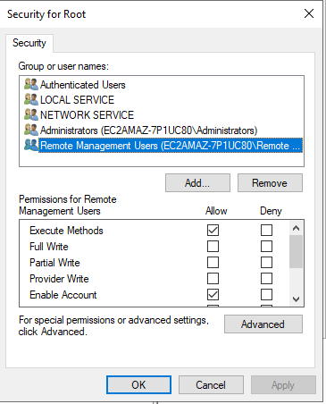
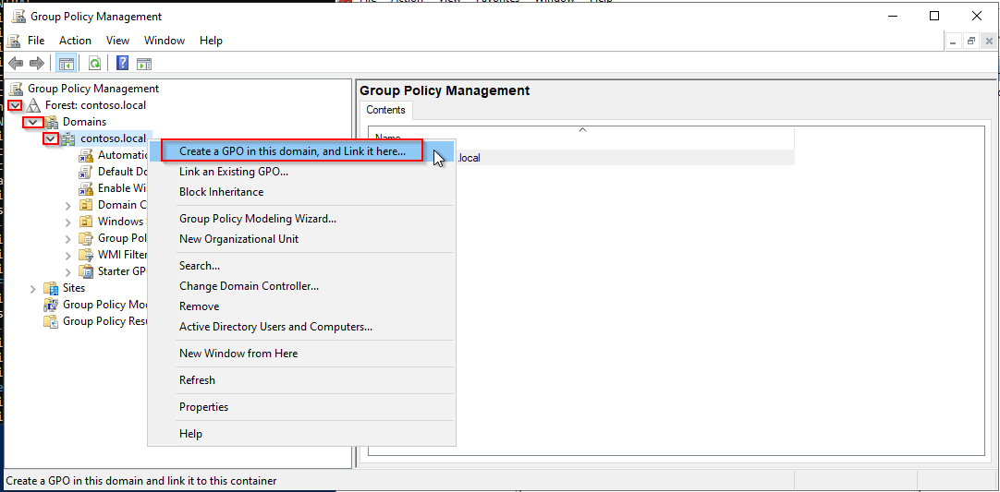
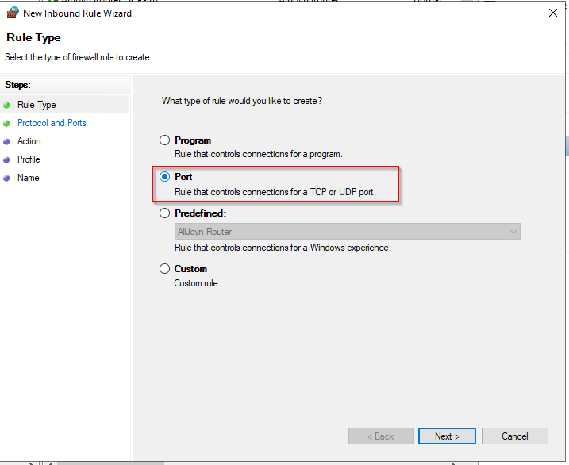

import Tabs from '@theme/Tabs';
import TabItem from '@theme/TabItem';

## Introduction

WS-Management (Web Services-Management) is a DMTF open standard defining a SOAP-based protocol for the management of servers, devices, applications and various web services. WS-Management provides a common way for systems to access and exchange management information across the IT infrastructure.

## WinRM configuration

<Tabs groupId="sync">
<TabItem value="Local Configuration" label="Local Configuration">

### WSMAN configuration

On your Windows server open PowerShell with Administrator privileges and run the following commands.

Enable WinRM and allow remote access:

``` bash
winrm quickconfig
```

Enable basic authentication:

``` bash
winrm s winrm/config/service/auth '@{Basic="true"}'
```

### Firewall configuration

* Open **Server Manager**
* From the **Tools** menu select **Windows Defender Firewall with Advance Security**
* Click on **Inbound Rules**
* Click on **New Rule...**
* Click on **Port**, then **Next**

  

* Enter the value **5986** in the field for **Specific local ports** and click on **Next**.

  

* Check that **Allow the connection** is selected, then click **Next**.

  

* On the next page, select the firewall profiles for which the rule should apply, and click **Next**.

  

* On the next page, give the rule a name, and click **Finish**.

  

### Create a self-signed certificate

Open PowerShell with Administrator privileges and run the following command, replacing
@HOSTNAME@ with the correct value.

``` bash
New-SelfSignedCertificate -Subject 'CN=@HOSTNAME@' -TextExtension '2.5.29.37={text}1.3.6.1.5.5.7.3.1'
```

Copy the **Thumbprint** for the next step:


Create the WinRM HTTPS listener by replacing the value @HOSTNAME@ and @THUMBPRINT@ with the correct values.

``` bash
winrm create winrm/config/Listener?Address=*+Transport=HTTPS  '@{Hostname="@HOSTNAME@";CertificateThumbprint="@THUMBPRINT@"}'
```

From here, you can monitor your Windows server by using the local Administrator account.
Is not recommended to use the Administrator account within Centreon.

## Dedicated User configuration

This section describes how to configure a local user and minimum privileges to monitor your server.
All configurations can be done through a GPO for global deployement.

### Create user

Open a PowerShell with Administrator privileges.

Create your user:

``` bash
net user @USERNAME@ @PASSWORD@ /add
```

### Group configuration

Open **Computer Management** and add your user into the following groups:

* Distributed COM Users
* Event Log Readers
* Performance Log Users
* Performance Monitor Users
* Remote Management Users.

  

### WMI access configuration

In PowerShell run the following command:

``` bash
WMImgmt.msc
```

Right-click on **WMI Control**, then **Properties**:


Click on **Security**:


Select **Root** and click on **Security**:


Click on **Add...**, select the **Remote Management Users** group and set the following permissions:

* Execute Methods
* Enable Account
* Remote Enable
* Read Security.



Click on **Apply** and **OK**

The permissions are not applied recursively, so you will have to repeat the previous process on the following directories:

* Root
* Root/CIMV2
* Root/DEFAULT
* Root/RSOP
* Root/RSOP/Computer
* Root/WMI
* Root/CIMv2/Security/MicrosoftTpm

Click **Apply** and **OK**. Close the WMImgmt window.

### Allow script execution

In PowerShell run the following command:

``` bash
winrm configSDDL default
```

Add the **Remote Management Users** group.
Set the following rights:

* Read(Get,Enumerate,Subscribe)
* Execute(Invoke)


Click **Apply** and **OK**.

### Grant permissions about services

#### Retrieve the user SID

To do so, run the following command in PowerShell, replacing the value *@USERNAME@* with the correct value.

```bash
wmic useraccount where name="@USERNAME@" get name,sid
```

Output:
><p>Name&ensp;&ensp;&ensp;&ensp;&ensp;&ensp;&ensp;&ensp;&ensp;&ensp;SID</p>
>@USRNAME@&ensp;&ensp;S-1-5-21-3051596711-3341658857-577043467-1000

#### Retrieve current SDDL for Service Control Manager

From a Windows Command Prompt (cmd) run the following command:

``` bash
sc sdshow scmanager
```

Your SDDL looks something like this:

>D:(A;;CC;;;AU)(A;;CCLCRPRC;;;IU)(A;;CCLCRPRC;;;SU)(A;;CCLCRPWPRC;;;SY)(A;;KA;;;BA)(A;;CC;;;AC)(A;;CC;;;S-1-15-3-1024-528118966-3876874398-709513571-1907873084-3598227634-3698730060-278077788-3990600205)S:(AU;FA;KA;;;WD)(AU;OIIOFA;GA;;;WD)

#### Modify SDDL

Copy this output and add the following section **(A;;CCLCRPRC;;;@USERSID@)** in the **D:** section just before the **S:** one.

In this exemple the SDDL is now looking like this:

>D:(A;;CC;;;AU)(A;;CCLCRPRC;;;IU)(A;;CCLCRPRC;;;SU)(A;;CCLCRPWPRC;;;SY)(A;;KA;;;BA)(A;;CC;;;AC)(A;;CC;;;S-1-15-3-1024-528118966-3876874398-709513571-1907873084-3598227634-3698730060-278077788-3990600205)*__(A;;CCLCRPRC;;;S-1-5-21-3051596711-3341658857-577043467-1000)__*S:(AU;FA;KA;;;WD)(AU;OIIOFA;GA;;;WD)

#### Set security credentials for accessing the Service Control Manager

In your Windows Command Prompt (cmd) run the following command, replacing *@NEWSDDL@* with the correct value:

``` bash
sc sdset scmanager "@NEWSDDL@"
```

In this example:

>sc sdset scmanager "D:(A;;CC;;;AU)(A;;CCLCRPRC;;;IU)(A;;CCLCRPRC;;;SU)(A;;CCLCRPWPRC;;;SY)(A;;KA;;;BA)(A;;CC;;;AC)(A;;CC;;;S-1-15-3-1024-528118966-3876874398-709513571-1907873084-3598227634-3698730060-278077788-3990600205)(A;;CCLCRPRC;;;S-1-5-21-3051596711-3341658857-577043467-1000)S:(AU;FA;KA;;;WD)(AU;OIIOFA;GA;;;WD)"

From here, your dedicated user is fully set up to monitor your Windows server without using a local Administrator account.

</TabItem>
<TabItem value="Domain Configuration" label="Domain Configuration">

> For this procedure we will assume that your Active Directory is properly configured and that a root certificate is deployed on each server.

### Enable & configure WinRM through a GPO

* Open the **Group Policy Manager**
* Extend **Forest > Domains > @DOMAIN_NAME@**
* Right-click on **@DOMAIN_NAME@** and click on **Create a GPO in this domain, and link it here...**

  

* Name your GPO. In this exemple we will name it **Enable WinRM**.
* Right click on the new GPO **Enable WinRM**, and click on **Edit...**

  

* In the **Group Policy Editor**, go into **Computer Configuration > Policies > Administrative Templates > Windows Components > Windows Remote Management (WinRM) > WinRM Service**.

  

* Enable the rule **Allow remote server management through WinRM**.
* Add "\*" in **IPv4 filter** and **IPv6 filter**.

  

* Disable the following rules:

    * **Allow Basic authentication**
    * **Allow CredSSP authentication**
    * **Allow unencrypted traffic**
    
The result must look like this:


### Automatically start the WinRM service through a GPO

In the same **Enable WinRM** GPO rule:
* Go into **Computer Configuration > Preferences > Control Pannel Settings > Services**.

  

* On the right pannel right-click, then select **New** and **Service**
* In **Startup** select **Automatic**
* In **Service name** type **WinRM**
* In **Service action** select **Start service**
* Click **OK**.


### Configure HTTPS WSMAN firewall rule through a GPO

In the same *Enable WinRM* GPO rule:

* Go into **Computer Configuration > Windows Settiengs > Security Settings > Windows Defender Firewall with Advanced Security > Windows Defender > Inbound Rules**:

  

* Right-click on the right panel and click on **New Rule...**
* Click on **Port**, then on **Next**.

  

* Enter the value **5986** in the field for **Specific local ports** and click on **Next**.

  

* Check that **Allow the connection** is selected, then click **Next**.

  

* On the next page, select the firewall profiles for which the rule should apply, and click **Next**.

  

* On the next page, give the rule a name, then click **Finish**.

### Create an auto-enroll certificate template

#### Certificate Server

* Open the **Certification Authority** manager
* Extend the left panel, right-click on **Certificate Templates**, then **Manage**.

  

* Right-click on the template **Web Server** and **Duplicate Template**.
* On the **General** tab, name your template and check the following boxes:

    * **Publish certificate in Active Directory**
    * **Do not automatically reenroll...**
    
  

* Go to the **Request Handling** tab.
* Check the option **Allow private key to be exported**.

  

* Go to the **Security** tab.
* Click on **Add...**, type **Domain Computers**
* Set the following permissions:

    * **Read**
    * **Enroll**
    * **Autoenroll**.

  

* Go to the **Subject Name** tab.
* Configure as shown below:

  

* Click on **OK** and close the **Certificate Template Console**.
* In the **crtsrv** window, right-click on **Certificate Templates**, then click **New** and **Certificate Template to Issue**.

  

* Select the previously created **WinRM Cert** template, then click on **OK**.
* Close the **certsrv** window.

#### Active Directory Server

> If an autoenroll GPO is already configured on your domain, you can skip that part.

* In the **Group Policy Manager**, create a new policy for the autoenrollment.
* Right-click on this policy and click on **Edit...**

  

* In the **Group Policy Management Editor**, go to **Computer Configuration > Windows Settings > Security Settings > Public Key Policies**.

  

* Double-click on **Certificate Service Client - Certificate Enrollement Policy**.
* Set **Configuration Model** to **Enabled**.
* Then click **OK**.

  

* Double-click on **Certificate Services Client - Auto-Enrollment**
* Set **Configuration Model** to **Enabled**.
* Check the following options:

   * **Renew expired certificates...**
   * **Update certificates...**

* Click on **OK**.

  

* Close the **Group Policy Manager Editor**.
* In **Group Policy Mangement**, right-click on the Auto-Entrollment policy and click on **Enforced**.


* Also set the **Enable WinRM** rule to **Enforced**.

A dedicated certificate will be issued for each server that is part of your domain. These certificates will be used to encrypt the communication between Centreon and your Windows servers by using WSMAN and the HTTPS protocol.

To link these certificates with the WinRM service you will have to run the following PowerShell (.ps1) script on each server.
It can be done though a GPO or locally on each server.

``` bash
$FQDN=$(($i=[System.Net.Dns]::GetHostByName($env:computerName))).HostName
$Thumbprint=$((Get-ChildItem cert:\LocalMachine\my |Where-Object{($TmplExt = $_.Extensions |Where-Object {$_.Oid.FriendlyName -match 'Certificate Template'}) -and $TmplExt.format(0) -match 'WinRM'})).Thumbprint

winrm create winrm/config/Listener?Address=*+Transport=HTTPS "@{Hostname=".$FQDN.".;CertificateThumbprint=".$Thumbprint."}"
```

### Configure service user

On your Active Directory server:

* Open **Active Directory Users and Computers**.
* In the left panel, select **@DOMAIN NAME@ > Users**.
* Right-click on the right panel and select **New > User**.

  

* Create your user.

  

* Set up the password
* Uncheck option **User must change password at next logon**
* Check the options:

    * **User cannot change password**
    * **Password never expires**

* Click **Next**, then **Finish**
    
  

* In the left panel go to **Builtin**.
* Add the service user as member of the following groups:
    * **Distributed COM Users**
    * **Event Log Readers**
    * **Performance Log Users**
    * **Performance Monitor Users**
    * **Remote Management Users**

  

* Go back to the **Group Policy Manager** and edit the rule **Enable WinRM**.
* Go to **Computer Configuration > Windows Settings > Local Policies > Security Options**:

  

* Select the rule **DCOM: Machine Access Restriction...(SDDL)**
* Check **Define this policy setting**
* Click on **Edit Security...**
* Click on **Add...**
* Add the **Distributed DCOM Users** group
* Allow **Local Access** and **Remote Access**
* Click **OK**.

  

* Select the rule **DCOM: Machine Launch Restrictions in Security...**
* Click on **Edit Security...**
* Click on **Add...**
* Add the **Distributed DCOM Users** group
* Allow all options
* Click **OK**.

  

Your policies must look like this:


### Configure WMI permissions

In a prompt, run the following command:

``` bash
WmiMgmt.msc
```

Right-click on **WMI Control**, then on **Properties**.


Click on **Security**.


Select **Root** and click on **Security**.


Click on **Add...**, select the **Remote Management Users** group
and set the following permissions:

* **Execute Methods**
* **Enable Account**
* **Remote Enable**
* **Read Security**


Click on **Apply** and **OK**.

The permissions are not applied recursively, so you will have to repeat the previous process on the following directories:

* Root
* Root/CIMV2
* Root/DEFAULT
* Root/RSOP
* Root/RSOP/Computer
* Root/WMI
* Root/CIMv2/Security/MicrosoftTpm

Click **Apply** and **OK**.

Close the **WMImgmt** window.

### Configure Kerberos on the Centreon server

On the Centreon server run the following command:

``` bash
yum install sssd realmd oddjob oddjob-mkhomedir adcli samba-common samba-common-tools krb5-workstation openldap-clients policycoreutils-python -y
realm join --user=administrator <YOUR_DOMAIN>
```

You will be asked to type your domain account password. When this is done, run the following command:

``` bash
kinit Administrator@<YOUR_DOMAIN>
```

From here everything is configured to monitor your Windows servers by using WSMAN with a service user account, with encrypted protocol.
Please find below an example of command from Centreon.

### Test check from Centreon server

```bash
./centreon_plugins.pl --plugin=os::windows::wsman::plugin --mode=cpu --hostname=EC2AMAZ-VU25UDV  --wsman-scheme=https --wsman-port=5986 --wsman-username="sa_centreon@CONTOSO.LOCAL" --wsman-password='XXXXX' --wsman-auth-method='gssnegotiate' --verbose
OK: CPU(s) average usage is 0.24 % - CPU '0' usage: 0.24 % | 'cpu.utilization.percentage'=0.24%;;;0;100 '0#core.cpu.utilization.percentage'=0.24%;;;0;100
CPU '0' usage: 0.24 %
```

> This authentication method requires you to use the DNS name of your windows server or Kerberos will not allow the connection.
> Option `--wsman-auth-method='gssnegotiate'` is mandatory to use a domain account.
> The domain name in `--wsman-username="sa_centreon@CONTOSO.LOCAL"` is case sensitive and must be in capital letters.

</TabItem>
</Tabs>
