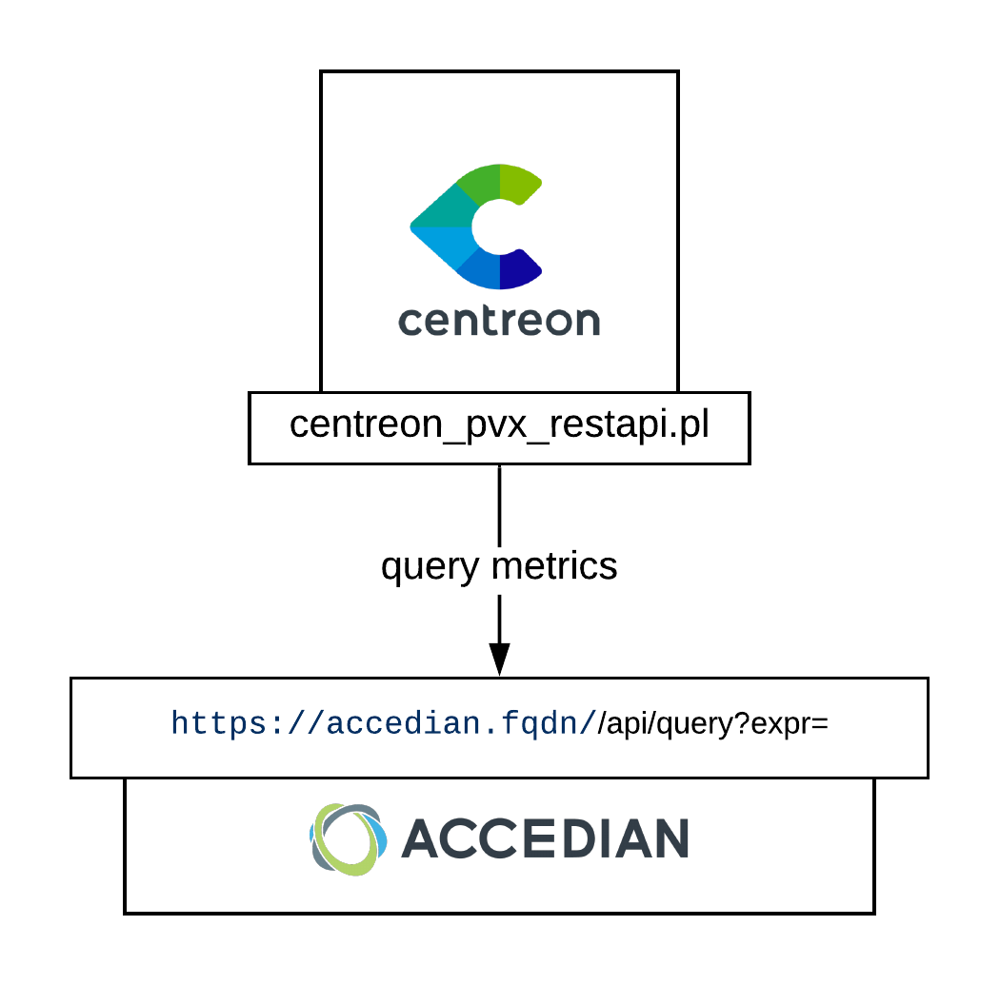

import Tabs from '@theme/Tabs';
import TabItem from '@theme/TabItem';


## Overview

Every PVX-Skylight instance provides XML API endpoints allowing Centreon to
perform queries against it.



## Pack Assets

### Templates

The Centreon Plugin Pack PVX brings 1 host template:
* App-Pvx-Application-Restapi-custom

It brings the following Service Templates:

| Service Alias                       | Service Template                                    | Service Description                       | Default |
|:------------------------------------|:----------------------------------------------------|:------------------------------------------|:--------|
| Http-Hits-Application               | App-Pvx-Http-Hits-Application-Restapi               | Check the number of HTTP errors           | X       |
| Http-Hits                           | App-Pvx-Http-Hits-Restapi                           | Check the number of HTTP errors           |         |
| Http-Hits-Server-Ip                 | App-Pvx-Http-Hits-Server-Ip-Restapi                 | Check the number of HTTP errors           |         |
| Network-Connection-Application      | App-Pvx-Network-Connection-Application-Restapi      | Check the connections attemps             | X       |
| Network-Connection                  | App-Pvx-Network-Connection-Restapi                  | Check connections attemps                 |         |
| Network-Connection-Server-Ip        | App-Pvx-Network-Connection-Server-Ip-Restapi        | Check the connections attemps             |         |
| Network-Traffic-Application         | App-Pvx-Network-Traffic-Application-Restapi         | Check traffic by application.             | X       |
| Network-Traffic-Layer               | App-Pvx-Network-Traffic-Layer-Restapi               | Check traffic by layer.                   |         |
| Network-Traffic                     | App-Pvx-Network-Traffic-Restapi                     | Check traffic by instance                 |         |
| Network-Traffic-Server-Ip           | App-Pvx-Network-Traffic-Server-Ip-Restapi           | Check traffic by IP                       |         |
| Network-User-Experience-Application | App-Pvx-Network-User-Experience-Application-Restapi | Check the user experience by application. | X       |
| Network-User-Experience             | App-Pvx-Network-User-Experience-Restapi             | Check the user experience by instance     |         |
| Network-User-Experience-Server-Ip   | App-Pvx-Network-User-Experience-Server-Ip-Restapi   | Check the user experience by IP           |         |

### Collected metrics & status

<Tabs groupId="sync">
<TabItem value="Http-Hits" label="Http-Hits">

| Metric Name                           | Unit   |
|:--------------------------------------|:-------|
| *instances*#http.hits.persecond       | hits/s |
| *instances*#http.hits.error.persecond | hits/s |
| *instances*#http.hits.percentage      |        |

</TabItem>
<TabItem value="Network-Connection" label="Network-Connection">

| Metric Name                                  | Unit          |
|:---------------------------------------------|:--------------|
| *instances*#connections.attempts.persecond   | connections/s |
| *instances*#connection.time.milliseconds     | ms            |
| *instances*#connections.ratio.percentage     |               |
| *instances*#connections.successful.persecond | connections/s |

</TabItem>
<TabItem value="Network-Traffic" label="Network-Traffic">

| Metric Name                                           | Unit  |
|:------------------------------------------------------|:------|
| traffic.client.bitspersecond                          | b/s   |
| traffic.server.bitspersecond                          | b/s   |
| traffic.aggregated.bitspersecond                      | b/s   |
| *instances*#instance.traffic.client.bitspersecond     | b/s   |
| *instances*#instance.traffic.server.bitspersecond     | b/s   |
| *instances*#instance.traffic.aggregated.bitspersecond | b/s   |

</TabItem>
<TabItem value="Network-User-Experience" label="Network-User-Experience">

| Metric Name                            | Unit  |
|:---------------------------------------|:------|
| *instances*#enduser.experience.seconds | s     |

</TabItem>
</Tabs>

## Prerequisites

### Compatibility

The connector has been tested with the following versions: \* PVX version 5.1.1

### PVX API

To query PVX API, you need to generate an access key. This key will never expire
and the procedure below is an extract from the 
[official documentation](<http://docs.performancevision.com/api_use.html>). In 
each step replace the value of the macros enclosed by '< \>' with yours.

```bash 
curl -k 'https://**<pvxapihost>**/api/login?user=**<user>**&password=**<password>**'`
```

Result:

``` json
{
    "type": "result",
    "result": "**session:91554086-842b-4b73-9028-c51d20d91b94**"
}
```

Thanks to the obtained session ID, execute the command below get a secret key

```bash 
curl -k 'https://**<pvxapihost>**/api/create-api-key?name=**<keyname>**&_session=session:91554086-842b-4b73-9028-c51d20d91b94'`
```

Result:

``` json
{
    "type": "result",
    "result": "**secret:e40b1cc6-f629-43a4-8be6-14a9c9f036e0**"
}
```

In this example the API key is "secret:e40b1cc6-f629-43a4-8be6-14a9c9f036e0".

## Setup

<Tabs groupId="sync">
<TabItem value="Online License" label="Online License">

1. Install the Centreon Plugin package on every Centreon poller expected to monitor **PVX** resources:

```bash
yum install centreon-plugin-Applications-Pvx-Restapi
```

2. On the Centreon Web interface, install the **PVX** Centreon Plugin Pack on the **Configuration > Plugin Packs** page.

</TabItem>
<TabItem value="Offline License" label="Offline License">

1. Install the Centreon Plugin package on every Centreon poller expected to monitor **PVX** resources:

```bash
yum install centreon-plugin-Applications-Pvx-Restapi
```

2. Install the **PVX** Centreon Plugin Pack RPM on the Centreon Central server:

```bash
yum install centreon-pack-applications-pvx-restapi
```

3. On the Centreon Web interface, install the **PVX** Centreon Plugin Pack on the **Configuration > Plugin Packs** page.

</TabItem>
</Tabs>

## Configuration

### Host

* Log into Centreon and add a new Host through **Configuration > Hosts**.
* Fill the **Name**, **Alias** & **IP Address/DNS** fields according to your **PVX** server settings.
* Select the **App-Pvx-Application-Restapi-custom** template to apply to the Host.
* Once the template is applied, fill in the corresponding macros. Some macros are mandatory.

| Mandatory   | Macro              | Description                                                                        |
|:------------|:-------------------|:-----------------------------------------------------------------------------------|
|             | PVXAPIEXTRAOPTIONS | Any extra option you may want to add to every command\_line (eg. a --verbose flag) |
| X           | PVXAPIHOSTNAME     | PVX hostname                                                                       |
| X           | PVXAPIKEY          | PVX API key                                                                        |
|             | PVXAPIPORT         | (Default: '443')                                                                   |
|             | PVXAPIPROTO        | (Default: 'https')                                                                 |
|             | PVXAPIURLPATH      | (Default: '/api')                                                                  |
|             | PVXCUSTOMMODE      | (Default: 'api')                                                                   |

## How to check in the CLI that the configuration is OK and what are the main options for? 

Once the plugin is installed, log into your Centreon Poller CLI using the 
**centreon-engine** user account (`su - centreon-engine`) and test the Plugin by
running the following command:

```bash
/usr/lib/centreon/plugins//centreon_pvx_restapi.pl \
    --plugin=apps::pvx::restapi::plugin \
    --mode=http-hits \
    --custommode='api' \
    --hostname='10.0.0.1' \
    --url-path='/api' \
    --api-key='' \
    --port='443' \
    --proto='https' \
    --timeframe='3600' \
    --instance='' \
    --warning-ratio='' \
    --critical-ratio='' \
    --warning-hits-error='' \
    --critical-hits-error='' \
    --warning-hits='40' \
    --critical-hits='60' \
    --use-new-perfdata 
```

The expected command output is shown below:

```bash
OK: ratio: 18 hits error: 2 hits/s hits: 39 hits/s | 'http.hits.percentage'=18;;;0; 'http.hits.error.persecond'=2hits/s;;;0; 'http.hits.persecond'=39hits/s;0:40;0:60;0; 
```

This command would trigger a WARNING alarm if the HTTP hits count is reported as
over 40 (`--warning-hits='40'`) and a CRITICAL if over than 60 
(`--critical-hits='40'`) in the last hour (`--timeframe='3600'`).

All available options for a given mode can be displayed by adding the 
`--help` parameter to the command:

```bash
/usr/lib/centreon/plugins//centreon_pvx_restapi.pl \
    --plugin=apps::pvx::restapi::plugin \
    --mode=http-hits \
    --help
```

All available options for a given mode can be displayed by adding the 
`--list-mode` parameter to the command:

```bash
/usr/lib/centreon/plugins//centreon_pvx_restapi.pl \
    --plugin=apps::pvx::restapi::plugin \
    --list-mode
```

### Troubleshooting

Please find all the troubleshooting documentation for the API-based Plugins in
the [dedicated chapter](../getting-started/how-to-guides/troubleshooting-plugins.md#http-and-api-checks)
of the Centreon documentation.