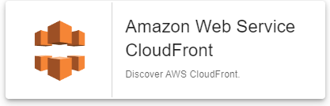

import Tabs from '@theme/Tabs';
import TabItem from '@theme/TabItem';


## Pack Assets

### Templates

The Centreon Monitoring Connector **Amazon CloudFront** brings a host template:

* Cloud-Aws-CloudFront-custom

It brings the following service templates:

| Service Alias         | Service Template                    | Service Description                   | Default |
|:----------------------|:------------------------------------|:--------------------------------------|:--------|
| Cloudfront-Errors     | Cloud-Aws-Cloudfront-Errors-Api     | Check pages access errors             | X       |
| Cloudfront-Requests   | Cloud-Aws-Cloudfront-Requests-Api   | Check requests number                 | X       |
| Cloudfront-Throughput | Cloud-Aws-Cloudfront-Throughput-Api | Check upload and download throughputs | X       |

### Discovery rules

The pack provides a discovery rule to automatically discover CloudFront resources:



More information about the Host Discovery module is available in the Centreon documentation: [Host Discovery](/docs/monitoring/discovery/hosts-discovery)

### Collected metrics & status

<Tabs groupId="sync">
<TabItem value="Cloudfront-Errors" label="Cloudfront-Errors">

| Metric Name                           | Unit  |
|:--------------------------------------|:------|
| cloudfront.errorrate.4xx.percentage   | %     |
| cloudfront.errorrate.5xx.percentage   | %     |
| cloudfront.errorrate.total.percentage | %     |

</TabItem>
<TabItem value="Cloudfront-Requests" label="Cloudfront-Requests">

| Metric Name               | Unit  |
|:--------------------------|:------|
| cloudfront.requests.count | count |

</TabItem>
<TabItem value="Cloudfront-Throughput" label="Cloudfront-Throughput">

| Metric Name                       | Unit  |
|:----------------------------------|:------|
| cloudfront.bytes.downloaded.bytes | bytes |
| cloudfront.bytes.uploaded.bytes   | B     |

</TabItem>
</Tabs>

## Prerequisites

### AWS Configuration

Configure a service account (access/secret key combo) for which the following privileges have to be granted:

| AWS Privilege                  | Description                                                     |
| :----------------------------- | :-------------------------------------------------------------- |
| cloudwatch:getMetricStatistics | Get metrics from the AWS/EC2 namespace on Cloudwatch.           |
| cloudfront:ListDistributions | Grants permission to list the distributions associated with your AWS account. |

### Plugin dependencies

To interact with Amazon APIs, you can use either use the *awscli* binary provided by Amazon or *paws*, a Perl AWS SDK (recommended). You must install it on every poller expected to monitor AWS resources.

> For now, it is not possible to use *paws* if you are using a proxy to reach AWS Cloudwatch APIs.

<Tabs groupId="sync">
<TabItem value="perl-Paws-installation" label="perl-Paws-installation">

```bashn
yum install perl-Paws
```

</TabItem>
<TabItem value="aws-cli-installation" label="aws-cli-installation">

```bash
curl "https://awscli.amazonaws.com/awscli-exe-linux-x86_64.zip" -o "awscliv2.zip"
unzip awscliv2.zip
sudo ./aws/install
```

</TabItem>
</Tabs>

## Setup

### Monitoring Pack

If the platform uses an *online* license, you can skip the package installation
instruction below as it is not required to have the pack displayed within the
**Configuration > Monitoring Connector Manager** menu.
If the platform uses an *offline* license, install the package on the **central server**
with the command corresponding to the operating system's package manager:

<Tabs groupId="sync">
<TabItem value="Alma / RHEL / Oracle Linux 8" label="Alma / RHEL / Oracle Linux 8">

```bash
dnf install centreon-pack-cloud-aws-cloudfront
```

</TabItem>
<TabItem value="CentOS 7" label="CentOS 7">

```bash
yum install centreon-pack-cloud-aws-cloudfront
```

</TabItem>
<TabItem value="Debian 11 & 12" label="Debian 11 & 12">

```bash
apt install centreon-pack-cloud-aws-cloudfront
```

</TabItem>
</Tabs>

Whatever the license type (*online* or *offline*), install the **Amazon CloudFront** Pack through
the **Configuration > Monitoring Connector Manager** menu.

### Plugin

Since Centreon 22.04, you can benefit from the 'Automatic plugin installation' feature.
When this feature is enabled, you can skip the installation part below.

You still have to manually install the plugin on the poller(s) when:
- Automatic plugin installation is turned off
- You want to run a discovery job from a poller that doesn't monitor any resource of this kind yet

> More information in the [Installing the plugin](/docs/monitoring/pluginpacks/#installing-the-plugin) section.

Use the commands below according to your operating system's package manager:

<Tabs groupId="sync">
<TabItem value="Alma / RHEL / Oracle Linux 8" label="Alma / RHEL / Oracle Linux 8">

```bash
dnf install centreon-plugin-Cloud-Aws-Cloudfront-Api
```

</TabItem>
<TabItem value="CentOS 7" label="CentOS 7">

```bash
yum install centreon-plugin-Cloud-Aws-Cloudfront-Api
```

</TabItem>
<TabItem value="Debian 11 & 12" label="Debian 11 & 12">

```bash
apt install centreon-plugin-cloud-aws-cloudfront-api
```

</TabItem>
</Tabs>

## Configuration

### Host

* Log into Centreon and add a new host through **Configuration > Hosts**.
* Fill the **Name**, **Alias** & **IP Address/DNS** fields according to your **CloudFront** server settings.
* Apply the **Cloud-Aws-CloudFront-custom** template to the host.
* Once the template is applied, fill in the corresponding macros. Some macros are mandatory.

| Mandatory   | Macro         | Description                                                                            |
|:------------|:--------------|:---------------------------------------------------------------------------------------|
|             | AWSACCESSKEY  |                                                                                        |
|             | AWSASSUMEROLE |                                                                                        |
|             | AWSCUSTOMMODE | (Default: 'paws')                                                                      |
|             | AWSINSTANCEID |                                                                                        |
|             | AWSREGION     |                                                                                        |
|             | AWSSECRETKEY  |                                                                                        |
|             | EXTRAOPTIONS  | Any extra option you may want to add to every command line (eg. a --verbose flag)      |
|             | PROXYURL      |                                                                                        |

## How to check in the CLI that the configuration is OK and what are the main options for?

Once the plugin is installed, log into your Centreon poller's CLI using the
**centreon-engine** user account (`su - centreon-engine`) and test the plugin by
running the following command:

```bash
/usr/lib/centreon/plugins//centreon_aws_cloudfront_api.pl \
    --plugin=cloud::aws::cloudfront::plugin \
    --mode=throughput \
    --custommode='paws' \
    --aws-secret-key='' \
    --aws-access-key='' \
    --aws-role-arn='' \
    --region='' \
    --id='' \
    --proxyurl='' \
    --filter-metric='' \
    --statistic='sum' \
    --timeframe='600' \
    --period='60' \
    --warning-bytes-uploaded='' \
    --critical-bytes-uploaded='' \
    --warning-bytes-downloaded='' \
    --critical-bytes-downloaded='' \
    --per-sec \
    --verbose \
    --use-new-perfdata
```

The expected command output is shown below:

```bash
OK: Bytes Downloaded Bytes Uploaded | 'cloudfront.bytes.downloaded.bytes'=9000;;;; 'cloudfront.bytes.uploaded.bytes'=9000B;;;; 
```

All available options for a given mode can be displayed by adding the
`--help` parameter to the command:

```bash
/usr/lib/centreon/plugins//centreon_aws_cloudfront_api.pl \
    --plugin=cloud::aws::cloudfront::plugin \
    --mode=throughput \
    --help
```

All available modes can be displayed by adding the `--list-mode` parameter to
the command:

```bash
/usr/lib/centreon/plugins//centreon_aws_cloudfront_api.pl \
    --plugin=cloud::aws::cloudfront::plugin \
    --list-mode
```

### Troubleshooting

Please find the [troubleshooting documentation](../getting-started/how-to-guides/troubleshooting-plugins.md)
for Centreon Plugins typical issues.
