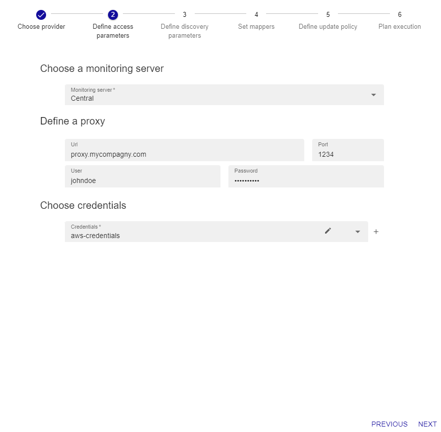
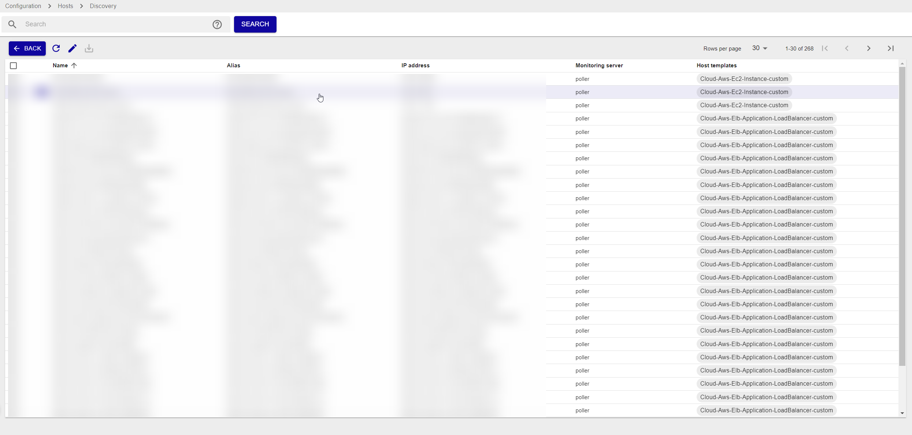

import Tabs from '@theme/Tabs';
import TabItem from '@theme/TabItem';

## Connector dependencies

The following monitoring connectors will be installed when you install the **AWS Discover** connector through the
**Configuration > Connectors > Monitoring Connectors** menu:
* [Base Pack](./base-generic.md)
* [Amazon API Gateway](./cloud-aws-apigateway.md)
* [Amazon Backup Vault](./cloud-aws-backup.md)
* [Amazon EBS](./cloud-aws-ebs.md)
* [Amazon EC2](./cloud-aws-ec2.md)
* [Amazon EFS](./cloud-aws-efs.md)
* [Amazon FSx](./cloud-aws-fsx.md)
* [Amazon Kinesis](./cloud-aws-kinesis.md)
* [AWS Lamba](./cloud-aws-lambda.md)
* [Amazon RDS](./cloud-aws-rds.md)
* [Amazon S3](./cloud-aws-s3.md)
* [Amazon SNS](./cloud-aws-sns.md)
* [Amazon SQS](./cloud-aws-sqs.md)
* [AWS VPN](./cloud-aws-vpn.md)

## Pack assets

The **AWS Discover** monitoring connector does not offer a host template directly,
it is based on the packs listed above.

#### Host discovery

| Rule name                       | Description                                  |
|:--------------------------------|:---------------------------------------------|
| Amazon AWS API Gateway          | Discover Amazon AWS API Gateway instances    |
| Amazon Web Service Backup Vault | Discover AWS Backup Vault host               |
| Amazon AWS EBS                  | Discover Amazon AWS Elastic Block Store host |
| Amazon AWS EC2                  | Discover Amazon AWS EC2 instance             |
| Amazon AWS ASG                  | Discover Amazon AWS Auto Scaling Groups      |
| Amazon AWS EFS                  | Discover Amazon AWS EFS instances            |
| Amazon AWS FSX                  | Discover Amazon AWS FSX intances             |
| Amazon AWS Kinesis              | Discover Amazon AWS Kinesis streams hosts    |
| Amazon Web Service Lambda       | Discover AWS Lambda instances                |
| Amazon AWS RDS                  | Discover Amazon AWS RDS instances            |
| Amazon AWS S3                   | Discover Amazon AWS S3 instances             |
| Amazon Web Service SNS          | Discover AWS SNS Topics                      |
| Amazon Web Service SQS          | Discover AWS SQS queues                      |
| Amazon AWS VPN                  | Discover AWS VPN                             |

More information about discovering hosts automatically is available on the [dedicated page](/docs/monitoring/discovery/hosts-discovery).

### Collected metrics & status

No metrics or status for this monitoring connector.

## Prerequisites

### AWS Privileges

Configure a service account (access/secret key combo).
The following rights have to be granted to the IAM role (accesskey/secretkey or AssumeRole):

| AWS Privilege                  | 
|:-------------------------------|
| apigateway:GetRestApis         |
| backup:ListBackupVaults        |
| ec2:DescribeVolumes            |
| ec2:DescribeInstances          |
| ec2:DescribeSpotFleetRequests  |
| ec2:DescribeVpnConnections     |
| efs:DescribeFileSystems        |
| elb:DescribeLoadBalancers      |
| elbv2:DdescribeLoadBalancers    |
| fsx:DescribeFileSystems        |
| kinesis:ListStreams            |
| lambda:ListFunctions           |
| rds:DescribeDBInstances        |
| s3api:ListBuckets              |
| sns:ListTopics                 | 
| sqs:ListQueues                 |
| cloudwatch:listMetrics         | 
| cloudwatch:getMetricStatistics |

### Plugin dependencies

To interact with the Amazon APIs, you can use either use the *awscli* binary provided by Amazon or *paws*, a Perl AWS SDK (recommended). You must install it on every poller expected to monitor AWS resources.

> Please note that you cannot use paws if you are connecting via a proxy.

<Tabs groupId="sync">
<TabItem value="perl-Paws-installation" label="perl-Paws-installation">

```bash
yum install perl-Paws
```

</TabItem>
<TabItem value="aws-cli-installation" label="aws-cli-installation">

```bash
curl "https://awscli.amazonaws.com/awscli-exe-linux-x86_64.zip" -o "awscliv2.zip"
unzip awscliv2.zip
sudo ./aws/install
```

</TabItem>
</Tabs>

## Installing the monitoring connector

### Pack

 The installation procedures for monitoring connectors are slightly different depending on [whether your license is offline or online](../getting-started/how-to-guides/connectors-licenses.md).


1. If the platform uses an *online* license, you can skip the package installation
instruction below as it is not required to have the connector displayed within the
**Configuration > Connectors > Monitoring Connectors** menu.
If the platform uses an *offline* license, install the package on the **central server**
with the command corresponding to the operating system's package manager:

<Tabs groupId="sync">
<TabItem value="Alma / RHEL / Oracle Linux 8" label="Alma / RHEL / Oracle Linux 8">

```bash
dnf install ccentreon-pack-cloud-aws\*
```

</TabItem>
<TabItem value="Alma / RHEL / Oracle Linux 9" label="Alma / RHEL / Oracle Linux 9">

```bash
dnf install centreon-pack-cloud-aws\*
```

</TabItem>
<TabItem value="Debian 11 & 12" label="Debian 11 & 12">

```bash
apt install centreon-pack-cloud-aws\*
```

</TabItem>
<TabItem value="CentOS 7" label="CentOS 7">

```bash
yum install centreon-pack-cloud-aws\*
```

</TabItem>
</Tabs>

2. Whatever the license type (*online* or *offline*), install the **Amazon API Gateway** connector through
the **Configuration > Connectors > Monitoring Connectors** menu.

### Plugin

Since Centreon 22.04, you can benefit from the 'Automatic plugin installation' feature.
When this feature is enabled, you can skip the installation part below.

You still have to manually install the plugin on the poller(s) when:
- Automatic plugin installation is turned off
- You want to run a discovery job from a poller that doesn't monitor any resource of this kind yet

> More information in the [Installing the plugin](/docs/monitoring/pluginpacks/#installing-the-plugin) section.

Use the commands below according to your operating system's package manager:

<Tabs groupId="sync">
<TabItem value="Alma / RHEL / Oracle Linux 8" label="Alma / RHEL / Oracle Linux 8">

```bash
dnf install centreon-plugin-Cloud-Aws-Cloudwatch-Api
```

</TabItem>
<TabItem value="Alma / RHEL / Oracle Linux 9" label="Alma / RHEL / Oracle Linux 9">

```bash
dnf install centreon-plugin-Cloud-Aws-Cloudwatch-Api
```

</TabItem>
<TabItem value="Debian 11 & 12" label="Debian 11 & 12">

```bash
apt install centreon-plugin-cloud-aws-cloudwatch-api
```

</TabItem>
<TabItem value="CentOS 7" label="CentOS 7">

```bash
yum install centreon-plugin-Cloud-Aws-Cloudwatch-Api
```

</TabItem>
</Tabs>

### Access parameters

Create a new discovery job and select **AWS Discover** as the provider. Click on *next* and set the authentication parameters
as well as optional access parameters if needed:



- Select the **Centreon Poller** from where the discovery job will be launched
- If necessary, add an entreprise **proxy URL and port** to use to reach the AWS API
- If necessary, select the **AWS credentials profile** linked to the subscription to be used

A new credentials profile has to be created the first time you need to use this authentification method. You can do so by clicking the '+' button and set the proper AWS
authentication parameters:


Click on *confirm* then *next* to go to the next step of the wizard and adjust the discovery parameters.

### Discovery parameters

Adjust the following settings:


> All the fields of this form are optional.

- AWS Region : Set the region name
- AWS Assume Role : Set arn of the role to be assumed if you are not using an **AWS credentials profile**

### Run the discovery job and display results

The step 4 of the wizard allows to adjust and set **mappers** if necessary; the Monitoring Connector comes along with predefined **mappers** that
don't typically need to be changed. If you have a specific need and want to edit the **mappers** section, refer to 
[this documentation](/docs/monitoring/discovery/hosts-discovery#how-to-use-mappers) to do so.

Final steps 5 & 6 will allow you to define a specific policy about the data modeling of the discovered results. Although the default configuration
is usually enough to proceed, [this documentation](/docs/monitoring/discovery/hosts-discovery#step-5-define-analysis-and-update-policies) 
will help you to customize it if needed. Coming to step 6, just click on *finish* to launch the discovery job.

Once the discovery job complete, you can display the results by clicking on *job results*. All the available Host Templates
corresponding to the discovered AWS resources will be automatically set, like in the example below:



> Some discovered elements may come up without any predefined Host Template; this is usually due to one or several **mappers**
> conditions that cannot be applied.

Just select the elements you want to add to the Centreon configuration and click on *save*. And... you're done !

### Troubleshooting

Please find the [troubleshooting documentation](../getting-started/how-to-guides/troubleshooting-plugins.md) for Centreon Plugins typical issues.
