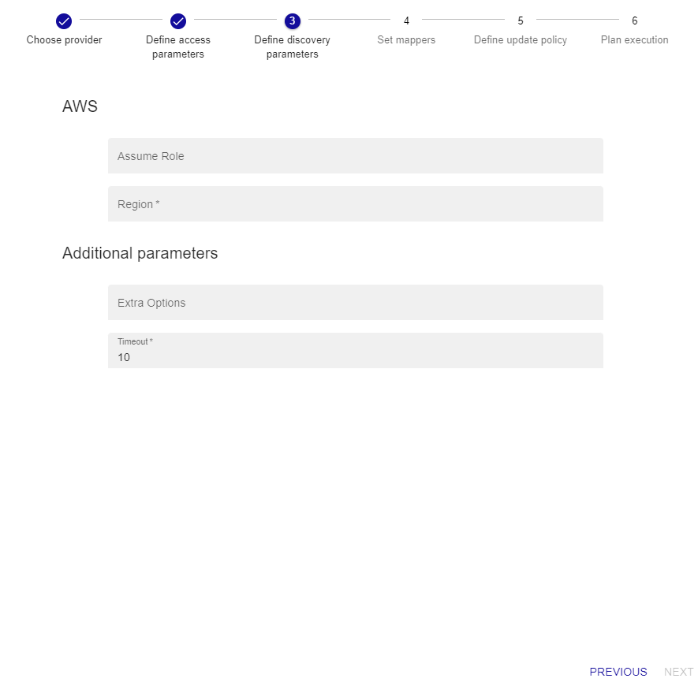

import Tabs from '@theme/Tabs';
import TabItem from '@theme/TabItem';


## Overview

The Centreon **AWS Discover** Monitoring Connector allows you to discover the following AWS resources:
* API Gateway
* Backup Vault
* EBS
* EC2
* EFS
* FSx
* Kinesis
* Lamba
* RDS
* S3
* SNS
* SQS
* VPN

This pack relies on the AWS API to retrieve AWS resources and on all the Centreon Monitoring Connectors for AWS to define 
appropriate monitoring models and indicators for each type of resource.

## Pack Assets

> The Centreon Monitoring Connector **AWS Discover** is only a *discovery* pack. It doesn't natively provide any templates nor
> indicators to monitor AWS resources

### Discovery rules

The Centreon Monitoring Connector **AWS Discover** includes a Host Discovery *provider* to automatically discover AWS resources
This provider is named **Amazon AWS Discover**:


More information about the Host Discovery module is available in the Centreon documentation:
[Host Discovery](/onprem/monitoring/discovery/hosts-discovery)

## Prerequisites

### AWS Privileges

Whether using a service account or a dedicated monitoring account to monitor Cloudwatch metrics, the following rights have to be granted to the IAM role (accesskey/secretkey or AssumeRole):

| AWS Privilege                  | 
|:-------------------------------|
| apigateway:GetRestApis         |
| backup:ListBackupVaults        |
| ec2:DescribeVolumes            |
| ec2:DescribeInstances          |
| ec2:DescribeSpotFleetRequests  |
| ec2:DescribeVpnConnections     |
| efs:DescribeFileSystems        |
| elb:DescribeLoadBalancers      |
| elbv2DdescribeLoadBalancers    |
| fsx:DescribeFileSystems        |
| kinesis:ListStreams            |
| lambda:ListFunctions           |
| rds:DescribeDBInstances        |
| s3api:ListBuckets              |
| sns:ListTopics                 | 
| sqs:ListQueues                 |
| cloudwatch:listMetrics         | 
| cloudwatch:getMetricStatistics |
### Plugin dependencies

To interact with Amazon APIs, you can use either use the *awscli* binary provided by Amazon or *paws*, a Perl AWS SDK (recommended). You must install it on every poller expected to monitor AWS resources. 

> For now, it is not possible to use *paws* if you are using a proxy to reach AWS Cloudwatch APIs. 

<Tabs groupId="sync">
<TabItem value="perl-Paws-installation" label="perl-Paws-installation">

```bash
yum install perl-Paws
```

</TabItem>
<TabItem value="aws-cli-installation" label="aws-cli-installation">

```bash
curl "https://awscli.amazonaws.com/awscli-exe-linux-x86_64.zip" -o "awscliv2.zip"
unzip awscliv2.zip
sudo ./aws/install
```

</TabItem>
</Tabs>

## Setup 

<Tabs groupId="sync">
<TabItem value="Online License" label="Online License">

1. Install the package on every Centreon poller expected to monitor **AWS** resources:

```bash
yum install centreon-plugin-Cloud-Aws-Cloudwatch-Api
```

2. On the Centreon web interface, on page **Configuration > Monitoring Connector Manager**, install the **AWS Discover** Centreon Monitoring Connector.
 You'll be prompted to install several other AWS Monitoring Connectors as dependencies (they will be used to set the proper templates/indicators
on the discovered elements).

</TabItem>
<TabItem value="Offline License" label="Offline License">

1. Install the package on every Centreon poller expected to monitor **AWS** resources:

```bash
yum install centreon-plugin-Cloud-Aws-Cloudwatch-Api
```

2. Install all the Centreon Monitoring Connector AWS RPM on the Centreon central server in order
to make all the dependencies available:

```bash
yum install centreon-pack-cloud-aws\*
```

3. On the Centreon web interface, on page **Configuration > Monitoring Connector Manager**, install the **AWS Discover** Centreon Monitoring Connector.
You'll be prompted to install several other AWS Monitoring Connectors as dependencies (they will be used to set the proper templates/indicators
on the discovered elements).

</TabItem>
</Tabs>

## Set up a discovery job

> The general specifications and mechanics of the *Host Discovery* feature is available [here](/onprem/monitoring/discovery/hosts-discovery)

### Access parameters

Create a new discovery job and select **AWS Discover** as the provider. Click on *next* and set the authentication parameters
as well as optional access parameters if needed:


- Select the **Centreon Poller** from where the discovery job will be launched
- If necessary, add an entreprise **proxy URL and port** to use to reach the AWS API
- If necessary, select the **AWS credentials profile** linked to the subscription to be used

A new credentials profile has to be created the first time you need to use this authentification method. You can do so by clicking the '+' button and set the proper AWS
authentication parameters:


Click on *confirm* then *next* to go to the next step of the wizard and adjust the discovery parameters.

### Discovery parameters

Adjust the following settings:



> All the fields of this form are optional

- AWS Region : Set the region name
- AWS Assume Role : Set arn of the role to be assumed if you are not using an **AWS credentials profile**

### Run the discovery job and display results

The step 4 of the wizard allows to adjust and set **mappers** if necessary; the Monitoring Connector comes along with predefined **mappers** that
don't typically need to be changed. If you have a specific need and want to edit the **mappers** section, refer to 
[this documentation](/onprem/monitoring/discovery/hosts-discovery#how-to-use-the-mappers) to do so.

Final steps 5 & 6 will allow you to define a specific policy about the data modeling of the discovered results. Although the default configuration
is usually enough to proceed, [this documentation](/onprem/monitoring/discovery/hosts-discovery#define-analysis-and-update-policies) 
will help you to customize it if needed. Coming to step 6, just click on *finish* to launch the discovery job.

Once the discovery job complete, you can display the results by clicking on *job results*. All the available Host Templates
corresponding to the discovered AWS resources will be automatically set, like in the example below:


> Some discovered elements may come up without any predefined Host Template; this is usually due to one or several **mappers**
> conditions that cannot be applied

Just select the elements you want to add to the Centreon configuration and click on *save*. And... you're done !

### Troubleshooting

Please find the [troubleshooting documentation](../getting-started/how-to-guides/troubleshooting-plugins.md) for Centreon Plugins typical issues.
