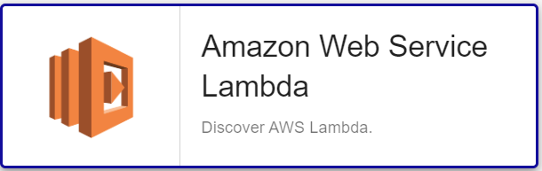

import Tabs from '@theme/Tabs';
import TabItem from '@theme/TabItem';


## Pack Assets

### Templates

The Centreon Plugin Pack **AWS Lambda** brings a host template:
* Cloud-Aws-Lambda-custom

It brings the following service template:

| Service Alias      | Service Template                 | Service Description          | Default |
|:-------------------|:---------------------------------|:-----------------------------|:--------|
| Lambda-Invocations | Cloud-Aws-Lambda-Invocations-Api | Check Memcached performances | X       |


### Discovery rules

The pack provides a discovery rule to automatically discover Lambda resources:



More information about the Host Discovery module is available in the Centreon documentation: [Host Discovery](/docs/monitoring/discovery/hosts-discovery)

### Collected metrics & status

<Tabs groupId="sync">
<TabItem value="Lambda-Invocations" label="Lambda-Invocations">

| Metric Name                              | Unit  |
|:-----------------------------------------|:------|
| lambda.function.duration.milliseconds    | ms    |
| lambda.function.invocations.count        | count |
| lambda.function.errors.count             | count |
| lambda.function.deadlettererrors.count   | count |
| lambda.function.throttles.count          | count |
| lambda.function.iteratorage.milliseconds | count |

</TabItem>
</Tabs>

## Prerequisites

### AWS Configuration

Configure a service account (access/secret key combo) for which the following privileges have to be granted:

| AWS Privilege                  | Description                                                     |
| :------------------------------| :-------------------------------------------------------------- |
| lamdba:ListFunctions           | Get a list of Lambda function                                   |
| cloudwatch:getMetricStatistics | Get metrics from the AWS/EC2 namespace on Cloudwatch.           |

### Plugin dependencies

To interact with Amazon APIs, you can use either use the *awscli* binary provided by Amazon or *paws*, a Perl AWS SDK (recommended). You must install it on every poller expected to monitor AWS resources. 

> For now, it is not possible to use *paws* if you are using a proxy to reach AWS Cloudwatch APIs. 

<Tabs groupId="sync">
<TabItem value="perl-Paws-installation" label="perl-Paws-installation">

```bash
yum install perl-Paws
```

</TabItem>
<TabItem value="aws-cli-installation" label="aws-cli-installation">

```bash
curl "https://awscli.amazonaws.com/awscli-exe-linux-x86_64.zip" -o "awscliv2.zip"
unzip awscliv2.zip
sudo ./aws/install
```

</TabItem>
</Tabs>

## Setup

<Tabs groupId="sync">
<TabItem value="Online License" label="Online License">

1. Install the plugin package on every Centreon poller expected to monitor **AWS Lambda** resources:

```bash
yum install centreon-plugin-Cloud-Aws-Lambda-Api
```

2. On the Centreon web interface, on page **Configuration > Plugin Packs**, install the **AWS Lambda** Centreon Plugin Pack.

</TabItem>
<TabItem value="Offline License" label="Offline License">

1. Install the plugin package on every Centreon poller expected to monitor **AWS Lambda** resources:

```bash
yum install centreon-plugin-Cloud-Aws-Lambda-Api
```

2. Install the **AWS Lambda** Centreon Plugin Pack RPM on the Centreon central server:

```bash
yum install centreon-pack-cloud-aws-lambda
```

3. On the Centreon web interface, on page **Configuration > Plugin Packs**, install the **AWS Lambda** Centreon Plugin Pack.

</TabItem>
</Tabs>

## Configuration

### Host

* Log into Centreon and add a new host through **Configuration > Hosts**.
* In the **IP Address/DNS** field, set the following IP address: **127.0.0.1**.
* Aplly the **Cloud-Aws-Lambda-custom** template to the host.
* Once the template is applied, fill in the corresponding macros. Some macros are mandatory.

| Mandatory   | Nom             | Description                                                                                 |
| :---------- | :-------------- | :------------------------------------------------------------------------------------------ |
| X           | AWSSECRETKEY    | AWS Secret key of your IAM role. Password checkbox must be checked                          |
| X           | AWSACESSKEY     | AWS Access key of your IAM role. Password checkbox must be checked                          |
| X           | AWSREGION       | Region where the instance is running                                                        |
| X           | AWSCUSTOMMODE   | Custom mode to get metrics, 'awscli' is the default, you can also use 'paws' perl library   |
|             | PROXYURL        | Configure proxy URL                                                                         |
|             | FUNCTIONNAME    | Function name (Default : '.*')                                                              |
|             | EXTRAOPTIONS    | Any extra option you may want to add to every command line (eg. a --verbose flag)           |
|             | DUMMYSTATUS     | Host state. Default is OK, do not modify it unless you know what you are doing              |
|             | DUMMYOUTPUT     | Host check output. Default is 'This is a dummy check'. Customize it with your own if needed |

## How to check in the CLI that the configuration is OK and what are the main options for?

Once the plugin is installed, log into your Centreon poller's CLI using the
**centreon-engine** user account (`su - centreon-engine`) and test the plugin by
running the following command:

```bash
/usr/lib/centreon/plugins//centreon_aws_lambda_api.pl \
    --plugin=cloud::aws::lambda::plugin \
    --mode=invocations \
    --custommode='awscli' \
    --aws-secret-key='' \
    --aws-access-key='' \
    --region='eu-west-1' \
    --proxyurl='' \
    --filter-metric='' \
    --timeframe='600' \
    --period='60' \
    --name='myfunctions' \
    --zeroed \
    --verbose
```

The expected command output is shown below:

```bash
OK: Function 'myfunctions' All metrics are ok | 'myfunctions~average#lambda.function.throttles.count'=0.00;;;; 'myfunctions~average#lambda.function.errors.count'=0.00;;;; 'myfunctions~average#lambda.function.iteratorage.milliseconds'=0.00;;;; 'myfunctions~average#lambda.function.invocations.count'=0.00;;;; 'myfunctions~average#lambda.function.deadlettererrors.count'=0.00;;;; 'myfunctions~average#lambda.function.duration.milliseconds'=0.00;;;; 'myfunctions~sum#lambda.function.throttles.count'=0.00;;;; 'myfunctions~sum#lambda.function.errors.count'=0.00;;;; 'myfunctions~sum#lambda.function.iteratorage.milliseconds'=0.00;;;; 'myfunctions~sum#lambda.function.invocations.count'=0.00;;;; 'myfunctions~sum#lambda.function.deadlettererrors.count'=0.00;;;; 'myfunctions~sum#lambda.function.duration.milliseconds'=0.00;;;;
Checking Function 'myfunctions'
    Statistic 'Average' Metrics Throttles: 0.00, Errors: 0.00, Iterator Age: 0.00, Invocations: 0.00, Dead Letter Errors: 0.00, Duration: 0.00
    Statistic 'Sum' Metrics Throttles: 0.00, Errors: 0.00, Iterator Age: 0.00, Invocations: 0.00, Dead Letter Errors: 0.00, Duration: 0.00
```

All available options for a given mode can be displayed by adding the
`--help` parameter to the command:

```bash
/usr/lib/centreon/plugins//centreon_aws_lambda_api.pl \
    --plugin=cloud::aws::lambda::plugin \
    --mode=invocations \
    --help
```

All available modes can be displayed by adding the `--list-mode` parameter to
the command:

```bash
/usr/lib/centreon/plugins//centreon_aws_lambda_api.pl \
    --plugin=cloud::aws::lambda::plugin \
    --list-mode
```

### Troubleshooting

Please find the [troubleshooting documentation](../getting-started/how-to-guides/troubleshooting-plugins.md)
for Centreon Plugins typical issues.