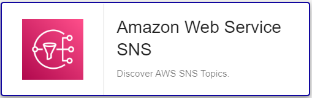

import Tabs from '@theme/Tabs';
import TabItem from '@theme/TabItem';


## Pack Assets

### Templates

The Centreon Plugin Pack **Amazon SNS** brings a host template:

* Cloud-Aws-Sns-custom

It brings the following service templates:

| Service Alias                  | Service Template                      | Service Description                      | Default |
|:-------------------------------|:--------------------------------------|:-----------------------------------------|:--------|
| Sns-Topic-Notifications        | Cloud-Aws-Sns-Topic-Notifications-Api | Check Amazon SNS notifications per topic | X       |

### Discovery rules

The pack provides a discovery rule to automatically discover SNS resources:



More information about the Host Discovery module is available in the Centreon documentation: [Host Discovery](/docs/monitoring/discovery/hosts-discovery)

### Collected metrics & status

More information about collected metrics is available in the official Amazon documentation:
https://docs.aws.amazon.com/sns/latest/dg/sns-monitoring-using-cloudwatch

<Tabs groupId="sync">
<TabItem value="Sns-Topic-Notifications" label="Sns-Topic-Notifications">

| Metric name                       | Description                                                                                         |
|:----------------------------------|:----------------------------------------------------------------------------------------------------|
| sns.notifications.published.count | The number of messages published to your Amazon SNS topics.                                         |
| sns.notifications.delivered.count | The number of messages successfully delivered from your Amazon SNS topics to subscribing endpoints. |
| sns.notifications.failed.count    | The number of messages that Amazon SNS failed to deliver.                                           |
| sns.notifications.filtered.count  | The number of messages that were rejected by subscription filter policies.                          |

</TabItem>
</Tabs>

## Prerequisites

### AWS Configuration

Configure a service account (*access/secret keys* combo) for which the following privileges have to be granted:

| AWS Privilege                  | Description                                          |
|:-------------------------------|:-----------------------------------------------------|
| sns:ListTopics                 | Returns a list of the requester's topics.            |
| cloudwatch:listMetrics         | List all metrics from Cloudwatch AWS/VPN namespace   |
| cloudwatch:getMetricStatistics | Get metrics values from Cloudwatch AWS/VPN namespace |

### Plugin dependencies

To interact with Amazon APIs, you can use either use the *awscli* binary provided by Amazon or *paws*, a Perl AWS SDK (recommended). 
You must install it on every Centreon poller expected to monitor AWS resources: 

<Tabs groupId="sync">
<TabItem value="perl-Paws-installation" label="perl-Paws-installation">

```bash
yum install perl-Paws
```

</TabItem>
<TabItem value="aws-cli-installation" label="aws-cli-installation">

```bash
yum install awscli
```

</TabItem>
</Tabs>

> For now, it is not possible to use *paws* in the following situations:
> * if you are using a proxy to reach AWS Cloudwatch APIs. 
> * to automatically add Hosts in Centreon using the *Host Discovery* feature

## Setup

<Tabs groupId="sync">
<TabItem value="Online License" label="Online License">

1. Install the plugin package on every Centreon poller expected to monitor **SNS** resources:

```bash
yum install centreon-plugin-Cloud-Aws-Sns-Api
```

2. On the Centreon web interface, on page **Configuration > Plugin Packs**, install the **Amazon SNS** Centreon Plugin Pack.

</TabItem>
<TabItem value="Offline License" label="Offline License">

1. Install the plugin package on every Centreon poller expected to monitor **SNS** resources:

```bash
yum install centreon-plugin-Cloud-Aws-Sns-Api
```

2. Install the **Amazon SNS** Centreon Plugin Pack RPM on the Centreon central server:

```bash
yum install centreon-pack-cloud-aws-sns
```

3. On the Centreon web interface, on page **Configuration > Plugin Packs**, install the **Amazon SNS** Centreon Plugin Pack.

</TabItem>
</Tabs>

## Configuration

* Log into Centreon and add a new host through **Configuration > Hosts**.
* In the **IP Address/DNS** field, set the following IP address: **127.0.0.1**.
* Aplly the **Cloud-Aws-Sns-custom** template to the host.
* Once the template is applied, fill in the corresponding macros. Some macros are mandatory.

| Mandatory   | Nom             | Description                                                                                 |
| :---------- | :-------------- | :------------------------------------------------------------------------------------------ |
| X           | AWSSECRETKEY    | AWS Secret key of your IAM role. Password checkbox must be checked                          |
| X           | AWSACESSKEY     | AWS Access key of your IAM role. Password checkbox must be checked                          |
| X           | AWSREGION       | Region where the instance is running                                                        |
| X           | AWSCUSTOMMODE   | Custom mode to get metrics, 'awscli' is the default, you can also use 'paws' perl library   |
|             | PROXYURL        | Configure proxy URL                                                                         |
|             | TOPICNAME       | Topic name (Default : '.*')                                                                 |
|             | EXTRAOPTIONS    | Any extra option you may want to add to every command line (eg. a --verbose flag)           |
|             | DUMMYSTATUS     | Host state. Default is OK, do not modify it unless you know what you are doing              |
|             | DUMMYOUTPUT     | Host check output. Default is 'This is a dummy check'. Customize it with your own if needed |

## How to check in the CLI that the configuration is OK and what are the main options for?

Once the plugin is installed, log into your Centreon poller's CLI using the
**centreon-engine** user account (`su - centreon-engine`) and test the plugin by
running the following command (Some of the parameters such as ```--proxyurl``` have to be adjusted):

```bash
/usr/lib/centreon/plugins/centreon_aws_sns_api.pl \
    --plugin=cloud::aws::sns::plugin \
    --mode=notifications \
    --custommode=awscli \
    --aws-secret-key='*******************' \
    --aws-access-key='**********' \
    --region='eu-west-1' \
    --proxyurl='http://myproxy.mycompany.org:8080'
    --statistic=sum \
    --timeframe='600' \
    --period='60' \
    --topic-name='my_sns_topic_1' \
    --filter-metric='NumberOfNotificationsFailed' \
    --warning-notifications-failed=0 \
    --critical-notifications-failed=5 \
    --verbose
```

Expected command output is shown below: 

```bash
OK: 'my_sns_topic_1' Statistic 'Sum' number of notifications failed: 0 | 'my_sns_topic_1~sum#sns.notifications.failed.count'=0;;;;
Notifications for topic 'my_sns_topic_1' :
    Statistic 'Sum' number of notifications failed: 0 
```

All available options for a given mode can be displayed by adding the
`--help` parameter to the command:

```bash
/usr/lib/centreon/plugins//centreon_aws_sns_api.pl \
    --plugin=cloud::aws::sns::plugin \
    --mode=notifications \
    --help
```

All available modes can be displayed by adding the `--list-mode` parameter to
the command:

```bash
/usr/lib/centreon/plugins//centreon_aws_sns_api.pl \
    --plugin=cloud::aws::sns::plugin \
    --list-mode
```

### Troubleshooting

Please find the [troubleshooting documentation](../getting-started/how-to-guides/troubleshooting-plugins.md)
for Centreon Plugins typical issues.