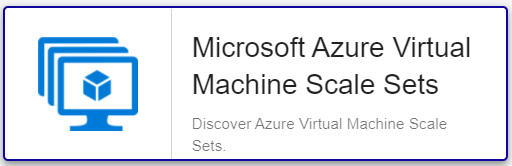

import Tabs from '@theme/Tabs';
import TabItem from '@theme/TabItem';


## Pack Assets

### Templates

The Centreon Plugin Pack Azure Virtual Machine Scale Sets brings 1 host template:
* Cloud-Azure-Compute-Vmscalesets-custom

It brings the following Service Templates:

| Service Alias | Service Template                              | Service Description                                  | Default |
|:--------------|:----------------------------------------------|:-----------------------------------------------------|:--------|
| Cpu-Usage     | Cloud-Azure-Compute-Vmscalesets-Cpu-Usage-Api | Check CPU of Virtual Machine Scale Sets              | X       |
| Diskio        | Cloud-Azure-Compute-Vmscalesets-Diskio-Api    | Check disks I                                        | X       |
| Health        | Cloud-Azure-Compute-Vmscalesets-Health-Api    | Check Virtual Machine Scale Sets state               | X       |
| Memory        | Cloud-Azure-Compute-Vmscalesets-Memory-Api    | Check memory available on Virtual Machine Scale Sets | X       |
| Traffic       | Cloud-Azure-Compute-Vmscalesets-Traffic-Api   | Check Virtual Machine Scale Sets network usage       | X       |

### Discovery rules

The Centreon Plugin Pack *Azure Virtual Machine Scale Sets* includes a Host Discovery provider to
automatically discover the Azure instances of a given subscription and add them
to the Centreon configuration. This provider is named **Microsoft Azure Virtual Machine Scale Sets**:


> This discovery feature is only compatible with the 'api' custom mode. 'azcli' is not supported.

More information about the Host Discovery module is available in the Centreon documentation: [Host Discovery](/docs/monitoring/discovery/hosts-discovery)

### Collected metrics & status

<Tabs groupId="metrics">
<TabItem value="Cpu-Usage" label="Cpu-Usage">

| Metric Name                 | Unit  |
|:----------------------------|:------|
| cpu.credits.consumed.count  |       |
| cpu.credits.remaining.count |       |
| cpu.utilization.percentage  | %     |

</TabItem>
<TabItem value="Diskio" label="Diskio">

| Metric Name           | Unit  |
|:----------------------|:------|
| disk.write.ops.persec |       |
| disk.write.ops.persec |       |

</TabItem>
<TabItem value="Health" label="Health">

Could not retrive metrics

</TabItem>
<TabItem value="Memory" label="Memory">

| Metric Name            | Unit  |
|:-----------------------|:------|
| memory.available.bytes | B     |

</TabItem>
<TabItem value="Traffic" label="Traffic">

| Metric Name       | Unit  |
|:------------------|:------|
| traffic.in.bytes  | B     |
| traffic.out.bytes | B     |

</TabItem>
</Tabs>

## Prerequisites

Please find all the prerequisites needed for Centreon to get information from Azure in the [dedicated page](../getting-started/how-to-guides/azure-credential-configuration.md).

## Setup

<Tabs groupId="sync">
<TabItem value="Online License" label="Online License">

1. Install the Centreon Plugin package on every Centreon poller expected to monitor *Azure VMSS* resources:

```bash
yum install centreon-plugin-Cloud-Azure-Compute-Vmscalesets-Api
```

2. On the Centreon Web interface, install the **Azure Virtual Machine Scale Sets** Centreon Plugin Pack on the **Configuration > Plugin Packs** page.

</TabItem>
<TabItem value="Offline License" label="Offline License">

1. Install the Centreon Plugin package on every Centreon poller expected to monitor *Azure VMSS* resources:

```bash
yum install centreon-plugin-Cloud-Azure-Compute-Vmscalesets-Api
```

2. Install the **Azure Virtual Machine Scale Sets** Centreon Plugin Pack RPM on the Centreon Central server:

```bash
yum install centreon-pack-cloud-azure-compute-vmscalesets
```

3. On the Centreon Web interface, install the **Azure Virtual Machine Scale Sets** Centreon Plugin Pack on the **Configuration > Plugin Packs** page.

</TabItem>
</Tabs>

## Configuration

### Host

* Log into Centreon and add a new Host through **Configuration > Hosts**.
* In the *IP *Address/FQDN** field, set the following IP address: '127.0.0.1'.
* Select the **Cloud-Azure-Compute-Vmscalesets-custom** template to apply to the Host.
* Once the template is applied, fill in the corresponding macros. Some macros are mandatory.
These mandatory Macros differ depending the custom mode used.

> Two methods can be used to set the Macros:
> * full ID of the Resource (`/subscriptions/<subscription_id>/resourceGroups/<resourcegroup_id>/providers/XXXXX/XXXXX/<resource_name>`)
in *AZURERESOURCE*
> * Resource Name in *AZURERESOURCE* associated with Resource Group (in *AZURERESOURCEGROUP*)

<Tabs groupId="sync">
<TabItem value="Azure Monitor API" label="Azure Monitor API">

| Mandatory   | Macro              | Description                                        |
|:------------|:-------------------|:---------------------------------------------------|
|             | AZURECLIENTID      | Client ID                                          |
|             | AZURECLIENTSECRET  | Client secret                                      |
|             | AZURECUSTOMMODE    | Custom mode 'api'                                  |
|             | AZURERESOURCE      | ID or name of the %s resource                      |
|             | AZURERESOURCEGROUP | Associated Resource Group if resource name is used |
|             | AZURESUBSCRIPTION  | Subscription ID                                    |
|             | AZURETENANT        | Tenant ID                                          |

</TabItem>
<TabItem value="Azure azcli" label="Azure azcli">

| Mandatory   | Macro              | Description                                        |
|:------------|:-------------------|:---------------------------------------------------|
|             | AZURECUSTOMMODE    | Custom mode 'azcli'                                |
|             | AZURERESOURCE      | ID or name of the %s resource                      |
|             | AZURERESOURCEGROUP | Associated Resource Group if resource name is used |
|             | AZURESUBSCRIPTION  | Subscription ID                                    |

</TabItem>
</Tabs>

## How to check in the CLI that the configuration is OK and what are the main options for? 

Once the plugin is installed, log into your Centreon Poller CLI using the 
**centreon-engine** user account (`su - centreon-engine`) and test the Plugin by
running the following command:

```bash
/usr/lib/centreon/plugins//centreon_azure_compute_vmscalesets_api.pl \
    --plugin=cloud::azure::compute::vmscalesets::plugin \
    --mode=cpu \
    --custommode='api' \
    --resource='' \
    --resource-group='' \
    --subscription='' \
    --tenant='' \
    --client-id='' \
    --client-secret='' \
    --proxyurl='' \
    --filter-metric='' \
    --timeframe='900' \
    --interval='PT5M' \
    --warning-cpu-usage='' \
    --critical-cpu-usage='' \
    --warning-cpu-credits-remaining='' \
    --critical-cpu-credits-remaining='' \
    --use-new-perfdata 
```

The expected command output is shown below:

```bash
OK: CPU Credits Consumed CPU Credits Remaining CPU percent | 'cpu.credits.consumed.count'=9000;;;0; 'cpu.credits.remaining.count'=9000;;;0; 'cpu.utilization.percentage'=9000%;;;0;100 
```

All available options for a given mode can be displayed by adding the 
`--help` parameter to the command:

```bash
/usr/lib/centreon/plugins//centreon_azure_compute_vmscalesets_api.pl \
    --plugin=cloud::azure::compute::vmscalesets::plugin \
    --mode=cpu \
    --help
```

All available options for a given mode can be displayed by adding the 
`--list-mode` parameter to the command:

```bash
/usr/lib/centreon/plugins//centreon_azure_compute_vmscalesets_api.pl \
    --plugin=cloud::azure::compute::vmscalesets::plugin \
    --list-mode
```

### Troubleshooting

Please find all the troubleshooting documentation for the API-based Plugins in
the [dedicated chapter](../getting-started/how-to-guides/troubleshooting-plugins.md#http-and-api-checks)
of the Centreon documentation.