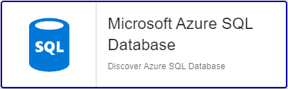

import Tabs from '@theme/Tabs';
import TabItem from '@theme/TabItem';


## Pack Assets

### Templates

The Centreon Plugin Pack **Azure SQL Database** brings a host template:

* Cloud-Azure-Database-SqlDatabase-custom

It brings the following service templates:

| Service Alias | Service Template                               | Service Description               | Default |
|:--------------|:-----------------------------------------------|:----------------------------------|:--------|
| App-Resources | Cloud-Azure-Database-SqlDatabase-App-Resources | Check App CPU and memory metrics  |         |
| Connections   | Cloud-Azure-Database-SqlDatabase-Connections   | Check the number of connections   |         |
| Deadlocks     | Cloud-Azure-Database-SqlDatabase-Deadlocks     | Check database for deadlocks      |         |
| Health        | Cloud-Azure-Database-SqlDatabase-Health        | Check database state              | X       |
| Sessions      | Cloud-Azure-Database-SqlDatabase-Sessions      | Check sessions usage              |         |
| Storage       | Cloud-Azure-Database-SqlDatabase-Storage       | Check database size               |         |
| Workers       | Cloud-Azure-Database-SqlDatabase-Workers       | Check the number of workers       |         |

### Discovery rules

The Centreon Plugin Pack **Azure SQL Database** includes a Host Discovery provider to
automatically discover the Azure instances of a given subscription and add them
to the Centreon configuration. This provider is named **Microsoft Azure SQL Database**:



> This discovery feature is only compatible with the **api** custom mode. **azcli** is not supported.

More information about discovering hosts automatically is available on the [dedicated page](/docs/monitoring/discovery/hosts-discovery).

### Collected metrics & status

<Tabs groupId="sync">
<TabItem value="App-Resources" label="App-Resources">

| Metric Name                                  | Unit  |
|:---------------------------------------------|:------|
| sqldatabase.serverless.app.cpu.percentage    | %     |
| sqldatabase.serverless.app.memory.percentage | %     |

</TabItem>
<TabItem value="Connections" label="Connections">

| Metric Name                             | Unit  |
|:----------------------------------------|:------|
| sqldatabase.connection.blocked.count    |       |
| sqldatabase.connection.failed.count     |       |
| sqldatabase.connection.successful.count |       |

</TabItem>
<TabItem value="Deadlocks" label="Deadlocks">

| Metric Name                 | Unit  |
|:----------------------------|:------|
| sqldatabase.deadlocks.count |       |

</TabItem>
<TabItem value="Health" label="Health">

| Metric Name                 | Unit   |
|:----------------------------|:-------|
| Database health status      | string |

</TabItem>
<TabItem value="Sessions" label="Sessions">

| Metric Name                | Unit  |
|:---------------------------|:------|
| sqldatabase.sessions.count |       |

</TabItem>
<TabItem value="Storage" label="Storage">

| Metric Name                                | Unit  |
|:-------------------------------------------|:------|
| sqldatabase.storage.space.usage.bytes      | B     |
| sqldatabase.storage.space.usage.percentage | %     |

</TabItem>
<TabItem value="Workers" label="Workers">

| Metric Name               | Unit  |
|:--------------------------|:------|
| sqldatabase.workers.count |       |

</TabItem>
</Tabs>

## Prerequisites

Please find all the prerequisites needed for Centreon to get information from Azure on the [dedicated page](../getting-started/how-to-guides/azure-credential-configuration.md).

## Setup

<Tabs groupId="sync">
<TabItem value="Online License" label="Online License">

1. Install the plugin package on every Centreon poller expected to monitor **Azure SQL Database** resources:

```bash
yum install centreon-plugin-Cloud-Azure-Database-SqlDatabase-Api
```

2. On the Centreon web interface, on page **Configuration > Plugin Packs**, install the **Azure SQL Database** Centreon Plugin Pack.

</TabItem>
<TabItem value="Offline License" label="Offline License">

1. Install the plugin package on every Centreon poller expected to monitor **Azure SQL Database** resources:

```bash
yum install centreon-plugin-Cloud-Azure-Database-SqlDatabase-Api
```

2. Install the **Azure SQL Database** Centreon Plugin Pack RPM on the Centreon central server:

```bash
yum install centreon-pack-cloud-azure-database-sqldatabase
```

3. On the Centreon web interface, on page **Configuration > Plugin Packs**, install the **Azure SQL Database** Centreon Plugin Pack.

</TabItem>
</Tabs>

## Configuration

### Host

* Log into Centreon and add a new host through **Configuration > Hosts**.
* In the **IP Address/DNS** field, set the following IP address: **127.0.0.1**.
* Aplly the **Cloud-Azure-Database-SqlDatabase-custom** template to the host.
* Once the template is applied, fill in the corresponding macros. Some macros are mandatory.
These mandatory macros differ depending on the custom mode used.

> Two methods can be used to set the macros:

>> * Full ID of the Resource (`/subscriptions/<subscription_id>/resourceGroups/<resourcegroup_id>/providers/XXXXX/XXXXX/<resource_name>`)
in **AZURERESOURCE**
> * Resource name in the **AZURERESOURCE** macro, and resource group name in the **AZURERESOURCEGROUP** macro.

<Tabs groupId="sync">
<TabItem value="Azure Monitor API" label="Azure Monitor API">

| Mandatory   | Macro              | Description                                   |
|:------------|:-------------------|:----------------------------------------------|
|             | AZUREAPICUSTOMMODE | Custom mode **api**                           |
|             | AZURECLIENTID      | Client ID                                     |
|             | AZURECLIENTSECRET  | Client secret                                 |
|             | AZURERESOURCE      | ID or name of the Azure SQL Database resource |
|             | AZURERESOURCEGROUP | Resource group name if resource name is used  |
|             | AZURESUBSCRIPTION  | Subscription ID                               |
|             | AZURETENANT        | Tenant ID                                     |

</TabItem>
<TabItem value="Azure AZ CLI" label="Azure AZ CLI">

| Mandatory   | Macro              | Description                                   |
|:------------|:-------------------|:----------------------------------------------|
|             | AZURECLICUSTOMMODE | Custom mode **azcli**                         |
|             | AZURERESOURCE      | ID or name of the Azure SQL Database resource |
|             | AZURERESOURCEGROUP | Resource group name if resource name is used  |
|             | AZURESUBSCRIPTION  | Subscription ID                               |

</TabItem>
</Tabs>

## How to check in the CLI that the configuration is OK and what are the main options for?

Once the plugin is installed, log into your Centreon poller's CLI using the
**centreon-engine** user account (`su - centreon-engine`) and test the plugin by
running the following command:

```bash
/usr/lib/centreon/plugins//centreon_azure_database_sqldatabase_api.pl \
    --plugin=cloud::azure::database::sqldatabase::plugin \
    --mode=deadlocks \
    --custommode='api' \
    --resource='SQLDB001A' \
    --resource-group='RSG1234' \
    --subscription='xxxxxxxxx' \
    --tenant='xxxxxxxxx' \
    --client-id='xxxxxxxxx' \
    --client-secret='xxxxxxxxx' \
    --proxyurl=''  \
    --warning-deadlocks='' \
    --critical-deadlocks='' \
```

The expected command output is shown below:

```bash
OK: Deadlocks: 0  | 'sqldatabase.deadlocks.count'=0;;;0; 
```

All available options for a given mode can be displayed by adding the
`--help` parameter to the command:

```bash
/usr/lib/centreon/plugins//centreon_azure_database_sqldatabase_api.pl \
    --plugin=cloud::azure::database::sqldatabase::plugin \
    --mode=deadlocks \
    --help
```

All available modes can be displayed by adding the `--list-mode` parameter to
the command:

```bash
/usr/lib/centreon/plugins//centreon_azure_database_sqldatabase_api.pl \
    --plugin=cloud::azure::database::sqldatabase::plugin \
    --list-mode
```

### Troubleshooting

Please find the troubleshooting documentation for the API-based plugins in
this [chapter](../getting-started/how-to-guides/troubleshooting-plugins.md#http-and-api-checks).