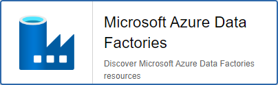

import Tabs from '@theme/Tabs';
import TabItem from '@theme/TabItem';


## Pack Assets

### Templates

The Centreon Monitoring Connector **Azure Data Factory** brings a host template:

* Cloud-Azure-DataFactory-Factories-custom

It brings the following service templates:

| Service Alias       | Service Template                                          | Service Description                   | Default |
|:--------------------|:----------------------------------------------------------|:--------------------------------------|:--------|
| Factory-Usage       | Cloud-Azure-DataFactory-Factories-Factory-Usage-Api       | Check factory size and entities       | X       |
| Integration-Runtime | Cloud-Azure-DataFactory-Factories-Integration-Runtime-Api | Check integration runtime utilization | X       |

### Discovery rules

The Centreon Monitoring Connector **Azure Data Factory** includes a Host Discovery provider to
automatically discover the Azure instances of a given subscription and add them
to the Centreon configuration. This provider is named **Microsoft Azure Data Factories**:



> This discovery feature is only compatible with the **api** custom mode. **azcli** is not supported.

More information about discovering hosts automatically is available on the [dedicated page](/docs/monitoring/discovery/hosts-discovery).

### Collected metrics & status

<Tabs groupId="sync">
<TabItem value="Factory-Usage" label="Factory-Usage">

| Metric Name                                    | Unit  |
|:-----------------------------------------------|:------|
| azdatafactory.factoryusage.size.bytes          | B     |
| azdatafactory.factoryusage.percentage          | %     |
| azdatafactory.factoryusage.resource.count      |       |
| azdatafactory.factoryusage.resource.percentage | %     |

</TabItem>
<TabItem value="Integration-Runtime" label="Integration-Runtime">

| Metric Name                                                   | Unit  |
|:--------------------------------------------------------------|:------|
| azdatafactory.integrationruntime.available.memory.bytes       | B     |
| azdatafactory.integrationruntime.available.node.number.count  |       |
| azdatafactory.integrationruntime.average.pickup.delay.seconds | s     |
| azdatafactory.integrationruntime.cpu.percentage.percent       | %     |
| azdatafactory.integrationruntime.queue.length.count           |       |

</TabItem>
</Tabs>

## Prerequisites

Please find all the prerequisites needed for Centreon to get information from Azure on the [dedicated page](../getting-started/how-to-guides/azure-credential-configuration.md).

## Setup

### Monitoring Pack

If the platform uses an *online* license, you can skip the package installation
instruction below as it is not required to have the pack displayed within the
**Configuration > Monitoring Connector Manager** menu.
If the platform uses an *offline* license, install the package on the **central server**
with the command corresponding to the operating system's package manager:

<Tabs groupId="sync">
<TabItem value="Alma / RHEL / Oracle Linux 8" label="Alma / RHEL / Oracle Linux 8">

```bash
dnf install centreon-pack-cloud-azure-datafactory-factories
```

</TabItem>
<TabItem value="CentOS 7" label="CentOS 7">

```bash
yum install centreon-pack-cloud-azure-datafactory-factories
```

</TabItem>
<TabItem value="Debian 11" label="Debian 11">

```bash
apt install centreon-pack-cloud-azure-datafactory-factories
```

</TabItem>
</Tabs>

Whatever the license type (*online* or *offline*), install the **Azure Data Factory** Pack through
the **Configuration > Monitoring Connector Manager** menu.

### Plugin

Since Centreon 22.04, you can benefit from the 'Automatic plugin installation' feature.
When this feature is enabled, you can skip the installation part below.

You still have to manually install the plugin on the poller(s) when:
- Automatic plugin installation is turned off
- You want to run a discovery job from a poller that doesn't monitor any resource of this kind yet

> More information in the [Installing the plugin](/docs/monitoring/pluginpacks/#installing-the-plugin) section.

Use the commands below according to your operating system's package manager:

<Tabs groupId="sync">
<TabItem value="Alma / RHEL / Oracle Linux 8" label="Alma / RHEL / Oracle Linux 8">

```bash
dnf install centreon-plugin-Cloud-Azure-DataFactory-Api
```

</TabItem>
<TabItem value="CentOS 7" label="CentOS 7">

```bash
yum install centreon-plugin-Cloud-Azure-DataFactory-Api
```

</TabItem>
<TabItem value="Debian 11" label="Debian 11">

```bash
apt install centreon-plugin-cloud-azure-datafactory-api
```

</TabItem>
</Tabs>

## Configuration

### Host

* Log into Centreon and add a new host through **Configuration > Hosts**.
* In the **IP Address/DNS** field, set the following IP address: **127.0.0.1**.
* Apply the **Cloud-Azure-DataFactory-Factories-custom** template to the host.
* Once the template is applied, fill in the corresponding macros. Some macros are mandatory.
These mandatory macros differ depending on the custom mode used.

> Two methods can be used to set the macros:

>> * Full ID of the Resource (`/subscriptions/<subscription_id>/resourceGroups/<resourcegroup_id>/providers/XXXXX/XXXXX/<resource_name>`)
in **AZURERESOURCE**
> * Resource name in the **AZURERESOURCE** macro, and resource group name in the **AZURERESOURCEGROUP** macro.

<Tabs groupId="sync">
<TabItem value="Azure Monitor API" label="Azure Monitor API">

| Mandatory   | Macro              | Description                                   |
|:------------|:-------------------|:----------------------------------------------|
| X           | AZUREAPICUSTOMMODE | Custom mode **api**                           |
| X           | AZURECLIENTID      | Client ID                                     |
| X           | AZURECLIENTSECRET  | Client secret                                 |
| X           | AZURERESOURCE      | ID or name of the Azure Data Factory resource |
| X           | AZURERESOURCEGROUP | Resource group name if resource name is used  |
| X           | AZURESUBSCRIPTION  | Subscription ID                               |
| X           | AZURETENANT        | Tenant ID                                     |

</TabItem>
</Tabs>

## How to check in the CLI that the configuration is OK and what are the main options for?

Once the plugin is installed, log into your Centreon poller's CLI using the
**centreon-engine** user account (`su - centreon-engine`) and test the plugin by
running the following command:

```bash
/usr/lib/centreon/plugins//centreon_azure_datafactory_factories_api.pl \
    --plugin=cloud::azure::datafactory::factories::plugin \
    --mode=factory-usage \
    --custommode='api' \
    --resource='FACTORY001ABCD' \
    --resource-group='RSG1234' \
    --subscription='xxxxxxxxx' \
    --tenant='xxxxxxxxx' \
    --client-id='xxxxxxxxx' \
    --client-secret='xxxxxxxxx' \
    --proxyurl='' \
    --timeframe='' \
    --interval='' \
    --aggregation='' \
    --warning-factory-percentage-usage='' \
    --critical-factory-percentage-usage='' \
    --warning-resource-percentage-usage='' \
    --critical-resource-percentage-usage='' \
    --warning-factory-size='' \
    --critical-factory-size='' \
    --warning-resource-count='' \
    --critical-resource-count='' \
    --use-new-perfdata
```

The expected command output is shown below:

```bash
OK: Instance 'FACTORY001ABCD' Statistic 'maximum' Metrics Factory size: 40.00GB, Factory usage: 30.00%, Resource count: 10.00, Resource usage: 25.00% | 'FACTORY001ABCD~maximum#azdatafactory.factoryusage.size.bytes'=40.00GB;;;0; 'FACTORY001ABCD~maximum#azdatafactory.factoryusage.percentage'=30.00%;;;0;100 'FACTORY001ABCD~maximum#azdatafactory.factoryusage.resource.count'=10.00;;;0; 'FACTORY001ABCD~maximum#azdatafactory.factoryusage.resource.percentage'=25.00%;;;0;100
```

All available options for a given mode can be displayed by adding the
`--help` parameter to the command:

```bash
/usr/lib/centreon/plugins//centreon_azure_datafactory_factories_api.pl \
    --plugin=cloud::azure::datafactory::factories::plugin \
    --mode=factory-usage \
    --help
```

All available modes can be displayed by adding the `--list-mode` parameter to
the command:

```bash
/usr/lib/centreon/plugins//centreon_azure_datafactory_factories_api.pl \
    --plugin=cloud::azure::datafactory::factories::plugin \
    --list-mode
```

### Troubleshooting

Please find the troubleshooting documentation for the API-based plugins in
this [chapter](../getting-started/how-to-guides/troubleshooting-plugins.md#http-and-api-checks).