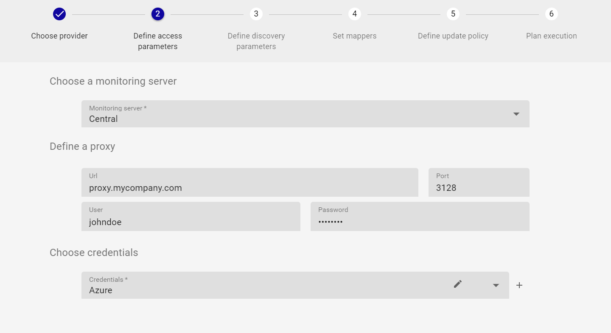
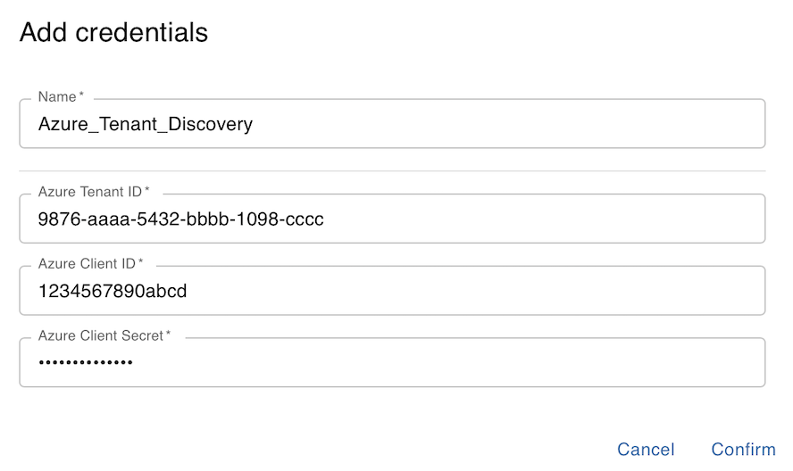
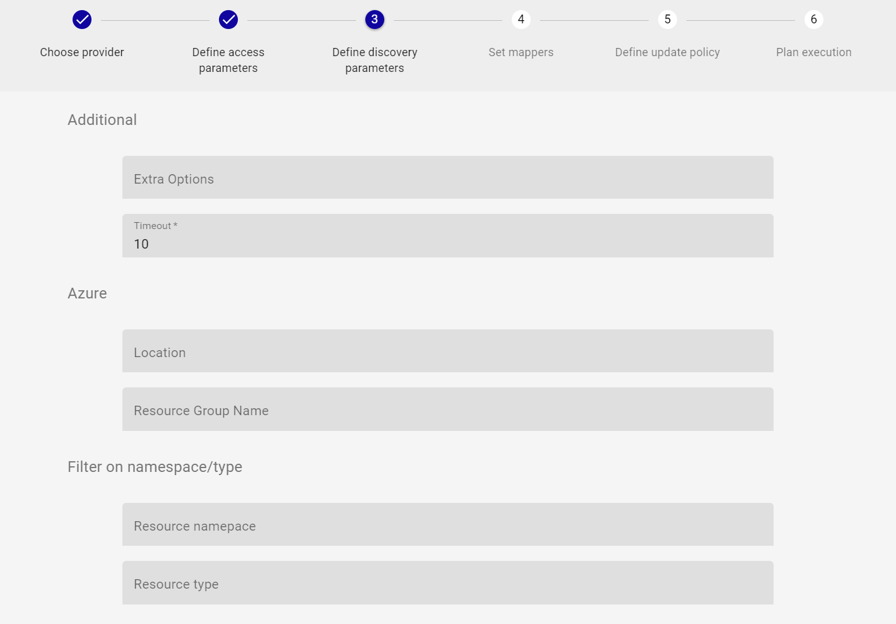
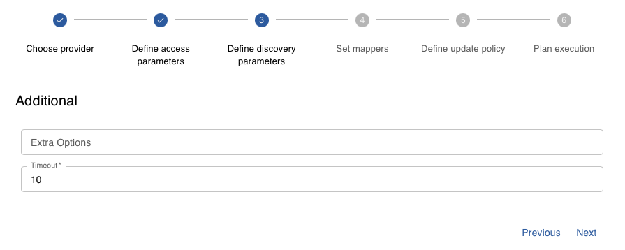
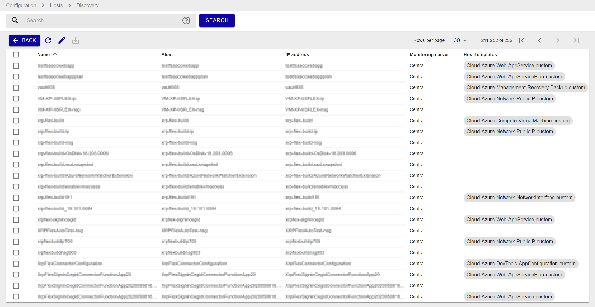

import Tabs from '@theme/Tabs';
import TabItem from '@theme/TabItem';


## Overview

The Centreon Monitoring Connector *Azure Discover* allows you to discover a whole Azure infrastructure for a given
subscription or a given tenant.
This Pack relies on the Azure Monitor API to fetch the resources of the Azure infrastructure and on all of the Centreon Monitoring Connectors
for Azure to set templates and proper monitoring indicators for each type of resource.

> This Monitoring Connector is only compatible with the 'api' custom-mode. 'azcli' is not supported for this usage.

## Pack Assets

> The Centreon Monitoring Connector *Azure Discover* is only a *discovery* pack. It doesn't natively provide any templates nor
> indicators to monitor Azure resources

### Discovery rules

The Centreon Monitoring Connector *Azure Discover* includes two Host Discovery *providers*:
- **Microsoft Azure Management Discover** to automatically discover all of the Azure resources of a given subscription.
- **Azure Tenant Discovery** to discover all of the Azure resources for every subscription related to a particular tenant.

> These discovery rules are only compatible with the 'api' custom mode.

More information about the Host Discovery module is available in the Centreon documentation:
[Host Discovery](/docs/monitoring/discovery/hosts-discovery)

## Prerequisites

Please find all the prerequisites needed for Centreon to get information from Azure on the [dedicated page](../getting-started/how-to-guides/azure-credential-configuration.md).

## Setup 

<Tabs groupId="sync">
<TabItem value="Online License" label="Online License">

1. Install the Plugin on every Centreon Poller expected to discover Azure resources:

<Tabs groupId="sync">
<TabItem value="Alma / RHEL / Oracle Linux 8" label="Alma / RHEL / Oracle Linux 8">

``` shell
dnf install centreon-plugin-Cloud-Azure-Management-Discover-Api
```

</TabItem>
<TabItem value="Alma / RHEL / Oracle Linux 9" label="Alma / RHEL / Oracle Linux 9">

``` shell
dnf install centreon-plugin-Cloud-Azure-Management-Discover-Api
```

</TabItem>
<TabItem value="Debian 11 & 12" label="Debian 11 & 12">

```shell
apt install centreon-plugin-cloud-azure-management-discover-api
```

</TabItem>
</Tabs>

2. On the Centreon Web interface, install the *Azure Discover* Centreon Monitoring Connector on the **Configuration > Monitoring Connectors Manager** page.
You'll be prompted to install several other Azure Monitoring Connectors as dependencies (they will be used to set the proper templates/indicators
on the discovered elements).

</TabItem>
<TabItem value="Offline License" label="Offline License">

1. Install the Plugin on every Centreon Poller expected to discover Azure resources:

<Tabs groupId="sync">
<TabItem value="Alma / RHEL / Oracle Linux 8" label="Alma / RHEL / Oracle Linux 8">

``` shell
dnf install centreon-plugin-Cloud-Azure-Management-Discover-Api
```

</TabItem>
<TabItem value="Alma / RHEL / Oracle Linux 9" label="Alma / RHEL / Oracle Linux 9">

``` shell
dnf install centreon-plugin-Cloud-Azure-Management-Discover-Api
```

</TabItem>
<TabItem value="Debian 11 & 12" label="Debian 11 & 12">

```shell
apt install centreon-plugin-cloud-azure-management-discover-api
```

</TabItem>
</Tabs>

2. Install the Centreon Monitoring Connector RPM on the Centreon Central server, install all of the Centreon Monitoring Connectors for Azure, in order
to make all the dependencies available:

<Tabs groupId="sync">
<TabItem value="Alma / RHEL / Oracle Linux 8" label="Alma / RHEL / Oracle Linux 8">

``` shell
dnf install centreon-pack-cloud-azure\*
```

</TabItem>
<TabItem value="Alma / RHEL / Oracle Linux 9" label="Alma / RHEL / Oracle Linux 9">

``` shell
dnf install centreon-pack-cloud-azure\*
```

</TabItem>
<TabItem value="Debian 11 & 12" label="Debian 11 & 12">

```shell
apt install centreon-pack-cloud-azure\*
```

</TabItem>
</Tabs>

3. On the Centreon Web interface, install the *Azure Discover* Centreon Monitoring Connector on the **Configuration > Monitoring Connectors Manager** page.
You'll be prompted to install several other Azure Monitoring Connectors as dependencies (they will be used to set the proper templates/indicators
on the discovered elements).

</TabItem>
</Tabs>

## Set up a discovery job

> The general specifications and mechanics of the *Host Discovery* feature is available [here](/docs/monitoring/discovery/hosts-discovery)

### Access parameters

Create a new discovery job and select **Microsoft Azure Management Discover** or **Azure Tenant Discovery** as the provider. Click on *next* and set the authentication parameters
as well as optional access parameters:



- Select the **Centreon Poller** from where the discovery job will be launched
- If necessary, add an entreprise **proxy URL and port** to use to reach the Azure API
- Select the **Azure credentials profile** linked to the subscription to be used

The first time, a new credentials profile has to be created. You can do so by clicking the '+' button and set the proper Azure
authentication parameters:

<Tabs groupId="sync">
<TabItem value="Microsoft Azure Management Discover" label="Microsoft Azure Management Discover">


</TabItem>
<TabItem value="Azure Tenant Discovery" label="Azure Tenant Discovery">



</TabItem>
</Tabs>

> All of the fields of the *credentials* form must be filled.

Click on *confirm* then *next* to go to the next step of the wizard and adjust the discovery parameters.

### Discovery parameters

If necessary, adjust the following settings:

<Tabs groupId="sync">
<TabItem value="Microsoft Azure Management Discover" label="Microsoft Azure Management Discover">



- Azure Location/Resource Group: allows to filter the discovery on a specific *Location* or *Resource Group*
- Filter on namespace/type: only discovers elements of a given namespace/type relative to Azure resources, for example:
    - *Resource namespace*: 'Microsoft.Compute'
    - *Resource type*: 'virtualMachines'
    > ** Warning ** To use this filter, it's mandatory to fill **both** *Resource namespace* and *Resource type* fields

</TabItem>
<TabItem value="Azure Tenant Discovery" label="Azure Tenant Discovery">



</TabItem>
</Tabs>

> All the fields of this form are optional

### Run the discovery job and display results

The step 4 of the wizard allows to adjust and set **mappers** if necessary; the Monitoring Connector comes along with predefined **mappers** that
don't typically need to be changed. If you have a specific need and want to edit the **mappers** section, refer to 
[this documentation](/docs/monitoring/discovery/hosts-discovery#how-to-use-the-mappers) to do so.

Final steps 5 & 6 will allow you to define a specific policy about the data modeling of the discovered results. Although the default configuration
is usually enough to proceed, [this documentation](/docs/monitoring/discovery/hosts-discovery#define-analysis-and-update-policies) 
will help you to customize it if needed. Coming to step 6, just click on *finish* to launch the discovery job.

Once the discovery job complete, you can display the results by clicking on *job results*. All the available Host Templates
corresponding to the discovered Azure resources will be automatically set, like in the example below:



> Some discovered elements may come up without any predefined Host Template; this is usually due to the following reasons:
> - These elements are not supposed to be monitored (Azure *technical* assets or dependencies of other assets)
> - These ressources cannot yet be monitored using the Centreon Monitoring Connectors

Just select the elements you want to add to the Centreon configuration and click on *save*. And... you're done !

## Troubleshooting

### The Azure credentials have changed and the Plugin does not work anymore

The Plugin is using a cache file to keep connection information and avoid an authentication at each call. 
If some of the authentication parameters change, you must delete the cache file. 

The cache file can be found within  ```/var/lib/centreon/centplugins/``` folder with a name similar to azure_api_`<md5>_<md5>_<md5>_<md5>`.

### ```UNKNOWN: Login endpoint API returns error code 'ERROR_NAME' (add --debug option for detailed message)```

When I run my command I obtain the following error message:
```UNKNOWN: Login endpoint API returns error code 'ERROR_NAME' (add --debug option for detailed message)```.

It means that some parameters used to authenticate the API request are wrong. The 'ERROR_NAME' string gives 
some hints about where the problem stands. 

### ```UNKNOWN: 500 Can't connect to login.microsoftonline.com:443```

This error message means that the Centreon Plugin couldn't successfully connect to the Azure Login API. Check that no third party
device (such as a firewall) is blocking the request. A proxy connection may also be necessary to connect to the API.
