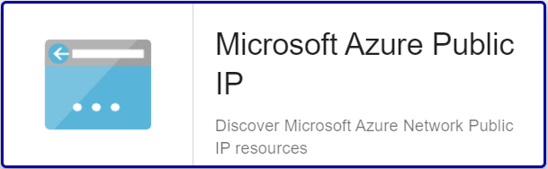

import Tabs from '@theme/Tabs';
import TabItem from '@theme/TabItem';


## Overview

Public IP addresses enable Azure resources to communicate to Internet and public-facing Azure services. The address is dedicated
to the resource, until it's unassigned by you. A resource without a public IP assigned can communicate outbound. Azure dynamically
assigns an available IP address that isn't dedicated to the resource.

The Centreon Monitoring Connector *Azure Public IP* can rely on Azure API or Azure CLI to collect the metrics related to the
Public IP service.

## Monitoring Connector Assets

### Monitored Objects

* Azure *Public IP* instances

### Discovery rules

The Centreon Monitoring Connector *Azure Public IP* includes a Host Discovery *provider* to automatically discover the Azure instances of a given
subscription and add them to the Centreon configuration.
This provider is named **Microsoft Azure Public IP**:



> This discovery feature is only compatible with the 'api' custom mode. 'azcli' is not supported yet.

More information about the Host Discovery module is available in the Centreon documentation:
[Host Discovery](/docs/monitoring/discovery/hosts-discovery)

### Collected Metrics

<Tabs groupId="sync">
<TabItem value="Ddos-Traffic" label="Ddos-Traffic">

| Metric name                          | Description                   | Unit    |
|:-------------------------------------|:------------------------------|:--------|
| publicip.ddos.dropped.bytes          | Inbound bytes dropped DDoS    | B       |
| publicip.ddos.forwarded.bytes        | Inbound bytes forwarded DDoS' | B       |
| publicip.ddos.inbound.bytes          | Inbound bytes DDoS            | B       |
| publicip.ddos.packets.countpersecond | Inbound packets dropped DDoS  | count/s |

</TabItem>
<TabItem value="Status" label="Status">

| Status name        | Description                                 |
|:-------------------|:--------------------------------------------|
| ddos-status        | Is the Public IP under Ddos attack          |
| provisioning-state | Current operational status of the Public IP |

</TabItem>
</Tabs>

## Prerequisites

Please find all the prerequisites needed for Centreon to get information from Azure on the [dedicated page](../getting-started/how-to-guides/azure-credential-configuration.md).

## Setup 

<Tabs groupId="sync">
<TabItem value="Online License" label="Online License">

1.  Install the Centreon package on every Centreon Poller expected to monitor Azure Public IP resources:

```bash
yum install centreon-plugin-Cloud-Azure-Network-PublicIP-Api
```

2. On the Centreon Web interface, install the *Azure Public IP* Centreon Monitoring Connector on the **Configuration > Monitoring Connector Manager** page

</TabItem>
<TabItem value="Offline License" label="Offline License">

1. Install the Centreon package on every Centreon Poller expected to monitor Azure Public IP resources:

```bash
yum install centreon-plugin-Cloud-Azure-Network-PublicIP-Api
```

2. Install the Centreon Monitoring Connector RPM on the Centreon Central server:

```bash
yum install centreon-pack-cloud-azure-network-publicip.noarch
```

3. On the Centreon Web interface, install the *Azure Public IP* Centreon Monitoring Connector on the **Configuration > Monitoring Connector Manager** page

</TabItem>
</Tabs>

## Configuration

### Host

* Log into Centreon and add a new Host through "Configuration > Hosts".
* In the *IP Address/FQDN* field, set the following IP address: '127.0.0.1'.

* Select the *Cloud-Azure-Network-PublicIP-custom* template to apply to the Host.
* Once the template applied, some Macros marked as 'Mandatory' hereafter have to be configured.
These mandatory Macros differ regarding the custom mode used:

<Tabs groupId="sync">
<TabItem value="Azure Monitor API" label="Azure Monitor API">

| Mandatory | Nom               | Description                  |
|:----------|:------------------|:-----------------------------|
| X         | AZURECUSTOMMODE   | Custom mode 'api'            |
| X         | AZURESUBSCRIPTION | Subscription ID              |
| X         | AZURETENANT       | Tenant ID                    |
| X         | AZURECLIENTID     | Client ID                    |
| X         | AZURECLIENTSECRET | Client secret                |
| X         | AZURERESOURCE     | Id of the Public IP instance |

</TabItem>
<TabItem value="Azure AZ CLI" label="Azure AZ CLI">

| Mandatory | Nom               | Description                  |
|:----------|:------------------|:-----------------------------|
| X         | AZURECUSTOMMODE   | Custom mode 'azcli'          |
| X         | AZURESUBSCRIPTION | Subscription ID              |
| X         | AZURERESOURCE     | Id of the Public IP instance |

</TabItem>
</Tabs>

## FAQ

### How to check in the CLI that the configuration is OK and what are the main options for ?

Once the Plugin installed, log into your Centreon Poller CLI using the *centreon-engine* 
user account and test the Plugin by running the following command:

```bash
/usr/lib/centreon/plugins/centreon_azure_network_publicip_api.pl \
    --plugin=cloud::azure::network::publicip::plugin \
    --mode=status \
    --custommode=api \
    --subscription='xxxxxxxxx' \
    --tenant='xxxxxxxxx' \
    --client-id='xxxxxxxxx' \
    --client-secret='xxxxxxxxx' \
    --resource='IPA001ABCD' \
    --timeframe='900' \
    --interval='PT5M' \
    --critical-provisioning-state='%\{state\} =~ /Failed/i' \
    --critical-ddos-status='%\{status\} =~ /DDOS Attack ongoing/i'
```

Expected command output is shown below:

```bash
OK: Public IP instance 'IPA001ABCD', IP: 1.2.3.4 (IPv4) current DDOS status: "OK", current provisioning state: "Succeeded" |
```

The command above collects the *status* of an Azure Public IP instance using the 'api' custom-mode
(```--plugin=cloud::azure::network::publicip::plugin --mode=status --custommode=api```).
This Public IP is identified by its id (```--resource='LBA001ABCD'```) and the authentication parameters
to be used with the custom mode are specified in the options (```--subscription='xxxxxxxxx' --tenant='xxxxxxx'
--client-id='xxxxxxxx' --client-secret='xxxxxxxxxx'```).

The calculated status would be based on the worst status collected of a 900 secondes / 15 min period (```--timeframe='900'```) sample
where a status would be fetched every 5 minutes (```--interval='PT5M'```).

This command would trigger a CRITICAL alarm in the following cases:
* The operational status of the resource is *Failed* (```--critical-provisioning-state='%{state} =~ /Failed/i'```)
* a DDOS attack on the Public IP is ongoing (```--critical-ddos-status='%{status} =~ /DDOS Attack ongoing/i'```)

All the available options for a given mode can be displayed by adding the ```--help``` parameter to the command:

```bash
/usr/lib/centreon/plugins/centreon_azure_network_publicip_api.pl \
    --plugin=cloud::azure::network::publicip::plugin \
    --mode=datapath \
    --help
```

### Troubleshooting

#### The Azure credentials have changed and the Plugin does not work anymore

The Plugin is using a cache file to keep connection information and avoid an authentication at each call. 
If some of the authentication parameters change, you must delete the cache file. 

The cache file can be found within  ```/var/lib/centreon/centplugins/``` folder with a name similar to azure_api_`<md5>_<md5>_<md5>_<md5>`.

#### ```UNKNOWN: Login endpoint API returns error code 'ERROR_NAME' (add --debug option for detailed message)```

When I run my command I obtain the following error message:
```UNKNOWN: Login endpoint API returns error code 'ERROR_NAME' (add --debug option for detailed message)```.

It means that some parameters used to authenticate the API request are wrong. The 'ERROR_NAME' string gives 
some hints about where the problem stands. 

As an example, if my Client ID or Client Secret are wrong, 'ERROR_DESC' value will be 'invalid_client'. 

#### ```UNKNOWN: 500 Can't connect to login.microsoftonline.com:443```

This error message means that the Centreon Plugin couldn't successfully connect to the Azure Login API. Check that no third party
device (such as a firewall) is blocking the request. A proxy connection may also be necessary to connect to the API.
This can be done by using this option in the command: ```--proxyurl='http://proxy.mycompany:8080'```.

#### ```UNKNOWN: No metrics. Check your options or use --zeroed option to set 0 on undefined values```

This command result means that Azure does not have any value for the requested period.
This result can be overriden by adding the ```--zeroed``` option in the command. This will force a value of 0 when no metric has
been collected and will prevent the UNKNOWN error message.
