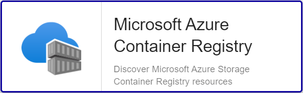

import Tabs from '@theme/Tabs';
import TabItem from '@theme/TabItem';


## Overview

Azure Container Registry is a managed, private Docker registry service based on the open-source Docker Registry 2.0. Create and maintain Azure
Container Registries to store and manage your private Docker container images and related artifacts.

The Centreon Plugin *Azure Container Registry* can rely on Azure API or Azure CLI to collect the metrics related to the *ACR* service.

## Pack Assets

### Monitored Objects

Available indicators and metrics:
* Azure Container Registries
     * Storage-usage

### Discovery rules

The Centreon Pack *Azure Container Registry* includes a Host Discovery provider to automatically discover the Azure instances of a given
subscription and add them to the Centreon configuration.
This provider is named **Microsoft Azure Container Registry**:



> This discovery feature is only compatible with the 'api' custom mode. 'azcli' is not supported.
More information about the Host Discovery module is available in the Centreon documentation:
[Host Discovery](/docs/monitoring/discovery/hosts-discovery)

### Collected metrics

<Tabs groupId="sync">
<TabItem value="Storage-usage" label="Storage-usage">

| Metric Name                                            | Description  | Unit |
|:-------------------------------------------------------|:-------------|:-----|
| *instance*#azure.containerregistry.storage.used.bytes  | Storage used | B    |

</TabItem>
</Tabs>

## Prerequisites

Please find all the prerequisites needed for Centreon to get information from Azure on the [dedicated page](../getting-started/how-to-guides/azure-credential-configuration.md).

## Setup 

<Tabs groupId="sync">
<TabItem value="Online License" label="Online License">

1. Install the Centreon package on every Centreon poller expected to monitor *Azure Container Registry* resources:

```bash
yum install centreon-plugin-Cloud-Azure-Storage-ContainerRegistry-Api
```

2. On the Centreon Web interface, install the *Azure Container Registry* Pack on the **Configuration > Monitoring Connector Manager** page.

</TabItem>
<TabItem value="Offline License" label="Offline License">

1. Install the Centreon package on every Centreon poller expected to monitor *Azure Container Registry* resources:

```bash
yum install centreon-plugin-Cloud-Azure-Storage-ContainerRegistry-Api
```

2. Install the Centreon Pack RPM on the Centreon Central server:

```bash
yum install centreon-pack-cloud-azure-storage-acr.noarch
```

3. On the Centreon Web interface, install the *Azure Container Registry* Pack on the **Configuration > Monitoring Connector Manager** page

</TabItem>
</Tabs>

## Configuration

### Host

* Log into Centreon and add a new Host through "Configuration > Hosts".
* In the *IP Address/FQDN* field, set the following IP address: '127.0.0.1'.

* Select the *Cloud-Azure-Storage-ContainerRegistry-custom* template to apply to the Host.
* Once the template applied, some Macros marked as 'Mandatory' hereafter have to be configured.
These mandatory Macros differ regarding the custom mode used.

> Two methods can be used to set the Macros:
> * full ID of the Resource (```/subscriptions/<subscription_id>/resourceGroups/<resourcegroup_id>/providers/Microsoft.ContainerRegistry/registries/<resource_name>```)
in *AZURERESOURCE*
> * Resource Name in *AZURERESOURCE* associated with Resource Group (in *AZURERESOURCEGROUP*) and Resource Type (in *AZURERESOURCETYPE*)

<Tabs groupId="sync">
<TabItem value="Azure Monitor API" label="Azure Monitor API">

| Mandatory | Nom                | Description                                        |
|:----------|:-------------------|:---------------------------------------------------|
| X         | AZURECUSTOMMODE    | Custom mode 'api'                                  |
| X         | AZURESUBSCRIPTION  | Subscription ID                                    |
| X         | AZURETENANT        | Tenant ID                                          |
| X         | AZURECLIENTID      | Client ID                                          |
| X         | AZURECLIENTSECRET  | Client secret                                      |
| X         | AZURERESOURCE      | ID or name of the Container Registry resource      |
|           | AZURERESOURCEGROUP | Associated Resource Group if resource name is used |

</TabItem>
<TabItem value="Azure AZ CLI" label="Azure AZ CLI">

| Mandatory | Nom                | Description                                        |
|:----------|:-------------------|:---------------------------------------------------|
| X         | AZURECUSTOMMODE    | Custom mode 'azcli'                                |
| X         | AZURESUBSCRIPTION  | Subscription ID                                    |
| X         | AZURERESOURCE      | ID or name of the Container Registry resource      |
|           | AZURERESOURCEGROUP | Associated Resource Group if resource name is used |

</TabItem>
</Tabs>

## How to check in the CLI that the configuration is OK and what are the main options for ?

Once the Plugin is installed, log into your Centreon Poller CLI using the **centreon-engine** 
user account (`su - centreon-engine`) and test the Plugin by running the following command:

```bash
/usr/lib/centreon/plugins/centreon_azure_storage_acr_api.pl \
    --plugin=cloud::azure::storage::acr::plugin \
    --mode=storage-usage \
    --custommode='api' \
    --subscription='xxxxxxxxx' \
    --tenant='xxxxxxxxx' \
    --client-id='xxxxxxxxx' \
    --client-secret='xxxxxxxxx' \
    --resource='ACR001ABCD' \
    --resource-group='RSG1234'
    --aggregation='Total' \
    --timeframe='3600' \
    --interval='PT1H' \
    --warning-storage-used='80000000000' \
    --critical-item-errors='90000000000'
 ```

Expected command output is shown below:

```bash
OK: Instance 'ACR001ABCD' Statistic 'total' Metrics Storage used: 74.86GB |
'ACR001ABCD~total#azure.containerregistry.storage.used.bytes'=80379853954.00B;0:70000000000;0:90000000000;0;
```

The command above checks the *storage usage* of an Azure *Container Registry* instance using the 'api' custom-mode
(```--plugin=cloud::azure::storage::acr::plugin --mode=storage-usage --custommode=api```).
This instance is identified by its id (```--resource='ACR001ABCD'```) and its associated group (```--resource-group='RSG1234'```).
The authentication parameters to be used with the custom mode are specified in the options (```--subscription='xxxxxxxxx'
--tenant='xxxxxxx' --client-id='xxxxxxxx' --client-secret='xxxxxxxxxx'```).

The fetched values are the total values (```--aggregation='Total'```) of a single sample based on a 3600 seconds / 1 hour period
(```--timeframe='3600' --interval='PT1H'```).

This command would trigger a WARNING alarm if the *storage usage* is reported as over 80GB (```--warning-storage-used='80000000000'```)
and a CRITICAL alarm over 90GB (```--critical-item-errors='90000000000'```).

All the available options for a given mode can be displayed by adding the ```--help``` parameter to the command:

```bash
/usr/lib/centreon/plugins/centreon_azure_storage_acr_api.pl \
    --plugin=cloud::azure::storage::acr::plugin \
    --mode=storage-usage  \
    --help
 ```

### Troubleshooting

Please find all the troubleshooting documentation for the API-based Plugins in the [dedicated chapter](../getting-started/how-to-guides/troubleshooting-plugins.md#http-and-api-checks)
of the Centreon documentation.
