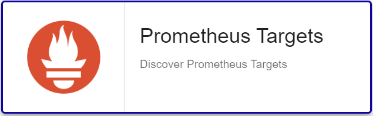

import Tabs from '@theme/Tabs';
import TabItem from '@theme/TabItem';


## Pack Assets

### Templates

The Centreon Monitoring Connector **Prometheus Server** brings 2 different host templates:

* Cloud-Prometheus-Api-custom
* Cloud-Prometheus-Target-Name-Api-custom

It brings the following service templates:

| Service Alias      | Service Template                        | Service Description                                          | Default |
| :----------------- | :-------------------------------------- | :----------------------------------------------------------- | :------ |
| Expression         | Cloud-Prometheus-Expression-Api         | Check allowing to execute queries and use results to define thresholds |         |
| Target-Name-Status | Cloud-Prometheus-Target-Name-Status-Api | Check targets status filtered by name                        | X       |
| Target-Status      | Cloud-Prometheus-Target-Status-Api      | Check targets status                                         | X       |

### Discovery rules

The Centreon Monitoring Connector **Prometheus Server** includes a Host Discovery provider to
automatically discover Prometheus targets.



### Collected metrics & status

<Tabs groupId="sync">
<TabItem value="Expression" label="Expression">

Generic mode to perform PromQL queries

| Metric Name | Unit |
| :---------- | :--- |
| status      |      |

</TabItem>
<TabItem value="Target-Name-Status" label="Target-Name-Status">

| Metric Name           | Unit  |
| :-------------------- | :---- |
| targets.active.count  | count |
| targets.down.count    | count |
| targets.dropped.count | count |
| targets.unknown.count | count |
| targets.up.count      | count |
| *targets*#status      |       |

</TabItem>
<TabItem value="Target-Status" label="Target-Status">

| Metric Name           | Unit  |
| :-------------------- | :---- |
| targets.active.count  | count |
| targets.down.count    | count |
| targets.dropped.count | count |
| targets.unknown.count | count |
| targets.up.count      | count |
| *targets*#status      |       |

</TabItem>
</Tabs>

## Prerequisites

The Centreon Poller should be able to perform queries against Prometheus API over
HTTP. 

## Setup

<Tabs groupId="sync">
<TabItem value="Online License" label="Online License">

1. Install the package on every Centreon poller expected to monitor **Prometheus Server** resources:

```bash
yum install centreon-plugin-Cloud-Prometheus-Api
```

2. On the Centreon web interface, on page **Configuration > Monitoring Connector Manager**, install the **Prometheus Server** Centreon Monitoring Connector.

</TabItem>
<TabItem value="Offline License" label="Offline License">

1. Install the package on every Centreon poller expected to monitor **Prometheus Server** resources:

```bash
yum install centreon-plugin-Cloud-Prometheus-Api
```

2. Install the **Prometheus Server** Centreon Monitoring Connector RPM on the Centreon central server:

```bash
yum install centreon-pack-cloud-prometheus-api
```

3. On the Centreon web interface, on page **Configuration > Monitoring Connector Manager**, install the **Prometheus Server** Centreon Monitoring Connector.

</TabItem>
</Tabs>

## Configuration

### Host

<Tabs groupId="sync">
<TabItem value="Cloud-Prometheus-Api-Custom" label="Cloud-Prometheus-Api-Custom">

Template to monitor Prometheus server.

* Log into Centreon and add a new host through **Configuration > Hosts**.
* Fill the **Name**, **Alias** & **IP Address/DNS** fields according to your **Prometheus Server** server settings.
* Apply the **Cloud-Prometheus-Api-custom** template to the host.
* Once the template is applied, fill in the corresponding macros. Some macros are mandatory.

| Mandatory | Macro              | Description                                      |
| :---------- | :-------------------- | :----------------------------------------------------------- |
|             | EXTRAOPTIONS          | Any extra option you may want to add to every command line (eg. a --verbose flag) |
| X           | PROMETHEUSAPIPORT     | (Default : '9090')                                            |
| X           | PROMETHEUSAPIPROTO    | (Default : 'http')                                            |
| X           | PROMETHEUSAPIURL      | (Default : '/api/v1')                                         |

</TabItem>

<TabItem value="Cloud-Prometheus-Target-Name-Api-Custom" label="Cloud-Prometheus-Target-Name-Api-Custom">

Template to monitor Prometheus targets.

* Log into Centreon and add a new host through **Configuration > Hosts**.
* Fill the **Name**, **Alias** & **IP Address/DNS** fields according to your **Prometheus target** server settings.
* Apply the **Cloud-Prometheus-Target-Name-Api-Custom** template to the host.
* Once the template is applied, fill in the corresponding macros. Some macros are mandatory.

| Mandatory | Macro              | Description                                      |
| :---------- | :-------------------- | :----------------------------------------------------------- |
|             | EXTRAOPTIONS          | Any extra option you may want to add to every command line (eg. a --verbose flag) |
| X           | FILTERLABEL           | Filter label to filter on a specific target. Example: 'instance,10.10.1.199:9182'                       |
| X           | PROMETHEUSAPIHOSTNAME | Prometheus server name or IP address                         |
| X           | PROMETHEUSAPIPORT     | (Default : '9090')                                            |
| X           | PROMETHEUSAPIPROTO    | (Default : 'http')                                            |
| X           | PROMETHEUSAPIURL      | (Default : '/api/v1')                                         |

</TabItem>
</Tabs>

## FAQ

### How to check in the CLI that the configuration is OK and what are the main options for ?

> Note: The test below assumes that you are using the Monitoring Connector on top of a Prometheus Server.

Once the Plugin installed, log into your Centreon Poller CLI using the *centreon-engine* 
user account and test the Plugin by running the following command:

```bash
/usr/lib/centreon/plugins//centreon_prometheus_api.pl \
    --plugin=cloud::prometheus::restapi::plugin \
    --mode=target-status \
    --hostname=amzprometheus.int.centreon.com \
    --url-path='/api/v1' --port='9090' --proto='http' \
    --filter-label='job,coredns' \
    --warning-status='' --critical-status='%{health} !~ /up/' 
```

Expected command output is shown below:

```bash
OK: Targets Active: 2, Dropped: 175, Up: 2, Down: 0, Unknown: 0 - All targets status are ok | 'targets.active.count'=2;;;0; 'targets.dropped.count'=175;;;0; 'targets.up.count'=2;;;0; 'targets.down.count'=0;;;0; 'targets.unknown.count'=0;;;0;
Target 'http://10.244.1.249:9153/metrics' health is 'up' [pod = coredns-74ff55c5b-g4hmt][namespace = kube-system][service = prometheus-operator-coredns][instance = 10.244.1.249:9153][job = coredns][endpoint = http-metrics]
Target 'http://10.244.2.5:9153/metrics' health is 'up' [pod = coredns-74ff55c5b-vh9zt][namespace = kube-system][service = prometheus-operator-coredns][instance = 10.244.2.5:9153][job = coredns][endpoint = http-metrics]
```

The command above check the status of the targets (`--mode=target-status`) linked 
to a Prometheus server (`--hostname=amzprometheus.int.centreon.com`)  exposing its API 
over HTTP and listnening on port 9090 (`--port='9090' --proto='http'`). 

Only targets linked with the coredns job label are checked (`--filter-label='job,coredns'`). 

The command triggers a CRITICAL if any of the Target status is not equal to "up". 

### How to use the generic Expression mode ?

> Note: The mode below can be used with Host that are not Prometheus Server even if the metric collection use it. The Host must inherit from the *Cloud-Prometheus-Api-custom* Template and the Service needs to be created manually using the *Cloud-Prometheus-Expression-Api-custom* Service Template.

Nothing is better than a clear example to understand how the Expression generic mode works:

```bash
/usr/lib/centreon/plugins//centreon_prometheus_api.pl \
    --plugin=cloud::prometheus::restapi::plugin \
    --mode=expression \
    --hostname=amzprometheus.int.centreon.com \
    --url-path='/api/v1' --port='9090' --proto='http' \
    --query='cpu_requests,sum by (node) (kube_pod_container_resource_requests_cpu_cores) / sum by (node) (kube_node_status_capacity_cpu_cores) * 100' \
    --output='%{instance} CPU Requests: %{cpu_requests}%' --multiple-output='Nodes CPU Requests within bounds' \
    --instance='node' \
    --warning-status='%{cpu_requests} > 60' --critical-status='%{cpu_requests} > 70' \
    --use-new-perfdata --verbose 
```

#### `--query` option and QUERIES macro

The `--query` option allows to define two things:

- the Centreon metric name (`cpu_requests`)
- the PromQL query (`sum by (node) (kube_pod_container_resource_requests_cpu_cores) / sum by (node) (kube_node_status_capacity_cpu_cores) * 100`)

In the Service definition, you can specify several queries that's why the QUERIES macro 
exceptionnaly includes the option definition. Here, QUERIES value would be "--query='cpu_requests,sum by (node) (kube_pod_container_resource_requests_cpu_cores) / sum by (node) (kube_node_status_capacity_cpu_cores) * 100'". 

#### `--instance` option and INSTANCE macro

The instance option explicits the Prometheus metric dimension/label the Plugin will highlight 
in the graphs (`--instance='node'`). The INSTANCE macro value would be "node" in this example. 

#### `--multiple-output`/`--output` options and MULTIPLEOUTPUT/OUTPUT macros

The output-related options gives ability to tune output messages of the
check in the following cases:

- Check a metric on multiple instances
- Check returning an error

Values can be specified through the corresponding macros, in this example the value of OUTPUT macro
would be "%{instance} CPU Requests: %{cpu_requests}%". Note that we use the Centreon label defined in the `--query`
option to use the obtained value). We also use the '%{instance}' keyword to display the node name. 

The MULTIPLEOUTPUT value would be "Nodes CPU Requests within bounds"

#### `--\*-status` options and \*STATUS macros 

--warning-status and --critical-status purpose is to define when the Plugin will raise an alert. 

In the command above, the check triggers a *WARNING* alarm when the 'cpu_requests' value is above 60 and a 
*CRITICAL* one when it is above 70. 

Note that the Centreon label defined in the `--query` options is used again to compare 
the obtained value with thresholds. 

The macros value would be '%{cpu_requests} > 60' for WARNINGSTATUS and '%{cpu_requests} > 70' 
for CRITICALSTATUS.

#### Expected output and macros summary

If everything is OK, a output similar to the one below should be displayed: 

```bash
OK: Nodes CPU Requests within bounds | 'amzkubemaster.int.centreon.com#cpu_requests'=37.5;;;; 'amzkubenode1.int.centreon.com#cpu_requests'=35;;;; 'amzkubenode2.int.centreon.com#cpu_requests'=30;;;;
amzkubemaster.int.centreon.com CPU Requests: 37.5%
amzkubenode1.int.centreon.com CPU Requests: 35%
amzkubenode2.int.centreon.com CPU Requests: 30%
```

Here is a summary of the Service's macros definitions: 

| Nom               | Value                                                  |
|:----------------- |:------------------------------------------------------ |
| QUERIES           | --query='cpu_requests,sum by (node) (kube_pod_container_resource_requests_cpu_cores) / sum by (node) (kube_node_status_capacity_cpu_cores) * 100'                     |
| INSTANCE          | node                                                   |
| OUTPUT            | URL Path to reach API (Default: '/api/v1)              |
| MULTIPLEOUTPUT    | Nodes CPU Requests within bounds                       |
| WARNINGSTATUS     | %{cpu_requests} > 60                                   |
| CRITICALSTATUS    | %{cpu_requests} > 70                                   |
| EXTRAOPTIONS      | --verbose --use-new-perfdata                           |

## Troubleshooting

### UNKNOWN: 500 Can't connect to amzprometheus.int.centreon.com:9090 (<error_text) |

When facing this error message, check that port, hostname are OK and double check the 
connection between your Centreon Poller and the Prometheus Server. 

The <error_text> should give more information about the root cause 

### UNKNOWN: 400 Bad Request |

The PromQL query expression is invalid. Check that it works within the Prometheus WebUI. 

### Troubleshooting

Please find the troubleshooting documentation for the API-based plugins in
this [chapter](../getting-started/how-to-guides/troubleshooting-plugins.md#http-and-api-checks).

