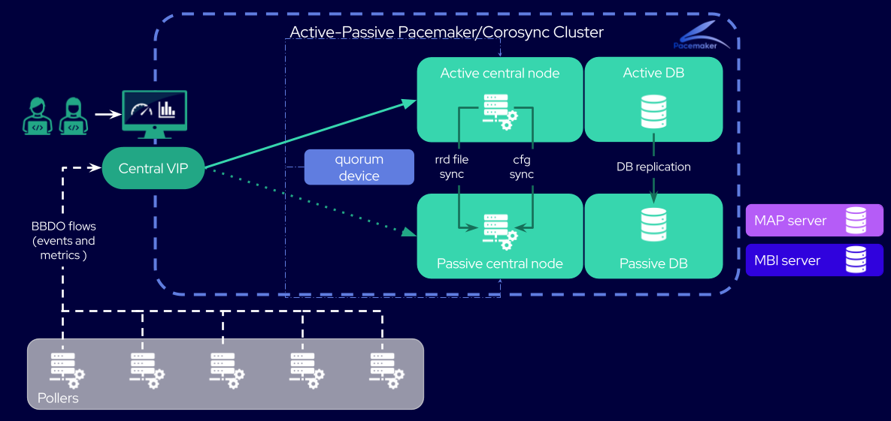

import { Tabs } from '@rspress/core/theme';
import { Tab } from '@rspress/core/theme';

If your platform only handles small volumes of data, where databases are hosted on central servers, Centreon can set up a "simplified" HA. In the event of a problem, the central server and database switch over simultaneously, thanks to a colocation constraint.

The threshold below which the databases can be integrated into the central servers is the same as for a standard Centreon platform (see [the decision tree on the **Architectures** page](../architectures.md#what-kind-of-architecture-do-you-need)).

## Diagram of a simplified HA architecture



## Elements of a simplified HA architecture

In its simplified version, the HA cluster is a 2-node cluster. It includes:
* 2 central servers, each with its own integrated database
* a quorum device, that decides which central server is the active node.

## Differences with a 4-node HA architecture

All the procedures described [in the HA section of this documentation](centreon-ha.md) are also correct for a 2-node HA, except for the following points:

* The `pcs status` command will return a message like this one:

```shell
Cluster Summary:
  * Stack: corosync
  * Current DC: @CENTRAL_ACTIVE_NAME@ (version 2.0.5-9.0.1.el8_4.1-ba59be7122) - partition with quorum
  * Last updated: Wed Sep 15 16:35:47 2021
  * Last change:  Wed Sep 15 10:41:50 2021 by root via crm_attribute on @CENTRAL_ACTIVE_NAME@
  * 2 nodes configured
  * 14 resource instances configured
Node List:
  * Online: [ @CENTRAL_ACTIVE_NAME@ @CENTRAL_PASSIVE_NAME@ ]
Full List of Resources:
  * Clone Set: ms_mysql-clone [ms_mysql] (promotable):
    * Masters: [ @CENTRAL_ACTIVE_NAME@ ]
    * Slaves: [ @CENTRAL_PASSIVE_NAME@ ]
  * Clone Set: php-clone [php]:
    * Started: [ @CENTRAL_ACTIVE_NAME@ @CENTRAL_PASSIVE_NAME@ ]
  * Clone Set: cbd_rrd-clone [cbd_rrd]:
    * Started: [ @CENTRAL_ACTIVE_NAME@ @CENTRAL_PASSIVE_NAME@ ]
  * Resource Group: centreon:
    * vip       (ocf::heartbeat:IPaddr2):        Started @CENTRAL_ACTIVE_NAME@
    * http      (systemd:httpd):         Started @CENTRAL_ACTIVE_NAME@
    * gorgone   (systemd:gorgoned):      Started @CENTRAL_ACTIVE_NAME@
    * centreon_central_sync     (systemd:centreon-central-sync):         Started @CENTRAL_ACTIVE_NAME@
    * cbd_central_broker        (systemd:cbd-sql):       Started @CENTRAL_ACTIVE_NAME@
    * centengine        (systemd:centengine):    Started @CENTRAL_ACTIVE_NAME@
    * centreontrapd     (systemd:centreontrapd):         Started @CENTRAL_ACTIVE_NAME@
    * snmptrapd (systemd:snmptrapd):     Started @CENTRAL_ACTIVE_NAME@
```

* The only constraints to be defined are those that link each central server to its database, so that failovers are simultaneous.
The output of the `pcs constraint` command should look like this:

```shell
Location Constraints:
Ordering Constraints:
Colocation Constraints:
  centreon with ms_mysql-clone (score:INFINITY) (rsc-role:Started) (with-rsc-role:Master)
  ms_mysql-clone with centreon (score:INFINITY) (rsc-role:Master) (with-rsc-role:Started)
Ticket Constraints:
```

* There are no VIPs for databases, as these are integrated into the central nodes.
