### Hostgroups-Host-Templates

#### Description

This report displays information on the hosts in the reporting
datawarehouse, their parent template, relation to groups and categories
and creation date. You can filter on host groups and categories.

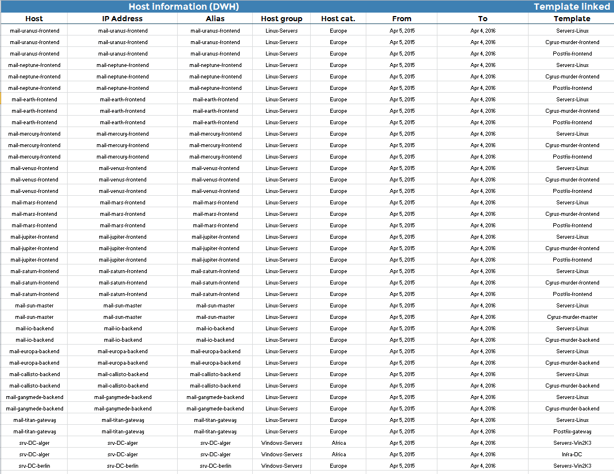

The table below shows the links between host templates:

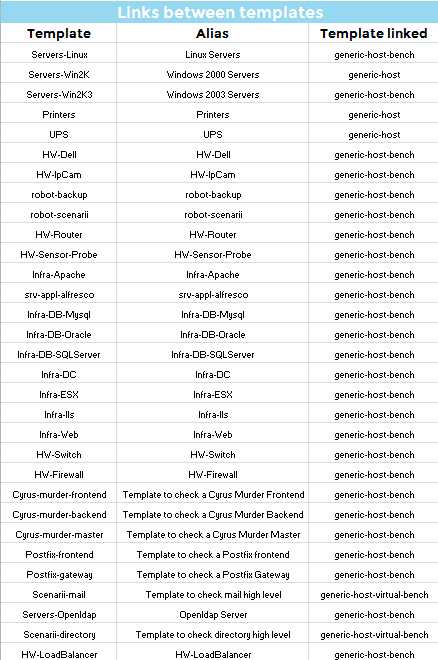

The following table shows the link between service and host templates:

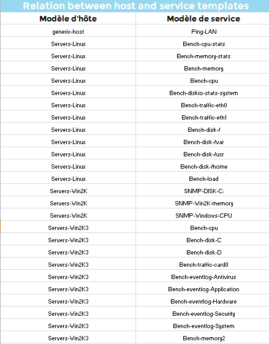

The following table presents an overview of the host templates and their
check and notification properties:

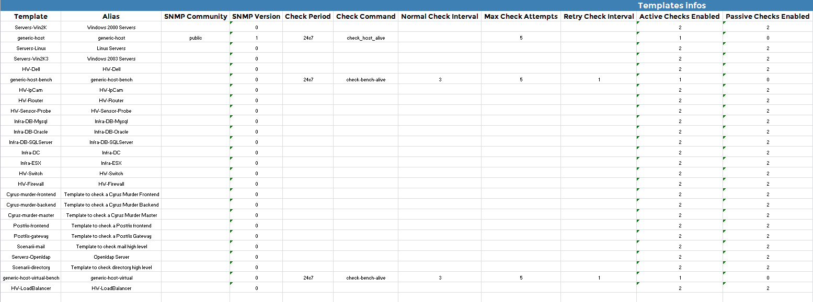

#### Parameters

Parameters required for the report:

- The reporting period
- The following Centreon objects:

| Parameter       | Parameter type | Description             |
|-----------------|----------------|-------------------------|
| Hostgroups      | Multi select   | Select host groups.     |
| Host Categories | Multi select   | Select host categories. |

### Hostgroups-Service-Templates

#### Description

This report displays information on the services in the reporting
datawarehouse, their parent template, their relationship with groups and
categories, and creation date. You can filter on host groups, host
categories and service categories.

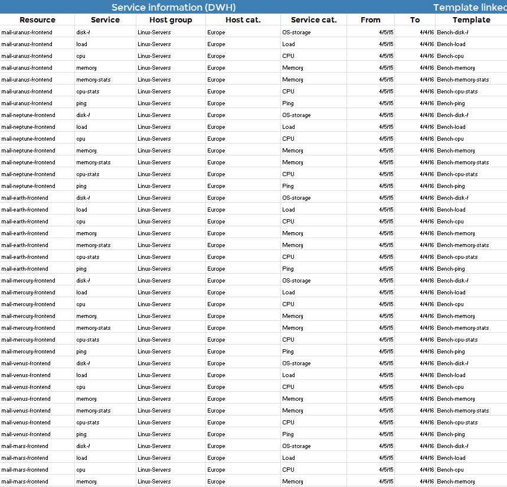

The table below shows the links between host templates:

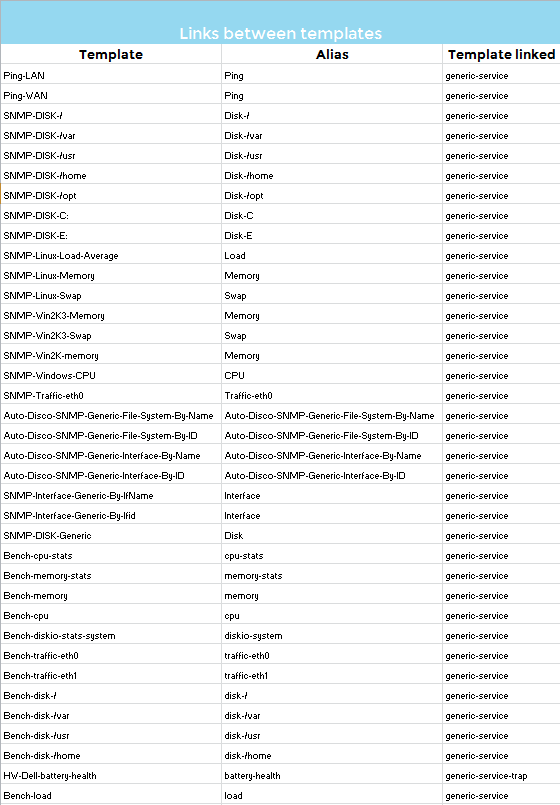

The following table shows the link between host and service templates:

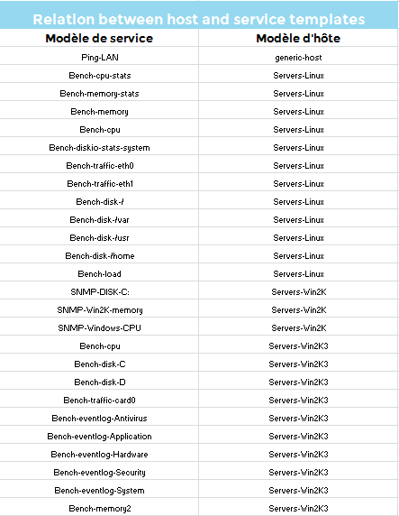

The following table presents an overview of the service templates and
their check and notification properties:

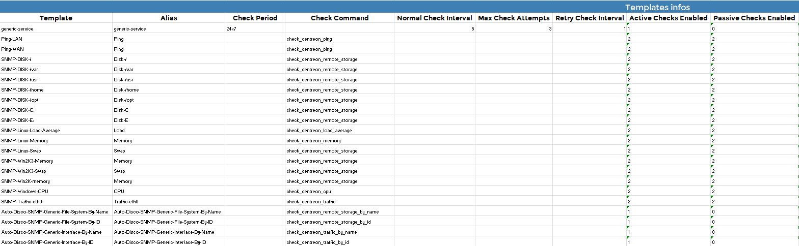

#### Parameters

Parameters expected by the report are:

- The reporting period
- The following Centreon objects:

| Parameter          | Parameter type | Description                |
|--------------------|----------------|----------------------------|
| Hostgroups         | Multi select   | Select host groups.        |
| Host Categories    | Multi select   | Select host categories.    |
| Service Categories | Multi select   | Select service categories. |

### Poller-Performances

#### Description

This report displays information on the configuration and performance of
the Centreon Engine running on a poller.

#### How to interpret the report

The poller name, IP address, version number and state of the engine, and
date of the last restart are displayed in the first part of the report.

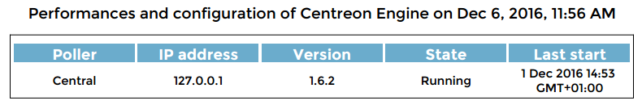

The report then shows the status of the hosts and services monitored by
the poller.

Statistics on latencies and execution times are presented along with the
hosts and services that exceed tolerated thresholds.

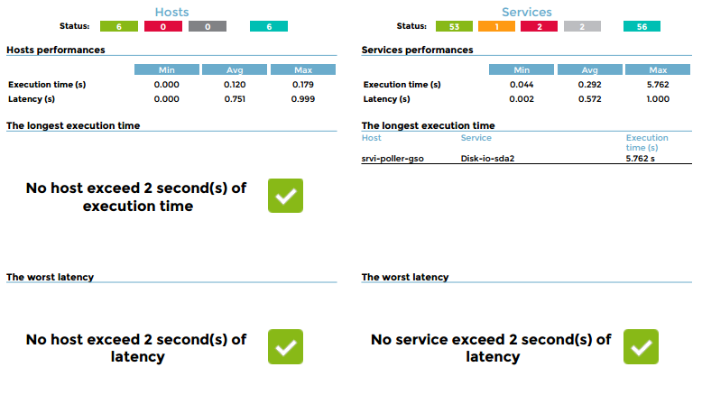

Finally, the report displays the current configuration of the Centreon
Engine and offers tips to optimize it (in case of performance issues).

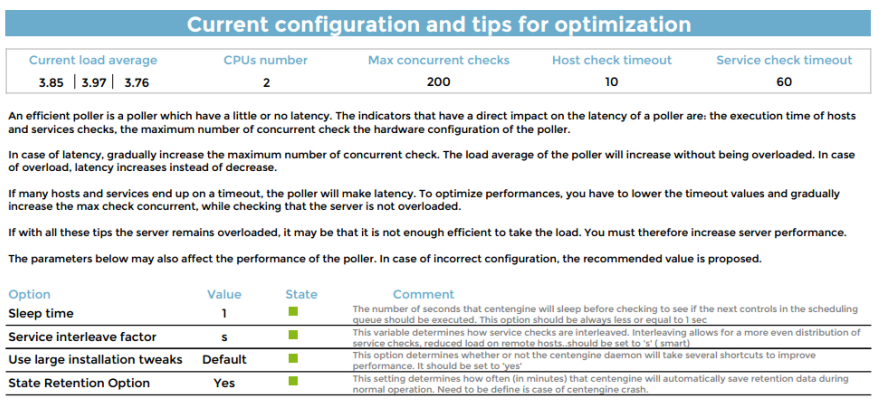

#### Parameters

The data appearing in the report is real-time data.

Parameters required for the report:

- The following Centreon objects:

| Parameter                       | Type         | Description                                                                            |
|---------------------------------|--------------|----------------------------------------------------------------------------------------|
| Select poller(s) for the report | Radio button | Generate the report on the central poller, the remote pollers, or all pollers.         |
| Limit latency (sec)             | Text field   | Specify latency threshold. Hosts / services exceeding the threshold are listed.        |
| Limit execution time (sec)      | Text field   | Specify execution time threshold. Hosts / services exceeding the threshold are listed. |

#### Prerequisites

The prerequisites for this report are:

- Monitoring of the load average on the pollers (metric names should
  be: load1, load5 and load15)
- Monitoring of the CPU on the poller (metric names should contain
  *cpu* string with the core number. Example: for a 4 core CPU,
  metrics can be cpu0,cpu1... or cpu\_0,cpu\_1...

### Hosts-not-classified

#### Description

This report displays all unclassified hosts. Information is represented
in two tables:

- One displays all hosts without a host group.
- The second displays all hosts without a host category.

A host without either a host group or a host category will appear in
both tables.

Any changes to host classification will appear the day after the
change is made.

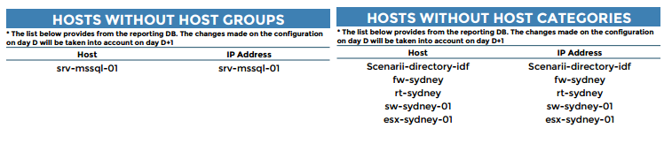

#### Parameters

This report requires no parameters.

#### Prerequisites

None.

### Services-not-classified

#### Description

This report displays all unclassified services. Information is
presented in a table.

Any changes to service classification will be appear the day after the
change is made.

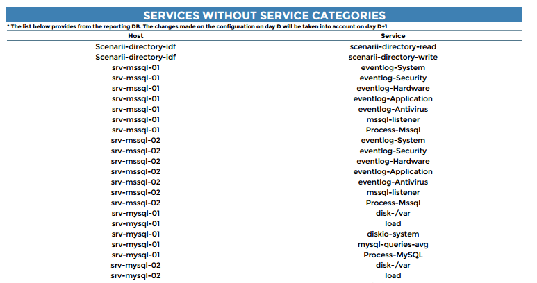

#### Parameters

This report requires no parameters.

#### Prerequisites

None.
