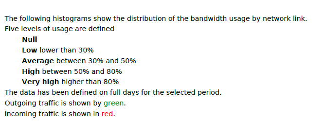
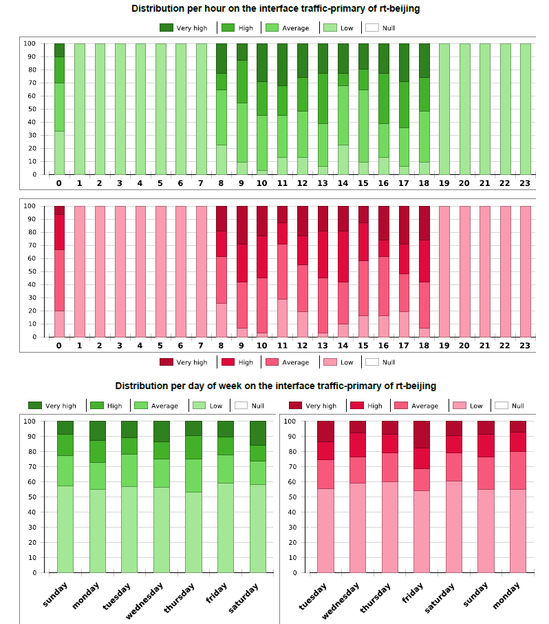
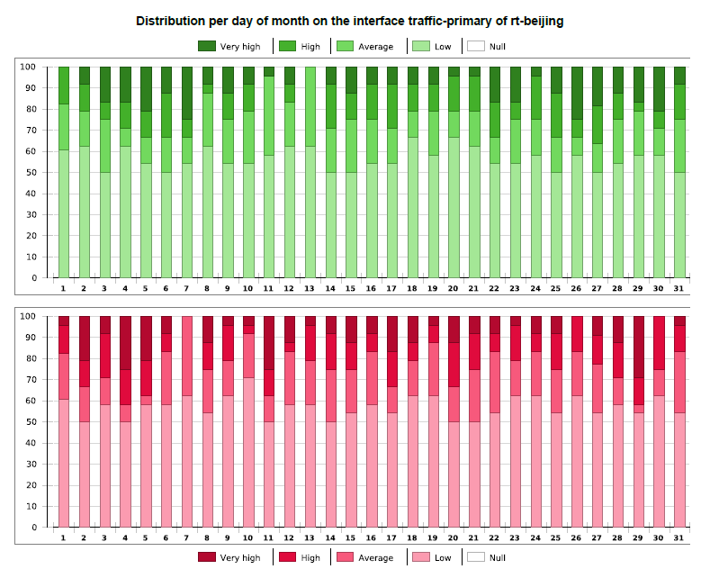
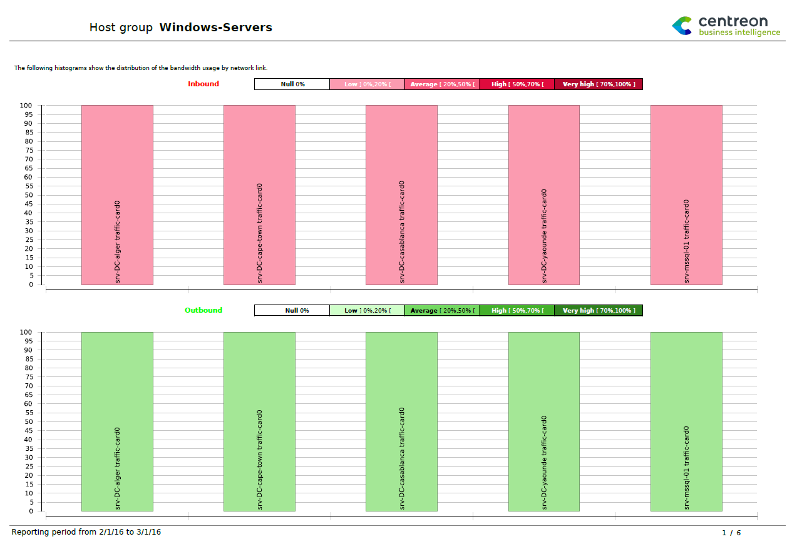
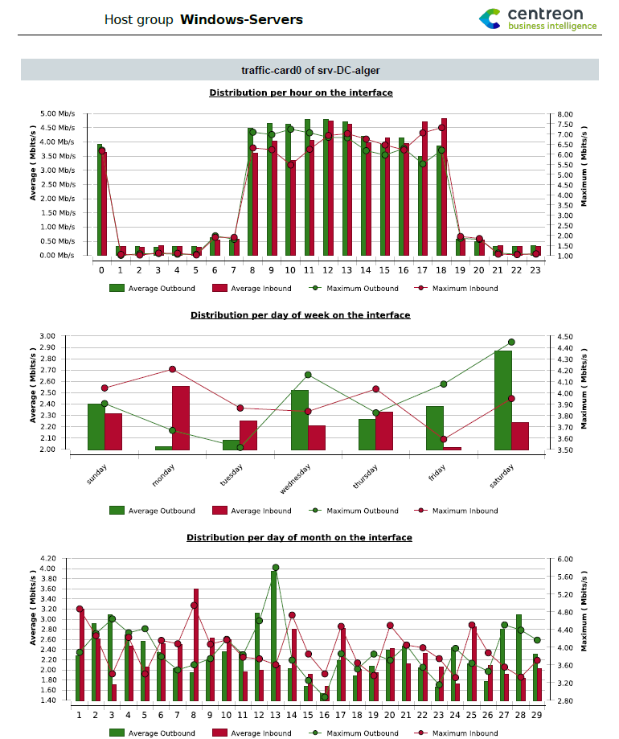
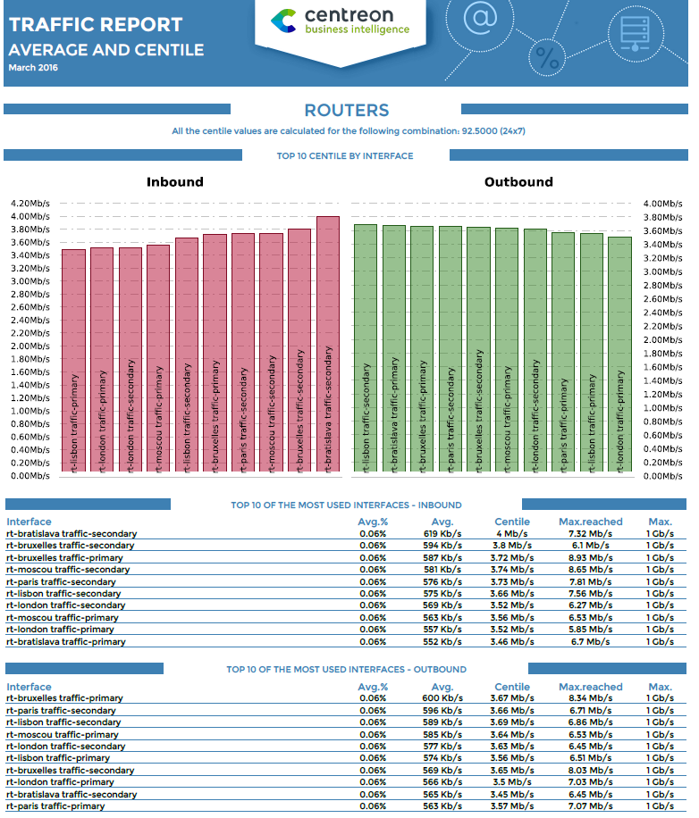
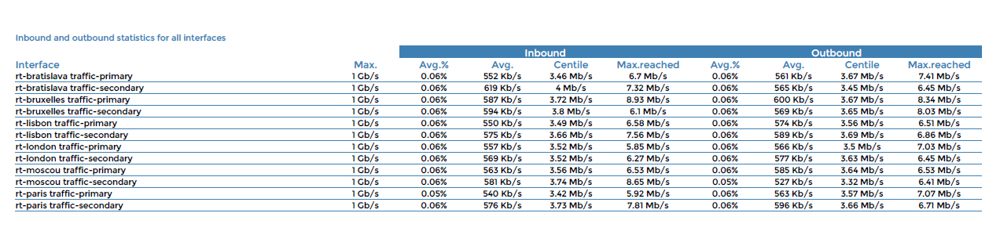

### Hostgroup-Traffic-By-Interface-And-Bandwith-Ranges

#### Description

This report shows the average inbound and outbound bandwidth usage of network
interfaces for a given host group.

#### How to interpret the report**

#### First page

The first page displays the bandwidth usage ranges in percentage by interval.

Intervals are:

- Null usage
- Low usage
- Average usage
- High usage
- Very high usage.

These intervals are configurable.



#### Following pages

The following pages are automatically generated for all interfaces of
the selected host group (one page per interface). Each page displays the
bandwidth usage by interval with distribution by:

- Hour of the day
- Day of the week
- Day of the month.





#### Parameters

Parameters required for the report:

- Reporting period
- The following Centreon objects:

| Parameter                   | Parameter type | Description                                                   |
|-----------------------------|----------------|---------------------------------------------------------------|
| Host Group                  | Dropdown list  | Select host group.                                            |
| Host Categories             | Multi select   | Select host categories.                                       |
| Service Categories          | Multi select   | Select service categories.                                    |
| Low-level threshold (%)      | Number         | Specify low threshold of bandwidth usage (between 0 and 100). |
| Average-level threshold (%) | Number         | Average threshold of bandwidth usage (between 0 and 100)       |
| High-level threshold (%)    | Number         | Specify high threshold of bandwidth usage (between 0 and 100) |
| Inbound traffic metric      | Dropdown list  | Specify metric of inbound traffic.                            |
| Outbound traffic metric     | Dropdown list  | Specify metric of outbound traffic.                           |

#### Prerequisites

For consistency in graphs and statistics, certain prerequisites apply to
performance data returned by the storage plugins. This data must be
formatted as follows, preceded by a pipe (|):

```text
output-plugin | traffic_in=valueunit;warning_treshold;critical_treshold;minimum;maximum traffic_out=value
```

Make sure the plugins return the maximum value, which is required in
order to calculate statistics. The storage plugins must return one
metric for **traffic in** and one for **traffic out**. Units must be in
**Bits**/**sec**.

### Hostgroup-Traffic-average-By-Interface

#### Description

This report shows the average inbound and outbound bandwidth usage of
network interfaces for a given host group.

#### How to interpret the report

#### First page

On the first page, we can see the distribution of bandwidth usage in
percent per interval.

Intervals are:

- Null usage
- Low usage
- Average usage
- High usage
- Very high usage.

These intervals are configurable.



#### Following pages

The following pages are automatically generated for all interfaces of
the selected host group (one page per interface). Each page dispays the
bandwidth distribution by:

**Hour of the day** displaying:

- The average usage by hour of the day of incoming and outgoing
  traffic for the selected reporting period.
- The maximum reached of incoming and outgoing traffic per hour of
  the day for the reporting period.

**Day of the week** displaying

- The average usage by day of the week of incoming and outgoing
  traffic for the selected reporting period.
- The maximum reached of incoming and outgoing traffic per day of
  the week for the reporting period.

**Day of the month** displaying

- The average usage by day of the month of incoming and outgoing
  traffic for the selected reporting period.
- The maximum reached of incoming and outgoing traffic per day of
  the month for the reporting period.



#### Parameters

Parameters required for the report:

- Reporting period
- The following Centreon objects:

| Parameter                  | Parameter type | Description                                                    |
|----------------------------|----------------|----------------------------------------------------------------|
| Hostgroup                  | Dropdown list  | Select host group.                                             |
| Host Categories            | Multi select   | Select host categories.                                        |
| Service Categories         | Multi select   | Select service categories.                                     |
| Low level threshold (%)     | Number         | Specify low threshold of bandwidth usage (between 0 and 100)   |
| Average level threshold (%) | Number         | Average threshold of bandwidth usage (between 0 and 100).      |
| High level threshold (%)    | Number         | Specify high threshold of bandwidth usage (between 0 and 100). |
| Inbound traffic metric     | Dropdown list  | Specify metric of inbound traffic.                             |
| Outbound traffic metric    | Dropdown list  | Specify metric of outbound traffic.                            |

> It is important to make sure that plugins return the maximum value
> because many statistics are based on a percentage, calculated using
> this maximum value. Be sure that the traffic plugins return one
> metric for traffic in and one for traffic out. The unit must be
> **Bits**/**sec**.

#### Prerequisites

For consistency in graphs and statistics, certain prerequisites apply to
performance data returned by the storage plugins. This data must be
formatted as follows, preceded by a pipe (|):

```text
output-plugin | traffic_in=valueunit;warning_treshold;critical_treshold;minimum;maximum traffic_out=value
```

Make sure the plugins return the maximum value, which is required in
order to calculate statistics. The storage plugins must return one
metric for **traffic in** and one for **traffic out**. Units must be in
**Bits**/**sec**.

### Hostgroup-monthly-network-percentile

#### Description

This report provides statistics on inbound and outbound traffic by
interface in terms of average and percentile values. This report applies
only to one month.

#### How to interpret the report

The first page displays three types of information:

- Two graphs representing the 10 interfaces having the maximum centile
  for inbound and outbound traffic
- 10 interfaces having the maximum average inbound traffic in percentage
- 10 interfaces having the maximum average outbound traffic in percentage.



On the following page(s), all interfaces are listed, sorted by host and
service name, each with the corresponding inbound and outbound traffic
statistics.



#### Parameters

Parameters required for the reports:

- A start date corresponding to the month for generating the report
  (corresponding to the start date on the Centreon MBI interface).
- The following Centreon objects:

| Parameters                    | Parameter type | Description                                 |
|-------------------------------|----------------|---------------------------------------------|
| Host group                    | Dropdown list  | Select host group.                          |
| Host Categories               | Multi select   | Select host categories.                     |
| Traffic service categories    | Dropdown list  | Select service category.                    |
| Time period for average usage | Dropdown list  | Specify low threshold of bandwidth usage.   |
| Centile/Time period           | Dropdown list  | Specify combination for centile statistics. |
| Inbound traffic metric        | Dropdown list  | Specify metric name of inbound traffic.     |
| Outbound traffic metric       | Dropdown list  | Specify metric name of outbound traffic.    |

#### Prerequisites

- Percentile should be correctly configured in the General Options > ETL tab
  menu.
- For consistency in graphs and statistics, certain prerequisites apply to
  performance data returned by the storage plugins. This data must be formatted
  as follows, preceded by a pipe (|):

```text
output-plugin | traffic_in=valueunit;warning_treshold;critical_treshold;minimum;maximum traffic_out=value
```

Make sure the plugins return the maximum value, which is required in
order to calculate statistics. The storage plugins must return one
metric for **traffic in** and one for **traffic out**. Units must be in
**Bits**/**sec**.
