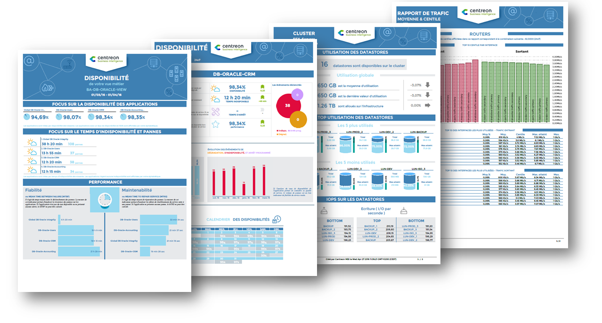

## What is Centreon MBI?

Centreon Monitoring Business Intelligence (MBI) is an extension that is used to generate reports on host groups, host categories and service categories. MBI requires users to [prepare their data](preparing-data.md) carefully so that reports can be generated.
We highly recommend you read our documentation to avoid running into issues. You can start with our [concepts](concepts.md) page.

> Centreon MBI is a Centreon **extension** that requires a valid [license](../administration/licenses.md).
> To purchase one and retrieve the necessary repositories, contact
> [Centreon](mailto:sales@centreon.com).

## What does MBI do?

Centreon MBI runs [jobs](concepts.md#jobs) to generate reports. MBI has more than 30 different ready-to-use templates (report "designs").

Reports address:

* Capacity planning and management
* Availability management
* SLA (Service Level Agreement) management
* Performance management.

 This allows for an overview of the performance of the selected resources over a given period of time. These reports can be configured to be generated once or on a regular basis (i.e. once per day, week, month...). This will help you keep track of your IT environment with monthly uptime reports, weekly infrastructure performance summaries...

## What kind of data can appear on the reports ?

Reports can display data about:
- Host groups
- Host categories
- Service categories
- Business views
- Business activities

Although data [must be organized into groups and categories](preparing-data.md#making-your-resources-available-to-mbi), some reports allow you to see the details of statuses and metrics for hosts and services.

MBI also creates reports on availability by converting checks into [events](concepts.md#event). Note that MBI only takes into account [HARD statuses](../alerts-notifications/concepts.md#status-types) when calculating availability.

Note that reports only contain data up to the previous day. The data for each day is [aggregated by the ETL the following day](how-mbi-works.md#phase-2-the-etl-is-launched-data-is-copied-to-mbi-and-aggregated).

## What are the possible output formats?
  
* MBI generates reports in different formats: PDF, CSV, XLSX, DOCX, PPTX, ODT, ODS, ODP.
* * Not all reports can be exported to every format. See our [table of supported formats](#supported-formats) below.
* By default, these reports can be downloaded from the **Reports view** page, but they can also be [configured to be sent to specific people when generated](reports-publication-rule.md).
* Report data can also be displayed in your Centreon [custom views](../alerts-notifications/custom-views.md) using dedicated [widgets](widgets.md).

### Supported formats

| Category | Report | PDF | CSV\* | XLSX | DOCX | PPTX | ODT | ODS | ODP |
|---|---|---|---|---|---|---|---|---|---|
| **Business activity monitoring** | BV-BA-Availabilities-1 | BEST | Non-Ok | OK | OK | OK | OK | OK | OK |
| | BA-Availability-1 | BEST | Non-Ok | OK | OK | OK | OK | OK | OK |
| | BV-BA-Availabilities-List | BEST | Non-Ok | OK | OK | OK | OK | OK | OK |
| | BA-Event-List | BEST | Non-Ok | OK | OK | OK | OK | OK | OK |
| | BV-BA-Current-Health-VS-Past | BEST | Non-Ok | OK | OK | OK | OK | OK | OK |
| | BV-BA-Availabilities-Calendars | BEST | Non-Ok | OK | OK | OK | OK | OK | OK |
| **Availability & Events** | Hostgroups-Incidents-1 | BEST | Non-Ok | OK | OK | OK | OK | OK | OK |
| | Hostgroups-Availability-1 | BEST | Non-Ok | OK | OK | OK | OK | OK | OK |
| | Hostgroup-Availability-2 | BEST | Non-Ok | OK | OK | OK | OK | OK | OK |
| | Hostgroup-Service-Incident-Resolution-2 | BEST | Non-Ok | OK | OK | OK | OK | OK | OK |
| | Hostgroup-Host-Availability-List | OK | Non-OK | BEST | OK | OK | OK | OK | OK |
| | Hostgroup-Host-Event-List | OK | Non-OK | BEST | OK | OK | OK | OK | OK |
| | Hostgroup-Service-Availability-List | OK | Non-OK | BEST | OK | OK | OK | OK | OK |
| | Hostgroup-Service-Event-List | OK | Non-OK | BEST | OK | OK | OK | OK | OK |
| | Hostgroup-Host-Pareto | BEST | Non-Ok | OK | OK | OK | OK | OK | OK |
| | Hostgroups-Host-Current-Events | BEST | Non-Ok | OK | OK | OK | OK | OK | OK |
| | Hostgroups-Service-Current-Events | BEST | Non-Ok | OK | OK | OK | OK | OK | OK |
| **Performance** | Host-Graphs-V2 | BEST | Non-Ok | OK | OK | OK | OK | OK | OK |
| | Hostgroup-Graphs-v2 | BEST | Non-Ok | OK | OK | OK | OK | OK | OK |
| | Hostgroup-Capacity-Planning-Linear-Regression | BEST | Non-Ok | OK | OK | OK | OK | OK | OK |
| | Hostgroups-Rationalization-Of-Resources-1 | BEST | Non-Ok | OK | OK | OK | OK | OK | OK |
| | Hostgroup-Service-Metric-Performance-List | OK | Non-OK | BEST | OK | OK | OK | OK | OK |
| | Hostgroups-Categories-Performance-List | OK | Non-OK | BEST | OK | OK | OK | OK | OK |
| **Storage** | Hostgroups-Storage-Capacity-1 | BEST | Non-Ok | OK | OK | OK | OK | OK | OK |
| | Hostgroup-Storage-Capacity-2 | BEST | Non-Ok | OK | OK | OK | OK | OK | OK |
| | Hostgroup-Storage-Capacity-List | OK | Non-OK | BEST | OK | OK | OK | OK | OK |
| **Network** | Hostgroup-Traffic-By-Interface-And-Bandwith-Ranges | BEST | Non-Ok | OK | OK | OK | OK | OK | OK |
| | Hostgroup-Traffic-average-By-Interface | BEST | Non-Ok | OK | OK | OK | OK | OK | OK |
| | Hostgroup-monthly-network-percentile | BEST | Non-Ok | OK | OK | OK | OK | OK | OK |
| **Virtualization** | VMWare-Cluster-Performances-1 | BEST | Non-Ok | OK | OK | OK | OK | OK | OK |
| | VMWare-VM-Performances-List | OK | Non-OK | BEST | OK | OK | OK | OK | OK |
| **Electric consumption** | Hostgroup-Electricity-Consumption-1 | BEST | Non-Ok | OK | OK | OK | OK | OK | OK |
| **Profiling** | Host-Detail-2 | BEST | Non-Ok | OK | OK | OK | OK | OK | OK |
| | Host-Detail-3 | BEST | Non-Ok | OK | OK | OK | OK | OK | OK |
| | Hostgroup-Host-Details-1 | BEST | Non-Ok | OK | OK | OK | OK | OK | OK |
| **Inventory & Configuration** | Hostgroups-Host-Templates | OK | Non-OK | BEST | OK | OK | OK | OK | OK |
| | Hostgroups-Service-Templates | OK | Non-OK | BEST | OK | OK | OK | OK | OK |
| | Poller-Performances | BEST | Non-Ok | OK | OK | OK | OK | OK | OK |
| | Hosts-not-classified | OK | Non-OK | BEST | OK | OK | OK | OK | OK |
| | Services-not-classified | OK | Non-OK | BEST | OK | OK | OK | OK | OK |
| **Database diagnostics** | Content-diagnostic | OK | Non-OK | BEST | OK | OK | OK | OK | OK |
| | Content-diagnostic-availability | OK | Non-OK | BEST | OK | OK | OK | OK | OK |
| | Content-diagnostic-performance | OK | Non-OK | BEST | OK | OK | OK | OK | OK |
| | Metric-integrity-check | OK | Non-OK | BEST | OK | OK | OK | OK | OK |

\* The CSV format is only for custom reports.
