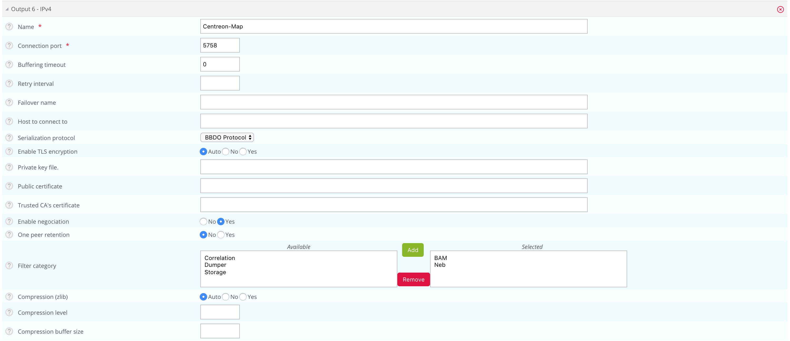

import { Tabs } from '@rspress/core/theme';
import { Tab } from '@rspress/core/theme';

This chapter describes advanced procedures to secure your Centreon MAP platform.

> If you want to use MAP in HTTPS, you must both secure your Centreon platform and MAP. Follow this [procedure](../administration/secure-platform.md#secure-the-web-server-with-https) if you need to secure your Centreon platform.

> Mistakes when editing configuration files can lead to malfunctions of the software. We recommend that you make a backup of the file before editing it and that you only change the settings advised by Centreon.

## Configure HTTPS/TLS on the MAP server

### HTTPS/TLS configuration with a recognized key

> This section describes how to add a **recognized key** to the Centreon
> MAP server.
>
> If you want to create an auto-signed key and add it to your server, please
> refer to the [following
> section](#httpstls-configuration-with-an-auto-signed-key)

You will require:

- A key file, referred to as *key.key*.
- A certificate file, referred to as *certificate.crt*.

1. Access the Centreon MAP server through SSH and create a PKCS12 file with the following command line:

    ```shell
    openssl pkcs12 -inkey key.key -in certificate.crt -export -out keys.pkcs12
    ```

2. Import this file into a new keystore (a Java repository of security certificates):

```shell
keytool -importkeystore -srckeystore keys.pkcs12 -srcstoretype pkcs12 -destkeystore /etc/centreon-map/map.jks
```

3. Set below parameters inside **/etc/centreon-map/map-config.properties**:

```text
centreon-map.keystore=/etc/centreon-map/map.jks
centreon-map.keystore-pass=xxx
```

> Replace the keystore-pass value "xxx" with the password you used for
> the keystore and adapt the path (if it was changed) to the keystore.

### HTTPS/TLS configuration with an auto-signed key

> Enabling the TLS mode with an auto-signed key will force every user to add an
> exception for the certificate before using the web interface.
>
> Enable it only if your Centreon also uses this protocol.
>
> Users will have to open the URL:
>
> ```shell
>https://<MAP_IP>:9443/centreon-map/api/beta/actuator/health
> ```
>
> **The solution we recommend is to use a recognized key method, as explained
> above.**

1. Move to the the Java installation folder:

```shell
cd $JAVA_HOME/bin
```

2. Generate a keystore file with the following command:

```shell
keytool -genkey -alias map -keyalg RSA -keystore /etc/centreon-map/map.jks
```

The alias value "map" and the keystore file path
**/etc/centreon-map/map.jks** may be changed, but unless there is a
specific reason, we advise keeping the default values.

Provide the needed information when creating the keystore.

At the end of the screen form, when the "key password" is requested, use
the same password as the one used for the keystore itself by pressing the
ENTER key.

3. Set below parameters inside **/etc/centreon-map/map-config.properties**:

```text
centreon-map.keystore=/etc/centreon-map/map.jks
centreon-map.keystore-pass=xxx
```

> Replace the keystore-pass value "xxx" with the password you used for
> the keystore and adapt the path (if it was changed to the keystore).

### Activate TLS profile of Centreon MAP service

1. Stop Centreon MAP service:

```shell
systemctl stop centreon-map-engine
```

2. Edit the file **/etc/centreon-map/centreon-map.conf**, adding `,tls` after `prod` profile:

```text
RUN_ARGS="--spring.profiles.active=prod,tls"
```

3. Set the **centreon.url** inside the **/etc/centreon-map/map-config.properties** file to use HTTPS instead of HTTP:

```shell
centreon.url=https://<server-address>
```

4. Restart Centreon MAP service:

```shell
systemctl start centreon-map-engine
```

Centreon MAP server is now configured to respond to requests from HTTPS at port 9443.

To change the default port, refer to the [dedicated
procedure](map-web-advanced-configuration.md#change-the-centreon-map-servers-port).

> Don't forget to modify the URL on Centreon side in the **MAP server address**
> field in the **Administration > Extensions > Map > Options** menu.

## Configure TLS on the Broker connection

An additional Broker output for Centreon Central (centreon-broker-master) has
been created during the installation.

You can check it in your Centreon web interface, from the **Configuration > Pollers > Broker Configuration**, 
by editing the **centreon-broker-master** configuration.

The output configuration should look like this:



### Broker configuration

You can enable TLS output and set up Broker's private key and public
certificate as described below:


1. Create a self-signed certificate with the following commands: 

    ```text
    openssl req -new -newkey rsa:2048 -nodes -keyout broker_private.key -out broker.csr
    openssl x509 -req -in broker.csr -CA ca.crt -CAkey ca.key -CAcreateserial -out broker_public.crt -days 365 -sha256
    ```

2. Copy the private key and the certificate into **/etc/centreon/broker_cert/** directory:

    ```text
    mv broker_private.key /etc/centreon/broker_cert/
    mv broker_public.crt /etc/centreon/broker_cert/
    ```

> "Trusted CA's certificate" field is optional. If you activate Broker's client
> authentication by setting this "ca\_certificate.crt", then you must setup a
> [keystore for MAP server](#configure-httpstls-on-the-map-server)
>
> You MUST push the new broker configuration and restart the broker after
> configuration.

### MAP server configuration

> You must [secure your Centreon platform with HTTPS](../administration/secure-platform.md#secure-the-web-server-with-https).

Set the **centreon.url** inside **/etc/centreon-map/map-config.properties** to use HTTPS instead of HTTP:

```shell
centreon.url=https://<server-address>
```

To enable TLS socket connection with Broker:

```text
broker.tls=true
```

#### Configuration with a self signed certificate

If the Broker public certificate is self signed, you must create a trust store
containing given certificate or its CA certificate with the following command
line:

```shell
keytool -import -alias centreon-broker -file broker_public.crt -keystore /etc/centreon-map/truststore.jks
```

- "broker\_public.crt" is Broker public certificate or its CA certificate
  in PEM format,
- "truststore.jks" is the generated trust store in JKS format,
- a store password is required during generation.

1. Add truststore parameters in **/etc/centreon-map/map-config.properties**:

```text
centreon-map.truststore=/etc/centreon-map/truststore.jks
centreon-map.truststore-pass=XXXX
```

> Replace the trustStorePassword value "xxx" with the password you used when
> generate the trust store.

2. Edit the file **/etc/centreon-map/centreon-map.conf**, and replace `,tls` by `,tls_broker` after `prod` profile:

```text
RUN_ARGS="--spring.profiles.active=prod,tls_broker"
```

> "tls_broker" profile implies "tls" profile. So Centreon MAP service
> serves necessarily HTTPS.

Once you add a truststore, Centreon MAP will use it to validate self-signed certificates.
This means that if you use a self-signed certificate for the central server, you must add it to the truststore. If you don't, the
 **Monitoring > Map** page will be blank, and the logs (**/var/log/centreon-map/centreon-map.log**)
 will show the following error :
 `unable to find valid certification path to requested target`.

1. Copy the central server's **.crt** certificate to the MAP server.

2. Add the certificate to the truststore:

```shell
keytool -import -alias centreon-broker -file central_public.crt -keystore /etc/centreon-map/truststore.jks
```

#### Configuration with a recognized CA certificate

If the broker public certificate is signed with a recognized CA, the JVM
default trust store **cacerts (/etc/pki/java/cacerts)** will be used. Nothing
to configure for Centreon MAP service.

## Configure TLS on a MySQL or MariaDB database

This section describes how to enable SSL on a MySQL/MariaDB server and configure a Spring Boot application to connect securely using the certificate authority verification (VERIFY_CA mode).

> **Note:** This procedure covers the VERIFY_CA mode only. In this mode, the server certificate is validated against a trusted Certificate Authority, but the hostname/IP address is not verified. For other SSL verification modes, see the [SSL Mode reference](#ssl-mode-reference) section.

- Select the tab corresponding to the database you want to use.

### Step 1 - Generate keys and certificates

<Tabs groupId="db" queryString>
<Tab value="MySQL" label="MySQL">

**1. Create a directory** (`/etc/mysql/newcerts` in this example) to store your certificate files:

    ```shell
    mkdir -p /etc/mysql/newcerts
    cd /etc/mysql/newcerts
    ```

**2. Generate the Certificate Authority (CA).** The CA is used to sign both the server and client certificates, establishing a chain of trust.

    ```shell
    # Generate the CA private key
    openssl genrsa 2048 > ca-key.pem
    # Generate the CA self-signed certificate
    openssl req -new -x509 -nodes -days 365000 -key ca-key.pem -out ca-cert.pem
    ```

**3. Generate the server certificate.** The server certificate is presented by MySQL to clients during the SSL handshake.

    ```shell
    # Generate the server private key and CSR (Certificate Signing Request)
    openssl req -newkey rsa:2048 -days 365000 -nodes -keyout server-key.pem -out server-req.pem
    
    # Convert the server key to RSA format (required by MySQL)
    openssl rsa -in server-key.pem -out server-key.pem
    
    # Sign the server certificate with the CA
    openssl x509 -req -in server-req.pem -days 365000 -CA ca-cert.pem -CAkey ca-key.pem -set_serial 01 -out server-cert.pem
    ```

**4. Generate the client certificate.** The client certificate is used by the application to authenticate itself to MySQL (mutual TLS).

    ```shell
    # Generate the client private key and CSR
    openssl req -newkey rsa:2048 -days 365000 -nodes -keyout client-key.pem -out client-req.pem
    # Convert the client key to RSA format
    openssl rsa -in client-key.pem -out client-key.pem
    # Sign the client certificate with the CA
    openssl x509 -req -in client-req.pem -days 365000 -CA ca-cert.pem -CAkey ca-key.pem -set_serial 01 -out client-cert.pem
    ```

**5. Verify the certificates.** Ensure both certificates are correctly signed by the CA before proceeding.

    ```shell
    openssl verify -CAfile ca-cert.pem server-cert.pem client-cert.pem
    # Expected output:
    # server-cert.pem: OK
    # client-cert.pem: OK
    ```

</Tab>
<Tab value="MariaDB" label="MariaDB">

**1. Create a directory** (`/etc/mariadb/newcerts` in this example) to store your certificate files:

    ```shell
    mkdir -p /etc/mariadb/newcerts
    cd /etc/mariadb/newcerts
    ```

**2. Generate the Certificate Authority (CA).** The CA is used to sign both the server and client certificates, establishing a chain of trust.

    ```shell
    # Generate the CA private key
    openssl genrsa 2048 > ca-key.pem
    
    # Generate the CA self-signed certificate
    openssl req -new -x509 -nodes -days 365000 -key ca-key.pem -out ca-cert.pem
    ```

**3. Generate the server certificate.** The server certificate is presented by MariaDB to clients during the SSL handshake.

    ```shell
    # Generate the server private key and CSR (Certificate Signing Request)
    openssl req -newkey rsa:2048 -days 365000 -nodes -keyout server-key.pem -out server-req.pem
    
    # Convert the server key to RSA format (required by MariaDB)
    openssl rsa -in server-key.pem -out server-key.pem
    
    # Sign the server certificate with the CA
    openssl x509 -req -in server-req.pem -days 365000 \
    -CA ca-cert.pem -CAkey ca-key.pem -set_serial 01 \
    -out server-cert.pem
    ```

**4. Generate the client certificate.** The client certificate is used by the application to authenticate itself to MariaDB (mutual TLS). Skip this section if you only need `REQUIRE SSL`.

    ```shell
    # Generate the client private key and CSR
    openssl req -newkey rsa:2048 -days 365000 -nodes -keyout client-key.pem -out client-req.pem
   
    # Convert the client key to RSA format
    openssl rsa -in client-key.pem -out client-key.pem
    
    # Sign the client certificate with the CA
    openssl x509 -req -in client-req.pem -days 365000 \
    -CA ca-cert.pem -CAkey ca-key.pem -set_serial 01 \
    -out client-cert.pem
    ```

**5. Verify the certificates.** Ensure both certificates are correctly signed by the CA before proceeding.

    ```shell
    openssl verify -CAfile ca-cert.pem server-cert.pem client-cert.pem
    # Expected output:
    # server-cert.pem: OK
    # client-cert.pem: OK
    ```

**6. Set the file ownership.** MariaDB requires ownership of all certificate files.

</Tab>
</Tabs>

### Step 2 - Configure the MySQL/MariaDB server

<Tabs groupId="db" queryString>
<Tab value="MySQL" label="MySQL">

**1. Set the file ownership.** MySQL requires ownership of all certificate files.

    > Ensure you are using the directory you previously created (`/etc/mysql/newcerts` in this example).

    ```shell
    chown -Rv mysql:root /etc/mysql/newcerts/*
    ```

**2. Edit the MySQL server configuration.** Add the following block to your MySQL server configuration file (typically /etc/mysql/mysql.conf.d/mysqld.cnf):

    ```shell
    [mysqld]
    ssl-ca   = /etc/mysql/newcerts/ca-cert.pem
    ssl-cert = /etc/mysql/newcerts/server-cert.pem
    ssl-key  = /etc/mysql/newcerts/server-key.pem
    # Restrict to secure TLS versions only
    tls_version = TLSv1.2,TLSv1.3
    ```

**3. Optional - Edit the MySQL client configuration.** This allows the mysql CLI tool to connect using SSL as well.

    
**4. Restart MySQL.**

    ```shell
    systemctl restart mysqld
    ```

**5. Verify SSL is active.**

    

</Tab>
<Tab value="MariaDB" label="MariaDB">

> Ensure you are using the directory you previously created (`/etc/mariadb/newcerts` in this example).

**1. Add the following block to your MariaDB server configuration file** (typically `/etc/mariadb/mariadb.conf.d/50-server.cnf`):

    ```shell
    [mariadb]
    ssl-ca   = /etc/mariadb/newcerts/ca-cert.pem
    ssl-cert = /etc/mariadb/newcerts/server-cert.pem
    ssl-key  = /etc/mariadb/newcerts/server-key.pem
    
    # Restrict to secure TLS versions only
    tls_version = TLSv1.2,TLSv1.3
    ```

**2. Optional - Edit the MariaDB client configuration.** This allows the mariadb CLI tool to connect using SSL as well (/etc/mariadb/mariadb.conf.d/client.cnf):

    ```shell
    [client-mariadb]
    ssl-ca   = /etc/mariadb/newcerts/ca-cert.pem
    ssl-cert = /etc/mariadb/newcerts/client-cert.pem
    ssl-key  = /etc/mariadb/newcerts/client-key.pem
    ```

**4. Restart MariaDB.**

    ```shell
    systemctl restart mariadb
    ```

**5. Verify SSL is active.**

    ```shell
    SHOW VARIABLES LIKE '%ssl%';
    -- have_ssl should be YES
    -- ssl_ca, ssl_cert, ssl_key should point to your certificate files
    ```

</Tab>
</Tabs>

### Step 3 - Configure the MySQL/MariaDB user

<Tabs groupId="db" queryString>
<Tab value="MySQL" label="MySQL">

**1. Require SSL for the user.**

    ```shell
    ALTER USER 'centreon_map'@'<ip_or_hostname>' REQUIRE SSL;
    -- Verify: ssl_type should now show ANY
    SELECT user, host, ssl_type FROM mysql.user WHERE user='centreon_map';
    ```

**2. Grant privileges.**

    ```shell
    GRANT SELECT, INSERT, UPDATE, DELETE, CREATE, DROP, INDEX, ALTER,
          CREATE TEMPORARY TABLES, LOCK TABLES
      ON `centreon_map`.*
      TO `centreon_map`@`<ip_or_hostname>`;
    -- Verify grants
    SHOW GRANTS FOR 'centreon_map'@'<ip_or_hostname>';
    ```
 
</Tab>
<Tab value="MariaDB" label="MariaDB">

**1. Require SSL for the user.**

    ```shell
    - SSL only (no client certificate required)
    ALTER USER 'centreon_map'@'<ip_or_hostname>' REQUIRE SSL;
   
    -- Or mutual TLS (client certificate required)
    -- ALTER USER 'centreon_map'@'<ip_or_hostname>' REQUIRE X509;
   
    -- Verify: ssl_type should now show ANY (for SSL) or X509 (for mTLS)
    SELECT user, host, ssl_type FROM mysql.user WHERE user='centreon_map';
    ```

**2. Grant privileges.**

    ```shell
    GRANT SELECT, INSERT, UPDATE, DELETE, CREATE, DROP, INDEX, ALTER,
        CREATE TEMPORARY TABLES, LOCK TABLES
    ON `centreon_map`.*
    TO `centreon_map`@`<ip_or_hostname>`;
    -- Verify grants
    SHOW GRANTS FOR 'centreon_map'@'<ip_or_hostname>';
    ```
</Tab>
</Tabs>

### Step 4 - Configure JDBC (Spring Boot)

<Tabs groupId="db" queryString>
<Tab value="MySQL" label="MySQL">

MySQL Connector/J does not support loading PEM files directly from the JDBC URL. Java requires certificates to be stored in a JKS (Java KeyStore) or PKCS12 keystore. This eliminates PEM format issues (e.g. PKCS#1 vs PKCS#8 key format) and provides a consistent, reliable SSL setup.

At minimum, one keystore file is required. A second one is needed only if mutual TLS (mTLS) is enabled:

| File    | Contains     | Purpose               | Required      |
|----------------|------------|---------------------------|-----------|
| truststore.jks     | CA certificate | Lets Java verify the MySQL server's identity    | Yes - Always      |
| keystore.jks      | Client cert + private key  | Lets MySQL verify the application's identity  | Only if REQUIRE X509     |

> **Note: mTLS is optional.** It is only needed if the MySQL user was created with REQUIRE X509 (mutual authentication). If the user was created with REQUIRE SSL, only the TrustStore is needed and Steps 2 and 2a/2b below can be skipped.

**1. Create the TrustStore.** The TrustStore contains the CA certificate. Java uses it to validate that the MySQL server's certificate was signed by a trusted authority.

    ```shell
    keytool -importcert -alias mysqlServerCACert \
    -file /etc/mysql/newcerts/ca-cert.pem \
    -keystore /etc/mysql/newcerts/truststore.jks \
    -storepass changeit \
    -noprompt
    ```

**2. Optional: mTLS only - Create the KeyStore** (client certificate).

    > **Note:** Skip this step if the MySQL user was created with REQUIRE SSL. It is only required for REQUIRE X509 (mutual TLS). `keytool` cannot import a PEM private key directly, so we first convert to PKCS12, then to JKS.

    2.1. Bundle the client cert and key into a PKCS12 file:

        ```shell
        openssl pkcs12 -export \
        -in /etc/mysql/newcerts/client-cert.pem \
        -inkey /etc/mysql/newcerts/client-key.pem \
        -out /etc/mysql/newcerts/client.p12 \
        -name mysqlClient \
        -passout pass:changeit
        ```

    2.2 Convert PKCS12 to JKS:

        ```shell
        keytool -importkeystore \
        -srckeystore  /etc/mysql/newcerts/client.p12  -srcstoretype  PKCS12 -srcstorepass  changeit \
        -destkeystore /etc/mysql/newcerts/keystore.jks -deststoretype JKS   -deststorepass changeit
        ```

**3. Set file permissions.** Ensure only the user running the Java application can read the keystore files.

    ```shell
    chown your_java_user: /etc/mysql/newcerts/*.jks
    chmod 640 /etc/mysql/newcerts/*.jks
    ```

**4. Set the JDBC URL.** Add the following to your configuration file (/etc/centreon-map/*-database.properties):

    ```shell
    *.connection.url=jdbc:mysql://<ip_or_hostname>:3306/centreon_map?sslMode=VERIFY_CA&trustCertificateKeyStoreUrl=file:/etc/mysql/newcerts/truststore.jks&trustCertificateKeyStorePassword=changeit&rewriteBatchedStatements=true
    ```

**5. Optional — only if mTLS is enabled - (REQUIRE X509)**. Add options clientCertificateKeyStoreUrl and clientCertificateKeyStorePassword:

        ```shell
        *.connection.url=jdbc:mysql://<ip_or_hostname>:3306/centreon_map?sslMode=VERIFY_CA&trustCertificateKeyStoreUrl=file:/etc/mysql/newcerts/truststore.jks&trustCertificateKeyStorePassword=changeit&clientCertificateKeyStoreUrl=file:/etc/mysql/newcerts/keystore.jks&clientCertificateKeyStorePassword=changeit&rewriteBatchedStatements=true
        ```

</Tab>
<Tab value="MariaDB" label="MariaDB">

Unlike MySQL Connector/J, **MariaDB Connector/J 3.x supports PEM files natively** via the `serverSslCert` parameter directly in the JDBC URL. No Java keystore conversion is needed for SSL simple mode.

A keystore file is only needed for mTLS (client certificate authentication):

| File    | Contains     | Purpose               | Required      |
|----------------|------------|---------------------------|-----------|
| ca-cert.pem     | CA certificate | Lets the driver verify the MariaDB server's identity     | Yes - Always      |
| keystore.p12      | Client cert + private key  | Lets MariaDB verify the application's identity  | Only if REQUIRE X509     |

> **Note: mTLS is optional.** It is only needed if the MariaDB user was created with REQUIRE X509. If the user was created with REQUIRE SSL, only serverSslCert pointing to the CA is needed and the keystore steps below can be skipped.

**1. Optional - Create the KeyStore for mTLS.**

    Skip this step if the MariaDB user was created with REQUIRE SSL. It is only required for REQUIRE X509 (mutual TLS).

    `keytool` cannot import a PEM private key directly, so we first bundle via PKCS12.

        1.1. Bundle the client cert and key into a PKCS12 file:

        ```shell
        openssl pkcs12 -export \
        -in /etc/mariadb/newcerts/client-cert.pem \
        -inkey /etc/mariadb/newcerts/client-key.pem \
        -out /etc/mariadb/newcerts/keystore.p12 \
        -name mariadbClient \
        -passout pass:changeit
        ```

**2. Set file permissions.** Ensure only the user running the Java application can read the keystore files.
   
        ```shell
        chown your_java_user: /etc/mariadb/newcerts/keystore.p12
        chmod 640 /etc/mariadb/newcerts/keystore.p12
        ```

**3. Set file permissions.** Ensure only the user running the Java application can read the keystore files.

    ```shell
    chown your_java_user: /etc/mariadb/newcerts/*.jks
    chmod 640 /etc/mariadb/newcerts/*.jks
    ```

**4. Set the JDBC URL.** Add the following to your configuration file (/etc/centreon-map/*-database.properties):

    ```shell
    *.connection.url=jdbc:mariadb://<ip_or_hostname>:3306/centreon_map?sslMode=verify-ca&serverSslCert=/etc/mariadb/newcerts/ca-cert.pem&rewriteBatchedStatements=true
    ```

**5. Optional — only if mTLS is enabled (REQUIRE X509).** Add options keyStore, keyStorePassword and keyStoreType:

        ```shell
        *.connection.url=jdbc:mariadb://<ip_or_hostname>:3306/centreon_map?sslMode=verify-ca&serverSslCert=/etc/mariadb/newcerts/ca-cert.pem&keyStore=/etc/mariadb/newcerts/keystore.p12&keyStorePassword=changeit&keyStoreType=PKCS12&rewriteBatchedStatements=true
        ```

</Tab>
</Tabs>

### Step 5 - Check Certificate Expiry

<Tabs groupId="db" queryString>
<Tab value="MySQL" label="MySQL">

Certificates generated with `-days 365000` are valid for ~1000 years, but this should still be monitored in shorter-lived setups.

**1. Check the TrustStore** (CA certificate):

    ```shell
    keytool -list -v -keystore /etc/mysql/newcerts/truststore.jks -storepass changeit
    # Look for: Valid from ... until ...
    ```

**2. Check the KeyStore** (client certificate):

    ```shell
    keytool -list -v -keystore /etc/mysql/newcerts/keystore.jks -storepass changeit
    # Look for: Valid from ... until ...
    ```

</Tab>
<Tab value="MariaDB" label="MariaDB">

**1. Check the CA certificate**.

    ```shell
    openssl x509 -in /etc/mariadb/newcerts/ca-cert.pem -noout -dates
    # notBefore=...
    # notAfter=...
    ```

**2. Check the server certificate.**

    ```shell
    openssl x509 -in /etc/mariadb/newcerts/server-cert.pem -noout -dates
    ```

**3. Check the KeyStore (mTLS only).**

    ```shell
    keytool -list -v -keystore /etc/mariadb/newcerts/keystore.p12 -storepass changeit
    # Look for: Valid from ... until ...
    ```

</Tab>
</Tabs>

### SSL Mode reference

<Tabs groupId="db" queryString>
<Tab value="MySQL" label="MySQL">

The `VERIFY_CA` mode is the recommended minimum for production. This table lists other available modes depending on your security requirements:

| Mode         | Server cert verified | Hostname/IP verified | Use case                         |
|--------------|----------------------|----------------------|----------------------------------|
| `DISABLED`     | No                 | No                 | Development only — no encryption |
| `PREFERRED`     | No                   | No                | Uses SSL if available, fallback to plain |
| `REQUIRED `     | No                   | No                | Enforces SSL, but does not validate the server cert  |
| `VERIFY_CA`     | Yes                   | No                | Used in this procedure — validates the CA chain  |
| `VERIFY_IDENTITY `     | Yes                   | Yes               | Strictest — also checks hostname/IP against the certificate SAN   |

</Tab>
<Tab value="MariaDB" label="MariaDB">

The `VERIFY_CA` mode is the recommended minimum for production. This table lists other available modes depending on your security requirements:

| Mode         | Server cert verified | Hostname/IP verified | Use case                         |
|--------------|----------------------|----------------------|----------------------------------|
| `DISABLED`     | No                 | No                 | Development only — no encryption |
| `trust`     | No                   | No                | Encrypts traffic but does not validate the server cert  |
| `VERIFY_CA`     | Yes                   | No                | Used in this procedure — validates the CA chain  |
| `verify-full`     | Yes                   | Yes               | Strictest — also checks hostname/IP against the certificate SAN    |

> **Note:** If you want to use the `verify-full` mode, the server certificate must include a Subject Alternative Name (SAN) matching the exact IP or hostname used in the JDBC URL. The CN field alone is not sufficient for IP-based connections.

</Tab>
</Tabs>
