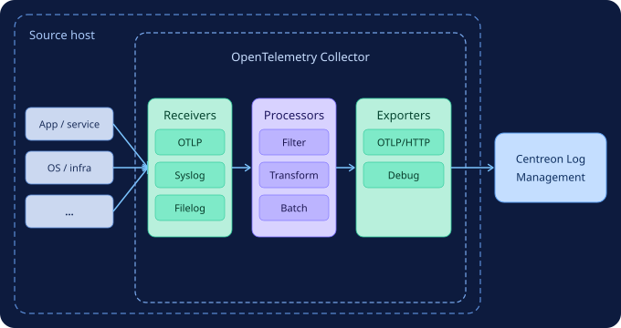

import { Tabs } from '@rspress/core/theme';
import { Tab } from '@rspress/core/theme';

As explained in [What is OpenTelemetry and how is it used by Centreon Log Management?](../getting-started/concepts.md#what-is-opentelemetry-and-how-is-it-used-by-centreon-log-management), you need to [install an OpenTelemetry collector](./collector.md) on each host you want to be able to send logs to Centreon Log Management. Only one collector is needed per host. You can send different types of logs using the same collector.

## Components of an OpenTelemetry Collector

An OpenTelemetry Collector has three main components that are executed one after the other (see [diagram](#diagram) below):

* **Receivers** read data from files or receive data from a stream. They accept logs in various formats and from various sources (e.g., OTLP, syslog, etc). Some types of receivers include "operators", which are similar to processors but apply only to the logs from that specific receiver.
* **Processors** let you perform actions on all logs in a given pipeline. They can filter, transform, or enrich data before it leaves the collector.
* **Exporters** send the logs in OpenTelemetry format to Centreon Log Management.

## Configuring the data processing pipeline

Receivers, processors and exporters are organized into a pipeline that defines the order in which they run.
Each component is defined using YAML files.

* If you only need to receive logs from a small number of sources, you can keep all the configuration in a single file (**config.yaml**). [See two examples here](collector-simple.md).
* Otherwise, best practice is to use one file for the collector’s general configuration and one file per data source (this is the method described in [our main procedure](./collector.md)).

In all cases, receivers, processors and exporters must be defined.

## Diagram

