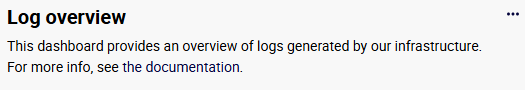
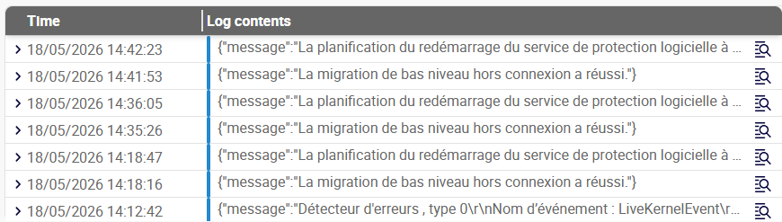

import { Tabs } from '@rspress/core/theme';
import { Tab } from '@rspress/core/theme';

Dashboards are built using widgets. They allow you to display [text](#generic-text), and [charts](#metrics-graph) that present the number of logs received according to specific parameters.

## Creating a dashboard

1. To create a dashboard, in the **Dashboards** page, click **Add**.
2. In the window that opens, enter a name (mandatory) and a description (optional), then click **Create**. A blank dashboard appears.

   

3. [Add widgets](#adding-a-widget-to-a-dashboard) to your dashboard.
4. Save each widget as you create or edit it, then save the dashboard itself. The dashboard appears in the list of dashboards.

## Adding a widget to a dashboard

1. If you are not already in your dashboard, [edit it](#editing-a-dashboard).
2. In the dashboard, click **Add a widget**: the screen displays the widget creation screen.
2. Select a widget type: the rest of the screen is updated to display the settings for this type of widget.
3. [Use the available settings to configure your widget](#available-widgets).
4. When you have finished configuring your widget, click **Save** in the bottom right corner. This only saves the widget: make sure you also save your dashboard before you do anything else.

## Editing a dashboard

On the **Dashboards** page, click the name of the dashboard you want to edit. The dashboard opens; click **Edit dashboard** in the top-right corner to enter edit mode.

Edit each widget you want, saving your changes to each widget. Then save the dashboard itself.

## Editing a widget

When editing a dashboard, click the 3 dots in the top right corner of a widget to enter edit mode.
Once you have edited your widget, save it, then save the dashboard itself.

## Available widgets

### Generic text

Use this widget to insert titles, information or links into your dashboards. Use the toolbar to format the description.

### Log viewer

Use this widget to display the list of logs matching a specific query in the last n minutes. In the resulting table, click **Show in context** on the right to display the log in the **Log explorer** page, along with the previous and next 2 minutes of logs that match the query.

### Metrics graph

Here, "metrics" means the number of log entries that match a specific query, or the ratio obtained by dividing a query by another query. The resulting number of logs can be broken down according to another parameter. In the example below, each bar represents the number of INFO and ERROR logs for a service for a given period.

Select the settings you want in the left part of the screen.

* The type of widget (here, **Metrics graph**).
* A title and a description. These will be displayed in the widget at all times.
* Configure the aspect of the graph using the **Display settings** section.
* The time period you want the graph to cover.

#### Dataset selection

In the right part of the screen, define the data you want to display. The graph can display several data series.  Each series is defined by a dataset. A dataset has the following parameters:

* **Name**: this will be the name of the data series in the legend of the graph.

* **Query**: use the correct [query syntax](query-syntax.md).
* **Operation**:

  * **Count** means that the query will return the number of log entries that match the query.
  * **Ratio** means that you divide the results of a query by the results of another query.
  
If you display the graph in **Line** mode, each dataset will produce a curve. If you display the chart as a **Bar** chart, each dataset will produce a bar. Inside each bar, the data will be stacked according to the **Group by** parameter.
