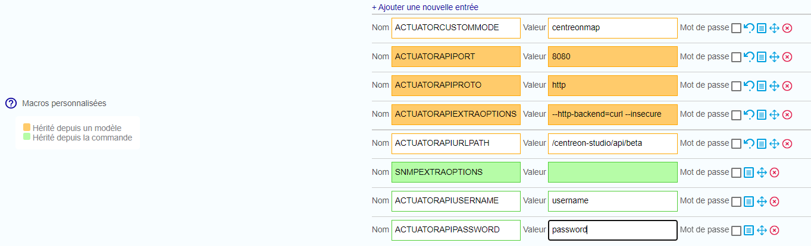
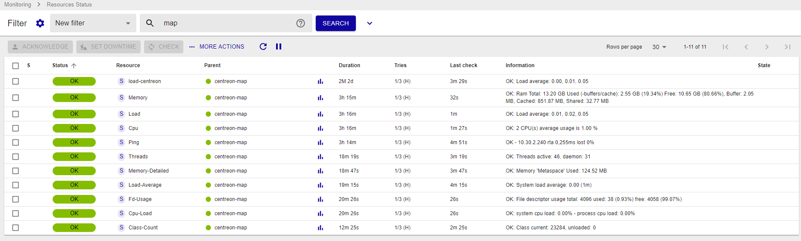

import { Tabs } from '@rspress/core/theme';
import { Tab } from '@rspress/core/theme';

Ce chapitre décrit les procédures avancées de configuration de votre système Centreon MAP.

> Veuillez noter que les endpoints spécifiés dans cette page ont été mis à jour suite à la dépréciation de la version bêta. Depuis la version 24.10, `beta` est remplacé par `latest` dans les chemins d'accès.

## Superviser votre serveur Centreon MAP après installation

Centreon fournit un [connecteur de supervision et un plugin](/pp/integrations/plugin-packs/procedures/applications-monitoring-centreon-map-engine-actuator) pour superviser votre serveur Centreon MAP.

### Configurer vos services

Accédez à votre interface web Centreon. Allez à la page **Configuration > Hôtes > Hôtes**, puis cliquez sur **Ajouter**.

Remplissez les informations de base sur votre hôte et ajoutez les modèles d'hôte suivants :

- OS-Linux-SNMP-custom
- App-Jvm-actuator-custom




Pour superviser la JVM centreon-map, veuillez utiliser les valeurs de macro suivantes :

| Nom                     | Valeur                                    |
| :---------------------- | :---------------------------------------- |
| ACTUATORCUSTOMMODE      | ```centreonmap```                         |
| ACTUATORAPIURLPATH      | ```/centreon-map/api/latest```           |
| ACTUATORAPIUSERNAME     | Le nom d'utilisateur Api doit être défini |
| ACTUATORAPIPASSWORD     | Le mot de passe Api doit être défini      |

> N'oubliez pas de cocher la case "Créer aussi les services liés aux modèles".

Vous pouvez maintenant exporter votre configuration, et votre serveur Centreon MAP sera supervisé.



Vous pouvez également vérifier l'URL suivante, qui indique si le serveur est opérationnel ou non :

<Tabs groupId="sync">
<Tab value="HTTP" label="HTTP">

```shell
http://<MAP_IP>:8080/centreon-map/api/latest/actuator/health.
```

</Tab>
<Tab value="HTTPS" label="HTTPS">

```shell
https://<MAP_IP>:8443/centreon-map/api/latest/actuator/health.
```

</Tab>
</Tabs>

## Changer le port du serveur Centreon MAP

> Des erreurs de modification de fichiers de configuration peuvent entraîner des dysfonctionnements du logiciel. Nous vous recommandons de faire une sauvegarde du fichier avant de le modifier et de ne changer que les paramètres conseillés par Centreon.

Par défaut, le serveur Centreon MAP écoute et envoie des informations via le port 8080.
Si vous avez configuré le SSL (voir [Configuration HTTPS/TLS](./secure-your-map-platform.md#configuration-du-serveur-map)), utilisez le port 8443.

Vous pouvez modifier ce port (par exemple, si un pare-feu sur votre réseau le bloque).

Sur votre serveur Centreon MAP, arrêtez le service centreon-map :

```shell
systemctl stop centreon-map
```

Modifiez le fichier de paramètres **map-config.properties** situé dans **/etc/centreon-map** :

```shell
vi /etc/centreon-map/map-config.properties
```

Ajoutez la ligne suivante à la section MAP SERVER :

```text
centreon-map.port=XXXX
```

> Remplacez *XXXX* par le port que vous souhaitez.

Redémarrez ensuite le serveur MAP de Centreon :

```shell
systemctl start centreon-map
```

Attendez que le service Centreon MAP ait fini de démarrer (~30 secondes à une minute).

Vérifiez que votre serveur est opérationnel et accessible sur le nouveau port que vous avez défini, en entrant l'URL suivante dans votre navigateur web :

```shell
http://<MAP_IP>:<NEW_PORT>/centreon-map/api/latest/actuator/health
```
