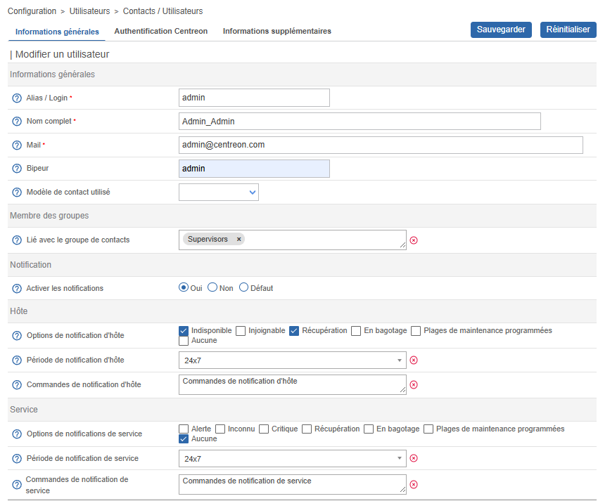

Pour ajouter un contact, allez à la page **Configuration > Utilisateurs > Contacts/Utilisateurs**, puis cliquez sur **Add**.



Pour afficher la matrice de notification d’un contact, cliquez sur **View contact notifications** (à côté du menu
**Add**).

## Onglet Informations générales

* **Alias/Login** : le login que l'utilisateur entrera pour accéder à l’interface web.
* **Nom complet** : le nom et prénom de l’utilisateur.
* **Mail** et **Bipeur** : contiennent respectivement l’adresse mail et le numéro de téléphone de l’utilisateur,
sur lesquels seront envoyés les alertes (dans le cas d’une notification par SMS ou appel par exemple). Les alertes doivent être activées pour l'utilisateur (voir option **Activer les notifications** ci-dessous).
* **Modèle de contact utilisé** : permet de lier un [modèle de contact](contacts-templates.md) au contact. Le contact héritera des caractéristiques du modèle. Si pour un même champ, le contact et le modèle de contact ont des valeurs différentes, la valeur définie
au niveau du contact prend le pas sur celle définie au niveau du contact.
* **Lié avec le groupe de contacts** : associe le contact à un ou plusieurs groupes de contacts.
* **Activer les notifications** : permet d’activer l’envoi de [notifications](../../alerts-notifications/notif-configuration.md) à l’utilisateur.
* **Options de notification d'hôte/de service** : permet de définir les statuts des hôtes ou des services pour
 lesquels des notifications seront envoyées.
* **Période de notification d'hôte/de service** : permet de choisir la [période temporelle](timeperiods.md) pendant laquelle 
les notifications pourront être envoyées. En-dehors de ces périodes de temps, l'utilisateur ne recevra aucune notification. 
* **Commandes de notification d'hôte/de service** : permet de choisir la façon dont laquelle les notifications seront envoyées à l'utilisateur pour un hôte ou pour un service.

## Onglet Authentification Centreon
 
* **Autoriser l'utilisateur à se connecter à l'interface web** : permet d’autoriser l’utilisateur à accéder à l’interface web de Centreon.
* Le champ **Votre mot de passe actuel** est requis lorsque vous (l'utilisateur actuellement connecté) devez modifier le mot de passe d'un autre utilisateur. Vous devez faire vérifier votre identité en saisissant votre propre mot de passe.
  > Vous ne pouvez modifier le mot de passe d'un autre utilisateur que si vous êtes connecté en utilisant une authentification locale, et non via un fournisseur d'identité (pour des raisons de sécurité).
* **Mot de passe** et **Confirmation du mot de passe** : contiennent le mot de passe de l'utilisateur.
  > Pour changer le mot de passe d'un utilisateur local, il est nécessaire de saisir également votre **Mot de passe actuel**. Dans le cas où vous êtes identifié par une connexion SSO, ce champ n'est pas visible. Pour créer un nouvel utilisateur, il n'est pas nécessaire de saisir cette information.
* **Langue par défaut** permet de définir la langue de l’interface Centreon pour cet utilisateur.
* **Administrateur** définit si cet utilisateur est administrateur de la plateforme de supervision ou non. Un administrateur a tous les droits (lecture, écriture) et peut accéder à toutes les pages de l'interface.
* **Clé d'auto-connexion** : permet de définir une clé de connexion pour l’utilisateur. L’utilisateur n’aura plus
  besoin d’entrer son login et mot de passe mais utilisera directement cette clé pour se connecter. Pour des raisons de sécurité, cette fonctionnalité n'est pas disponible pour les utilisateurs LDAP. Syntaxe de connexion :

    ```text
    http://[IP_DU_SERVER_CENTRAL]/index.php?autologin=1&useralias=[login_user]&token=[value_autologin]
    ```

  > La possibilité de connexion automatique (auto login) doit être activée dans le menu : **Administration > Options**.

* Le champ **Source d'authentification** spécifie si les informations de connexion proviennent d’un annuaire LDAP ou d’informations stockées localement sur le serveur (définies via l'interface Centreon).
* Les trois champs qui suivent servent à autoriser les utilisateurs à faire appel à l'[API v1](../../api/rest-api-v1.md#api-calls) et à l'[API v2](https://docs-api.centreon.com/api/centreon-web/23.04/) (à noter que la documentation API n'est disponible qu'en anglais et est destinée à des développeurs familiers avec les requêtes HTTP et JSON).
  - Le champ **API de configuration** ne s'applique qu'aux API V2. (Seuls les administrateurs peuvent utiliser cette API en v1).
  - L'[**API de temps réel**](../../api/rest-api-v1.md#realtime-information) peut être appelée par les non-administrateurs dans les deux versions lorsque ce champ est coché.
  - Les administrateurs peuvent faire appel à l'**API de configuration** et l'[**API de temps réel**](../../api/rest-api-v1.md#realtime-information) indépendamment de si le champ correspondant à ces APIs est coché. Ceci est valable pour l'API v1 et l'API v2. Les administrateurs sont également les seuls à pouvoir utiliser [**CLAPI**](../../api/clapi.md), les autres utilisteurs n'ont accès qu'à l'API Rest.
* Le champ **Groupes de liste d'accès** permet de définir un groupe d’accès pour un utilisateur, groupe utilisé pour les [contrôles d’accès (ACL)](../../administration/access-control-lists.md).

> Un utilisateur Administrateur a tous les droits et les règles de contrôle d’accès ne s'appliquent pas à lui, même si vous l'incluez dans un groupe d’accès.

## Onglet Informations supplémentaires

* **Adresse** : permet de spécifier des informations de contacts supplémentaires (autre mail, autre numéro
  de téléphone...).
* **Statut** : permet d’activer ou de désactiver le contact. Un contact désactivé ne recevra plus aucune notification et ne pourra plus se connecter à l'interface de Centreon.
* **Commentaires**
