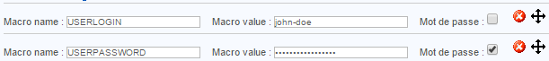
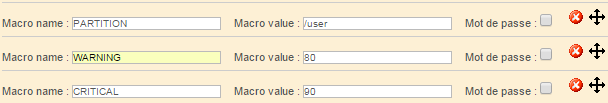

Une macro est une variable permettant de récupérer certaines valeurs. Une macro commence et se termine toujours par le
signe "$".

## Les macros standards

Les macros standards sont des macros prédéfinies dans le code source des moteurs de supervision. Ces différentes macros
permettent de récupérer la valeur de différents objets au sein des commandes.

Exemple :

* La macro **\$HOSTADDRESS\$** permet de récupérer l'adresse IP d'un hôte
* La macro **\$CONTACTEMAIL\$** permet de récupérer l'adresse mail du contact

> Une [liste complète des macros](#liste-des-macros) est disponible sur cette page ainsi qu'une description de ce qu'elles représentent.

## Les macros personnalisées

### Définition

Les macros personnalisées sont des macros définies par l'utilisateur lors de la création d'un hôte ou d'un service.
Elles sont utilisées dans les commandes de vérifications. Les macros personnalisées commencent par $_HOST pour les
macros personnalisées d'hôtes et par $_SERVICE pour les macros personnalisées de services.

Il y a plusieurs avantages à utiliser les macros personnalisées à la place des arguments :

* La fonction de la macro est définie dans le nom de celle-ci. La macro $_HOSTMOTDEPASSEINTRANET$ est plus facilement
  lisible que $ARG1$
* Les macros héritent des modèles d'hôtes et de services, la modification d'une seule macro est donc possible pour un
  hôte ou un service. En revanche, les arguments doivent être tous redéfinis en cas de modification d'un seul argument
* Le nombre d'arguments est limité à 32 contrairement aux macros personnalisées qui sont infinies

Une macro d'hôte est utilisée pour définir une variable qui est propre à l'hôte et qui ne changera pas qu'importe le
service interrogé : des identifiants de connexion à l'hôte, un port de connexion pour un service particulier, une
communauté SNMP.

Une macro de service est plutôt utilisée pour définir des paramètres propres à un service : un seuil WARNING/CRITICAL,
une partition à interroger...

### Exemple

Lors de la définition d'un hôte, les macros suivantes sont créées :

Pour faire appel à ces macros dans une commande de vérification, il faudra les invoquer en utilisant les variables
suivantes : $_HOSTUSERLOGIN$, $_HOSTUSERPASSWORD$.

Lors de la définition d'un service, les macros suivantes sont créées :

Pour faire appel à ces macros dans une commande de vérification, il faudra les invoquer en utilisant les variables
suivantes : $_SERVICEPARTITION$, $_SERVICEWARNING$, $_SERVICECRITICAL$.

### Cas particulier

Les champs **Community SNMP & Version** présent au sein d'une fiche d'hôte génèrent automatiquement les macros
personnalisées suivantes : $_HOSTSNMPCOMMUNITY$ et $_HOSTSNMPVERSION$.

## Macros dans les macros

Lorsque Centreon Engine évalue une commande, la résolution des macros s'effectue en deux passes successives.

**Niveau 1 — Niveau de la commande** : les macros présentes directement dans la ligne de commande sont résolues :

- Macro standard ou personnalisée résolue → remplacée par sa valeur.
- Macro non résolue ou vide → remplacée par une chaîne vide.

**Niveau 2 — Niveau de la valeur de macro** : si la valeur produite au niveau 1 contient elle-même des tokens ressemblant à des macros, une seconde passe s'applique à cette valeur :

- Macro résolue → remplacée par sa valeur.
- Macro non résolue ou vide → **conservée telle quelle** (non supprimée).

### Syntaxe d'échappement avec doubles accolades

Utilisez le format `{{$MACRO$}}` lorsque vous souhaitez que les macros non résolues dans une valeur soient remplacées par une chaîne vide plutôt que conservées :

- Au niveau 1 ou 2 : une macro résolue est remplacée par sa valeur et les doubles accolades sont supprimées.
- Au niveau 1 ou 2 : une macro non résolue ou vide est remplacée par une chaîne vide et les doubles accolades sont supprimées.

### Cas d'usage : syntaxes de plugins tiers

Certains plugins de supervision utilisent des caractères `$` dans leur propre syntaxe d'argument, qui ne sont pas des délimiteurs de macros Centreon. Un exemple courant est la syntaxe NSClient++, qui utilise des tokens tels que `${name}`, `${state}`, `${problem_list}` ou `${drive}`.

Ces macros Centreon n'étant pas résolues, le comportement du niveau 2 les conserve telles quelles, ce qui permet au plugin de recevoir la ligne de commande correcte.

:::warning

Si vous définissez une valeur de macro contenant de tels tokens et exportez la configuration avec une version de Engine n'implémentant pas le modèle à deux niveaux, ces tokens seront supprimés et le plugin recevra une ligne de commande malformée.

:::

## Les macros globales

Les macros globales sont utilisées par le moteur de supervision. Ces macros peuvent
être invoquées par n'importe quel type de commande. Elles se présentent sous la forme $USERn$ où ‘n' est compris entre
1 et 256.

D'une manière générale, ces macros sont utilisées pour faire référence aux chemins contenant les sondes de supervision.
Par défaut, la macro $USER1$ est créée et sa valeur est la suivante : /usr/lib/nagios/plugins.

Pour ajouter une macro globale :

* Renez-vous dans le menu **Configuration > Pollers > Resources**
* Cliquez sur le bouton **Add**

* Le champ **Name** définit le nom de la macro globale. Exemple : $USER3$
* Le champ **Expression** définit la valeur de la macro.
* La liste **Linked Instances** permet de définir quels seront les moteurs de supervision qui pourront accéder à cette
  macro.
* Les champs **Status** et **Comment** permettent d'activer/désactiver la macro ou de la commenter.

## Les macros d'environnement

Les macros d'environnement (aussi appelées macros “à la demande” ou “on demand” en anglais) permettent de récupérer des
informations à partir de tous les objets issus de la supervision. Elles sont utilisées afin de pouvoir récupérer à un
instant "t" la valeur d'un objet.

Elles sont complémentaires aux macros standards. Exemple :

* La macro standard $CONTACTEMAIL$ fait référence à l'adresse email du contact qui utilisera la commande de notification
* La macro d'environnement $CONTACTEMAIL:centreon$ retournera l'adresse email de l'utilisateur "centreon"

La documentation complète des macros à la demande est disponible à cette *[adresse](https://assets.nagios.com/downloads/nagioscore/docs/nagioscore/3/en/macros.html)*.

> L'utilisation de ces macros n'est pas recommandée car la recherche d'une valeur d'un paramètre d'un objet depuis un
> autre objet est consommateur en termes de ressources.

> L'activation du paramètre **Use large installation tweaks** rend impossible l'utilisation des macros d'environnement.

## Liste des macros

Vous trouverez ci-dessous une liste exhaustive des macros classées par type de ressource. Chaque type de ressource a également une section de description.

> Certaines macros ont un chiffre à côté (ex. : **[(2)](#notes)**). La [section des notes](#notes) à la fin de cette page explique certaines restrictions ou recommendations liées à ces macros.

### Macros d'hôtes

| Nom de la macro [[(3)](#notes)](#notes) | Service Checks | Service Notifications  | Host Checks       | Host Notifications  | Service Event Handlers | Host Event Handlers | Note | URL d'action |
|-----------------------------------------|----------------|------------------------|-------------------|---------------------|------------------------|---------------------|------|-------------|
| \$HOSTNAME\$                            | Oui            | Oui                    | Oui               | Oui                 | Oui                    | Oui                 | Oui | Oui         |
| \$HOSTDISPLAYNAME\$                     | Oui            | Oui                    | Oui               | Oui                 | Oui                    | Oui                 | Non | Non         |
| \$HOSTALIAS\$                           | Oui            | Oui                    | Oui               | Oui                 | Oui                    | Oui                 | Oui | Oui         |
| \$HOSTADDRESS\$                         | Oui            | Oui                    | Oui               | Oui                 | Oui                    | Oui                 | Oui | Oui         |
| \$HOSTSTATE\$                           | Oui            | Oui                    | Oui [(1)](#notes) | Oui                 | Oui                    | Oui                 | Oui | Oui         |
| \$HOSTSTATEID\$                         | Oui            | Oui                    | Oui [(1)](#notes) | Oui                 | Oui                    | Oui                 | Oui | Oui         |
| \$LASTHOSTSTATE\$                       | Oui            | Oui                    | Oui               | Oui                 | Oui                    | Oui                 | Non | Non         |
| \$LASTHOSTSTATEID\$                     | Oui            | Oui                    | Oui               | Oui                 | Oui                    | Oui                 | Non | Non         |
| \$HOSTSTATETYPE\$                       | Oui            | Oui                    | Oui [(1)](#notes) | Oui                 | Oui                    | Oui                 | Non | Non         |
| \$HOSTATTEMPT\$                         | Oui            | Oui                    | Oui               | Oui                 | Oui                    | Oui                 | Non | Non         |
| \$MAXHOSTATTEMPTS\$                     | Oui            | Oui                    | Oui               | Oui                 | Oui                    | Oui                 | Non | Non         |
| \$HOSTEVENTID\$                         | Oui            | Oui                    | Oui               | Oui                 | Oui                    | Oui                 | Non | Non         |
| \$LASTHOSTEVENTID\$                     | Oui            | Oui                    | Oui               | Oui                 | Oui                    | Oui                 | Non | Non         |
| \$HOSTPROBLEMID\$                       | Oui            | Oui                    | Oui               | Oui                 | Oui                    | Oui                 | Non | Non         |
| \$LASTHOSTPROBLEMID\$                   | Oui            | Oui                    | Oui               | Oui                 | Oui                    | Oui                 | Non | Non         |
| \$HOSTLATENCY\$                         | Oui            | Oui                    | Oui               | Oui                 | Oui                    | Oui                 | Non | Non         |
| \$HOSTEXECUTIONTIME\$                   | Oui            | Oui                    | Oui [(1)](#notes) | Oui                 | Oui                    | Oui                 | Non | Non         |
| \$HOSTDURATION\$                        | Oui            | Oui                    | Oui               | Oui                 | Oui                    | Oui                 | Non | Non         |
| \$HOSTDURATIONSEC\$                     | Oui            | Oui                    | Oui               | Oui                 | Oui                    | Oui                 | Non | Non         |
| \$HOSTDOWNTIME\$                        | Oui            | Oui                    | Oui               | Oui                 | Oui                    | Oui                 | Non | Non         |
| \$HOSTPERCENTCHANGE\$                   | Oui            | Oui                    | Oui               | Oui                 | Oui                    | Oui                 | Non | Non         |
| \$HOSTGROUPNAME\$                       | Oui            | Oui                    | Oui               | Oui                 | Oui                    | Oui                 | Non | Non         |
| \$HOSTGROUPNAMES\$                      | Oui            | Oui                    | Oui               | Oui                 | Oui                    | Oui                 | Non | Non         |
| \$LASTHOSTCHECK\$                       | Oui            | Oui                    | Oui               | Oui                 | Oui                    | Oui                 | Non | Non         |
| \$LASTHOSTSTATECHANGE\$                 | Oui            | Oui                    | Oui               | Oui                 | Oui                    | Oui                 | Non | Non         |
| \$LASTHOSTUP\$                          | Oui            | Oui                    | Oui               | Oui                 | Oui                    | Oui                 | Non | Non         |
| \$LASTHOSTDOWN\$                        | Oui            | Oui                    | Oui               | Oui                 | Oui                    | Oui                 | Non | Non         |
| \$LASTHOSTUNREACHABLE\$                 | Oui            | Oui                    | Oui               | Oui                 | Oui                    | Oui                 | Non | Non         |
| \$HOSTOUTPUT\$                          | Oui            | Oui                    | Oui [(1)](#notes) | Oui                 | Oui                    | Oui                 | Non | Non         |
| \$LONGHOSTOUTPUT\$                      | Oui            | Oui                    | Oui [(1)](#notes) | Oui                 | Oui                    | Oui                 | Non | Non         |
| \$HOSTPERFDATA\$                        | Oui            | Oui                    | Oui [(1)](#notes) | Oui                 | Oui                    | Oui                 | Non | Non         |
| \$HOSTCHECKCOMMAND\$                    | Oui            | Oui                    | Oui               | Oui                 | Oui                    | Oui                 | Non | Non         |
| \$HOSTACTIONURL\$                       | Oui            | Oui                    | Oui               | Oui                 | Oui                    | Oui                 | Non | Non         |
| \$HOSTNOTESURL\$                        | Oui            | Oui                    | Oui               | Oui                 | Oui                    | Oui                 | Non | Non         |
| \$HOSTNOTES\$                           | Oui            | Oui                    | Oui               | Oui                 | Oui                    | Oui                 | Non | Non         |
| \$TOTALHOSTSERVICES\$                   | Oui            | Oui                    | Oui               | Oui                 | Oui                    | Oui                 | Non | Non         |
| \$TOTALHOSTSERVICESOK\$                 | Oui            | Oui                    | Oui               | Oui                 | Oui                    | Oui                 | Non | Non         |
| \$TOTALHOSTSERVICESWARNING\$            | Oui            | Oui                    | Oui               | Oui                 | Oui                    | Oui                 | Non | Non         |
| \$TOTALHOSTSERVICESUNKNOWN\$            | Oui            | Oui                    | Oui               | Oui                 | Oui                    | Oui                 | Non | Non         |
| \$TOTALHOSTSERVICESCRITICAL\$           | Oui            | Oui                    | Oui               | Oui                 | Oui                    | Oui                 | Non | Non         |

### Description des macros d'hôtes (3)

- **\$HOSTNAME\\$** : Nom court de l'hôte (ex. : "biglinuxbox"). Cette valeur vient de la directive `host_name` dans la définition de l'hôte.  
- **\$HOSTDISPLAYNAME\\$** : Nom d'affichage alternatif pour l'hôte. Cette valeur vient de la directive `display_name` dans la définition de l'hôte.  
- **\$HOSTALIAS\\$** : Nom long ou description de l'hôte. Cette valeur vient de la directive `alias` dans la définition de l'hôte.  
- **\$HOSTADDRESS\\$** : Adresse de l'hôte. Cette valeur vient de la directive `address` dans la définition de l'hôte.  
- **\$HOSTSTATE\\$** : Chaîne de caractères indiquant le statut actuel de l'hôte ("DISPONIBLE", "INDISPONIBLE" ou "INJOIGNABLE").  
- **\$HOSTSTATEID\\$** : Numéro correspondant à le statut actuel de l'hôte : 0 = DISPONIBLE, 1 = INDISPONIBLE, 2 = INJOIGNABLE.  
- **\$LASTHOSTSTATE\\$** : Chaîne de caractères indiquant le dernier statut de l'hôte ("DISPONIBLE", "INDISPONIBLE" ou "INJOIGNABLE").  
- **\$LASTHOSTSTATEID\\$** : Numéro correspondant au dernier statut de l'hôte : 0 = DISPONIBLE, 1 = INDISPONIBLE, 2 = INJOIGNABLE.  
- **\$HOSTSTATETYPE\\$** : Chaîne de caractères indiquant le type de statut pour la vérification actuelle de l'hôte ("HARD" ou "SOFT"). Les statuts "soft" surviennent lors qu'un incident vient d'être détecté et que ce dernier doit être confirmé. Les status "hard" lorsque le statut est confirmé.  
- **\$HOSTATTEMPT\\$** : Numéro de la tentative actuelle de vérification de l'hôte. Par exemple, s'il s'agit de la deuxième tentative, cette valeur sera 2. Utile dans les gestionnaires d'événements pour des statuts "soft" qui doivent agir d'une manière spécifique selon le nombre de tentatives de vérification de l'hôte.  
- **\$MAXHOSTATTEMPTS\\$** : Nombre maximal de tentatives de vérification défini pour cet hôte. Utile pour les scripts réagissant aux états "soft" qui doivent agir d'une manière spécifique selon le nombre de tentatives de vérification de l'hôte.  
- **\$HOSTEVENTID\\$** : Identifiant unique global associé au statut actuel de l'hôte. Incrémenté à chaque changement de statut de l'hôte (ou d'un service). Si aucun changement de statut n'a eu lieu, cette valeur est 0.  
- **\$LASTHOSTEVENTID\\$** : Identifiant unique global de l'événement précédent pour cet hôte.  
- **\$HOSTPROBLEMID\\$** : Identifiant unique global associé au statut problème actuel de l'hôte. Incrémenté de un lorsque l'hôte passe d'un statut UP à un statut de problème. Ne change pas si l'hôte passe entre deux états de problème (ex. si l'hôte passe de INDISPONIBLE à INJOIGNABLE). Sert notamment à créer automatiquement des tickets lors de la détection d'un problème.  
- **\$LASTHOSTPROBLEMID\\$** : Identifiant de problème précédent. Peut être utilisé pour clôturer automatiquement les tickets quand l'hôte repasse au statut DISPONIBLE.  
- **\$HOSTLATENCY\\$** : Nombre (flottant) de secondes de retard d'une vérification planifiée par rapport à l'heure prévue. Par exemple, un écart de 2,0 secondes si prévu à 03:14:15 et exécuté à 03:14:17. Les vérifications à la demande ont une latence de 0 seconde.  
- **\$HOSTEXECUTIONTIME\\$** : Nombre (flottant) de secondes que la vérification de l'hôte a pris pour s'exécuter.  
- **\$HOSTDURATION\\$** : Durée pendant laquelle l'hôte est resté dans son statut actuel, au format "XXh YYm ZZs" (heures, minutes et secondes).  
- **\$HOSTDURATIONSEC\\$** : Nombre de secondes depuis que l'hôte est entré dans son statut actuel.  
- **\$HOSTDOWNTIME\\$** : Nombre indiquant la "profondeur de maintenance" actuelle des périodes de maintenance planifiées. Supérieure à 0 si une indisponibilité est en cours, sinon 0.  
- **\$HOSTPERCENTCHANGE\\$** : Pourcentage en nombre flottant de changement de statut détecté pour l'hôte. Utilisé pour la détection de flapping (bagotement).  
- **\$HOSTGROUPNAME\\$** : Nom court du groupe d'hôtes auquel appartient cet hôte. Provient de la directive hostgroup_name. Si l'hôte appartient à plusieurs groupes, ce champ ne contiendra que le nom d'un seul groupe.  
- **\$HOSTGROUPNAMES\\$** : Liste de noms courts, séparés par des virgules, des groupes d'hôtes auxquels appartient cet hôte.  
- **\$LASTHOSTCHECK\\$** : Timestamp (format `time_t`, en secondes depuis l'epoch UNIX) de la dernière vérification de l'hôte.  
- **\$LASTHOSTSTATECHANGE\\$** : Timestamp du dernier changement de statut de l'hôte.  
- **\$LASTHOSTUP\\$** : Timestamp de la dernière détection du statut DISPONIBLE de l'hôte.  
- **\$LASTHOSTDOWN\\$** : Timestamp de la dernière détection du statut INDISPONIBLE de l'hôte.  
- **\$LASTHOSTUNREACHABLE\\$** : Timestamp de la dernière détection du statut INJOIGNABLE de l'hôte.  
- **\$HOSTOUTPUT\\$** : Première ligne du résultat de la dernière vérification de l'hôte (ex. : "Ping OK").  
- **\$LONGHOSTOUTPUT\\$** : Texte complet (à l'exception de la première ligne) du dernier résultat de vérification de l'hôte.  
- **\$HOSTPERFDATA\\$** : Données de performance éventuellement retournées par la dernière vérification de l'hôte.  
- **\$HOSTCHECKCOMMAND\\$** : Nom de la commande (et ses arguments éventuels) utilisée pour vérifier l'hôte.  
- **\$HOSTACKAUTHOR\\$** [(8)](#notes) : Nom de l'utilisateur ayant accusé réception du problème de l'hôte. Valide uniquement dans les notifications où la macro \$NOTIFICATIONTYPE\$ vaut "ACKNOWLEDGEMENT".  
- **\$HOSTACKAUTHORNAME\\$** [(8)](#notes) : Nom court du contact (si applicable) ayant accusé réception du problème. Valide uniquement pour les notifications d'accusé de réception.  
- **\$HOSTACKAUTHORALIAS\\$** [(8)](#notes) : Alias du contact (si applicable) ayant accusé réception du problème. Valide uniquement pour les notifications d'accusé de réception.  
- **\$HOSTACKCOMMENT\\$** [(8)](#notes) : Commentaire d'accusé de réception saisi par l'utilisateur ayant reconnu le problème. Valide uniquement pour les notifications d'accusé de réception.  
- **\$HOSTACTIONURL\\$** : URL d'action pour l'hôte. Peut contenir d'autres macros (ex. : \$HOSTNAME\$), utile pour passer le nom de l'hôte à une page web.  
- **\$HOSTNOTESURL\\$** : URL des notes pour l'hôte. Peut contenir d'autres macros comme \$HOSTNAME\$, utile pour passer le nom de l'hôte à une page web.   
- **\$HOSTNOTES\\$** : Notes associées à l'hôte. Peut inclure d'autres macros pour afficher des informations spécifiques.  
- **\$TOTALHOSTSERVICES\\$** : Nombre total de services associés à l'hôte.  
- **\$TOTALHOSTSERVICESOK\\$** : Nombre de services associés à l'hôte qui sont dans un statut OK.  
- **\$TOTALHOSTSERVICESWARNING\\$** : Nombre de services associés à l'hôte qui sont dans un statut ALERTE.  
- **\$TOTALHOSTSERVICESUNKNOWN\\$** : Nombre de services associés à l'hôte qui sont dans un statut INCONNU.  
- **\$TOTALHOSTSERVICESCRITICAL\\$** : Nombre de services associés à l'hôte qui sont dans un statut CRITIQUE.  

### Macros de groupes d'hôtes

| Nom de la macro [(5)](#notes) | Service Checks | Service Notifications  | Host Checks | Host Notifications  | Service Event Handlers | Host Event Handlers |
|-------------------------------|----------------|------------------------|-------------|---------------------|------------------------|---------------------|
| \$HOSTGROUPALIAS\$            | Oui            | Oui                    | Oui         | Oui                 | Oui                    | Oui                 |
| \$HOSTGROUPMEMBERS\$          | Oui            | Oui                    | Oui         | Oui                 | Oui                    | Oui                 |
| \$HOSTGROUPNOTES\$            | Oui            | Oui                    | Oui         | Oui                 | Oui                    | Oui                 |
| \$HOSTGROUPNOTESURL\$         | Oui            | Oui                    | Oui         | Oui                 | Oui                    | Oui                 |
| \$HOSTGROUPACTIONURL\$        | Oui            | Oui                    | Oui         | Oui                 | Oui                    | Oui                 |

### Description des macros de groupes d'hôtes (5)

- **\$HOSTGROUPALIAS\\$** : Le nom long / alias soit  
  - 1) du nom du groupe d'hôtes passé comme argument de macro à la demande, soit  
  - 2) du groupe d'hôtes principal associé à l'hôte actuel (s'il n'est pas utilisé dans le contexte d'une macro à la demande). Cette valeur est issue de la directive alias dans la définition du groupe d'hôtes.
- **\$HOSTGROUPMEMBERS\\$** : Une liste séparée par des virgules de tous les hôtes appartenant soit  
  - 1) au nom du groupe d'hôtes passé comme argument de macro à la demande, soit  
  - 2) au groupe d'hôtes principal associé à l'hôte actuel (s'il n'est pas utilisé dans le contexte d'une macro à la demande).
- **\$HOSTGROUPNOTES\\$** : Les notes associées soit  
  - 1) au nom du groupe d'hôtes passé comme argument de macro à la demande, soit  
  - 2) au groupe d'hôtes principal associé à l'hôte actuel (s'il n'est pas utilisé dans le contexte d'une macro à la demande). Cette valeur est issue de la directive notes dans la définition du groupe d'hôtes.
- **\$HOSTGROUPNOTESURL\\$** : L'URL des notes associée soit  
  - 1) au nom du groupe d'hôtes passé comme argument de macro à la demande, soit  
  - 2) au groupe d'hôtes principal associé à l'hôte actuel (s'il n'est pas utilisé dans le contexte d'une macro à la demande). Cette valeur est issue de la directive notes_url dans la définition du groupe d'hôtes.
- **\$HOSTGROUPACTIONURL\\$** : L'URL d'action associée soit  
  - 1) au nom du groupe d'hôtes passé comme argument de macro à la demande, soit  
  - 2) au groupe d'hôtes principal associé à l'hôte actuel (s'il n'est pas utilisé dans le contexte d'une macro à la demande). Cette valeur est issue de la directive action_url dans la définition du groupe d'hôtes.

### Macros de services

| Nom de la macro                         | Service Checks    | Service Notifications  | Host Checks | Host Notifications  | Service Event Handlers | Host Event Handlers | Note | URL d'action |
|-----------------------------------------|-------------------|------------------------|-------------|---------------------|------------------------|---------------------|------|-------------|
| \$SERVICEDESC\$                         | Oui               | Oui                    | Non         | Non                 | Oui                    | Non                 | Oui | Oui         |
| \$SERVICEDISPLAYNAME\$                  | Oui               | Oui                    | Non         | Non                 | Oui                    | Non                 | Non | Non         |
| \$SERVICESTATE\$                        | Oui [(2)](#notes) | Oui                    | Non         | Non                 | Oui                    | Non                 | Oui | Oui         |
| \$SERVICESTATEID\$                      | Oui [(2)](#notes) | Oui                    | Non         | Non                 | Oui                    | Non                 | Oui | Oui         |
| \$LASTSERVICESTATE\$                    | Oui               | Oui                    | Non         | Non                 | Oui                    | Non                 | Non | Non         |
| \$LASTSERVICESTATEID\$                  | Oui               | Oui                    | Non         | Non                 | Oui                    | Non                 | Non | Non         |
| \$SERVICESTATETYPE\$                    | Oui               | Oui                    | Non         | Non                 | Oui                    | Non                 | Non | Non         |
| \$SERVICEATTEMPT\$                      | Oui               | Oui                    | Non         | Non                 | Oui                    | Non                 | Non | Non         |
| \$MAXSERVICEATTEMPTS\$                  | Oui               | Oui                    | Non         | Non                 | Oui                    | Non                 | Non | Non         |
| \$SERVICEISVOLATILE\$                   | Oui               | Oui                    | Non         | Non                 | Oui                    | Non                 | Non | Non         |
| \$SERVICEEVENTID\$                      | Oui               | Oui                    | Non         | Non                 | Oui                    | Non                 | Non | Non         |
| \$LASTSERVICEEVENTID\$                  | Oui               | Oui                    | Non         | Non                 | Oui                    | Non                 | Non | Non         |
| \$SERVICEPROBLEMID\$                    | Oui               | Oui                    | Non         | Non                 | Oui                    | Non                 | Non | Non         |
| \$LASTSERVICEPROBLEMID\$                | Oui               | Oui                    | Non         | Non                 | Oui                    | Non                 | Non | Non         |
| \$SERVICELATENCY\$                      | Oui               | Oui                    | Non         | Non                 | Oui                    | Non                 | Non | Non         |
| \$SERVICEEXECUTIONTIME\$                | Oui [(2)](#notes) | Oui                    | Non         | Non                 | Oui                    | Non                 | Non | Non         |
| \$SERVICEDURATION\$                     | Oui               | Oui                    | Non         | Non                 | Oui                    | Non                 | Non | Non         |
| \$SERVICEDURATIONSEC\$                  | Oui               | Oui                    | Non         | Non                 | Oui                    | Non                 | Non | Non         |
| \$SERVICEDOWNTIME\$                     | Oui               | Oui                    | Non         | Non                 | Oui                    | Non                 | Non | Non         |
| \$SERVICEPERCENTCHANGE\$                | Oui               | Oui                    | Non         | Non                 | Oui                    | Non                 | Non | Non         |
| \$SERVICEGROUPNAME\$                    | Oui               | Oui                    | Non         | Non                 | Oui                    | Non                 | Non | Non         |
| \$SERVICEGROUPNAMES\$                   | Oui               | Oui                    | Non         | Non                 | Oui                    | Non                 | Non | Non         |
| \$LASTSERVICECHECK\$                    | Oui               | Oui                    | Non         | Non                 | Oui                    | Non                 | Non | Non         |
| \$LASTSERVICESTATECHANGE\$              | Oui               | Oui                    | Non         | Non                 | Oui                    | Non                 | Non | Non         |
| \$LASTSERVICEOK\$                       | Oui               | Oui                    | Non         | Non                 | Oui                    | Non                 | Non | Non         |
| \$LASTSERVICEWARNING\$                  | Oui               | Oui                    | Non         | Non                 | Oui                    | Non                 | Non | Non         |
| \$LASTSERVICEUNKNOWN\$                  | Oui               | Oui                    | Non         | Non                 | Oui                    | Non                 | Non | Non         |
| \$LASTSERVICECRITICAL\$                 | Oui               | Oui                    | Non         | Non                 | Oui                    | Non                 | Non | Non         |
| \$SERVICEOUTPUT\$                       | Oui [(2)](#notes) | Oui                    | Non         | Non                 | Oui                    | Non                 | Non | Non         |
| \$LONGSERVICEOUTPUT\$                   | Oui [(2)](#notes) | Oui                    | Non         | Non                 | Oui                    | Non                 | Non | Non         |
| \$SERVICEPERFDATA\$                     | Oui [(2)](#notes) | Oui                    | Non         | Non                 | Oui                    | Non                 | Non | Non         |
| \$SERVICECHECKCOMMAND\$                 | Oui               | Oui                    | Non         | Non                 | Oui                    | Non                 | Non | Non         |
| \$SERVICEACKAUTHOR\$ [(8)](#notes)      | Non               | Oui                    | Non         | Non                 | Non                    | Non                 | Non | Non         |
| \$SERVICEACKAUTHORNAME\$ [(8)](#notes)  | Non               | Oui                    | Non         | Non                 | Non                    | Non                 | Non | Non         |
| \$SERVICEACKAUTHORALIAS\$ [(8)](#notes) | Non               | Oui                    | Non         | Non                 | Non                    | Non                 | Non | Non         |
| \$SERVICEACKCOMMENT\$ [(8)](#notes)     | Non               | Oui                    | Non         | Non                 | Non                    | Non                 | Non | Non         |
| \$SERVICEACTIONURL\$                    | Oui               | Oui                    | Non         | Non                 | Oui                    | Non                 | Non | Non         |
| \$SERVICENOTESURL\$                     | Oui               | Oui                    | Non         | Non                 | Oui                    | Non                 | Non | Non         |
| \$SERVICENOTES\$                        | Oui               | Oui                    | Non         | Non                 | Oui                    | Non                 | Non | Non         |

### Description des macros de services

- **\$SERVICEDESC\\$** : Le nom long / la description du service (ex. "Site Web Principal"). Cette valeur est issue de la directive service_description dans la définition du service.
- **\$SERVICEDISPLAYNAME\\$** : Un nom d'affichage alternatif pour le service. Cette valeur est issue de la directive display_name dans la définition du service.
- **\$SERVICESTATE\\$** : Une chaîne de caractères indiquant l'état actuel du service ("OK", "ALERTE", "INCONNU" ou "CRITIQUE").
- **\$SERVICESTATEID\\$** : Un nombre correspondant à l'état actuel du service : 0=OK, 1=ALERTE, 2=CRITIQUE, 3=INCONNU.
- **\$LASTSERVICESTATE\\$**: Une chaîne  de caractères  indiquant le dernier état du service ("OK", "ALERTE", "INCONNU" ou "CRITIQUE").
- **\$LASTSERVICESTATEID\\$** : Un nombre correspondant au dernier état du service : 0=OK, 1=ALERTE, 2=CRITIQUE, 3=INCONNU.
- **\$SERVICESTATETYPE\\$** : Une chaîne  de caractères  indiquant le type d'état pour la vérification actuelle du service ("HARD" ou "SOFT"). Les états SOFT apparaissent lorsque des vérifications de service retournent un état non-OK et sont en cours de réessai. Les états HARD se produisent lorsque les vérifications ont atteint le nombre maximal de tentatives.
- **\$SERVICEATTEMPT\\$** : Le numéro de tentative actuelle de vérification du service. Par exemple, s'il s'agit de la deuxième tentative, cette valeur sera deux. Ce numéro est surtout utile dans les gestionnaires d'événements pour les états "SOFT" qui réagissent en fonction du nombre de tentatives.
- **\$MAXSERVICEATTEMPTS\\$** : Le nombre maximal de tentatives défini pour le service actuel. Utile dans les gestionnaires d'événements pour les états "SOFT" qui déclenchent des actions en fonction du nombre de tentatives.
- **\$SERVICEISVOLATILE\\$** : Indique si le service est marqué comme volatile ou non : 0 = non volatile, 1 = volatile.
- **\$SERVICEEVENTID\\$**: Un numéro unique global associé à l'état actuel du service. À chaque changement d'état d'un service (ou hôte), ce numéro d'événement global est incrémenté. Si aucun changement d'état n'a eu lieu, cette valeur est 0.
- **\$LASTSERVICEEVENTID\\$** : Le numéro d'événement (unique global) précédent attribué au service.
- **\$SERVICEPROBLEMID\\$** : Un numéro unique global associé à l'état de problème actuel du service. À chaque transition de l'état OK vers un état problématique, ce numéro est incrémenté. Cette macro est non nulle si le service est actuellement dans un état non-OK. Les transitions entre états non-OK (ex. ALERTE vers CRITIQUE) ne modifient pas ce numéro. Si le service est actuellement en état OK, cette macro vaut zéro. Combiné à des gestionnaires d'événements, cela peut servir à ouvrir automatiquement des tickets d'incident.
- **\$LASTSERVICEPROBLEMID\\$** : Le précédent numéro de problème (unique global) attribué au service. Combiné aux gestionnaires d'événements, cela peut permettre de fermer automatiquement des tickets lors du retour à l'état OK.
- **\$SERVICELATENCY\\$** : Un nombre flottant indiquant le retard (en secondes) d'une vérification de service par rapport à l'heure prévue. Par exemple, si une vérification devait se produire à 03:14:15 mais a eu lieu à 03:14:17, la latence est de 2.0 secondes.
- **\$SERVICEEXECUTIONTIME\\$** : Un nombre flottant indiquant le temps (en secondes) nécessaire pour exécuter la dernière vérification du service.
- **\$SERVICEDURATION\\$** : Une chaîne de caractères indiquant la durée pendant laquelle le service est resté dans son état actuel. Format : "XXh YYm ZZs", pour heures, minutes et secondes.
- **\$SERVICEDURATIONSEC\\$** : Un nombre indiquant le nombre de secondes pendant lesquelles le service est resté dans son état actuel.
- **\$SERVICEDOWNTIME\\$** : Un nombre indiquant la "profondeur de maintenance" actuelle du service. Si le service est actuellement en période d'indisponibilité planifiée, cette valeur sera supérieure à zéro. Sinon, elle vaudra zéro.
- **\$SERVICEPERCENTCHANGE\\$** : Un nombre flottant indiquant le pourcentage de variation d'état du service. Le pourcentage est utilisé par l'algorithme de détection de flapping.
- **\$SERVICEGROUPNAME\\$** : Le nom court du groupe de services auquel ce service appartient. Cette valeur est issue de la directive servicegroup_name dans la définition du groupe. Si le service appartient à plusieurs groupes, cette macro n'en contiendra qu'un des groupes.
- **\$SERVICEGROUPNAMES\\$** : Une liste des noms courts séparés par des virgules de tous les groupes de services auxquels ce service appartient.
- **\$LASTSERVICECHECK\\$** : Un timestamp au format time_t (secondes depuis l'epoch UNIX) indiquant la dernière fois où une vérification du service a été effectuée.
- **\$LASTSERVICESTATECHANGE\\$** : Un timestamp au format time_t (secondes depuis l'epoch UNIX) indiquant la dernière fois où l'état du service a changé.
- **\$LASTSERVICEOK\\$** : Un timestamp au format time_t (secondes depuis l'epoch UNIX) indiquant la dernière fois où le service a été détecté en état OK.
- **\$LASTSERVICEWARNING\\$** : Un timestamp au format time_t (secondes depuis l'epoch UNIX) indiquant la dernière fois où le service a été détecté en état ALERTE.
- **\$LASTSERVICEUNKNOWN\\$** : Un timestamp au format time_t (secondes depuis l'epoch UNIX) indiquant la dernière fois où le service a été détecté en état INCONNU.
- **\$LASTSERVICECRITICAL\\$** : Un timestamp au format time_t (secondes depuis l'epoch UNIX) indiquant la dernière fois où le service a été détecté en état CRITIQUE.
- **\$SERVICEOUTPUT\\$** : La première ligne de sortie du dernier contrôle de service (ex. "Ping OK").
- **\$LONGSERVICEOUTPUT\\$** : Le texte complet (hors première ligne) de la sortie du dernier contrôle de service.
- **\$SERVICEPERFDATA\\$** : Cette macro contient les données de performance éventuellement retournées par la dernière vérification du service.
- **\$SERVICECHECKCOMMAND\\$** : Cette macro contient le nom de la commande (et ses arguments) utilisée pour vérifier le service.
- **\$SERVICEACKAUTHOR\\$** [(8)](#notes) : Une chaîne contenant le nom de l'utilisateur ayant accusé réception du problème. Cette macro n'est valide que dans les notifications où \$NOTIFICATIONTYPE\$ vaut "ACKNOWLEDGEMENT".
- **\$SERVICEACKAUTHORNAME\\$** [(8)](#notes) : Une chaîne contenant le nom court du contact (si applicable) ayant accusé réception du problème. Valide uniquement si \$NOTIFICATIONTYPE\$ = "ACKNOWLEDGEMENT".
- **\$SERVICEACKAUTHORALIAS\\$** [(8)](#notes) : Une chaîne contenant l'alias du contact (si applicable) ayant accusé réception du problème. Valide uniquement si \$NOTIFICATIONTYPE\$ = "ACKNOWLEDGEMENT".
- **\$SERVICEACKCOMMENT\\$** [(8)](#notes) : Une chaîne contenant le commentaire d'accusé de réception saisi par l'utilisateur. Valide uniquement si \$NOTIFICATIONTYPE\$ = "ACKNOWLEDGEMENT".
- **\$SERVICEACTIONURL\\$** : URL d'action pour le service. Cette macro peut contenir d'autres macros (ex. \$HOSTNAME\$ ou \$SERVICEDESC\$), ce qui permet de transmettre le nom du service à une page web.
- **\$SERVICENOTESURL\\$** : URL des notes pour le service. Cette macro peut contenir d'autres macros (ex. \$HOSTNAME\$ ou \$SERVICEDESC\$), ce qui permet de transmettre le nom du service à une page web.
- **\$SERVICENOTES\\$** : Notes pour le service. Cette macro peut contenir d'autres macros (ex. \$HOSTNAME\$ ou \$SERVICESTATE\$), ce qui permet d'ajouter des informations spécifiques à l'état dans la description.

### Macros de groupe de services

| Nom de la macro [(6)](#notes) | Service Checks | Service Notifications  | Host Checks | Host Notifications  | Service Event Handlers | Host Event Handlers |
|-------------------------------|----------------|------------------------|-------------|---------------------|------------------------|---------------------|
| \$SERVICEGROUPALIAS\$         | Oui            | Oui                    | Oui         | Oui                 | Oui                    | Oui                 |
| \$SERVICEGROUPMEMBERS\$       | Oui            | Oui                    | Oui         | Oui                 | Oui                    | Oui                 |

### Description des macros de groupes de services (6)

- **\$SERVICEGROUPALIAS\\$**: Le nom long / alias 
  - 1) soit du nom du groupe de services passé comme argument de macro sur demande,
  - 2) soit du groupe de services principal associé au service actuel (s'il n'est pas utilisé dans le contexte d'une macro sur demande). Cette valeur est issue de la directive alias dans la définition du groupe de services.
- **\$SERVICEGROUPMEMBERS\\$**: Une liste séparée par des virgules de tous les services appartenant
  - 1) soit au nom du groupe de services passé comme argument de macro sur demande,  
  - 2) soit au groupe de services principal associé au service actuel (s'il n'est pas utilisé dans le contexte d'une macro sur demande).

-------------

### Macros de contacts

| Nom de la macro     | Service Checks | Service Notifications  | Host Checks | Host Notifications  | Service Event Handlers | Host Event Handlers |
|---------------------|----------------|------------------------|-------------|---------------------|------------------------|---------------------|
| \$CONTACTNAME\$     | Non            | Oui                    | Non         | Oui                 | Non                    | Non                 |
| \$CONTACTALIAS\$    | Non            | Oui                    | Non         | Oui                 | Non                    | Non                 |
| \$CONTACTEMAIL\$    | Non            | Oui                    | Non         | Oui                 | Non                    | Non                 |
| \$CONTACTPAGER\$    | Non            | Oui                    | Non         | Oui                 | Non                    | Non                 |
| \$CONTACTADDRESSn\$ | Non            | Oui                    | Non         | Oui                 | Non                    | Non                 |

### Description des macros de contacts

- **\$CONTACTNAME\$** : Nom court du contact (ex. « jdoe ») qui est notifié d'un problème hôte ou service. Cette valeur provient de la directive `contact_name` dans la définition du contact.
- **\$CONTACTALIAS\$** : Nom complet ou description du contact (ex. « John Doe ») qui est notifié. Cette valeur provient de la directive `alias` dans la définition du contact.
- **\$CONTACTEMAIL\$** : Adresse e-mail du contact notifié. Cette valeur provient de la directive `email` dans la définition du contact.
- **\$CONTACTPAGER\$** : Numéro/adresse de téléavertisseur du contact notifié. Cette valeur provient de la directive `pager` dans la définition du contact.
- **\$CONTACTADDRESSn\$** : Adresse du contact notifié. Chaque contact peut avoir six adresses différentes (en plus de l'adresse e-mail et du téléavertisseur). Les macros correspondantes sont $CONTACTADDRESS1$ à $CONTACTADDRESS6$. Cette valeur provient de la directive `addressx` dans la définition du contact.
- **\$CONTACTGROUPNAME\$** : Nom court du groupe de contacts auquel appartient ce contact. Cette valeur provient de la directive `contactgroup_name` dans la définition du groupe de contacts. Si le contact appartient à plusieurs groupes, cette macro contiendra le nom de l'un d'entre eux seulement.
- **\$CONTACTGROUPNAMES\$** : Liste des noms courts séparés par des virgules de tous les groupes de contacts auxquels ce contact appartient.

### Macros de groupes de contacts

| Nom de la macro [(7)](#notes) | Service Checks | Service Notifications  | Host Checks | Host Notifications  | Service Event Handlers | Host Event Handlers |
|-------------------------------|----------------|------------------------|-------------|---------------------|------------------------|---------------------|
| \$CONTACTGROUPALIAS\$         | Oui            | Oui                    | Oui         | Oui                 | Oui                    | Oui                 |
| \$CONTACTGROUPMEMBERS\$       | Oui            | Oui                    | Oui         | Oui                 | Oui                    | Oui                 |

### Description des macros de groupes de contacts (5)

- **\$CONTACTGROUPALIAS\$** [(7)](#notes) : Nom complet / alias 
  - 1) soit du groupe de contacts transmis comme argument à la macro sur demande, soit  
  - 2) soit du groupe de contacts principal associé au contact actuel (si la macro n'est pas utilisée dans le contexte d'une macro sur demande). Cette valeur provient de la directive `alias` dans la définition du groupe de contacts.
- **\$CONTACTGROUPMEMBERS\$** [(7)](#notes) : Liste séparée par des virgules de tous les contacts appartenant
  - 1) soit au groupe de contacts transmis comme argument à la macro sur demande, soit  
  - 2) soit au groupe de contacts principal associé au contact actuel (si la macro n'est pas utilisée dans le contexte d'une macro sur demande).

### Macros de résumés

| Nom de la macro [(10)](#notes)     | Service Checks | Service Notifications  | Host Checks | Host Notifications  | Service Event Handlers | Host Event Handlers |
|------------------------------------|----------------|------------------------|-------------|---------------------|------------------------|---------------------|
| \$TOTALHOSTSUP\$                   | Oui            | Oui [(4)](#notes)      | Oui         | Oui [(4)](#notes)   | Oui                    | Oui                 |
| \$TOTALHOSTSDOWN\$                 | Oui            | Oui [(4)](#notes)      | Oui         | Oui [(4)](#notes)   | Oui                    | Oui                 |
| \$TOTALHOSTSUNREACHABLE\$          | Oui            | Oui [(4)](#notes)      | Oui         | Oui [(4)](#notes)   | Oui                    | Oui                 |
| \$TOTALHOSTSDOWNUNHANDLED\$        | Oui            | Oui [(4)](#notes)      | Oui         | Oui [(4)](#notes)   | Oui                    | Oui                 |
| \$TOTALHOSTSUNREACHABLEUNHANDLED\$ | Oui            | Oui [(4)](#notes)      | Oui         | Oui [(4)](#notes)   | Oui                    | Oui                 |
| \$TOTALHOSTPROBLEMS\$              | Oui            | Oui [(4)](#notes)      | Oui         | Oui [(4)](#notes)   | Oui                    | Oui                 |
| \$TOTALHOSTPROBLEMSUNHANDLED\$     | Oui            | Oui [(4)](#notes)      | Oui         | Oui [(4)](#notes)   | Oui                    | Oui                 |
| \$TOTALSERVICESOK\$                | Oui            | Oui [(4)](#notes)      | Oui         | Oui [(4)](#notes)   | Oui                    | Oui                 |
| \$TOTALSERVICESWARNING\$           | Oui            | Oui [(4)](#notes)      | Oui         | Oui [(4)](#notes)   | Oui                    | Oui                 |
| \$TOTALSERVICESCRITICAL\$          | Oui            | Oui [(4)](#notes)      | Oui         | Oui [(4)](#notes)   | Oui                    | Oui                 |
| \$TOTALSERVICESUNKNOWN\$           | Oui            | Oui [(4)](#notes)      | Oui         | Oui [(4)](#notes)   | Oui                    | Oui                 |
| \$TOTALSERVICESWARNINGUNHANDLED\$  | Oui            | Oui [(4)](#notes)      | Oui         | Oui [(4)](#notes)   | Oui                    | Oui                 |
| \$TOTALSERVICESCRITICALUNHANDLED\$ | Oui            | Oui [(4)](#notes)      | Oui         | Oui [(4)](#notes)   | Oui                    | Oui                 |
| \$TOTALSERVICESUNKNOWNUNHANDLED\$  | Oui            | Oui [(4)](#notes)      | Oui         | Oui [(4)](#notes)   | Oui                    | Oui                 |
| \$TOTALSERVICEPROBLEMS\$           | Oui            | Oui [(4)](#notes)      | Oui         | Oui [(4)](#notes)   | Oui                    | Oui                 |
| \$TOTALSERVICEPROBLEMSUNHANDLED\$  | Oui            | Oui [(4)](#notes)      | Oui         | Oui [(4)](#notes)   | Oui                    | Oui                 |

### Description des macros de résumés

- **\$TOTALHOSTSUP\$** : Cette macro reflète le nombre total d'hôtes actuellement dans un état DISPONIBLE.
- **\$TOTALHOSTSDOWN\$** : Cette macro reflète le nombre total d'hôtes actuellement dans un état INDISPONIBLE.
- **\$TOTALHOSTSUNREACHABLE\$** : Cette macro reflète le nombre total d'hôtes actuellement dans un état INJOIGNABLE.
- **\$TOTALHOSTSDOWNUNHANDLED\$** : Cette macro reflète le nombre total d'hôtes actuellement dans un état INDISPONIBLE qui ne sont pas actuellement « pris en charge ». Les problèmes d'hôtes non pris en charge sont ceux qui ne sont pas acquittés, qui ne sont pas en maintenance planifiée, et pour lesquels les vérifications sont activées.
- **\$TOTALHOSTSUNREACHABLEUNHANDLED\$** : Cette macro reflète le nombre total d'hôtes actuellement dans un état INJOIGNABLE et qui ne sont pas « pris en charge ». Les problèmes non pris en charge sont ceux qui ne sont pas acquittés, qui ne sont pas en maintenance planifiée, et pour lesquels les vérifications sont activées.
- **\$TOTALHOSTPROBLEMS\$** : Cette macro reflète le nombre total d'hôtes actuellement dans un état INDISPONIBLE ou INJOIGNABLE.
- **\$TOTALHOSTPROBLEMSUNHANDLED\$** : Cette macro reflète le nombre total d'hôtes actuellement dans un état INDISPONIBLE ou INJOIGNABLE et qui ne sont pas « pris en charge ». Les problèmes non pris en charge sont ceux qui ne sont pas acquittés, qui ne sont pas en maintenance planifiée, et pour lesquels les vérifications sont activées.
- **\$TOTALSERVICESOK\$** : Cette macro reflète le nombre total de services actuellement dans un état OK.
- **\$TOTALSERVICESWARNING\$** : Cette macro reflète le nombre total de services actuellement dans un état ALERTE.
- **\$TOTALSERVICESCRITICAL\$** : Cette macro reflète le nombre total de services actuellement dans un état CRITIQUE.
- **\$TOTALSERVICESUNKNOWN\$** : Cette macro reflète le nombre total de services actuellement dans un état INCONNU.
- **\$TOTALSERVICESWARNINGUNHANDLED\$** : Cette macro reflète le nombre total de services actuellement dans un état ALERTE et qui ne sont pas « pris en charge ». Les problèmes non pris en charge sont ceux qui ne sont pas acquittés, qui ne sont pas en maintenance planifiée, et pour lesquels les vérifications sont activées.
- **\$TOTALSERVICESCRITICALUNHANDLED\$** : Cette macro reflète le nombre total de services actuellement dans un état CRITIQUE et qui ne sont pas « pris en charge ». Les problèmes non pris en charge sont ceux qui ne sont pas acquittés, qui ne sont pas en maintenance planifiée, et pour lesquels les vérifications sont activées.
- **\$TOTALSERVICESUNKNOWNUNHANDLED\$** : Cette macro reflète le nombre total de services actuellement dans un état INCONNU et qui ne sont pas « pris en charge ». Les problèmes non pris en charge sont ceux qui ne sont pas acquittés, qui ne sont pas en maintenance planifiée, et pour lesquels les vérifications sont activées.
- **\$TOTALSERVICEPROBLEMS\$** : Cette macro reflète le nombre total de services actuellement dans un état ALERTE, CRITIQUE ou INCONNU.
- **\$TOTALSERVICEPROBLEMSUNHANDLED\$** : Cette macro reflète le nombre total de services actuellement dans un état ALERTE, CRITIQUE ou INCONNU et qui ne sont pas « pris en charge ». Les problèmes non pris en charge sont ceux qui ne sont pas acquittés, qui ne sont pas en maintenance planifiée, et pour lesquels les vérifications sont activées.

### Macros de notifications

| Nom de la macro               | Service Checks | Service Notifications  | Host Checks | Host Notifications  | Service Event Handlers | Host Event Handlers | Note | URL d'action |
|-------------------------------|----------------|------------------------|-------------|---------------------|------------------------|---------------------|------|-------------|
| \$NOTIFICATIONTYPE\$          | Non            | Oui                    | Non         | Oui                 | Non                    | Non                 | Non | Non         |
| \$NOTIFICATIONRECIPIENTS\$    | Non            | Oui                    | Non         | Oui                 | Non                    | Non                 | Non | Non         |
| \$NOTIFICATIONISESCALATED\$   | Non            | Oui                    | Non         | Oui                 | Non                    | Non                 | Non | Non         |
| \$NOTIFICATIONAUTHOR\$        | Non            | Oui                    | Non         | Oui                 | Non                    | Non                 | Non | Non         |
| \$NOTIFICATIONAUTHORNAME\$    | Non            | Oui                    | Non         | Oui                 | Non                    | Non                 | Non | Non         |
| \$NOTIFICATIONAUTHORALIAS\$   | Non            | Oui                    | Non         | Oui                 | Non                    | Non                 | Non | Non         |
| \$NOTIFICATIONCOMMENT\$       | Non            | Oui                    | Non         | Oui                 | Non                    | Non                 | Oui | Oui         |
| \$HOSTNOTIFICATIONNUMBER\$    | Non            | Oui                    | Non         | Oui                 | Non                    | Non                 | Non | Non         |
| \$HOSTNOTIFICATIONID\$        | Non            | Oui                    | Non         | Oui                 | Non                    | Non                 | Non | Non         |
| \$SERVICENOTIFICATIONNUMBER\$ | Non            | Oui                    | Non         | Oui                 | Non                    | Non                 | Non | Non         |
| \$SERVICENOTIFICATIONID\$     | Non            | Oui                    | Non         | Oui                 | Non                    | Non                 | Non | Non         |

### Description des macros de notifications

- **\$NOTIFICATIONTYPE\$** : Une chaîne de caractères identifiant le type de notification envoyée (« PROBLEM », « RECOVERY », « ACKNOWLEDGEMENT », « FLAPPINGSTART », « FLAPPINGSTOP », « FLAPPINGDISABLED », « DOWNTIMESTART », « DOWNTIMEEND » ou « DOWNTIMECANCELLED »).
- **\$NOTIFICATIONRECIPIENTS\$** : Liste séparée par des virgules des noms courts de tous les contacts notifiés à propos de l’hôte ou du service.
- **\$NOTIFICATIONISESCALATED\$** : Un entier indiquant si la notification a été envoyée aux contacts normaux de l’hôte ou du service, ou si elle a été escaladée. 0 = Notification normale (non escaladée), 1 = Notification escaladée.
- **\$NOTIFICATIONAUTHOR\$** : Une chaîne de caractères contenant le nom de l’utilisateur ayant émis la notification. Si la macro $NOTIFICATIONTYPE$ est définie sur « DOWNTIMESTART » ou « DOWNTIMEEND », ce sera le nom de l’utilisateur ayant planifié la maintenance. Si $NOTIFICATIONTYPE$ vaut « ACKNOWLEDGEMENT », ce sera le nom de l’utilisateur ayant acquitté le problème hôte ou service. Si $NOTIFICATIONTYPE$ est « CUSTOM », ce sera le nom de l’utilisateur ayant déclenché manuellement la notification.
- **\$NOTIFICATIONAUTHORNAME\$** : Une chaîne de caractères contenant le nom court du contact (le cas échéant) indiqué dans la macro $NOTIFICATIONAUTHOR$.
- **\$NOTIFICATIONAUTHORALIAS\$** : Une chaîne de caractères contenant l’alias du contact (le cas échéant) indiqué dans la macro $NOTIFICATIONAUTHOR$.
- **\$NOTIFICATIONCOMMENT\$** : Une chaîne de caractères contenant le commentaire saisi par l’auteur de la notification. Si la macro $NOTIFICATIONTYPE$ est « DOWNTIMESTART » ou « DOWNTIMEEND », ce sera le commentaire de l’utilisateur ayant planifié la maintenance. Si $NOTIFICATIONTYPE$ est « ACKNOWLEDGEMENT », ce sera le commentaire de l’utilisateur ayant acquitté le problème. Si $NOTIFICATIONTYPE$ est « CUSTOM », ce sera le commentaire de l’utilisateur ayant déclenché manuellement la notification.
- **\$HOSTNOTIFICATIONNUMBER\$** : Le numéro de notification courant pour l’hôte. Ce numéro augmente de un à chaque nouvelle notification envoyée pour l’hôte (sauf pour les acquittements). Le numéro est réinitialisé à 0 lorsque l’hôte redevient DISPONIBLE (après l’envoi de la notification de récupération). Les acquittements, les détections de battements (flapping) et les maintenances planifiées ne modifient pas ce numéro.
- **\$HOSTNOTIFICATIONID\$** : Un identifiant unique de notification pour un hôte. Les identifiants de notification sont uniques pour les hôtes et les services, ce qui permet de les utiliser comme clé primaire dans une base de données. Ils restent uniques même après un redémarrage du moteur, tant que la rétention d’état est activée. Ce numéro est incrémenté à chaque notification hôte envoyée, indépendamment du nombre de contacts notifiés.
- **\$SERVICENOTIFICATIONNUMBER\$** : Le numéro de notification courant pour le service. Ce numéro augmente de un à chaque nouvelle notification envoyée pour le service (sauf pour les acquittements). Le numéro est réinitialisé à 0 lorsque le service redevient DISPONIBLE (après la notification de récupération). Les acquittements, les détections de battements et les maintenances planifiées ne modifient pas ce numéro.
- **\$SERVICENOTIFICATIONID\$** : Un identifiant unique de notification pour un service. Les identifiants sont uniques pour les hôtes et les services et peuvent servir de clé primaire dans une base de données. Ils restent uniques entre les redémarrages du moteur, tant que la rétention d’état est activée. Ce numéro est incrémenté à chaque notification de service envoyée, indépendamment du nombre de contacts notifiés.

### Macros d'heure/date

| Nom de la macro                 | Service Checks | Service Notifications  | Host Checks | Host Notifications  | Service Event Handlers | Host Event Handlers |
|---------------------------------|----------------|------------------------|-------------|---------------------|------------------------|---------------------|
| \$LONGDATETIME\$                | Oui            | Oui                    | Oui         | Oui                 | Oui                    | Oui                 |
| \$SHORTDATETIME\$               | Oui            | Oui                    | Oui         | Oui                 | Oui                    | Oui                 |
| \$DATE\$                        | Oui            | Oui                    | Oui         | Oui                 | Oui                    | Oui                 |
| \$TIME\$                        | Oui            | Oui                    | Oui         | Oui                 | Oui                    | Oui                 |
| \$TIMET\$                       | Oui            | Oui                    | Oui         | Oui                 | Oui                    | Oui                 |
| \$ISVALIDTIME\$ [(9)](#notes)   | Oui            | Oui                    | Oui         | Oui                 | Oui                    | Oui                 |
| \$NEXTVALIDTIME\$ [(9)](#notes) | Oui            | Oui                    | Oui         | Oui                 | Oui                    | Oui                 |

### Description des macros d'heure/date

- **\$LONGDATETIME\$** : Horodatage actuel (ex. Fri Oct 13 00:30:28 CDT 2000). Le format de la date est défini par la directive `date_format`.
- **\$SHORTDATETIME\$** : Horodatage actuel (ex. 10-13-2000 00:30:28). Le format de la date est défini par la directive `date_format`.
- **\$DATE\$** : Date actuelle (ex. 10-13-2000). Le format de la date est défini par la directive `date_format`.
- **\$TIME\$** : Heure actuelle (ex. 00:30:28).
- **\$TIMET\$** : Horodatage actuel au format time_t (secondes écoulées depuis l'epoch UNIX).
- **\$ISVALIDTIME:\$** [(9)](#notes) : Macro spéciale à la volée qui renvoie 1 ou 0 selon qu'une heure donnée est valide ou non dans une plage horaire spécifiée. Deux façons d'utiliser cette macro :
  - \$ISVALIDTIME:24x7\$ sera défini à "1" si l'heure actuelle est valide dans la plage horaire "24x7". Sinon, il sera défini à "0".
  - \$ISVALIDTIME:24x7:timestamp\$ sera défini à "1" si l'heure spécifiée par l'argument "timestamp" (qui doit être au format time_t) est valide dans la plage horaire "24x7". Sinon, il sera défini à "0".
- **\$NEXTVALIDTIME:\$** [(9)](#notes) : Macro spéciale à la volée qui renvoie le prochain moment valide (au format time_t) pour une plage horaire spécifiée. Deux façons d'utiliser cette macro :
  - \$NEXTVALIDTIME:24x7\$ retournera le prochain moment valide — à partir de l'heure actuelle incluse — dans la plage horaire "24x7".
  - \$NEXTVALIDTIME:24x7:timestamp\$ retournera le prochain moment valide — à partir de l'heure spécifiée par l'argument "timestamp" (au format time_t) incluse — dans la plage horaire "24x7".
  - Si aucun moment valide ne peut être trouvé dans la plage spécifiée, la macro sera définie à "0".

### Macros diverses

| Nom de la macro      | Service Checks | Service Notifications  | Host Checks | Host Notifications  | Service Event Handlers | Host Event Handlers |
|----------------------|----------------|------------------------|-------------|---------------------|------------------------|---------------------|
| \$PROCESSSTARTTIME\$ | Oui            | Oui                    | Oui         | Oui                 | Oui                    | Oui                 |
| \$EVENTSTARTTIME\$   | Oui            | Oui                    | Oui         | Oui                 | Oui                    | Oui                 |
| \$ARGn\$             | Oui            | Oui                    | Oui         | Oui                 | Oui                    | Oui                 |
| \$USERn\$            | Oui            | Oui                    | Oui         | Oui                 | Oui                    | Oui                 |

### Description des macros variées

- **\$PROCESSSTARTTIME\$** : Horodatage au format time_t (secondes écoulées depuis l'epoch UNIX) indiquant quand le processus Engine a été (re)démarré pour la dernière fois. Il est possible de déterminer depuis combien de temps Engine est en cours d'exécution (depuis son dernier redémarrage) en soustrayant \$PROCESSSTARTTIME\$ de \$TIMET\$.
- **\$EVENTSTARTTIME\$** : Horodatage au format time_t (secondes écoulées depuis l'epoch UNIX) indiquant quand le processus Engine a commencé à traiter les événements (vérifications, etc.). Il est possible de déterminer le temps de démarrage d'Engine en soustrayant \$PROCESSSTARTTIME\$ de \$EVENTSTARTTIME\$.
- **\$ARGn\$** : Le énième argument passé à la commande (notification, gestionnaire d'événements, vérification de service, etc.). Engine prend en charge jusqu'à 32 macros d'argument (\$ARG1\$ à \$ARG32\$).
- **\$USERn\$** : La énième macro définissable par l'utilisateur. Les macros utilisateur peuvent être définies dans un ou plusieurs fichiers de ressources. Engine prend en charge jusqu'à 256 macros utilisateur (\$USER1\$ à \$USER256\$).

## Notes

- **(1)** Ces macros ne sont pas valides si l'hôte avec lequel elles sont associées est en train d'être contrôlé (elle n'ont donc pas de sens puisque leur objet n'a pas encore été déterminé).
- **(2)** Ces macros ne sont pas valides si le service avec lequel elles sont associées est en train d'être contrôlé (elle n'ont donc pas de sens puisque leur objet n'a pas encore été déterminé).
- **(3)** Lorsqu'une macro d'hôte est utilisée dans une commande pour services (ex. service notifications, gestionnaire d'évennements, etc), la macro fait référence à l'hôte auquel le service est associé.
- **(4)** Ces macros sont normalement associées avec le premier groupe d'hôtes associé à l'hôte actuel. On pourrait donc les considérer des macros d'hôtes dans plusieurs cas. Cependant, ces macros ne sont pas disponibles en tant que macros à la demande mais peuvent être utilisées comme des macros de groupes d'hôtes à la demande lorsque vous fournissez le nom d'un groupe d'hôtes à la macro. Par exemple :  $HOSTGROUPMEMBERS:hg1$ renverrait une liste délimitée par des virgules de tous les hôtes membres du groupe d'hôtes hg1.
- **(5)**  Ces macros sont normalement associées au premier/groupe d'hôtes principal lié à l'hôte actuel. Elles pourraient donc être considérées, dans de nombreux cas, comme des macros d'hôte. Cependant, ces macros ne sont pas disponibles en tant que macros d'hôte à la demande. Elles peuvent en revanche être utilisées comme macros de groupe d'hôtes à la demande lorsque vous fournissez le nom d'un groupe d'hôtes à la macro. Par exemple : $HOSTGROUPMEMBERS:hg1$ renverrait une liste délimitée par des virgules de tous les membres (hôtes) du groupe d'hôtes hg1.
- **(6)** Ces macros sont normalement associées au premier/groupe de services principal lié au service actuel. Elles pourraient donc être considérées, dans de nombreux cas, comme des macros de service. Cependant, ces macros ne sont pas disponibles en tant que macros de service à la demande. Elles peuvent en revanche être utilisées comme macros de groupe de services à la demande lorsque vous fournissez le nom d'un groupe de services à la macro. Par exemple : $SERVICEGROUPMEMBERS:sg1$ renverrait une liste délimitée par des virgules de tous les membres (services) du groupe de services sg1.
- **(7)** Ces macros sont normalement associées au premier/groupe de contacts principal lié au contact actuel. Elles pourraient donc être considérées, dans de nombreux cas, comme des macros de contact. Cependant, ces macros ne sont pas disponibles en tant que macros de contact à la demande. Elles peuvent en revanche être utilisées comme macros de groupe de contacts à la demande lorsque vous fournissez le nom d'un groupe de contacts à la macro. Par exemple : $CONTACTGROUPMEMBERS:cg1$ renverrait une liste délimitée par des virgules de tous les membres (contacts) du groupe de contacts cg1.
- **(9)** Ces macros sont uniquement disponibles en tant que macros à la demande — c'est-à-dire que vous devez leur fournir un argument supplémentaire pour pouvoir les utiliser. Elles ne sont pas disponibles en tant que variables d'environnement.
- **(10)** Les macros de résumé ne sont pas disponibles en tant que variables d'environnement si l'option use_large_installation_tweaks est activée, car leur calcul est assez gourmand en ressources processeur.
