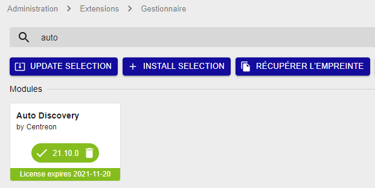

import { Tabs } from '@rspress/core/theme';
import { Tab } from '@rspress/core/theme';

## Installer le module d'autodécouverte

1. Pour installer le paquet, exécutez la commande suivante sur le serveur Central :

<Tabs groupId="sync">
<Tab value="Alma / RHEL / Oracle Linux 8" label="Alma / RHEL / Oracle Linux 8">

```shell
dnf install -y centreon-auto-discovery-server
```

</Tab>
<Tab value="Alma / RHEL / Oracle Linux 9" label="Alma / RHEL / Oracle Linux 9">

```shell
dnf install -y centreon-auto-discovery-server
```

</Tab>
<Tab value="Debian 12" label="Debian 12">

```shell
apt update && apt install centreon-auto-discovery-server
```

</Tab>
</Tabs>

2. Pour installer l'extension, connectez-vous à l’interface web de Centreon avec un compte ayant le
droit d’installer des modules et rendez-vous dans le menu **Administration >
Extensions > Gestionnaire**.

3. Assurez-vous que les modules **License Manager** et **Gestionnaire de connecteurs de supervision** sont à jour
 avant de procéder à l'installation du module **Auto Discovery**.

4. Cliquez sur l’icône d’installation correspondant au module **Centreon Auto
Discovery**. Le module est maintenant installé :

  

5. Rendez-vous dans le menu **Configuration > Connecteurs > Connecteurs de supervision** et [installez les connecteurs de supervision
](../pluginpacks.md#installer-le-pack) correspondant aux fournisseurs de découverte désirés.
