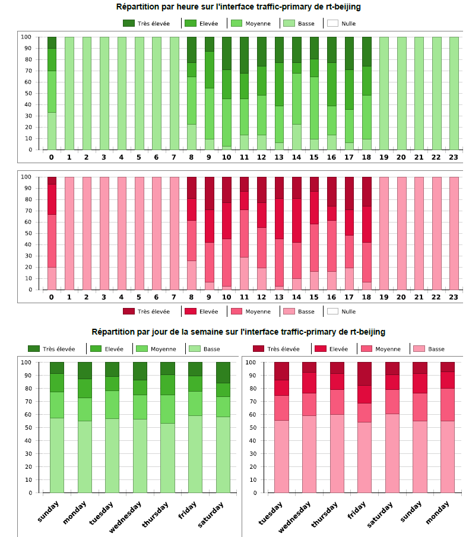
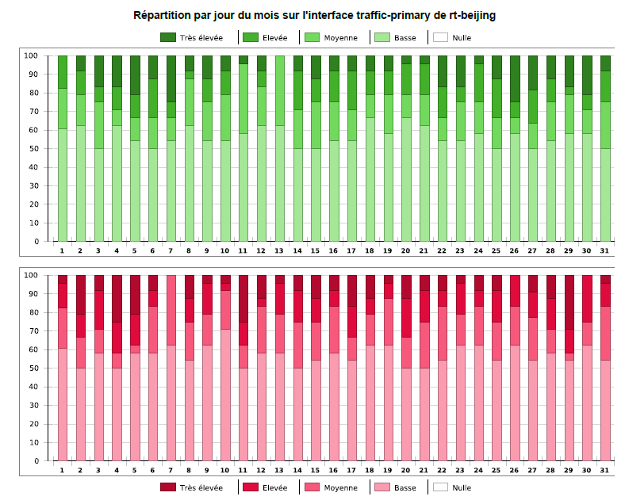
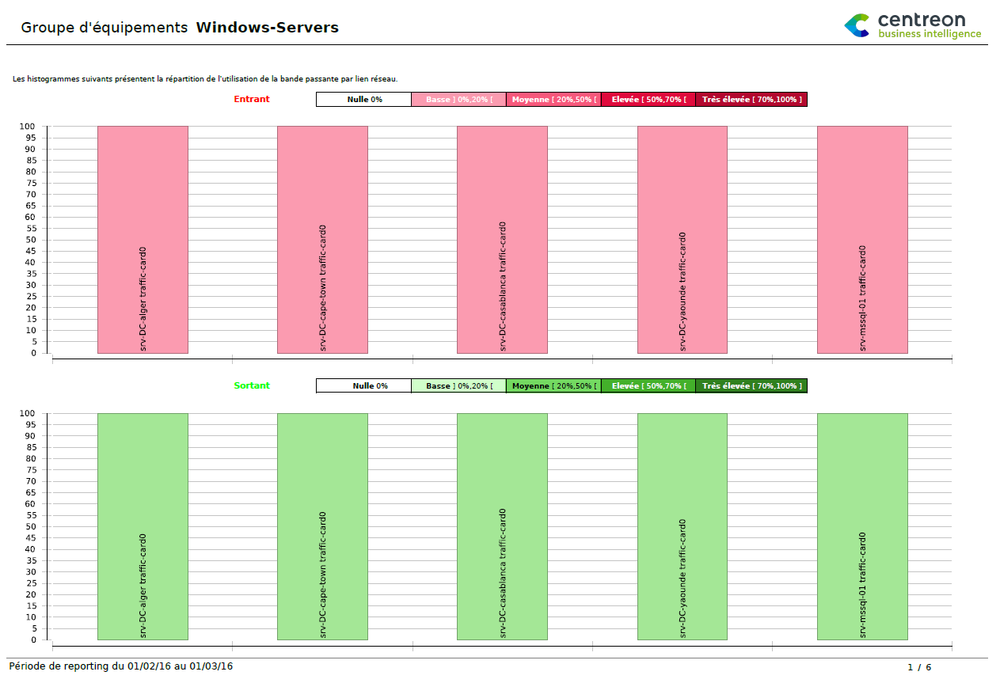
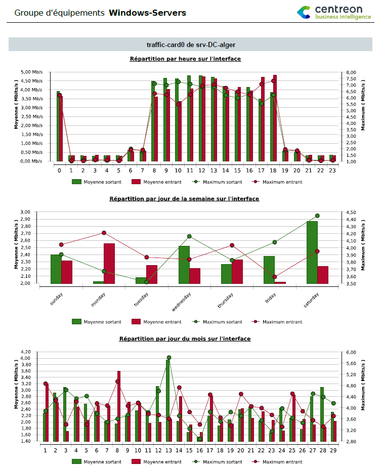
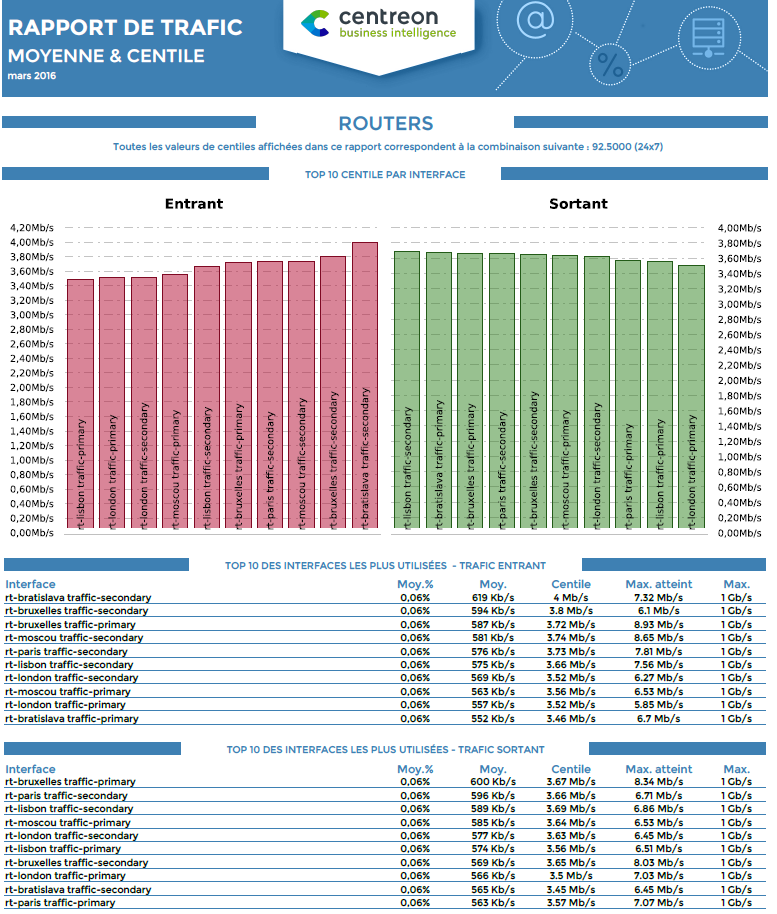
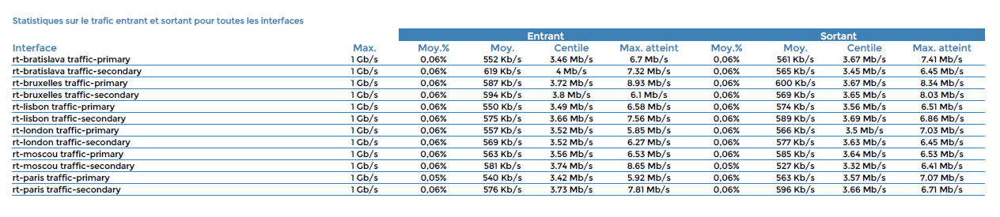

## Réseau

### Hostgroup-Traffic-By-Interface-And-Bandwith-Ranges

Ce rapport permet de visualiser l'utilisation de la bande passante
entrante et sortante sur les interfaces réseau d'un groupe d'hôtes.

#### Comment interpréter ce rapport

#### Première page

On trouve sur la première page la répartition en pourcentage de
l'utilisation de la bande passante par intervalle.

5 intervalles sont possibles :

- Utilisation nulle
- Utilisation basse
- Utilisation moyenne
- Utilisation élevée
- Utilisation très élevée


#### Pages suivantes

Les pages suivantes sont automatiquement générées pour toutes les
interfaces du groupe d'hôtes (une page par interface) et affichent
l'utilisation de la bande passante par intervalle avec une répartition
par :

- Les heures d'une journée
- Les jours d'une semaine
- Les jours d'un mois





#### Paramètres

Les paramètres attendus dans ce rapport :

- Une période de reporting
- Les objets Centreon suivants :

| Paramètres                  | Type             | Description                                                                     |
|-----------------------------|------------------|---------------------------------------------------------------------------------|
| Host group                  | Liste déroulante | Sélection du groupe d’hôtes                                                     |
| Host category               | Multi sélection  | Catégories d’hôtes                                                              |
| Service category            | Multi sélection  | Catégories de services de **trafic**                                            |
| Low level treshold (%)      | Champ texte      | Seuil bas d’utilisation de la bande passante, en pourcentage (entre 0 et 100)   |
| Average level threshold (%) | Champ texte      | Seuil d’utilisation moyen de la bande passante, en pourcentage (entre 0 et 100) |
| High level threshold (%)    | Champ texte      | Seuil d’utlisation haut de la bande passante, en pourcentage (entre 0 et 100)   |
| Inbound traffic metric      | Liste déroulante | Nom de la métrique pour le trafic entrant                                       |
| Outbound traffic metric     | Liste déroulante | Nom de la métrique pour le trafic sortant                                       |

#### Pré-requis

Pour assurer la cohérence des données dans les graphiques et tableaux de
performance, certains pré-requis sont à respecter concernant le retour
des plugins.

Les données de performance retournées par les plugins de trafic doivent
être formatées de cette manière et comporter une métrique de **trafic
entrant** et une métrique de **trafic sortant**:

```text
output-plugin | traffic_in=valueunit;warning_treshold;critical_treshold;minimum;maximum traffic_out=value
```

Il est important de contrôler que la valeur maximum est bien retournée.
Enfin, assurez vous que les plugins de stockage retournent des valeurs
en **bits/secondes**.

### Hostgroup-Traffic-average-By-Interface

Ce rapport permet de visualiser l'utilisation de la bande passante
entrante et sortante sur les interfaces réseau d'un groupe d'hôtes.

#### Comment interpréter ce rapport

#### Première page

On trouve sur la première page la répartition en pourcentage de
l'utilisation de la bande passante par intervalle.

5 intervalles sont possibles :

- Utilisation nulle
- Utilisation basse
- Utilisation moyenne
- Utilisation elevée
- Utilisation très elevée

Ces intervalles sont paramétrables.



#### Pages suivantes

Les pages suivantes sont automatiquement générées pour toutes les
interfaces du groupe d'hôtes (une page par interface) et affichent la
répartition de la bande passante par :

- **Heures de la journée** en affichant:
  - La moyenne d'utilisation par heure de la journée du trafic
    entrant et sortant sur la période de reporting sélectionnée
  - Le maximum atteint du trafic entrant et sortant par heure de la
    journée sur la période de reporting sélectionnée
- **Jours de semaine** en affichant:
  - La moyenne d'utilisation par jour de la semaine du trafic
    entrant et sortant sur la période de reporting sélectionnée
  - Le maximum atteint du trafic entrant et sortant par jour de
    semaine sur la période de reporting sélectionnée
- **Jours de mois** en affichant:
  - La moyenne d'utilisation par jour de mois du trafic entrant et
    sortant sur la période de reporting sélectionnée
  - Le maximum atteint du trafic entrant et sortant par jour de mois
    sur la période de reporting sélectionnée



#### Paramètres

Les paramètres attendus dans ce rapport :

- Une période de reporting
- Les objets Centreon suivants :

| Paramètres                  | Type             | Description                                                                     |
|-----------------------------|------------------|---------------------------------------------------------------------------------|
| Host group                  | Liste déroulante | Sélection du groupe d’hôtes                                                     |
| Host category               | Multi sélection  | Catégories d’hôtes                                                              |
| Service category            | Multi sélection  | Catégories de services de **trafic**                                            |
| Low level treshold (%)      | Champ texte      | Seuil bas d’utilisation de la bande passante, en pourcentage (entre 0 et 100)   |
| Average level threshold (%) | Champ texte      | Seuil d’utilisation moyen de la bande passante, en pourcentage (entre 0 et 100) |
| High level threshold (%)    | Champ texte      | Seuil d’utlisation haut de la bande passante, en pourcentage (entre 0 et 100)   |
| Inbound traffic metric      | Liste déroulante | Nom de la métrique pour le trafic entrant                                       |
| Outbound traffic metric     | Liste déroulante | Nom de la métrique pour le trafic sortant                                       |

#### Pré-requis

Pour assurer la cohérence des données dans les graphiques et tableaux de
performance, certains pré-requis sont à respecter concernant le retour
des plugins.

Les données de performance retournées par les plugins de trafic doivent
être formatées de cette manière et comporter une métrique de **trafic
entrant** et une métrique de **trafic sortant**:

```text
output-plugin | traffic_in=valueunit;warning_treshold;critical_treshold;minimum;maximum traffic_out=value
```

Il est important de contrôler que la valeur maximum est bien retournée.
Enfin, assurez vous que les plugins de stockage retournent des valeurs
en **bits/secondes**.

### Hostgroup-monthly-network-percentile

Ce rapport vous donne des statistiques de moyenne et de centile du
traffic entrant et sortant des interface réseaux. Ce rapport est un
rapport mensuel, la période de reporting doit de ce fait être un mois
complet, terminé.

#### Comment interpréter ce rapport

Sur la première page, il y a 3 informations :

- Deux graphiques présentant les 10 interfaces ayant des valeurs de
  centile les plus élevées, pour le trafic entrant et sortant
- Les 10 interfaces ayant leur moyenne d'utilisation de la bande
  passante entrante la plus élevée
- Les 10 interfaces ayant leur moyenne d'utilisation de la bande
  passante sortante la plus élevée



Sur la ou les pages suivantes, on retrouve un listing de toutes les
interfaces, triées par noms d'hôtes et de services sur lesquels on
retrouve toutes les statistiques d'utilisation de la bande passante.



#### Paramètres

Les paramètres attendus dans ce rapport :

- Une date correspondant au mois sur lequel générer le rapport (date de début
  sur l'interface de Centreon MBI)
- Les objets Centreon suivants :

| Paramètres              | Type             | Description                                                                 |
|-------------------------|------------------|-----------------------------------------------------------------------------|
| Host group              | Liste déroulante | Sélection du groupe d’hôtes                                                 |
| Host category           | Multi sélection  | Catégories d’hôtes                                                          |
| Service category        | Multi sélection  | Catégories de services de trafic                                            |
| Plage horaire           | Liste déroulante | Plage horaire utilisée pour les moyennes d’utilisation de la bande psssante |
| Centile/Timeperiod      | Liste déroulante | Combinaison utiliser pour les statistiques de centile                       |
| Inbound traffic metric  | Liste déroulante | Nom de la métrique pour le trafic entrant                                   |
| Outbound traffic metric | Liste déroulante | Nom de la métrique pour le trafic sortant                                   |

#### Pre-requis

- La configuration concernant les calculs de centile doit avoir été
  faite dans la partie General Option > Onglet "ETL"

- Pour assurer la cohérence des données dans les graphiques et
  tableaux de performance, certains pré-requis sont à respecter
  concernant le retour des plugins. Les données de performance
  retournées par les plugins de trafic doivent être formatées de cette
  manière et comporter une métrique de **trafic entrant** et une
  métrique de **trafic sortant** :

```text
output-plugin | traffic_in=valueunit;warning_treshold;critical_treshold;minimum;maximum traffic_out=value
```

> Il est important de contrôler que la valeur maximum est bien
> retournée. Enfin, assurez vous que les plugins de stockage retournent
> des valeurs en **bits/secondes**.
