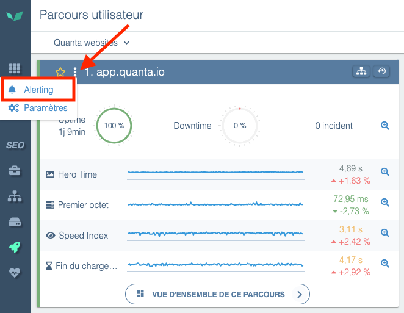
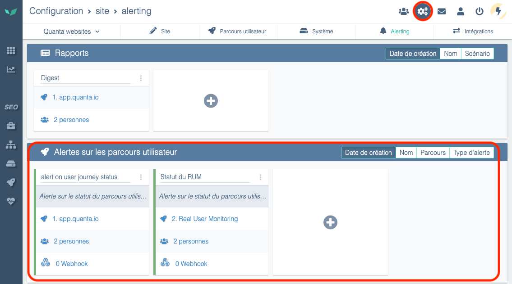
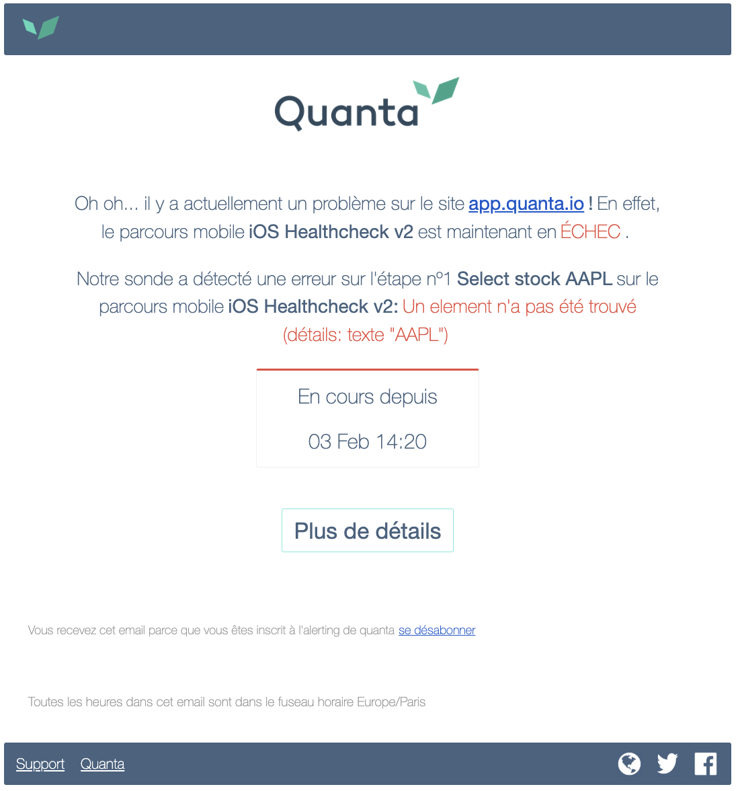
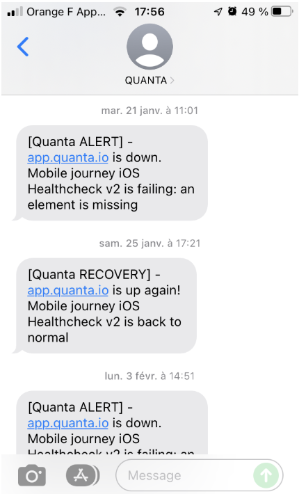
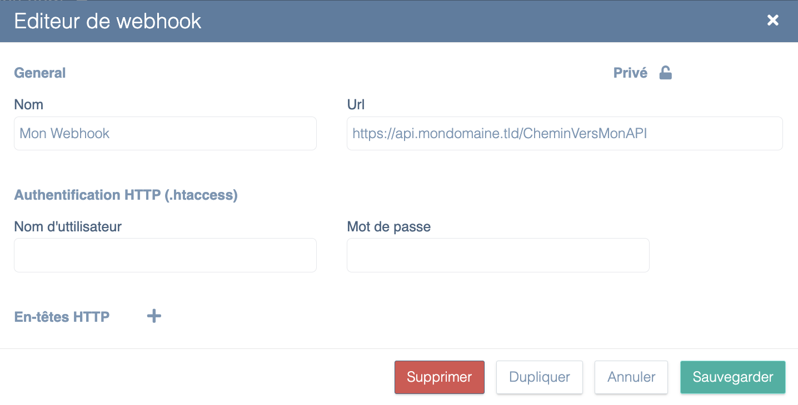

---
id: receive-and-configure-alerts
title: Recevoir et configurer les alertes
---

Les alertes sont accessibles **dans toutes les licences par email**.

Certaines licences permettent de recevoir des alertes **par SMS, par Slack, ou par webhooks** (Microsoft Teams, Google Chat, Mattermost...). Pour souscrire à cette option, contactez votre interlocuteur commercial ou le support: 

[Contacter le support Experience Monitoring](../getting-started/contact-support.md)

## Configurer les moyens de communication

Les notifications sont **personnelles**. Pour qu’un utilisateur reçoive les emails, les SMS ou Slack, il suffit de configurer dans sa page profil les informations.


Page profil

Pour envoyer une notification dans un canal Teams, Google Chat, ou d’autres logiciels de messagerie, vous pourrez utiliser les webhooks dans les alertes.

>Si vous souhaitez envoyer des notifications à un email d’équipe, vous pouvez créer un utilisateur utilisant cet email d’équipe. Référez-vous à la page dédiée : [Gérez vos utilisateurs et leurs droits](./manage-users-and-rights.md)

## Accéder à l’écran de configuration des alertes et rapports

Vous pouvez accéder à l’écran de configuration en cliquant sur les trois petits points au-dessus d’un parcours utilisateur, puis sur *Alerting*.



Vous pouvez aussi accéder à l’écran de configuration soit en cliquant sur *Configuration* puis *Alerting*.



## Mettre en place les alertes

### Planning d’alerting

Les utilisateurs peuvent définir les périodes pendant lesquelles ils ne reçoivent pas d’alertes.


Egalement, chaque alerte peut être activée/désactivée sur des plages horaires pour ne pas notifier les personnes abonnées à cette alerte, quelque soit leur propre planning.

### Configurer une alerte

Sélectionnez la façon dont vous souhaitez être alerté (SMS/Email/Slack). Voici quelques exemples de messages que vous pourrez recevoir :

#### Email



#### SMS



#### Webhook

En complément des alertes par e-mail ou SMS, Experience Monitoring permet aux utilisateurs de recevoir leurs alertes via un **webhook**, offrant ainsi une plus grande flexibilité pour l'intégration avec d'autres outils et systèmes. Lorsqu'un incident est détecté sur une application web surveillée, Experience Monitoring peut envoyer une requête **HTTP POST** à une URL spécifiée par l'utilisateur. Cette URL peut être protégée par un accès **htaccess**, et l'utilisateur peut également définir des **headers spécifiques** si nécessaire.
La configuration de cette URL est disponible en cliquant sur le mot “Webhook” d’une alerte nouvellement créée ou pré-existante, puis en cliquant sur l’icone “**+**” (**Créer un webhook**) :


Ensuite il suffit de rentrer l’URL de votre choix et les éventuels paramètres de connexion htaccess (si l’API est sécurisée par un Htaccess) :



Le corps de la requête POST qui sera envoyée en cas d’alerte contient un **payload JSON** avec des informations détaillées sur l'alerte, permettant une exploitation automatisée des données. Voici un exemple du format envoyé :

```json
{
  "start_clock": 1739292540,
  "journey_id": 3682,
  "journey_name": "1. Mon scénario",
  "interaction_id": 19640,
  "interaction_name": "Accueil",
  "interaction_number": 0,
  "incident_id": 5898982,
  "incident_kind": "expectation_failed",
  "traits": {
    "pending_expectations": [
      {
        "kind": "text",
        "details": "vous êtes ici"
      }
    ],
    "details": "50s",
    "current_url": "https://perdu.com/"
  },
  "url": "https://app.quanta.io/app/sites/1390/uj/3682?from=1739292480&to=1739292660",
  "settings_url": "https://app.quanta.io/app/settings/sites/1390/alerting?section=uj&ids=4947",
  "alert_status": "error",
  "site_name": "perdu.com",
  "site_id": 1390,
  "detected_at_clock": 1739292540
}
```

Explication des données envoyées :

- **`start_clock`** : Timestamp Unix indiquant le début de l'incident.
- **`journey_id`** et **`journey_name`** : ID et nom du parcours utilisateur.
- **`interaction_id`**, **`interaction_name`**, **`interaction_number`** : Informations sur l'étape spécifique du parcours ayant déclenché l'alerte (ex: l’ID de la page d'accueil).
- **`incident_id`** et **`incident_kind`** : Identifiant unique de l'incident et type de problème détecté (ex: "expectation_failed" si un élément n’a pas été trouvé dans la page).
- **`traits`** :
    - **`pending_expectations`** : Liste des vérifications qui ont échoué (ex: un test de texte).
    - **`details`** : Informations complémentaires sur l'incident (ex: temps d'attente de 50s).
    - **`current_url`** : URL en cours dans le navigateur au moment de l'incident.
- **`url`** : Lien direct vers l'incident dans l'interface Experience Monitoring.
- **`settings_url`** : Lien vers la configuration des alertes associées au site concerné.
- **`alert_status`** : Statut de l'alerte (ex: "error" pour une erreur critique).
- **`site_name`** et **`site_id`** : Nom et ID du site concerné.
- **`detected_at_clock`** : Timestamp Unix de la détection de l'incident.

Une fois l’alerte terminée (quand le site est de nouveau opérationnel), Experience Monitoring enverra un nouvel appel webhook de “Recovery” indiquant que le problème est résolu.
Le corps de la requête POST qui sera envoyée en cas de **résolution d’alerte** contient également un **payload JSON** avec des informations détaillées, comme ceci :

```json
{
  "start_clock": 1739292540,
  "end_clock": 1739293920,
  "duration": 1380,
  "journey_id": 3682,
  "journey_name": "1. Mon scénario",
  "url": "https://app.quanta.io/app/sites/1390/uj/3682?from=1739292540&to=1739293920",
  "settings_url": "https://app.quanta.io/app/settings/sites/1390/alerting?section=uj&ids=4947",
  "alert_status": "recovery",
  "site_name": "perdu.com",
  "site_id": 1390,
  "detected_at_clock": 1739294100
}
```

Explication des données envoyées :

- **`start_clock`** : Timestamp Unix indiquant le début de l'incident.
- **`end_clock`** : Timestamp Unix indiquant la fin de l'incident (moment où la situation est revenue à la normale).
- **`duration`** : Durée totale de l'incident en secondes (ex: ici **1380s** soit **23 minutes**).
- **`journey_id`** et **`journey_name`** : ID et nom du parcours utilisateur concerné par l’incident.
- **`url`** : Lien direct vers l'incident dans l'interface Experience Monitoring, permettant de consulter l’évolution de la situation.
- **`settings_url`** : Lien vers la configuration des alertes associées au site concerné.
- **`alert_status`** : Statut de l’alerte, ici `"recovery"` pour indiquer que l'incident est terminé.
- **`site_name`** et **`site_id`** : Nom et ID du site concerné par l'incident.
- **`detected_at_clock`** : Timestamp Unix de la détection de la récupération, soit le moment où Experience Monitoring a constaté la résolution du problème.

Grâce à cette fonctionnalité, les équipes techniques peuvent **automatiser le traitement des alertes** en les intégrant dans leurs systèmes internes (Slack, outils de monitoring, scripts personnalisés, etc.) ou externes (Zapier, Pagerduty, etc.).

## Paramétrer les seuils d'alerte

Une fois votre alerte créée, vous avez la possibilité de configurer différents seuils:

- Le seuil d'alerte
- Le seuil de résolution

Pour lesquels vous recevrez une notification.

En fonction de votre type d'alerte, vous allez pouvoir contrôler différents seuils:

- **Alerte sur le statut du** **scénario:** sélectionnez au bout de combien d'erreurs (pages non accessible, chaîne de caractère manquante, timeout, sélecteur dynamique introuvable) vous souhaitez être averti. Par défaut le seuil d'alerte est à 3 échecs sur une période de 5 minutes et votre scénario est considéré comme "réparé" lorsque sur une période de 5 minutes nous n'avons eu aucune erreur.
- **Alerte sur le temps du scénario:** sélectionnez votre limite de tolérance sur l'augmentation du temps du scénario, par défaut, si le temps total de votre scénario dépasse de 15 % le temps de la veille au moins 15 fois sur 25 passages de sonde, vous serez averti.

## Questions fréquentes

### Suite à quel type d’erreur serai-je alerté ?

Vous recevrez une alerte pour les anomalies de type : Code d’erreur, Site indisponible, Temps de chargement trop longs (+ de 20 sec), etc.

Chaque erreur est représentée par des barres rouges dans Experience Monitoring. Pour savoir exactement ce qui s’est passé, nous vous invitons à regarder le message d’alerte que vous avez reçu et dans lequel la raison de l’incident est explicitée.

### Y-a-t’il des quotas dans les alertes ?

Il n’y a pas de quotas pour les emails, les webhooks et les notifications Slack mais il y en a pour les SMS. Le quota de SMS est fixé par site et recrédité tous les mois.

Pour voir votre crédit de SMS, aller dans *Configuration*, puis dans l’onglet *Site*. Vous trouverez votre quota dans la partie *Alertes & Rapports*


