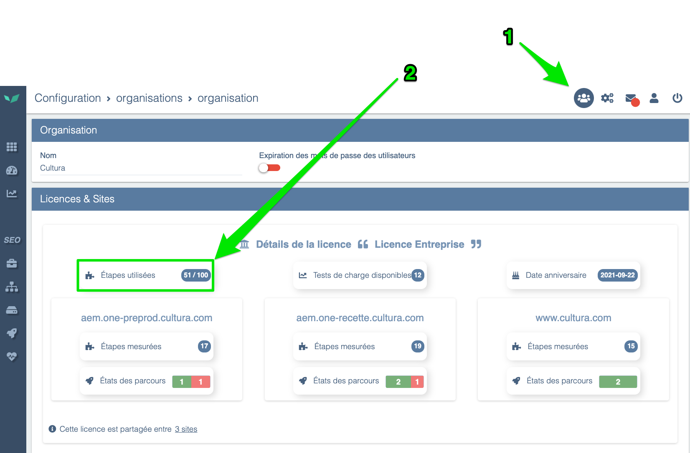
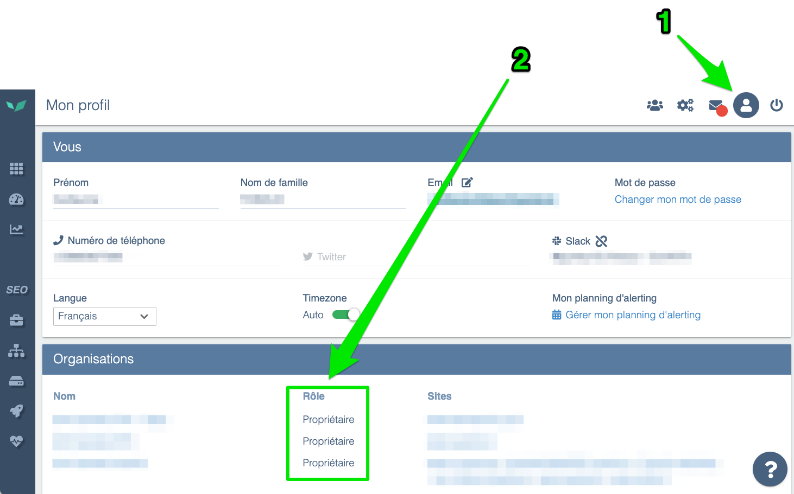
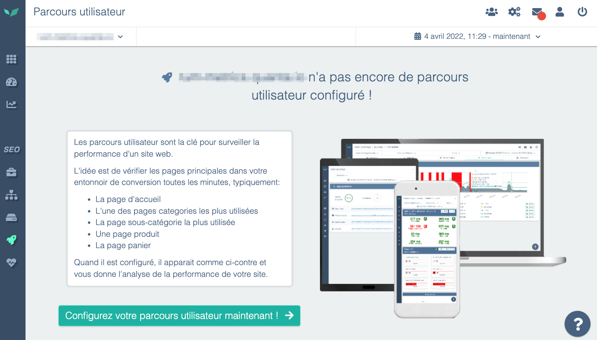
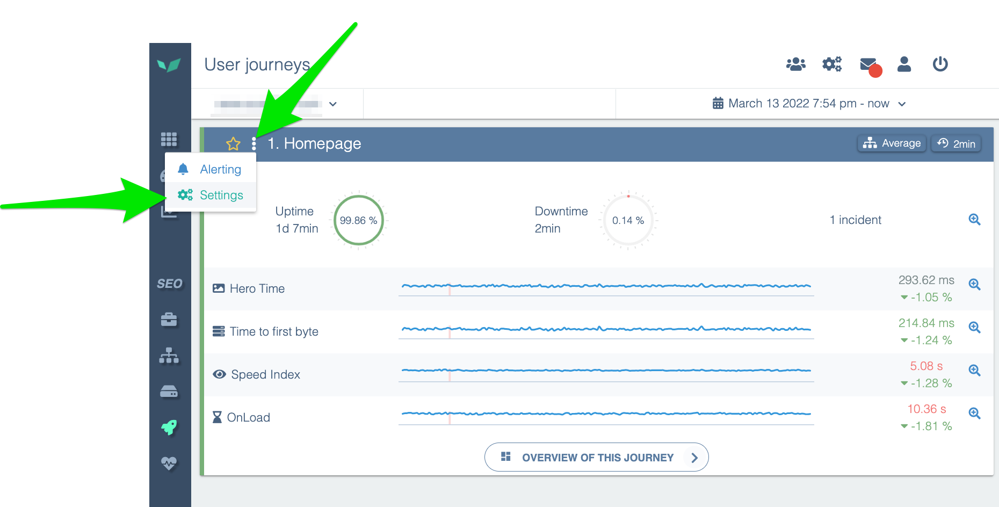
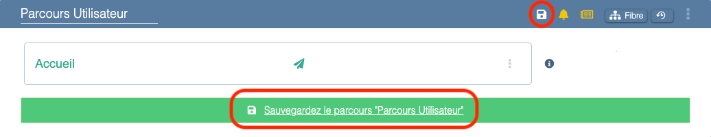
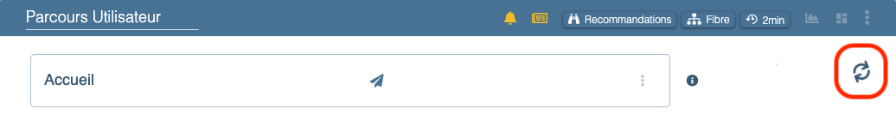

---
id: create-a-scenario
title: Création d’un scénario (”Parcours Utilisateur”)
--- 

Vous pouvez vérifier qu’il vous reste suffisamment d’étapes dans la page Organisation



Vous devez disposer des droits Propriétaire ou Administrateur pour modifier vos scénarios. Vous pouvez vérifier dans votre page Profil



Pour les modifier, consultez:

[Gérez vos utilisateurs et leurs droits](../manage-users-and-rights.md)

## Entrer en mode création/édition de parcours

Le mode édition de parcours vous permet de modifier vos parcours ou d’en créer de nouveau. Dans la barre du menu à gauche, cliquez sur ***Parcours Utilisateurs***. A ce stade, il y a 2 possibilités:

### Vous n’avez pas encore de parcours

Si le site n’a pas de Parcours Utilisateur configuré, alors ce message s’affiche :



Vous pouvez cliquer sur *“Configurez votre parcours utilisateur maintenant !”* pour entrer en mode édition.

### Vous avez déjà au moins un parcours

Si un parcours existe**,** vous verrez un écran semblable à celui-ci:



Cliquez sur les 3 points et sur *Configurer* pour entrer en mode édition/création.

## Créer un parcours

> Si le site que vous souhaitez superviser est interne à votre organisation, vous devrez créer une [zone STM](stm-zones.md) en plus du parcours utilisateur.

En bas de la page d’édition, vous trouverez un bouton pour créer un nouveau parcours:


Bouton d’action en mode édition

Experience Monitoring génère un nouveau parcours avec une seule étape: la navigation vers la racine de votre nom de domaine.

## Activer le parcours

Pour activer votre parcours, vous devez le sauvegarder. Pour cela, cliquer sur l’icône *Sauvegarder* ou sur le bouton au pied de votre parcours:



Options pour sauvegarder un parcours utilisateur

Vous verrez un symbole de chargement dans le coin supérieur droit qui indique que votre parcours fonctionne mais que la sonde n’est pas encore passée depuis les dernières modifications



Indicateur de changements sauvegardés mais pas encore exécuté par la sonde

Lorsque que la sonde passe, le contenu est mis à jour automatiquement. Vous verrez alors les captures d’écran.

## Configurer des étapes

>**Une étape contient au moins une action** et s’arrête nécessairement en cas de navigation. **Vous pouvez configurer plusieurs actions dans une étape**, mais une étape ne peut pas contenir plusieurs navigations.
>Par exemple, vous pouvez remplir un formulaire, ajouter au panier un produit puis cliquer pour naviguer vers le panier en une étape.

### Configurer une action

Il existe 6 actions possibles:

#### Naviguer

Choisissez une URL vers laquelle naviguer. Cette action est équivalente à entrer une URL dans la barre d’adresse et y aller.

L’URL doit faire partie du domaine autorisé pour votre licence Experience Monitoring.

#### Cliquer

Pour choisir sur quoi cliquer vous avez 2 choix:

- Chercher un texte
- Chercher un élément par son sélecteur CSS

Si vous cherchez un texte, celui-ci doit faire partie d’une seule balise HTML. Un texte peut sembler visuellement cohérent mais être séparé par une balise.

```html
<p>Cliquez <span class="emphasis">vite</span> pour découvrir la suite</p>
```

```html
<p>Cliquez vite pour découvrir la suite</p>
```

Par défaut, Experience Monitoring cliquera sur la première occurence détectée. Vous pouvez choisir de:

- cliquer sur la première occurence (par défaut)
- cliquer sur la deuxième, la troisième, etc
- cliquer au hasard parmi toutes les occurrences

#### Survoler

Survoler utilise exactement les mêmes conditions que Cliquer mais se limite à passer la souris sur le texte ou l’élément CSS choisi.

Cette action est utile si des éléments ne se chargent pas tant que la souris n’a pas survolé une zone de l’écran.

#### Remplir un formulaire

La complétion d’un formulaire est possible dans Experience Monitoring. La sonde s’appuie sur les standards HTML.

**Sélecteur CSS du formulaire**

Si une page contient plusieurs formulaires, cette option permettra de bien limiter la sonde au formulaire choisie.

**Remplir les champs**

Les champs peuvent être sélectionnés par leurs noms (attribut *name*), leurs placeholders, le texte de leurs labels, ou par des sélecteurs CSS.

**Soumettre le formulaire**

Par défaut, Experience Monitoring envoie le formulaire une fois rempli. Mais vous pouvez modifier ce comportement. Vos options sont:

- Soumettre automatiquement (par défaut): équivalent à taper la touche Entrée dans un formulaire
- Désactivé: ne rien faire une fois le formulaire rempli
- Cliquer sur un texte: utile si l’envoi du formulaire se fait ailleurs dans la page
- Cliquer sur un élément CSS: idem

#### Attendre

Parfois, vous n’avez pas de solution plus simple que d’attendre qu’une action se passe. Par exemple, si les éléments s’affichent en fondu après 1s, alors attendre 1s vous permet d’avoir des captures d’écrans avec ces éléments affichés.

C’est une solution de dernier recours qui ne devrait être que rarement utilisé.

#### Exécuter un script

Si toutes les autres actions échouent, vous pouvez utiliser cette option pour exécuter du JavaScript dans le navigateur afin de déclencher une action. Évitez d'utiliser un script simplement pour remplacer une autre action si ce n'est pas nécessaire. 

Notez que le script garantit l'exécution d'une action mais pas son résultat. Ajoutez une vérification après chaque script :
- DOM: (élément visible, classe changée)
- Network: requête attendue (URL, statut HTTP...)

Faites des scripts courts, simples et avec des spécifications précises.

### Configurer une vérification

Lorsqu’une action est effectuée, vous pouvez ajouter des vérifications de succès.

**La dernière action doit avoir au moins une vérification.**

#### Confirmer qu’une navigation a été effectuée

>Cette vérification ne peut pas être retirée pour une action Naviguer.

La sonde va vérifier qu’un nouveau document HTML a été chargé correctement, c’est-à-dire:

- Le document HTML a été chargé complètement
- Le code de retour est 200

Aucune vérification du contenu n’est faite.

#### Trouver le texte

>Nous vous recommandons d’utiliser des sélecteurs CSS car moins sensible aux changements du site.
>Si vous ne savez pas comment créer vos sélecteurs CSS, contactez votre agence ou le support Experience Monitoring (support@quanta.io ou le point d’interrogation en bas à droite dans Experience Monitoring) pour que nous vous configurions votre parcours.

Cette vérification utilise la même logique que les actions Cliquer et Survoler. Si le texte que vous cherchez existe sur la page après l’action, alors la vérification est acceptée

#### Trouver l’élément CSS

Cette vérification cherche un élément par son sélecteur CSS. **S’il s’agit d’une image, la sonde vérifie également que l’image charge correctement.**

#### Faire une requête

Cette vérification valide qu’une requête vers une adresse a été fait à un moment après l’action. La requête doit être un succès également, les redirections sont possibles.

Vous pouvez utiliser le joker * pour chercher les requêtes. Par exemple, si vous devez appeler une URL pour ajouter un élément au panier qui aurait la forme *https://mon-site.com/add-to-cart?id=id-de-mon-produit* alors vous pouvez remplacer par *https://mon-site.com/add-to-cart** pour éviter que la vérification échoue si l’ID du produit change ou si un autre paramètre vient s’ajouter avant ou après l’ID.

## Configuration avancée de l’étape

Les étapes ont également des paramètres propres, qui influenceront les actions à l’intérieur. Pour accéder à cette configuration avancée, cliquer sur les trois petits points au bout de la ligne de l’étape souhaitée et cliquer sur *Avancé*.

### Activée/Désactivée: supprimer l’étape du parcours sans perdre la configuration

Vous pouvez décider de retirer une étape sans la supprimer. La sonde ignorera cette étape et ne la jouera pas

### Mesurée/Non mesurée: jouer l’étape mais ne pas vérifier les résultats

Retirer cette option permet d’exécuter cette étape sans la mesurer ou la montrer ailleurs dans l’interface. Un exemple de l’utilité de cette option serait de fermer un formulaire de demande d’avis qui se produit aléatoirement sur une partie de votre trafic. Parfois la sonde va le rencontrer et le fermera, les autres fois la sonde ignorera l’erreur provoquée par le fait de ne pas avoir rencontré le formulaire.

#### Timeout d’étape

Vous pouvez définir que cette étape à un timeout différent, soit plus court, soit plus long que la configuration générale du parcours.

## Configuration générale d’un parcours

Chaque étape a des actions, et l’ensemble de parcours a des options de configuration à définir. Pour accéder à ces configurations, en mode édition, cliquer sur les 3 petits points de votre parcours, puis *Avancé* pour accéder au menu.

### Nom

Choisissez un nom pour désigner ce parcours dans les rapports et dans les différents écrans d'Experience Monitoring.

Nous vous recommandons d’utiliser des noms bien distincts, et d’utiliser un système de numérotation. Par exemple:

- 1- Commande invitée
- 2- Connexion compte perso

### Profilage PHP

>Par défaut, Experience Monitoring l’active s’il reçoit des données PHP.

Permet d’activer / désactiver le profilage PHP sur ce parcours si vous avez l’agent système Experience Monitoring et le module PHP installé sur vos serveurs.

Vous pouvez retrouver la procédure d’installation des agents sur cette page: 

[Checklist d’installation d'Experience Monitoring](../../installation/installation-checklist.md)

### Vérifier le certificat SSL

>Activé par défaut.

Permet d’activer / désactiver la vérification de conformité du certificat TLS/SSL.

Lorsque qu’un site n’est pas sécurisé, les clients peuvent voir un écran équivalent à celui-ci.


Exemple de page d’échec SSL

Par défaut, Experience Monitoring considère que le parcours est en échec en cas de problème de sécurité de ce type. Désactivez l’option pour ignorer ces erreurs.

### Authentification HTTP Basic (.htaccess)

Certains sites, notamment les environnements de préproduction, utilisent des authentifications HTTP Basic (ou .htaccess) pour protéger le site des accès externes, en plus de l’authentification des utilisateurs.

Renseignez un nom d’utilisateur et un mot de passe pour activer cette option d’authentification. Si les champs sont vides, la sonde n’enverra pas de requête utilisant l’authentification HTTP Basic.

### Paramètres du navigateur utilisé (réseau fibre/4G, ordinateur ou téléphone, etc)

**Activer le cache navigateur**

>Par défaut, activé

Les navigateurs “cachent” le contenu. Par exemple, le logo de votre site n’est pas chargé à chaque fois que l’utilisateur ouvre une nouvelle page de votre site. Le navigateur reconnait qu’il s’agit de la même image et l’affiche depuis la mémoire plutôt que de la télécharger.

Désactivez pour que la sonde télécharge tous les contenus à chaque interaction.

**User Agent**

>Par défaut, la sonde s’identifie comme un navigateur Google Chrome

Le User Agent est une information donnée par le navigateur à votre site pour indiquer quel navigateur il utilise afin de pouvoir adapter les contenus si besoin.

Il peut être utile de le changer pour identifier la sonde différemment du trafic classique.

**Limite de bande passante**

Choisissez une bande passante représentative de votre trafic. Choisissez 3G ou 4G quand vous utilisez un format téléphone, et ADSL ou Fibre quand vous utilisez un format ordinateur

**Simuler un appareil**

Choisissez un type d’appareil comme un ordinateur, une tablette, ou un téléphone parmi la liste.

>Modifier le type d’appareil ne modifie pas le navigateur ou le matériel utilisé mais simule la taille d’écran de l’appareil choisi

**Orientation**

Choisissez si le téléphone ou la tablette est utilisé en mode portrait ou paysage.

**Cookies**

Ajoutez des cookies personnalisés pour stocker des données ou des sessions au lancement du parcours

**En-têtes HTTP**

Vous pouvez ajouter des headers HTTP personnalisés

### Paramètres de la sonde (intervalle de mesure, timeout)

**Attendre le chargement complet**

>Par défaut, activé

Par défaut, la sonde attend l’évènement OnLoad avant de passer à l’étape suivante, même si les vérifications sont réussies. Vous pouvez désactiver ce comportement et forcer la sonde à avancer dès que les vérifications sont finies, même si la page n’est pas chargée.

**Intervalle de mesure**

>Si le parcours dure plus longtemps que l’intervalle de mesure, la sonde ne finira pas le parcours et reprendra au début.
>Un intervalle de mesure plus grand, c’est moins de données qui transitent sur le réseau et moins de travail pour vos serveurs.

Choisissez tous les combien de temps la sonde doit passer sur le parcours

**Timeout d’étape**

Si la sonde passe ce temps sur une étape, la considérer en échec. Un temps trop court pose le risque d’avoir des faux positifs. Un temps trop grand pose le risque de ne pas avoir d’erreur et d’alertes pour des chargements lents.

### URLs en liste noire (exclure Experience Monitoring des statistiques de mesure de trafic)

Par défaut, nous excluons les fournisseurs suivants:

- DoubleClick
- Hotjar
- Google Analytics
- Notre propre RUM
- Google Ads
- Google Maps

Pour éviter que la sonde ne compte dans certains de vos outils, vous pouvez lui demander de ne pas envoyer de requête vers des domaines personnalisés.

Cela a 2 intérêts:

- Ne pas compter la sonde dans les statistiques de trafic
- Empêcher la sonde de charger des éléments avec un prix à l’affichage
    - Par exemple, Google Maps vous facture un prix basé sur le nombre de requête. Si la sonde accède à une page contenant une carte, vous serez facturé pour cela. Désactiver ce domaine permet de faire des économies.

Vous pouvez utiliser le joker * pour définir facilement une expression régulière. Par exemple, si vous excluez *https://mon-analyseur-de-trafic.fr/api/v*/**  alors les requêtes, qu’elles soient faites sur la v1, la v2, la v3, etc de cette API, et quelqu’en soit le contenu, seront bloquées par la sonde.

### Liste des variables

Les variables permettent de donner des informations à la sonde comme des mots de passe, ou des textes à envoyer lors du passage.

Par exemple, vous pouvez définir des variables *login* et *password* à insérer sur la page de connexion pour accéder à un espace.

Vous ne pouvez pas faire varier ces variables dans la partie “Parcours Utilisateur”, les variables sont utiles dans 2 cas:

- Vous avez besoin de valeurs différentes entre les mesures régulières et les audits de recommandations journaliers
- Vous avez besoin de valeurs différentes entres les différents navigateurs pendant un test de montée en charge (simuler plusieurs utilisateurs avec des logins différents)
