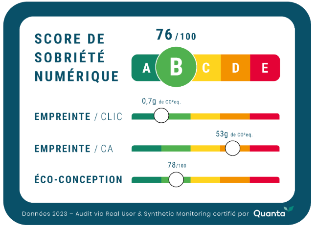
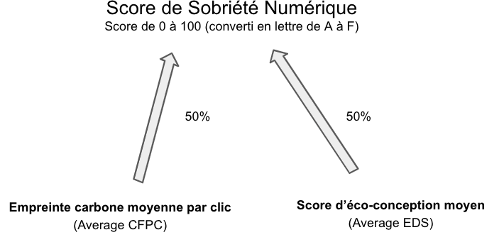

---
id: digital-sobriety-score
title: Score de Sobriété Numérique
--- 

Spécifications v1.1 (Avril 2023)

## Contexte : la raison d’être du Score de Sobriété Numérique

Chez Centreon, nous sommes convaincus que la transition écologique passe par une prise de conscience et une responsabilisation du secteur du numérique dans son impact environnemental.

Aujourd’hui le numérique représente 4% des gaz à effet de serre à l’échelle mondiale avec une tendance **en hausse de +8% par an**. Or dans le même temps, l’accord de Paris pour le climat exige d’engager une baisse annuelle de nos émissions, tous secteurs confondus, **de -7%** :

Bien qu’il soit utile pour décarboner d’autres industries, le numérique ne pourra donc pas échapper à une nécessaire baisse de ses propres émissions. Mais pour pouvoir s’améliorer, encore faut-il avoir **une mesure fiable et partagée**.

Pour pouvoir accompagner cette transition du numérique et le rendre compatible avec les limites planétaires, il nous a donc semblé essentiel d’avoir un guide standardisé et partagé par l’ensemble des acteurs du numérique, c’est la raison d’être du Score de Sobriété Numérique.

Le Score de Sobriété Numérique est une notation générale qui permet de mesurer l'empreinte environnementale d’un site internet ou d’une application web. Ce score peut être utilisé sans connaissance technique préalable, tout en permettant aux spécialistes du numérique et de la responsabilité environnementale des entreprises de suivre avec davantage de précisions l’ensemble des sous-indicateurs qui constituent le score global.

Avec ce score unifié, Experience Monitoring s’est donné pour mission de sensibiliser et d’accompagner l’ensemble des acteurs du numérique vers des choix plus responsables, en leur donnant les outils pour se comparer et améliorer progressivement l'impact environnemental de leurs applications actuelles et futures.

## Introduction à la méthodologie

Les quelques indicateurs existants dans le domaine de la mesure de l’empreinte environnementale du numérique sont pour la plupart assez complexes à lire sans faire partie des spécialistes du sujet et ils se limitent par ailleurs à quelques critères ce qui peine à faire progresser les acteurs sur l’ensemble des éléments qui constitue l’impact de leurs activités numériques.

Le Score de Sobriété Numérique est donc une **notation globale** qui regroupe l’ensemble des impacts environnementaux liés à l’usage d’un site internet ou d’une application mobile avec une notation simplifiée sous forme d’un score sur 100, également exprimé de A à E, comme un produit alimentaire :

Pour davantage de précision, il convient de lire le score sous sa forme numérique. Voici le tableau de correspondance entre le score numérique et la notation en lettre :

| Score de Sobriété Numérique | Notation en lettre |
| --- | --- |
| 0 à 45 | E |
| 45 à 60 | D |
| 60 à 75 | C |
| 75 à 90 | B |
| 90 à 100 | A |

Cette notation a la vertu de prendre en compte le champ d’impacts le plus large possible, tout en donnant une visibilité simplifiée aux directions digitales et directions RSE afin :

- de leur permettre de comparer plusieurs sites entre eux, comme plusieurs sites d’une même enseigne, ou encore un site versus ses concurrents.
- de leur permettre de mettre en place un plan d’action visant à rendre leurs applications davantage soutenables.
- d'être guidés sur le respect des bonnes pratiques d’éco-conception dès la construction de futurs projets numériques, que les développements soient menés par des équipes internes ou externes.

Dans le cadre du Score de Sobriété Numérique, Experience Monitoring s’engage à fournir des mesures actionnables permettant de respecter les principes du [GHG Protocol](https://www.greenly.earth/fr-fr/blog/guide-entreprise/ghg-protocol-quest-ce-que-cest-comment-ca-marche) : Pertinence, Exhaustivité, Permanence, Transparence et Exactitude.

En d’autres termes, la méthode de calcul et les méthodes de mesures utilisées **resteront transparentes et ouvertes** sous licence Creative Commons ([CC BY-NC-ND 4.0 DEED](https://creativecommons.org/licenses/by-nc-nd/4.0/deed.fr)), afin de permettre à toutes les équipes, et en particulier les plus spécialistes du numérique responsable, de comparer les résultats donnés par Experience Monitoring avec leurs propres calculs et outils de mesure.

Cette transparence permet à toutes les parties prenantes :

- d’effectuer elles-même des mesures de Score de Sobriété Numérique, y compris dans des contextes où Experience Monitoring ne pourrait pas avoir accès à leurs applications.
- de pouvoir suggérer des améliorations afin de faire évoluer positivement la méthode de calcul au fil de l’évolution des travaux de recherche dans le domaine du GreenIT.

## Méthode de calcul

Le calcul de l'empreinte environnementale du numérique est un domaine relativement nouveau et en constante évolution. De nouvelles informations sur les impacts de l’usage, de la fabrication et de la fin de vie du matériel numérique peuvent apparaître, par conséquent les algorithmes de calcul de ces impacts sont amenés à s’affiner chaque année.

Pour cette raison, Experience Monitoring a décidé de “versionner” la méthode de calcul pour garantir sa pertinence, de permettre aux utilisateurs de bénéficier des évolutions, sans pénaliser ses capacités de comparaison entre sites ou applications ayant été préalablement audités.

Sans modification des méthodes de mesures, il est également probable (et souhaitable !) que les valeurs médianes du marché s’améliorent d’année en année, ce qui amènera naturellement Experience Monitoring à ajuster les quantiles utilisés pour chaque paramètre dans le calcul du Score de Sobriété Numérique.

Dans ce document, nous décrivons l’algorithme de calcul actualisé au mois d’Avril 2023 (**version 1.1**), qui est la première version publique.

### Comment est calculé le Score de Sobriété Numérique ?

Tout d’abord, il est à noter que le **Score de Sobriété Numérique** peut être évalué via 2 types d’audits :

1. la méthode simple
2. la méthode “audit complet”

L’un des gros avantages de ces 2 types d’audit, c’est qu’il s’adapte aux moyens et exigences de précision de chacun, tout en donnant des scores totalement comparables entre eux. En réalité, la seule différence entre ces 2 méthodes est l’approximation qui est faite des impacts dans la méthode simple.

Comparatif entre les 2 méthodes et de leurs avantages :

|  | Méthode simple (cf. site [quanta.green](http://quanta.green)) | Méthode “audit complet” |
| --- | --- | --- |
| Durée | 3 à 5 minutes | minimum de 7 jours pour que les données collectées soient suffisamment exhaustives |
| Précision | Moyenne basée sur les 10 pages les plus fréquentées du site | Prise en compte de 100% des pages avec une pondération précise de la représentation de chaque page sur le trafic total du site |
| Installation nécessaire | Aucune | Nécessite l’installation d’un tag de Real User Monitoring (NB : le tag de Real User Monitoring d'Experience Monitoring permet l’audit complet sans être soumis à la RGPD) |
| Coût nécessaire | Gratuit sur le site quanta.green | Nécessite une souscription à Experience Monitoring ou autre outil capable de calculer le Score de Sobriété Numérique |
| Comparaison dans le temps | Oui, mais avec une précision trimestrielle (le site quanta.green garde en mémoire le score pour 3 mois). Au bout de 3 mois une nouvelle analyse permet d’obtenir l’évolution dans le temps. | Oui, en temps réel et de façon historisée automatiquement sur plusieurs années dans Experience Monitoring |
| Certification | Certification “audit simple”, contenant un visuel récapitulatif pouvant être apposé sur le site concerné pour décrire son impact environnemental. | Certification “audit complet” contenant un visuel récapitulatif pouvant être apposé sur le site concerné pour décrire son impact environnemental. |

Le calcul d’empreinte carbone du site étant exhaustif et représentatif de l’ensemble du trafic, il peut être repris dans un bilan carbone global d’entreprise pour apporter + de précision sur la partie numérique.

Afin de pouvoir permettre une comparaison dans les impacts environnementaux des applications web d’entreprise de différentes tailles, le choix a été fait de rapporter l’empreinte du site à son trafic.

Le Score de Sobriété Numérique est **un résumé de nombreux critères d’évaluation**, par conséquent son score pris individuellement ne peut pas répondre à la question “quelle est l’empreinte carbone de mon site internet ?”. Sa vocation est d’offrir une notation à la fois plus large que la simple empreinte carbone, mais aussi de rendre toutes les applications web comparables entre elles, qu’elles soient utilisées par 100 personnes ou 100 000 personnes.

Pour les équipes RSE souhaitant néanmoins obtenir une mesure de l’empreinte carbone de leur site, typiquement pour affiner leur bilan carbone d’entreprise avec une mesure précise en CO2eq correspondant à l’activité du site internet, elles pourront le faire via l’empreinte carbone exprimée “en absolue” et disponible dans un sous-indicateur du Score de Sobriété Numérique (voir “Empreinte carbone globale du site” pour plus bas pour plus de détails).

### Algorithme détaillé du Score de Sobriété Numérique via la méthode d’audit complet (version 1.1 - avril 2023)

Le Score de Sobriété Numérique repose sur plusieurs critères, avec un système de pondération en arborescence permettant de valoriser chacun d’entre eux dans la notation globale.

Il est à noter que plusieurs de ces sous-critères, pris individuellement, ont leur intérêt propre dans le cadre d’une amélioration de l’empreinte environnementale d’une application. Il est donc conseillé aux équipes dédiées à l’amélioration de l’empreinte environnementale pour leur entreprise d’intégrer ces sous-indicateurs dans leurs comités de suivi et dans leurs rapports.

Le score global aura lui plutôt vocation à être suivi et partagé par les directions et à être utilisé dans les communications externes comme lors de l’affichage d’un certificat sur le site internet.

Pour expliquer le schéma ci-dessus, voici la liste exhaustive des indicateurs sous-jacents du Score de Sobriété Numérique :

## Le Score d'éco-conception (ou EDS pour “Eco-Design Score”)

Ce score compte pour 50% sur le Score de Sobriété Numérique. Il est lui-même noté de 0 à 100 et peut se mesurer pour une page donnée en fonction de 5 sous-critères permettant d’évaluer si les principes de l’éco-conception ont été suivi :

- **Le Time To First Byte** (également appelé “TTFB”, soit le temps de réception du premier Octet de la page)
    
    Souvent mesuré et optimisé pour favoriser un affichage plus rapide, cet indicateur se retrouve particulièrement révélateur du temps d'exécution dépensé côté serveur. Résultat, plus le TTFB est long, et plus la dépense énergétique au niveau du centre d’hébergement est importante.
    
    Le TTFB vaut pour 30% du score d’éco-conception.
    
- **Le poids de la page**
    
    On entend ici par “poids de la page” la quantité totale de données qui est téléchargée par l’internaute lorsqu’il navigue vers une page, ou qu’il effectue un clic sur le site entraînant un changement de contexte sur le site.
    
    Le transfert, contenant l’ensemble des éléments (code HTML, feuilles de styles CSS, images, etc.) a un impact particulièrement important sur les équipements réseaux entre le centre de données et l’internaute.
    
    Le poids de la page vaut pour 30% du score d’éco-conception.
    
- **Le temps d’exécution “Frontend”**
    
    Une fois la page téléchargée dans le navigateur de l’internaute, le terminal de l’internaute (mobile, tablette ou ordinateur) va très généralement exécuter du code Javascript localement. L'exécution de ce code est assez invisible pour les administrateurs du site internet car la charge induite n'apparaît pas au niveau du centre de données mais est au contraire déportée sur le terminal de l’internaute. Pourtant, l’énergie dépensée est bien réelle et les émissions carbones qui en découlent également.
    
    Pour estimer au mieux ce temps d'exécution “frontend”, il est possible d’utiliser l’indicateur “OnLoad” (temps de chargement complet de la page) qui correspond au moment où le navigateur passe en mode repos après avoir exécuté tout le code Javascript, auquel nous pouvons soustraire le Time To First Byte. En effet, tant que le code HTML n’est pas reçu par l’internaute, aucun élément n’est chargé, et le navigateur de l’internaute est donc en attente.
    
    Une bonne estimation du temps d’exécution Frontend est donc le temps entre le Time To First Byte et le OnLoad.
    
    Le temps d’exécution Frontend vaut pour 20% du score d’éco-conception.
    
- **Le nombre de requêtes HTTP(s)**
    
    Ce nombre est important car la gestion de chaque requête HTTP (ou HTTPs) nécessite des échanges de données supplémentaires entre le serveur et le terminal de l'utilisateur, ce qui peut représenter un surcoût d’énergie sur le réseau. Par ailleurs, le traitement de nombreuses requêtes génère également du temps de traitement dans le terminal de l’internaute, soit un autre surcoût de dépense énergétique.
    
    L’enjeu de la réduction du nombre de requêtes est donc d’optimiser les pages en utilisant au maximum le système de cache des navigateurs, mais aussi en combinant des fichiers pour réduire le nombre de requêtes ou en utilisant des techniques telles que l'inlining pour éviter les requêtes supplémentaires.
    
    Le nombre de requêtes HTTP vaut pour 10% du score d’éco-conception.
    
- **La taille du DOM**
    
    Le DOM (Document Object Model) est une représentation hiérarchique des éléments HTML d'une page web qui peut être manipulée en utilisant des langages de script tels que JavaScript. Le DOM est important pour le fonctionnement des sites web modernes, mais sa taille peut avoir un impact significatif sur la consommation d'énergie du site. Les raisons principales sont qu’un DOM de taille importante va nécessiter plus d'éléments HTML à charger, à analyser et à afficher, par conséquent cela représente une quantité de mémoire plus importante dans le terminal de l’internaute, et nécessite des calculs plus longs (et donc plus consommateurs de ressources) lors de chaque opération.
    
    La taille du DOM vaut pour 10% du score d’éco-conception.
    

Une fois l’ensemble des indicateurs mesuré, une pondération est effectuée en fonction de l’importance donnée à chaque critère d’un point de vue environnemental :

Pour obtenir la note correspondante à chaque sous-indicateur du score d'éco-conception, des tableaux de correspondance sont utilisés pour convertir les mesures en score (exemple : 28 points sur le score d’éco-conception pour 90ms dans la mesure du “Time To First Byte”). Ces tableaux de correspondance sont publiquement disponibles afin de permettre à chacun de calculer de bout en bout le Score de Sobriété Numérique. La source ayant permis l’établissement de ces tableaux de correspondance sont les base de données [HTTP Archive](https://httparchive.org/) et [Chrome UX report](https://developer.chrome.com/docs/crux/). et la méthode celle des quantiles de valeurs (par exemple : pour obtenir 30 points sur 30 sur la valeur “Time To First Byte”, le site doit se situer dans les 5% de l’ensemble du web ayant les valeurs les plus rapides sur cet indicateur).

## Le score d’éco-conception moyen (ou “Average EDS”, pour Average Eco-Design Score)

Pour calculer le score d’éco-conception moyen d’un site, il y a 2 cas de figure :

1. Le cas d’un audit simple
    
    Dans le cas d’un audit simple, nous prenons les 10 pages les plus populaires du site et chacune d’entre elles doit obtenir un score d’éco-conception. La moyenne de l’ensemble des 10 mesures donne le score d’éco-conception moyen (Average EDS).
    
2. Le cas d’un audit complet
    
    Dans ce cas, le score d’éco-conception moyen prendra en compte toutes les pages consultées du site et pondérées par leur importance sur le trafic global, ce qui donnera une mesure plus précise. Ainsi une page isolée générant peu de trafic et ayant un très mauvais score d’éco-conception ne viendra finalement presque pas impacter le score global. A l’inverse, si cette page se met à absorber beaucoup de trafic, alors son score d’éco-conception pondéré par sa représentation parmi le trafic utilisateur fera nettement baisser le score d’éco-conception moyen du site.
    

## L’empreinte carbone (ou “CF” pour Carbon Footprint)

Un indicateur de base pour mesurer l’empreinte environnementale d’une application est déjà de calculer l’empreinte carbone de l’accès à une page web ou bien d'un clic. Pour cette évaluation, Experience Monitoring a implémenté un algorithme reconnu et transparent : [la méthode Sustainable Web Design](https://sustainablewebdesign.org/calculating-digital-emissions/).

Cette méthode permet de mesurer l’impact carbone d’une page en fonction de son poids et de l’intensité carbone de l’électricité utilisée par la plateforme d’hébergement.

Grâce à cette méthode, une même page web consultée en France, en Irlande ou aux USA n’aura pas le même impact du fait de la grande disparité des sources d’énergies électriques. Pour prendre en compte le mix électrique du pays d’hébergement, Experience Monitoring se base sur la base de données [Ember Climate](https://ember-climate.org/insights/research/global-electricity-review-2022/) (plus connue comme la source du site [Our World In Data](https://ourworldindata.org/grapher/carbon-intensity-electricity)).

Le résultat qui en découle du calcul, exprimé en CO2eq permet également de distinguer la part des différents périmètres (centre de données, réseau et terminaux des utilisateurs).

**Empreinte Carbone Par Clic** (ou “Average CFPC” pour Average Carbon Footprint Per Clic)

L’empreinte carbone par clic compte pour 50% sur le Score de Sobriété Numérique. Il s’agit de l’empreinte environnementale rapporté à une page vue ou clic effectué par l’internaute sur l’application web.

Pourquoi mesurer des clics et non seulement des pages vues ?

On parle ici de “clics” car les sites en “SPA” (Single Page Application) sont de plus en plus populaires et représentés sur le web. Or dans un contexte d’application “SPA”, un clic peut transformer la page en cours, mais sans nécessairement entraîner de navigation vers une nouvelle page. Pour autant, chacune de ces interactions a un coût écologique et doit être prise en compte dans l’évaluation environnementale.

>La version 1.1 du Score de Sobriété Numérique est basée sur les émissions carbone, qui sont utilisées dans la plupart des entreprises comme la boussole la plus importante du pilotage de la réduction d’impact environnemental du numérique. Néanmoins il est à noter que plusieurs autres critères d’impact comme les ressources en eau consommées, les ressources abiotiques consommées ou l’énergie primaire utilisée ont également un intérêt à être suivis. La méthodologie de calcul du Score de Sobriété Numérique est donc conçue pour être prête à accueillir d’autres critères environnementaux dans les versions suivantes.

Pour calculer l’empreinte carbone par clic (Average CFPC), il y a 2 cas de figure :

1. Le cas d’un audit simple
    
    Dans le cas d’un audit simple, il s’agit de prendre les 10 pages les plus populaires du site et chacune d’entre elles doit obtenir un calcul d’empreinte carbone (CF). La moyenne de l’ensemble des 10 mesures donne l’empreinte carbone par clic l’average EFPC.
    
2. Le cas d’un audit complet
    
    Dans ce cas, l’empreinte carbone par clic prendra en compte toutes les pages consultées du site et pondérées par leur importance sur le trafic global, ce qui donnera une mesure plus précise. Ainsi une forte empreinte carbone sur une page isolée générant très peu de trafic ne viendra finalement presque pas impacter le score global. A l’inverse, si cette page se met à absorber beaucoup de trafic, alors son empreinte carbone pondérée par sa représentation parmi le trafic utilisateur fera nettement augmenter l’empreinte carbone par clic du site.
    

Bien que dans le cas d’un audit complet, le trafic soit pris en compte page par page pour préciser l’impact “moyen” d’une page, l’objectif de l’empreinte carbone par clic est bien ici de rapporter l’empreinte à une seule page vue ou clic ayant généré un changement de contexte du site, c’est à dire un indicateur totalement indépendant du trafic et donc comparable d’un mois sur l’autre malgré des variations de trafic.

Pour donner un exemple, si l’on compare les mois de Novembre et Décembre et que le trafic sur Décembre a été nettement plus important du fait du calendrier des fêtes de fin d’année, l’empreinte carbone par clic tiendra compte de cette variation de trafic et permettra de continuer d’évaluer l’empreinte pour un clic “moyen” sur le site mois par mois. Cette vue permet donc aux équipes numérique responsable de garder un cap fiable sur les efforts réalisés sur l’éco-conception du site, sans que leur boussole ne soit perturbée par les activités marketing du site.

## Empreinte carbone globale du site (“Global CF” pour Carbon Footprint for Global website activity)

Pour calculer l’empreinte carbone globale du site, il faut prendre en compte 2 critères principaux :

- l’empreinte carbone par clic (CFPC) soit l’empreinte carbone moyenne d’une page vue ou d’un clic ayant généré un changement de contexte sur le site, pour une période donnée
- le nombre de pages vues effectuées par les internautes pour cette même période

Il y a là aussi, 2 cas de figure :

1. Le cas d’un audit simple
    
    Dans le cas d’un audit simple, il s’agit de multiplier l’empreinte carbone par clic (CFPC) par le nombre de pages vues sur le site, ce qui donne une bonne mesure de l’empreinte environnementale liée à l’ensemble du trafic.
    
2. Le cas d’un audit complet
    
    Dans ce cas, il convient de **pondérer individuellement** l’empreinte carbone de chaque page. En effet, la fréquentation précise de chaque page, et leurs empreintes carbones (CF) respectives étant connues, il est bien plus précis de multiplier l’empreinte carbone de chaque page par le nombre de fois où ces pages ont été consultées sur une période donnée.
    
    Experience Monitoring peut réaliser ces mesures et calculs en temps réel en se basant sur les données de son tag de Real User Monitoring qui trace l’ensemble des pages vues par les internautes. Ces données amènent une précision importante dans l’évaluation de l’empreinte carbone globale du site.
    

Dans les 2 cas, nous obtenons l’empreinte carbone globale de l’activité du site pour une période donnée.

## Le Score de Sobriété Numérique

Enfin, la notation globale sur 100 du Score de Sobriété Numérique prend en compte les 2 sous-indicateurs principaux :

- l’empreinte carbone par clic
- le score d’éco-conception moyen

Chacun de ces 2 sous-indicateurs compte pour 50% de la note globale, de sorte à valoriser à la fois une faible empreinte carbone par clic, mais également le bon respect des règles de l’éco-conception :

NB : Bien que la méthode de calcul et les pondérations soient identiques dans le cas d’un audit simple ou d’un audit complet, il est à noter que dans le cas de l’audit simple les calculs de Score d’éco-conception moyen et de l’Empreinte carbone moyenne par clic ne prennent en compte que les 10 principales pages du site. Se référer au premier chapitre “Comment est calculé le Score de Sobriété Numérique” pour plus d’informations.

**Condition d'obtention du label Experience Monitoring**

Experience Monitoring permet de fournir un Score de Sobriété Numérique sous une forme certifiée contenant un visuel récapitulatif pouvant être utilisé sur le site lui-même et/ou dans d’autres communications. Ce certificat est accompagné d’un rapport plus détaillé et contenant l’ensemble des mesures clés ayant donné lieu au calcul du score global.

Le rapport fourni sert à la fois à prouver l’origine de la mesure et du calcul ayant donné lieu à la fourniture du Score de Sobriété Numérique, mais également à guider les équipes digitales ou numérique responsable dans le choix des prochaines optimisations du site qui pourront améliorer son score.

Pour obtenir un score certifié :

- une licence Experience Monitoring Sobriété Numérique doit être connectée au site concerné avec l’option Real User Monitoring. Le Score de Sobriété Numérique y est dans ce cas calculé en temps réel.
- une analyse est réalisée par un expert afin de rédiger le rapport complet.

Le premier certificat généré pour un site donné peut être effectué en se basant sur les mesures des 30 derniers jours. Il est valable un an, et sera renouvelé par un certificat basé sur les mesures des 12 mois suivants. Ainsi, dès la 2ème année de certification, le Score de Sobriété Numérique délivré par Experience Monitoring prendra en compte l’empreinte précise liée au trafic constaté pendant toute l’année.

Le certificat émis à partir de la 2ème année pourra par ailleurs faire figurer la variation de la note versus l’année précédente.

## Indicateur optionnel : l’Empreinte Carbone par € de chiffre d’affaires (“CFPT” pour Carbon Footprint Per Turnover)

Non répercuté dans le Score de Sobriété Numérique, l’empreinte carbone par unité de chiffre d’affaire est un **calcul optionnel** de l’empreinte carbone du site Internet rapporté à 1 euro de chiffre d'affaires réalisé en ligne. Il peut être utile pour comparer l’impact environnemental de 2 sites e-commerce de tailles différentes.

Pour calculer l’empreinte carbone par € de chiffre d’affaires, il faut prendre en compte 2 critères principaux :

- l’empreinte carbone globale du site (Global CF) pour une période donnée
- le chiffre d’affaires en € du site pour cette même période

De la même manière que l’empreinte carbone par clic permet de comparer l’empreinte environnementale de 2 sites aux tailles très diverses, l’empreinte carbone par € de chiffre d'affaires permet de comparer l’efficacité carbone de 2 e-commerçants de tailles radicalement différentes.

Avec cet indicateur, un groupe peut par exemple comparer les sites de ses différentes enseignes, de ses concurrents ou encore les versions régionalisées d’un même site hébergé dans plusieurs pays.

## Sources pour aller plus loin

Plus d’information concernant certains des calculs évoqués dans ce document :

- Calculating Digital Emissions [Sustainable Web Design](https://sustainablewebdesign.org/calculating-digital-emissions/)
- Lean ICT - Pour une sobriété numérique ([The Shift Project](https://theshiftproject.org/wp-content/uploads/2018/05/2018-05-17_Rapport-interm%C3%A9diaire_Lean-ICT-Pour-une-sobri%C3%A9t%C3%A9-num%C3%A9rique.pdf))
- **Calculer le Score de Sobriété Numérique gratuitement (méthode audit simple) sur [quanta.green](http://quanta.green)**
- Intensité carbone de l’électricité : [electricity maps](https://app.electricitymaps.com/map)

## Licence

L’algorithme et la méthode de calcul, ainsi que les quantiles utilisées pour produire le Score de Sobriété Numérique sont communiquées de façon transparente et gratuite afin de servir au plus grand nombre sans nécessité d’utiliser les services d'Experience Monitoring. La licence utilisée est la [Creative Commons Attribution-NonCommercial-NoDerivatives 2.0 France (CC BY-NC-ND 2.0 FR)](https://creativecommons.org/licenses/by-nc-nd/2.0/fr/), qui autorise l’utilisation par tous, particuliers, associations et entreprise sans être revendus.

## Annexe - Quantiles utilisés

Pour traduire chacune des mesures réalisées sur un site Internet en score, **l’utilisation de tableaux de correspondance est nécessaire**. Afin que chacun puisse calculer son propre Score de Sobriété Numérique, en dehors du site [quanta.green](http://quanta.green) ou des services proposés par Experience Monitoring, l’ensemble des tableaux de correspondance sont disponibles sur simple demande via [hello@quanta.io](mailto:hello@quanta.io).
